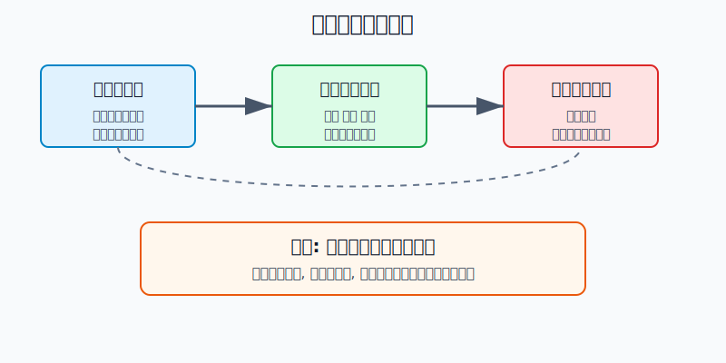
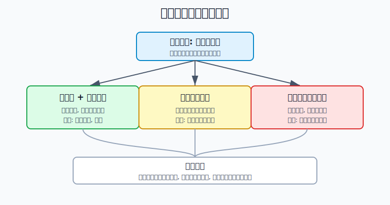
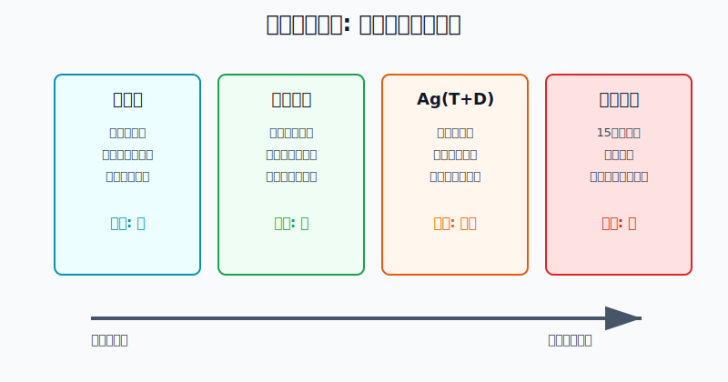
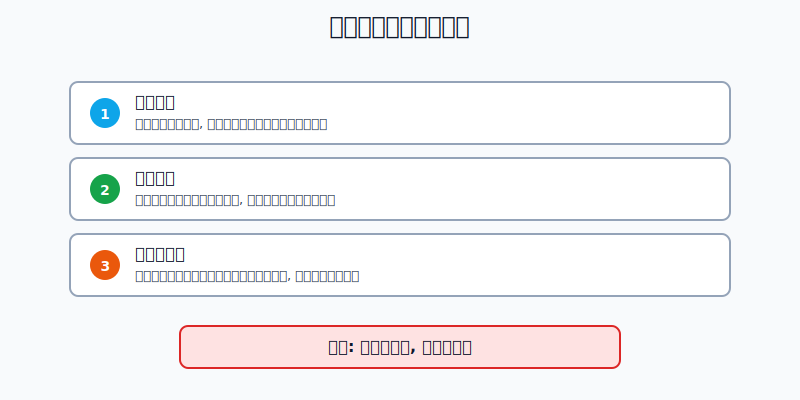

## 散户投资小白金融全品种操盘手册 - 7.7 白银: 比黄金弹性更大, 风险也更大
  
### 作者  
digoal  
  
### 日期  
2026-06-06   
  
### 标签  
金融产品 , 金融工具 , 散户 , 投资小白 , 全品操盘手册  
  
----  
  
## 背景 
   

> 适用读者: 中国大陆投资小白、散户、已经理解黄金基础逻辑, 但容易把白银当成“便宜黄金”的人。
> 本文定位: 投资教育框架, 不构成个性化投资建议。

## 一句话先懂

白银不是“价格更低的黄金”, 而是“贵金属属性 + 工业金属属性 + 更薄市场 + 更高波动”的混合品种; 它适合做小仓位卫星, 不适合替代黄金做核心防守资产。

## 核心观点

第7章前面几节讲的是黄金: 黄金不生息, 它赚的是风险重估的钱。白银也有贵金属属性, 但不能把黄金逻辑原封不动搬过来。因为白银还有很重的工业属性, 会受光伏、电子、汽车、电网、工业周期影响; 同时白银市场比黄金小, 流动性更薄, 价格弹性更大。

所以本节的核心判断是: **白银是高弹性卫星, 不是黄金替代品。** 如果你想用贵金属做防守, 黄金优先级更高; 如果你想参与白银, 先把仓位缩小、工具降杠杆、退出条件写清楚。方向看对不能抵消仓位错误, 在白银上尤其如此。

## 逻辑推导链

先把几个词翻译成人话。贵金属属性, 是指白银会跟随黄金受到避险、美元、实际利率和货币信用预期影响。工业属性, 是指白银被用在电子、光伏、汽车、焊料等真实生产场景里。高弹性, 是指同样的宏观刺激, 白银价格经常比黄金涨得更猛, 也跌得更快。

本节前提分三类: 第一, 白银兼具贵金属和工业金属属性, 这是常量; 第二, 白银工业需求占比高, 受产业周期和替代技术影响, 这是变量; 第三, 白银市场深度、价差、保证金规则和交易工具, 是关键变量, 会随市场状态和交易所规则变化。

1. 因为白银有贵金属属性 -> 所以当黄金因避险、美元走弱、实际利率下行而上涨时, 白银经常也会受到带动 -> 因此小白会自然产生“买白银也能防守”的想法。

这一步只成立一半。世界黄金协会在2026年金银对比研究中把黄金称为更稳定的避险资产, 把白银称为更高 beta 的卫星资产。beta 可以理解成“跟随大方向时放大的程度”。该研究还指出, 白银相对黄金的长期平均 beta 约为1.3, 意味着它经常把黄金方向放大, 但不是只放大上涨, 下跌也会放大。

2. 因为白银工业需求占比高 -> 所以白银不是纯避险资产 -> 因此经济放缓、工业需求走弱或高价促使企业减少用银时, 白银会失去一部分支撑。

Silver Institute 的 World Silver Survey 2026 显示, 2025年全球白银总需求降至11.3亿盎司, 工业需求下降3%至657.4百万盎司; 其中电气和电子需求下降2%, 光伏需求受到降银耗和替代影响。这个数据很关键: 哪怕市场仍有供需缺口, 高价格也会倒逼企业少用银。这就是白银和黄金最大的不同之一。

3. 因为白银市场比黄金小、价差更宽、波动更高 -> 所以“同样仓位”在白银上代表更大的风险预算 -> 因此白银仓位必须小于黄金仓位。

世界黄金协会同一份研究给出一组直观数字: 过去五年, 两大黄金ETF日均成交约23亿美元, 两大白银ETF约7亿美元; 黄金期货日均成交约550亿美元, 白银期货约110亿美元; 黄金场外交易约970亿美元, 白银约130亿美元。更薄的市场会带来更宽的买卖价差。研究还指出, 2025年2月到2026年2月的现货日内平均价差, 白银约9个基点, 黄金约2个基点; 白银历史日波动率大约是黄金的两倍。

这组证据支撑的不是“白银不能买”, 而是“白银不能按黄金仓位买”。如果黄金仓位能承受5%的价格波动, 白银同等金额带来的心理和账户冲击通常更大。

4. 因为白银常见交易工具带有不同摩擦和杠杆 -> 所以小白不能只看白银价格, 还要看自己买的是哪一种工具 -> 因此低杠杆优先, 保证金工具不做默认入口。

上海黄金交易所 Ag(T+D) 合约参数显示, 白银延期合约交易单位为1千克/手, 交易时间含夜盘, 延期补偿费按自然日逐日收付。交易所2026年5月29日通知显示, 自2026年6月1日收盘清算时起, Ag(T+D)合约保证金比例从24%调整为21%, 下一交易日起涨跌幅度限制从23%调整为20%。上海期货交易所白银期货业务细则规定, 白银期货交易单位为15千克/手, 交易代码为AG。把它翻译成人话: 你以为自己买的是白银, 实际上买到的可能是“白银价格 + 保证金 + 夜盘 + 每日结算 + 追加资金压力”。

最终结论是: 白银的正确位置不是核心防守仓, 而是高弹性卫星仓。正常情景下, 只有当贵金属逻辑、工业需求逻辑和工具规则三条同时说得清, 才能用小仓位参与; 任何一条说不清, 先暂停, 不用“白银便宜”作为买入理由。

## 前提变化时怎么办

第一种情景: 贵金属逻辑和工业逻辑共振。比如市场担心货币信用, 黄金走强, 同时工业需求没有明显恶化。此时白银的弹性有价值, 但操作仍是小仓位、分批、预设止损, 不是满仓冲进去。

第二种情景: 贵金属逻辑还在, 工业前提变弱。2025年就是一个反例: 白银工业需求在经历四年增长后转为下降, 光伏企业因为竞争和原料成本上升加快降银耗。重新推导后的结论是: “长期缺口”不能直接等于“短期必涨”, 高价本身会削弱一部分需求。对应操作是降低仓位或暂停加仓。

第三种情景: 价格上行但市场流动性恶化。Silver Institute 2026 报告提到, 2025年库存下降、金属流向 CME 仓库、交易所产品持仓上升、金币银条需求上升, 共同造成了10月流动性挤压。流动性挤压能推高价格, 也能放大回撤。对应操作不是追涨, 而是先检查价差、成交、保证金和自己的退出条件。

## 工具边界

实物银的优点是看得见, 缺点是买卖价差、保管、回购和重量都比想象麻烦。小白若只是想体验白银, 可以把它当认知样本, 不能把饰品、纪念银条和投资银条混为一谈。

白银基金或跟踪白银价格的产品, 重点是看清跟踪标的、费率、净值、溢价折价和流动性。名字里有“白银”不等于风险相同, 有的跟现货价格, 有的可能掺入期货展期成本或矿业股票波动。

Ag(T+D) 和白银期货的共同点是规则复杂、保证金交易、波动被账户放大。它们适合先做规则学习, 不适合作为小白默认配置工具。只要你说不清保证金比例、涨跌停板、延期费、夜盘时间、强平或每日结算, 就不该实盘。

## 实操例子

假设小林有10万元投资资金, 已经有宽基ETF、短债基金和少量黄金ETF。他看到白银涨得比黄金快, 想投入2万元买白银。按本节论证链, 不能先问“白银还会不会涨”, 要先问“这2万元承担的是多大风险”。

第一步, 定角色。小林把白银写成高弹性卫星仓, 不写成防守仓。如果他的黄金仓是5%, 白银试错仓先控制在1%到2%的教育口径内, 也就是1000元到2000元级别, 而不是直接2万元。

第二步, 查前提。他检查三件事: 黄金上涨是否来自避险和实际利率前提; 白银工业需求是否仍有支撑; 当前产品是否有明显溢价、价差扩大或成交变差。如果其中一条答不上来, 结论就是暂停。

第三步, 选工具。他若选择低杠杆产品, 重点看净值、费率、成交和跟踪误差; 他若想碰 Ag(T+D) 或期货, 必须先把保证金、延期费、夜盘和强平规则写在纸上。写不出来, 就回到低杠杆工具或模拟学习。

第四步, 写错了怎么办。如果买入后白银下跌10%, 他不能用“长期缺口”安慰自己, 而要复盘是哪条前提变了: 是黄金逻辑变了, 工业需求变了, 还是自己买了高杠杆工具。若仓位超过计划, 先减回计划内; 若工具规则看不懂, 先退出规则复杂工具。

这个例子对应本节结论: 白银不是不能参与, 而是必须用更小仓位、更低杠杆和更硬退出条件参与。

## 可复用框架

【三前提框架】

适用前提: 你想参与白银, 且资金不是生活钱、不是借来的钱、不是短期要用的钱。

核心逻辑: 因为白银同时受贵金属、工业需求和市场深度影响, 所以下单前必须三条都过关, 不能只看价格涨跌。

操作步骤:

1. 看贵金属前提: 黄金、美元、实际利率、避险需求是否支持贵金属。
2. 看工业前提: 光伏、电子、汽车、电网等需求是否没有明显恶化。
3. 看工具前提: 产品是否低杠杆, 价差、成交、保证金、费用是否清楚。

前提失效时: 贵金属前提失效, 暂停追涨; 工业前提失效, 降低仓位; 工具前提失效, 先退出高杠杆工具。

举一反三: 这个框架也可以用在铜、原油、商品基金等同时受宏观和供需影响的品种上。

【小仓卫星框架】

适用前提: 你已经有核心资产和防守资产, 白银只是组合里的弹性补充。

核心逻辑: 因为白银波动大约是黄金的两倍, 所以白银的金额仓位应小于黄金, 以风险预算而不是涨幅想象来定仓。

操作步骤:

1. 先给黄金、债券、现金等核心防守仓定上限。
2. 再给白银一个更小的卫星仓位, 只用亏得起的资金学习。
3. 每次加仓前重新测算: 下跌10%、20%时, 是否仍不影响生活和主组合。

前提失效时: 一旦白银仓位超过原计划, 或高杠杆工具让名义风险放大, 先降仓位, 不争论方向。

举一反三: 这个框架也适用于行业ETF、主题ETF、黄金股等高弹性资产。

## 执行清单

| 买入前问题 | 判断标准 |
|---|---|
| 我买的是防守资产还是高弹性卫星? | 白银默认按高弹性卫星处理, 不替代黄金和现金 |
| 三个前提是否都成立? | 贵金属逻辑、工业需求、工具规则都说得清才继续 |
| 仓位是否小于黄金仓位? | 按风险预算定仓, 不是按“白银便宜”定仓 |
| 工具有没有杠杆? | Ag(T+D)、期货等保证金工具不做小白默认入口 |
| 错了怎么退出? | 写清下跌、前提变化、溢价扩大、保证金压力下的退出动作 |

## 本节小结

白银最大的诱惑, 是它看起来比黄金更便宜、更有弹性; 白银最大的风险, 也正是这个弹性。对小白来说, 正确姿势不是猜它能涨多高, 而是先承认它不是黄金替代品: 用小仓位、低杠杆、清楚规则去学, 看不懂就不碰。

下一节讲黄金买入时机: 回到贵金属主线, 你要学会判断实际利率下行、避险上升、货币信用受疑这三类信号, 而不是看到上涨才追。

## 参考资料

- The Silver Institute: World Silver Survey 2026 新闻稿, 2026-04-15, https://silverinstitute.org/elevated-lease-rates-regional-liquidity-tightness-and-robust-investor-interest-resulted-in-record-silver-prices-in-2025/
- The Silver Institute: World Silver Survey 2026 PDF, 2026-04, https://silverinstitute.org/wp-content/uploads/2026/04/World-Silver-Survey-2026.pdf
- World Gold Council: Gold the safe haven versus silver the wildcard, 2026-03-18, https://www.gold.org/goldhub/research/gold-safe-haven-versus-silver-wildcard
- 上海黄金交易所: Ag(T+D) 合约参数, 访问日期 2026-06-06, https://www.sge.com.cn/h5_cpfw/xhyqjshy_xq?cplx=9&parent_cplx=0&pro_id=793742434475237376
- 上海黄金交易所: 《关于调整部分延期合约保证金比例和涨跌停板的通知》, 2026-05-29, https://www.sge.com.cn/jjsnotice/10007379
- 上海期货交易所: 《上海期货交易所白银期货业务细则》, 2025-12-31, https://www.shfe.com.cn/regulation/exchangerules/productrules/202512/t20251231_829961.html

> ⚠️ **声明**：本文内容为投资教育目的，所有历史数据、策略框架均为辅助学习工具，不构成证券投资建议。市场有风险，投资需谨慎。实际操作请结合自身风险承受能力，必要时咨询专业投顾。
  
#### [PostgreSQL 解决方案集合](../201706/20170601_02.md "40cff096e9ed7122c512b35d8561d9c8")
  
  
#### [德哥 / digoal's Github - 公益是一辈子的事.](https://github.com/digoal/blog/blob/master/README.md "22709685feb7cab07d30f30387f0a9ae")
  
  
#### [About 德哥](https://github.com/digoal/blog/blob/master/me/readme.md "a37735981e7704886ffd590565582dd0")
  
  

  
