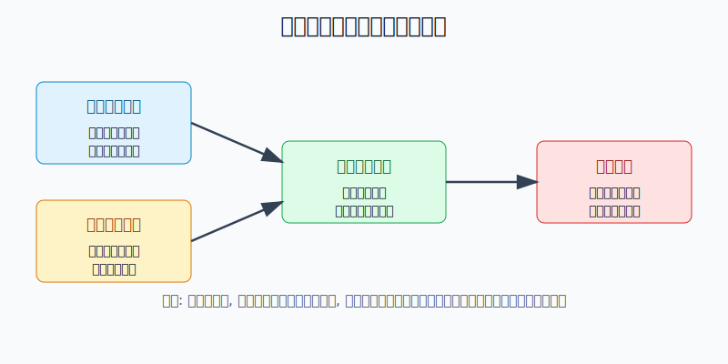
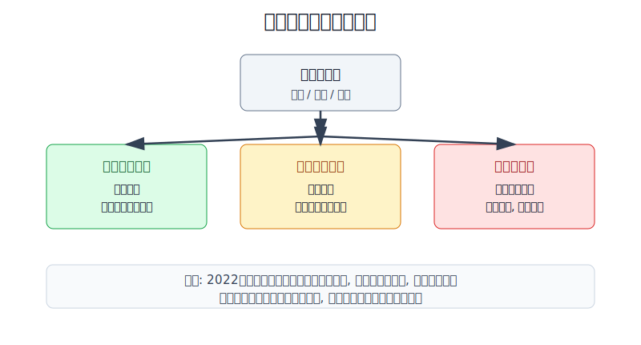
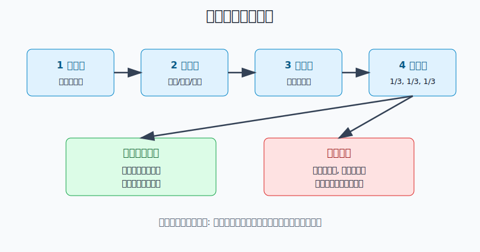

## 散户投资小白金融全品种操盘手册 - 7.8 黄金买入时机: 实际利率下行、避险上升、货币信用受疑
  
### 作者  
digoal  
  
### 日期  
2026-06-06   
  
### 标签  
金融产品 , 金融工具 , 散户 , 投资小白 , 全品操盘手册  
  
----  
  
## 背景 
   

> 适用读者: 已经理解实物黄金、黄金ETF和黄金T+D差异, 想知道什么时候才值得买黄金的小白和散户。
> 本文定位: 投资教育框架, 不构成个性化投资建议。

## 一句话先懂

黄金最危险的买法, 不是买贵, 而是只因为新闻很吓人就一把买满。真正的买入时机, 要看三盏灯: 实际利率下行、避险需求上升、货币信用受疑。

## 核心概念

黄金不生息。它不像债券有票息, 不像股票有利润, 不像货币基金每天计收益。你买黄金, 本质上是在买一种“没有对手方信用、供应增长慢、全球都认”的资产。

所以黄金买入时机不能只看金价跌了多少。更重要的问题是: 现在持有现金、债券、股票和货币信用的吸引力, 有没有在下降?

实际利率, 可以粗略理解为“名义利率减去通胀预期”。如果银行或国债看上去有利息, 但扣掉通胀后实际收益下降, 黄金这种不生息资产的劣势就变小。避险需求, 是市场担心战争、金融风险、经济衰退或资产大跌时, 对防守资产的需求。货币信用受疑, 是投资者和央行担心单一货币、单一债券市场或单一国家信用太集中, 于是增加黄金这种储备资产。

这三件事不是玄学, 都可以观察: 看10年期TIPS实际利率, 看VIX和风险资产波动, 看美元指数、央行购金、黄金ETF流入流出和外汇储备结构。

## 逻辑推导链

【论证链标题】: 黄金买入不是猜最低点, 而是等三类机会成本同时改善。

前提A: 黄金不生息, 持有黄金的代价是放弃现金、债券和其他资产的收益。这是常量。

前提B: 当实际利率下行时, 持有现金和债券的真实吸引力下降; 当实际利率上行时, 黄金的机会成本上升。这是变量。

前提C: 当避险需求上升、货币信用受疑时, 投资者和央行会更愿意持有黄金。这是变量。

前提D: 黄金价格会提前反映预期, 所以买入必须分批, 不能等所有人都确认后才满仓追入。这是交易层面的变量。

由A+B可得: 因为黄金不生息, 所以实际利率下行会降低黄金的相对劣势; 如果实际利率上行, 即使有坏消息, 黄金也未必涨得顺。

再由这个中间命题+C可得: 因为机会成本下降, 同时市场又需要防守和储备多元化, 所以黄金的买入胜率提高。若再叠加D, 结论不是“一把买满”, 而是“把目标仓位拆成几笔, 每次确认前提仍成立再买下一笔”。

正常情景下, 两盏灯以上亮起时, 小白可以把黄金从观察名单调到执行名单: 第一笔只买目标黄金仓位的三分之一; 如果实际利率继续下行、风险偏好没有明显修复、央行或ETF需求仍在确认, 再买第二笔和第三笔。这里的“买”优先指黄金ETF、黄金基金或小比例实物, 不是黄金T+D这类杠杆工具。

## 数据怎么验证

第一组证据看需求。世界黄金协会《Gold Demand Trends: Q4 and Full Year 2025》显示, 2025年全球黄金总需求首次超过5,000吨; 全球黄金ETF持仓增加801吨, 是历史第二强年份; 央行购买863吨黄金; LBMA黄金年均价为3,431美元/盎司, 同比上升44%。这说明当投资需求、央行需求和避险/分散化动机同时出现时, 黄金不是只靠一个新闻事件上涨。

第二组证据看央行。世界黄金协会2024年全年报告显示, 2024年全球央行净购金约1,045吨, 这是连续第三年超过1,000吨, 远高于2010-2021年473吨的年均水平。到2025年, 央行购金降到863吨, 但仍明显高于2010-2021年的均值。国家外汇管理局2026年官方储备资产表显示, 中国官方黄金储备从2026年1月的7,419万盎司增加到2026年4月的7,464万盎司。这类数据验证的是前提C: 货币信用和储备多元化需求, 会给黄金提供中长期支撑。

第三组证据看反例。FRED的10年期美国TIPS实际利率数据显示, 2022年3月8日为-1.04%, 到2022年11月3日升至1.74%。世界黄金协会2022年全年报告也提到, 黄金当年面对美元走强和全球利率上升的明显逆风, 年末仅小幅上涨。这个反例很重要: 只看地缘风险不够, 如果实际利率和美元同时走强, 黄金可能被机会成本压住。

写作日再做一次现场示范: FRED显示, 2026年6月4日10年期TIPS实际利率为2.11%; FRED的VIX数据同日为15.40, 并不是恐慌级别。这意味着如果某天你只是因为金价回调而想买, 不能自动得出“买点到了”的结论。你还要检查另外两盏灯是否亮起: 避险是否重新升温, 央行和ETF需求是否继续确认。

## 前提变化时怎么办

如果实际利率下行, 但避险需求没有上升、美元也没有明显走弱, 结论是小额试仓或继续观察, 不能重仓。因为这时只是机会成本变低, 还没有看到防守需求接力。

如果避险新闻很多, 但实际利率上行、美元走强, 结论是暂停追涨。因为市场可能先买美元和短债, 黄金未必是第一受益资产。

如果央行持续购金、美元信用被讨论, 但金价已经连续大涨、黄金ETF出现短期拥挤流入, 结论是只按原计划分批, 不因为“大家都在买”临时提高仓位。货币信用受疑是慢变量, 追高情绪是快变量, 小白最容易把慢逻辑做成短线冲动。

## 实操例子

假设小林有10万元投资资金, 原计划黄金最高只占组合10%, 也就是1万元。他不是拿10万元去赌黄金, 而是把黄金定义为防守仓的一部分。

第一步, 写目标: 黄金仓位上限1万元, 分三笔执行, 每笔约3,000-3,500元。对应论证链的前提D: 黄金会提前反映预期, 所以不一把买满。

第二步, 查三盏灯。若10年期TIPS实际利率从高位连续回落, VIX或主要股债市场波动明显上升, 同时世界黄金协会或国家外汇管理局数据继续显示央行购金和储备多元化, 第一笔执行。对应论证链的结论: 两盏灯以上亮起, 买入胜率改善。

第三步, 买工具前看价格。如果用黄金ETF, 先看成交额、买卖价差和场内价格是否明显高于净值; 如果出现高溢价, 当天不买。方向判断正确, 但工具买贵, 仍然会降低收益。

第四步, 买后每两周复盘一次。若实际利率继续下行、风险偏好没有明显修复、央行或ETF需求继续确认, 买第二笔。若实际利率重新走强、美元走强、VIX回落到平静区间, 暂停第二笔。

如果操作错误, 比如第一笔刚买就跌5%, 不能用“黄金长期看好”来补仓。先回到三盏灯: 是前提仍成立, 只是短期波动? 还是实际利率和美元已经反向? 前者按计划观察, 后者停止加仓。亏损不是自动补仓理由, 前提仍成立才是下一步行动理由。

## 可复用框架

【三灯买入法】

适用前提: 你买黄金是为了组合防守和资产分散, 不是为了日内交易; 工具优先选择黄金ETF、黄金基金或小比例实物; 总仓位有上限。

核心逻辑: 因为黄金不生息, 所以实际利率决定机会成本; 因为黄金没有单一对手方信用, 所以避险和货币信用担忧决定需求强度; 两类条件同时改善时, 才把观察变成分批买入。

操作步骤:

1. 看实际利率: 10年期TIPS实际利率连续下行, 第一盏灯亮。
2. 看避险: VIX、股债波动、地缘和金融风险上升, 第二盏灯亮。
3. 看信用: 央行购金、黄金ETF流入、美元走弱或储备多元化继续, 第三盏灯亮。
4. 两盏灯以上亮起, 才按目标仓位的三分之一分批买入。

前提失效时: 实际利率走强、美元走强、风险偏好回升时, 暂停下一笔; 黄金仓位超过上限时, 不再加仓, 只复盘是否需要再平衡。

举一反三: 这个框架也能用于黄金基金、跨境黄金ETF和含黄金的资产组合; 但不能直接套到黄金股, 因为黄金股还叠加矿企经营、成本和股票估值。

## 本节行动清单

- 买黄金前, 先写明黄金在组合里的角色: 防守、分散, 还是短线交易。
- 每次买入前检查三盏灯: 实际利率、避险需求、货币信用/央行购金。
- 目标仓位拆成三笔, 每一笔都要有前提确认, 不因上涨临时加码。
- 如果使用黄金ETF, 同时检查成交额、买卖价差、溢价折价和跟踪误差。
- 若实际利率走强、美元走强、风险偏好回升, 暂停追入并重新推导。

## 一句话总结

黄金买入时机不是“新闻越吓人越该买”, 而是“机会成本下降、防守需求上升、货币信用担忧被数据确认”时, 用小仓位、分批和可复盘的方式进入。

## 参考资料

- World Gold Council: Gold Demand Trends: Q4 and Full Year 2025, 2026-01-29, https://www.gold.org/goldhub/research/gold-demand-trends/gold-demand-trends-full-year-2025
- World Gold Council: Central Banks, Gold Demand Trends: Q4 and Full Year 2025, 2026-01-29, https://www.gold.org/goldhub/research/gold-demand-trends/gold-demand-trends-full-year-2025/central-banks
- World Gold Council: Central Banks, Gold Demand Trends: Full Year 2024, 2025-02-05, https://www.gold.org/goldhub/research/gold-demand-trends/gold-demand-trends-full-year-2024/central-banks
- World Gold Council: Gold Demand Trends Full Year 2022, 2023-01-31, https://www.gold.org/goldhub/research/gold-demand-trends/gold-demand-trends-full-year-2022
- Federal Reserve Bank of St. Louis FRED: Market Yield on U.S. Treasury Securities at 10-Year Constant Maturity, Inflation-Indexed (DFII10), 访问日期 2026-06-06, https://fred.stlouisfed.org/series/DFII10
- Federal Reserve Bank of St. Louis FRED: CBOE Volatility Index: VIX (VIXCLS), 访问日期 2026-06-06, https://fred.stlouisfed.org/series/VIXCLS
- 国家外汇管理局: 官方储备资产（2026年）, 发布日期 2026-05-07, https://www.safe.gov.cn/safe/2026/0205/27113.html

> ⚠️ **声明**：本文内容为投资教育目的，所有历史数据、策略框架均为辅助学习工具，不构成证券投资建议。市场有风险，投资需谨慎。实际操作请结合自身风险承受能力，必要时咨询专业投顾。
  
#### [PostgreSQL 解决方案集合](../201706/20170601_02.md "40cff096e9ed7122c512b35d8561d9c8")
  
  
#### [德哥 / digoal's Github - 公益是一辈子的事.](https://github.com/digoal/blog/blob/master/README.md "22709685feb7cab07d30f30387f0a9ae")
  
  
#### [About 德哥](https://github.com/digoal/blog/blob/master/me/readme.md "a37735981e7704886ffd590565582dd0")
  
  

  
