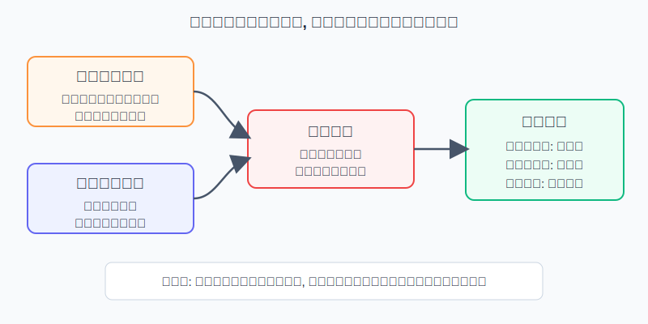
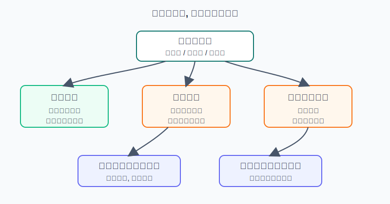
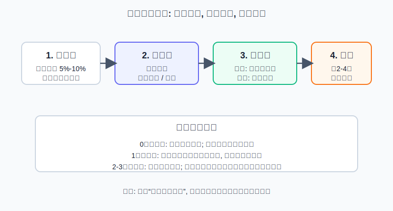

## 散户投资小白金融全品种操盘手册 - 7.9 黄金卖出时机: 风险偏好回升、实际利率走强、仓位过高
  
### 作者  
digoal  
  
### 日期  
2026-06-06   
  
### 标签  
金融产品 , 金融工具 , 散户 , 投资小白 , 全品操盘手册  
  
----  
  
## 背景 
   

> 适用读者: 已经理解黄金买入逻辑, 但不知道什么时候该减仓、止盈或再平衡的小白和散户。
> 本文定位: 投资教育框架, 不构成个性化投资建议。

## 一句话先懂

黄金最容易卖错的地方, 是把“卖出”理解成“我判断黄金要跌”。对小白来说, 更稳的理解是: **当黄金的防守价值下降, 或黄金仓位已经超出原计划, 就把多出来的风险收回来。**

## 核心概念

黄金卖出时机, 不是让你去猜最高点。最高点只有事后才知道, 交易前没人能提前盖章确认。

本章第8节讲过, 黄金买入主要看三盏灯: 实际利率下行、避险需求上升、货币信用受疑。那卖出就反过来看三条线: **实际利率走强、风险偏好回升、仓位过高。**

实际利率走强, 可以理解为“持有现金和债券又有真实收益了”。黄金不生息, 所以当真实利率抬高, 黄金的机会成本就上升。风险偏好回升, 是市场从“我要保命”切回“我要赚钱”, 股票、信用债、成长资产重新吸引资金。仓位过高, 是最容易被忽视的一条: 就算黄金长期逻辑还在, 如果你原来计划黄金只占8%, 涨着涨着变成15%, 它就不再只是防守资产, 而变成组合里的集中风险。

所以本节的核心行动结论是: **卖黄金优先卖超出计划的部分, 不是情绪化清仓; 当实际利率走强和风险偏好回升同时出现, 再把黄金减回目标仓位。**

## 逻辑推导链

【论证链标题】: 黄金卖出不是看空黄金, 而是当机会成本和仓位边界变化时做风险回收。

前提A: 黄金不生息, 持有黄金的代价是放弃现金、债券和其他资产的收益。这是常量。

前提B: 实际利率上行时, 持有现金和债券的真实吸引力上升, 黄金的相对劣势会扩大。这是变量。

前提C: 风险偏好回升时, 市场对避险资产的需求会下降, 黄金此前积累的防守溢价可能回吐。这是变量。

前提D: 黄金在组合里的主要角色是防守和分散, 不是替代全部资产。仓位一旦超过计划上限, 即使方向没错, 组合风险也已经变形。这是操作层面的变量。

因为A+B可得: 黄金不生息, 所以实际利率越高, 持有黄金的机会成本越高; 如果这个变化持续, 单纯依靠“黄金长期保值”不足以支撑继续加仓。

再由这个中间命题+C可得: 如果实际利率上行, 同时市场风险偏好修复, 黄金面对的就是“双重压力”: 一边是持有成本上升, 一边是避险需求下降。此时继续把黄金当作进攻仓, 胜率会下降。

最后叠加D可得: 如果黄金仓位已经超过原计划, 卖出不需要等到你看空黄金。因为组合管理的第一任务不是卖在最高点, 而是让每类资产回到它该承担的风险位置。

正常情景下, 三条线的操作如下:

1. 只有仓位过高: 卖出超出目标上限的部分, 或先卖超额部分的一半。
2. 实际利率走强 + 仓位过高: 减回目标仓位, 暂停新增买入。
3. 实际利率走强 + 风险偏好回升 + 仓位过高: 减回目标仓位, 激进仓位降到目标下限。
4. 如果避险重新升温、实际利率重新下行: 暂停卖出, 重新推导, 不机械止盈。

## 数据怎么验证

第一组证据看2013年。世界黄金协会《Gold Demand Trends Full Year 2013》显示, 2013年全球黄金ETF及类似产品净流出880.8吨, 全球黄金需求从2012年的4,415.8吨降至2013年的3,756.1吨, 下降15%; 世界黄金协会新闻稿还披露, 2013年平均金价为1,411美元/盎司, 比2012年下降15%。这不是因为黄金突然失去所有价值, 而是当时美联储缩减量化宽松的预期升温, 市场重新定价利率和风险资产。对小白的启发是: 当实际利率和风险偏好一起转向, 黄金会从“大家抢的防守资产”变成“资金撤出的非生息资产”。

第二组证据看2022年。世界黄金协会2022年全年报告显示, 全球黄金ETF持仓全年下降110吨, 折合资金流出约30亿美元。报告对投资部分的解释很直接: 2022年前四个月, 地缘风险推动黄金ETF强劲流入; 但随后, 激进加息、高收益率和更强美元开始主导市场叙事。也就是说, 即使那一年有通胀和地缘风险, 一旦实际利率和美元方向不利, 黄金也会承压。这个案例验证了前提B: 只看“世界很乱”不够, 还要看持有黄金的机会成本是否变高。

第三组证据看反例。世界黄金协会《Gold Demand Trends: Q4 and Full Year 2025》显示, 2025年全球黄金ETF持仓增加801吨, 为历史第二强年份; 央行购金863吨; 年度平均金价3,431美元/盎司, 同比上升44%。这个数据说明一件事: 金价高, 不自动等于必须清仓。如果实际利率、避险、央行购金、货币信用担忧这些前提仍然支持黄金, 正确动作不是“因为涨多了就全卖”, 而是检查仓位有没有超过计划。

第四组证据看仓位边界。世界黄金协会2025版战略资产配置研究认为, 黄金可作为多资产组合的长期配置资产; 其早期研究和2026年市场结构材料也反复提到, 在不同目标下, 2%到10%左右的黄金配置可以帮助组合分散风险。这个范围不是给所有人的硬规定, 但能提醒小白: 黄金通常是组合里的防守和分散模块, 不是全部身家。

历史数据不代表未来, 但这些案例有参考价值, 因为它们验证的不是某一年会不会重复, 而是同一条机制: **黄金不生息, 所以实际利率和风险偏好会影响它的相对吸引力; 黄金能防守, 但仓位过高会把防守变成押注。**

## 前提变化时怎么办

第一种情景: 三条线同时成立。比如实际利率连续上行, 股市和信用资产修复, 同时你的黄金仓位因为上涨从8%变成15%。重新推导后的结论是: 黄金防守价值下降, 仓位又超标, 所以应该减回目标仓位, 激进者可以减到目标下限。

第二种情景: 只有仓位过高, 但宏观前提没有明显反转。比如央行购金仍强、避险仍高、实际利率没有继续走强, 只是金价上涨让你的黄金仓位超标。此时不是看空黄金, 而是做再平衡: 卖出超出上限的部分, 让仓位回到计划内。

第三种情景: 实际利率走强, 但风险偏好没有修复。比如市场同时担心衰退和金融风险, 股票也很弱。此时黄金可能仍有避险需求, 操作不能简单清仓。更合适的动作是暂停加仓, 对超额仓位做小幅减仓, 保留核心防守仓。

第四种情景: 金价回调, 但避险重新升温、实际利率重新下行。此时卖出前提失效, 不能因为价格跌了就恐慌卖。重新推导后的结论是: 若原始买入逻辑仍成立, 只处理仓位和工具问题, 不把波动当作卖出理由。

## 实操例子

假设小林有10万元投资资金, 原计划黄金仓位上限是10%, 目标仓位是8%, 也就是最多1万元, 常态8000元。后来黄金上涨, 他的黄金ETF市值变成1.4万元, 仓位从8%升到14%。

这个例子对应论证链的结论D: 仓位超过计划上限时, 先处理多出来的风险。

第一步, 写清目标。小林在复盘表上写: 黄金目标仓位8%, 上限10%, 下限5%。当前14%, 已经超过上限4个百分点。这里不用先争论黄金是不是见顶, 因为仓位已经偏离计划。

第二步, 查三条线。若10年期TIPS实际利率连续走强, 或者像美联储H.15在2026年6月4日发布的数据那样, 10年期实际收益率处在2%以上的较高区间, 小林要把“机会成本上升”记为一条风险线。若同时主要股指反弹、VIX回落、资金重新追逐风险资产, “风险偏好回升”记为第二条风险线。仓位14%超过上限10%, 是第三条风险线。

第三步, 决定卖多少。如果只有仓位线成立, 小林可以先卖出4000元, 把黄金仓位从14%降回10%附近。如果实际利率走强和风险偏好回升也成立, 他应卖出约6000元, 把黄金降回8000元目标仓位。若三条线都成立, 且他买的是溢价较高或流动性较差的黄金工具, 可以优先卖出工具风险更高的部分。

第四步, 写错了怎么办。如果卖出后黄金继续上涨, 小林不能马上追回去, 因为他卖出的理由不是“黄金一定跌”, 而是“仓位超标”。下次复盘若实际利率重新下行、风险重新升温, 且黄金仓位低于目标, 再按第8节买入规则分批补回。若卖出后黄金下跌, 也不能把自己包装成神预测, 因为真正有效的是纪律: 按前提和仓位行动。

## 可复用框架

【三线卖出法】

适用前提: 你买黄金是为了组合防守和分散, 工具以黄金ETF、黄金基金或小比例实物为主, 不是用黄金T+D或期货重仓短炒。

核心逻辑: 因为黄金不生息, 所以实际利率走强会抬高机会成本; 因为黄金有避险属性, 所以风险偏好回升会削弱防守需求; 因为黄金是组合模块, 所以仓位过高时要先做风险回收。

操作步骤:

1. 看利率线: 10年期TIPS实际利率是否持续走强。
2. 看情绪线: VIX、股债市场、信用利差和风险资产是否明显修复。
3. 看仓位线: 黄金是否超过原计划目标或上限。
4. 一条线成立, 只处理超额仓位; 两条线成立, 减回目标仓位; 三条线成立, 减到目标下限并暂停新增买入。

前提失效时: 若实际利率重新下行、风险重新升温、货币信用担忧加剧, 暂停卖出, 回到买入逻辑重新判断。

举一反三: 这个框架也适用于债券ETF、高股息资产和REITs的止盈再平衡, 因为这些资产同样有“收益逻辑还在, 但仓位已经超标”的问题。

【上限再平衡】

适用前提: 你已经给黄金设定了组合角色和仓位上限。

核心逻辑: 因为组合风险来自仓位而不只来自价格方向, 所以任何资产涨到超过上限, 都要先问是否需要再平衡。

操作步骤:

1. 买入前写目标仓位、上限和下限。
2. 每月或每季度检查一次实际仓位。
3. 超过上限时, 先卖超额部分; 低于下限且买入前提成立时, 再分批补回。

前提失效时: 如果黄金工具出现高溢价、成交变差、杠杆压力或费用异常, 先处理工具风险, 不等宏观信号完全确认。

举一反三: 这个框架可用于行业ETF、白银、黄金股和主题基金, 尤其适合防止“涨了以后仓位失控”。

## 本节行动清单

- 给黄金写一个明确仓位范围: 例如目标5%到8%, 上限10%, 具体比例按自身风险承受能力调整。
- 卖出前只看三条线: 实际利率是否走强, 风险偏好是否回升, 仓位是否超过计划。
- 优先卖超额仓位, 不轻易把长期防守仓一次清空。
- 如果三条线同时成立, 把黄金减回目标仓位或目标下限, 并暂停新增买入。
- 如果避险重新升温、实际利率重新下行, 暂停卖出, 不把短期波动当作卖出理由。

## 一句话总结

黄金卖出不是为了证明你能猜中顶部, 而是当实际利率、风险偏好和仓位边界发生变化时, 把黄金从“过大的押注”重新调回“该有的防守仓”。

## 参考资料

- World Gold Council: Gold Demand Trends Full Year 2013, 2014-02-18, https://www.gold.org/goldhub/research/gold-demand-trends/gold-demand-trends-full-year-2013
- World Gold Council: Gold Demand Trends Q4 and Full Year 2013 PDF, 2014-02, https://www.gold.org/sites/default/files/GDT_Q4_2013.pdf
- World Gold Council: Global consumer demand for gold at unprecedented levels in 2013, 2014-02-18, https://www.gold.org/news-and-events/press-releases/global-consumer-demand-gold-unprecedented-levels-2013.-china-worlds
- World Gold Council: Gold Demand Trends Full Year 2022, 2023-01-31, https://www.gold.org/goldhub/research/gold-demand-trends/gold-demand-trends-full-year-2022
- World Gold Council: Investment, Gold Demand Trends Full Year 2022, 2023-01-31, https://www.gold.org/goldhub/research/gold-demand-trends/gold-demand-trends-full-year-2022/investment
- World Gold Council: Gold Demand Trends Q4 and Full Year 2025, 2026-01-29, https://www.gold.org/goldhub/research/gold-demand-trends/gold-demand-trends-full-year-2025
- World Gold Council: Gold as a strategic asset: 2025 edition, 2025-01-23, https://www.gold.org/goldhub/research/relevance-of-gold-as-a-strategic-asset-2025
- World Gold Council: Gold Market Primer: Market size and structure, 2026, https://www.gold.org/goldhub/research/market-primer/gold-market-primer-market-size-and-structure
- Federal Reserve Board: H.15 Selected Interest Rates, release date 2026-06-04, https://www.federalreserve.gov/releases/h15/
- Federal Reserve Bank of St. Louis FRED: CBOE Volatility Index: VIX (VIXCLS), 访问日期 2026-06-06, https://fred.stlouisfed.org/series/VIXCLS

> ⚠️ **声明**：本文内容为投资教育目的，所有历史数据、策略框架均为辅助学习工具，不构成证券投资建议。市场有风险，投资需谨慎。实际操作请结合自身风险承受能力，必要时咨询专业投顾。
  
#### [PostgreSQL 解决方案集合](../201706/20170601_02.md "40cff096e9ed7122c512b35d8561d9c8")
  
  
#### [德哥 / digoal's Github - 公益是一辈子的事.](https://github.com/digoal/blog/blob/master/README.md "22709685feb7cab07d30f30387f0a9ae")
  
  
#### [About 德哥](https://github.com/digoal/blog/blob/master/me/readme.md "a37735981e7704886ffd590565582dd0")
  
  

  
