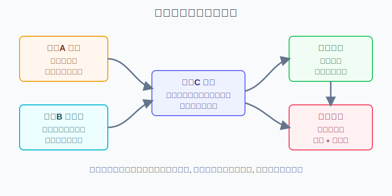
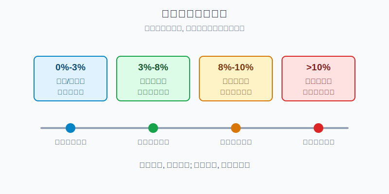
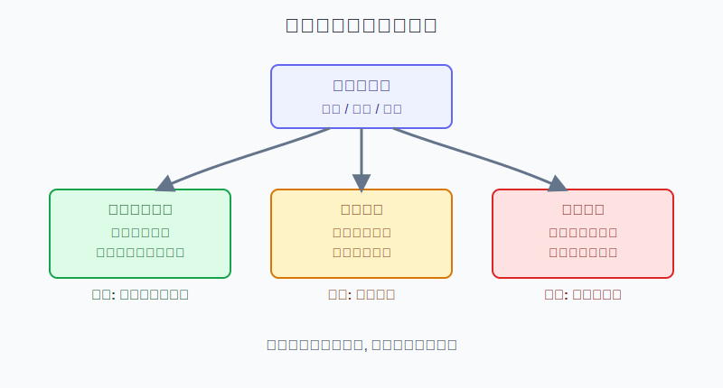
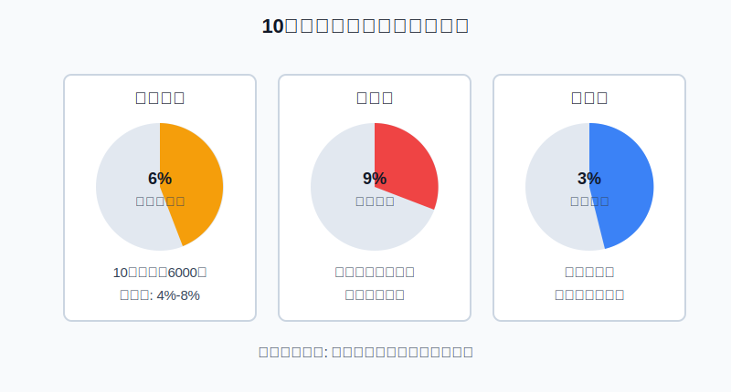

## 散户投资小白金融全品种操盘手册 - 7.10 黄金仓位: 防守资产不是重仓赌博
  
### 作者  
digoal  
  
### 日期  
2026-06-06   
  
### 标签  
金融产品 , 金融工具 , 散户 , 投资小白 , 全品操盘手册  
  
----  
  
## 背景 
   

> 适用读者: 已经理解黄金买入逻辑, 但容易因为金价上涨、央行购金、避险新闻而想重仓黄金的小白和散户。
> 本文定位: 投资教育框架, 不构成个性化投资建议。

## 一句话先懂

黄金可以是组合里的防守资产, 但防守资产不等于越多越安全。真正的黄金仓位, 不是按“我觉得它还能涨多少”来定, 而是按“它下跌时我能不能扛住、上涨后会不会挤掉其他资产”来定。

## 核心概念

仓位, 说白了就是你把多少钱交给某一类风险。10万元账户里买1万元黄金, 黄金仓位就是10%。仓位不是一个数字游戏, 它决定了你晚上睡不睡得着, 也决定了你判断错时还有没有余地纠偏。

黄金的特殊之处在于: 它没有利息、没有分红、没有企业利润, 但它也没有某家公司违约、某个债务人不还钱的问题。它更像组合里的“备用盾牌”: 市场风险、货币信用和实际利率条件变差时, 盾牌可能有用; 但你不能把整个背包都装成盾牌, 因为你还需要现金、债券、股票和其他工具完成不同任务。

所以本节的核心判断是: **黄金适合做有上限的防守仓, 不适合做情绪化重仓。** 小白先把黄金仓位写进组合规则, 再谈买入时机; 先设上限, 再谈加仓。

## 逻辑推导链

【论证链标题】: 黄金的组合价值来自防守和分散, 但它不生息且会回撤, 所以仓位必须有上限。

前提A: 黄金不产生现金流。它不像债券给票息, 不像股票可能分红, 也不像货币基金每天计收益。这是常量。

前提B: 黄金在很多系统性风险阶段能起到分散作用, 因为它和股票、信用资产的风险来源不同; 同时全球黄金市场足够大、流动性较强。这是慢变量。

前提C: 黄金价格受实际利率、美元、通胀预期、央行购金、避险需求和投资资金流动影响。这是变量, 会让黄金阶段性上涨, 也会让黄金阶段性下跌。

前提D: 散户账户的承受能力有限。生活钱、短期要用的钱、心理承受能力和已有资产结构, 都会限制黄金仓位。这是个人变量。

由A可得: 因为黄金不生息, 所以黄金仓位过高时, 你放弃的是现金利息、债券票息、股票长期增长和其他机会。黄金涨的时候这件事不明显, 黄金横盘或下跌时, 机会成本就会变得刺眼。

由B可得: 因为黄金能在部分风险情景中分散组合, 所以黄金不是完全没必要。它的价值不是替你预测每一次涨跌, 而是在股票、信用资产或货币信用前提变差时, 给组合留一个不同方向的防守模块。

再由A+B+C可得: 因为黄金有防守价值, 但没有现金流, 且价格会受宏观变量反复拉扯, 所以正常结论不是“越看好越重仓”, 而是“设一个目标仓位和上下限, 前提成立时分批补到目标, 前提变弱或仓位越界时减回计划内”。

最后加上D: 如果你是小白, 黄金更应该从学习仓和防守仓开始, 而不是一上来押成主仓。正常情景下, 黄金仓位可以分成三个区间理解: 0%-3%是观察/学习仓, 3%-8%是防守配置仓, 8%-10%已经进入上限观察区; 超过10%时, 你就要非常认真地回答一个问题: 我是在做资产配置, 还是在赌单一品种?

## 数据怎么验证

第一组证据说明黄金为什么能进组合。世界黄金协会《Gold as a strategic asset: 2025 edition》用2004年12月31日至2024年12月31日的美元回测比较了“无黄金组合”和“5%黄金组合”。在20年维度里, 加入5%黄金后, 年化收益从6.3%提高到6.4%, 年化波动从9.9%降到9.6%, 最大回撤从-35.3%收窄到-33.0%。这个证据支持的是前提B: 少量黄金的作用是改善风险收益比, 不是替代整个组合。

第二组证据说明黄金为什么不能被当成保本资产。同一份报告在风险提示中明确指出, 黄金没有常规收入来源; 同时它的波动并不低, 它适合分散风险是因为行为方式和股债不同, 不是因为价格不会跌。翻译成人话: 黄金不是货币基金, 也不是银行存款。你买多了, 它照样会让账户大幅波动。

第三组证据说明“有需求”也不等于“可以重仓追涨”。世界黄金协会《Gold Demand Trends: Q4 and Full Year 2025》显示, 2025年全球黄金总需求含场外交易首次超过5,000吨, 黄金ETF持仓增加801吨, 央行购金863吨。这说明黄金在避险和分散化需求强的时候确实会获得支撑。但回到2013年, 世界黄金协会全年报告显示, 当年黄金投资需求从2012年的1,568.1吨降到773.3吨, 同比下降51%; ETF及类似产品净流出880.8吨; 年均金价1,411美元/盎司, 比2012年下降15%。这就是反例: 黄金需求结构一变, 防守资产也会出现很难受的回撤。

这三组数据合在一起, 支撑的是同一个结论: 黄金值得有位置, 但不值得无上限。它是组合里的防守模块, 不是让你把全部筹码推上去的理由。

## 前提变化时怎么办

第一种情景: 防守前提成立。比如实际利率下行, 风险资产波动上升, 央行购金和黄金ETF需求仍在确认。此时可以把黄金从观察仓补到目标防守仓, 但动作仍然是分批, 不是一次买满。因为前提C只是提高胜率, 没有取消波动。

第二种情景: 防守前提变弱。比如实际利率走强, 美元走强, 风险偏好回升, 股票和信用资产重新受到资金追捧。此时重新推导: 因为黄金不生息, 且机会成本上升, 所以继续追涨的理由变弱。对应操作是停止加仓, 已经超过上限的仓位要考虑降回计划内。

第三种情景: 金价上涨导致仓位越界。很多小白会犯这个错: 本来黄金只占6%, 涨着涨着变成10%以上, 心里一高兴还想继续加。这里的正确推导是: 因为仓位越界会让单一资产支配组合, 所以即使方向看对, 也要按仓位纪律处理。盈利不是破坏规则的理由。

第四种情景: 金价下跌导致仓位低于目标。此时不能机械补仓。先检查前提: 如果实际利率、美元、避险需求和央行需求都没有破坏, 只是短期波动, 可以按计划补回目标仓; 如果核心前提已经反向, 低了也先不补。下跌不是自动买入信号, 前提仍成立才是买入信号。

## 实操例子

假设小林有10万元投资资金, 已经留好生活备用金, 组合里有宽基ETF、短债基金和现金。他看完第7章前几节后决定配置黄金, 但不想把黄金做成赌博。

第一步, 定角色。小林写下: 黄金在我的组合里只做防守和分散, 不做暴富工具。这个动作对应前提B, 因为黄金的价值来自组合分散, 不是替代所有资产。

第二步, 定目标仓位。他把黄金目标仓位设为6%, 也就是6000元; 上下限设为4%-8%。低于4%时, 如果防守前提仍成立, 可以补回; 高于8%时, 不再加仓, 必要时减回目标附近。这个动作对应前提A和D, 因为黄金不生息, 而小白账户承受能力有限。

第三步, 分批买入。6000元不一次买完, 分成三笔, 每笔约2000元。第一笔用于建立观察仓; 第二笔要等实际利率、避险需求或央行/ETF需求继续确认; 第三笔只在前提仍成立且场内工具没有明显高溢价时执行。这个动作对应前提C, 因为宏观变量会变化, 分批能降低一次判断错误的伤害。

第四步, 再平衡。若金价上涨后黄金仓位从6%变成9%, 小林不因为赚钱就继续加码, 而是减回8%以内或至少停止新增。若金价下跌后黄金仓位变成3%, 他也不立刻补仓, 而是先检查前提有没有失效。这个动作对应本节结论: 仓位纪律比方向兴奋更重要。

如果小林操作错误, 比如看到金价连续上涨后把黄金仓位临时加到20%, 后果不是“赚更多”这么简单, 而是整个组合被黄金价格牵着走。一旦金价回撤15%, 账户会损失3个百分点; 更麻烦的是, 他可能因为心理压力在错误位置卖出。纠偏方法很简单: 先把仓位降回计划区间, 再复盘当初为什么破坏上限。

## 可复用框架

【上限仓位法】

适用前提: 你买黄金是为了防守和分散, 不是为了短线赌博; 资金不是生活钱, 也不是短期要用的钱。

核心逻辑: 因为黄金不生息但有分散价值, 所以先给它一个目标仓位和上下限, 再根据前提变化做加减仓。

操作步骤:

1. 定角色: 黄金只做防守模块, 不替代现金、债券和核心权益资产。
2. 定目标: 小白可以先从0%-3%学习仓开始, 熟悉后再考虑3%-8%的防守仓。
3. 定上限: 8%-10%进入观察区, 超过10%必须重新论证, 不能靠情绪加码。
4. 定再平衡: 高于上限停止加仓或减回, 低于下限先查前提再补。

前提失效时: 实际利率走强、美元走强、风险偏好明显恢复时, 暂停补仓; 如果黄金已经超过上限, 优先降回计划内。

举一反三: 这个框架也能用在白银、商品基金、行业ETF和主题ETF上。凡是没有稳定现金流、波动又不低的资产, 都要先设仓位上限。

【三问再平衡】

适用前提: 你已经持有黄金, 不知道涨了要不要加、跌了要不要补。

核心逻辑: 因为黄金仓位变化来自价格涨跌和主动买卖两部分, 所以每次操作前先问角色、前提和仓位, 不直接问“还能涨吗”。

操作步骤:

1. 角色有没有变? 如果还是防守资产, 就不能用进攻仓位对待。
2. 前提有没有变? 实际利率、美元、避险需求和央行/ETF需求是否仍支持黄金。
3. 仓位有没有越界? 超过上限先减风险, 低于下限也要先确认前提再补。

前提失效时: 角色变成短线投机、前提说不清、仓位已经越界, 三者出现任意一个, 都先暂停加仓。

举一反三: 这个框架也适用于第十五章的组合再平衡。你不是靠每天预测价格赚钱, 而是靠规则防止自己在情绪最强时犯大错。

## 本节行动清单

| 买入前问题 | 判断标准 |
|---|---|
| 黄金在组合里是什么角色? | 防守和分散, 不是暴富主仓 |
| 目标仓位写了吗? | 先写目标仓位和上下限, 再下单 |
| 有没有超过10%? | 超过后必须重新论证, 不能默认继续加 |
| 前提还成立吗? | 实际利率、美元、避险、央行/ETF需求至少要说得清 |
| 涨跌后怎么处理? | 上涨越界要再平衡, 下跌补仓前先查前提 |

## 一句话总结

黄金仓位的正确姿势是: 承认它有防守价值, 也承认它不生息、会回撤、会被宏观变量反复拉扯; 所以用目标仓位、上限和再平衡管理它, 不把防守资产做成重仓赌博。

## 参考资料

- World Gold Council: Gold as a strategic asset: 2025 edition, Risk/reward profile, 2025-01-23, https://www.gold.org/goldhub/research/relevance-of-gold-as-a-strategic-asset/risk-reward-profile
- World Gold Council: Gold as a strategic asset: 2025 edition, Diversification, 2025-01-23, https://www.gold.org/goldhub/research/relevance-of-gold-as-a-strategic-asset-2025/diversification
- World Gold Council: Gold as a strategic asset: 2025 edition, Potential risks and challenges, 2025-01-23, https://www.gold.org/goldhub/research/relevance-of-gold-as-a-strategic-asset/risks-and-challenges
- World Gold Council: Gold as a strategic asset: 2025 edition, Liquidity, 2025-01-23, https://www.gold.org/goldhub/research/relevance-of-gold-as-a-strategic-asset/liquidity
- World Gold Council: Gold Demand Trends: Q4 and Full Year 2025, 2026-01-29, https://www.gold.org/goldhub/research/gold-demand-trends/gold-demand-trends-full-year-2025
- World Gold Council: Gold Demand Trends Full Year 2013 PDF, 2014-02, https://www.gold.org/sites/default/files/GDT_Q4_2013.pdf

> ⚠️ **声明**：本文内容为投资教育目的，所有历史数据、策略框架均为辅助学习工具，不构成证券投资建议。市场有风险，投资需谨慎。实际操作请结合自身风险承受能力，必要时咨询专业投顾。
  
#### [PostgreSQL 解决方案集合](../201706/20170601_02.md "40cff096e9ed7122c512b35d8561d9c8")
  
  
#### [德哥 / digoal's Github - 公益是一辈子的事.](https://github.com/digoal/blog/blob/master/README.md "22709685feb7cab07d30f30387f0a9ae")
  
  
#### [About 德哥](https://github.com/digoal/blog/blob/master/me/readme.md "a37735981e7704886ffd590565582dd0")
  
  

  
