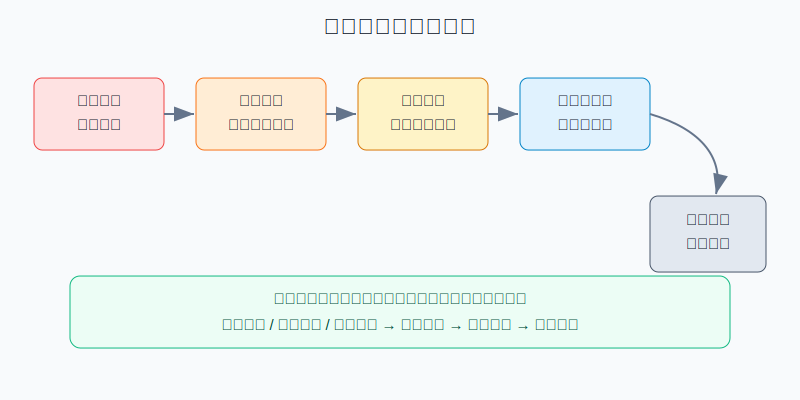
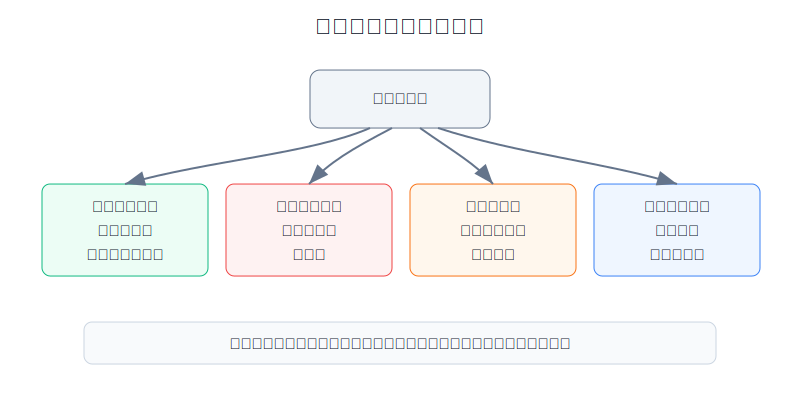
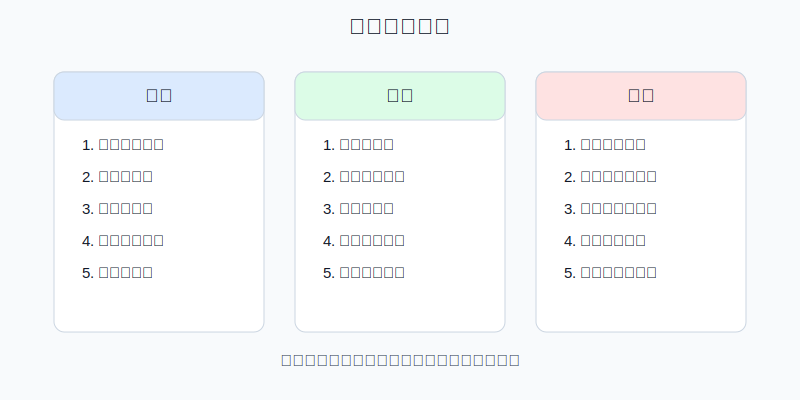

## 散户投资小白金融全品种操盘手册 - 7.11 常见错误: 追涨黄金、把黄金当短线暴富工具
  
### 作者  
digoal  
  
### 日期  
2026-06-06   
  
### 标签  
金融产品 , 金融工具 , 散户 , 投资小白 , 全品操盘手册  
  
----  
  
## 背景 
   

> 适用读者: 已经读完黄金买入、卖出和仓位章节, 但看到金价创新高就容易冲动下单的小白和散户。  
> 本文定位: 投资教育框架, 不构成个性化投资建议。

## 一句话先懂

黄金最容易让人犯错的地方, 是它明明是防守资产, 却经常在大涨时被小白当成短线暴富工具。方向看对, 不等于追涨重仓是对的。

## 核心概念

黄金像组合里的安全气囊, 不是发动机。安全气囊的价值, 是在事故发生时减少伤害; 如果你把安全气囊拆下来当发动机用, 车反而更危险。

投资里的翻译是: 黄金不产生利息, 不产生利润, 不给你分红。它的价值来自三个地方: 市场愿意为避险付钱, 愿意为货币信用分散付钱, 愿意在实际利率下降时少拿一点生息资产。实际利率, 可以粗略理解为“名义利率减去通胀预期”。当实际利率下降, 持有黄金的机会成本下降; 当实际利率上升, 黄金的不生息缺点会变得更明显。

追涨黄金的错误, 不是“黄金不能涨”。黄金当然能涨, 而且在特定年份会涨得很猛。错误在于: 你看到价格已经涨了, 新闻已经热了, 别人已经赚钱了, 才把原本用于防守和分散的资产, 做成一次性重仓押注。

所以本节的核心行动结论是: **黄金只能先定角色、先定仓位、再分批执行; 不能因为价格上涨临时提高仓位, 更不能用生活钱、借来的钱或高杠杆工具追涨。**

## 逻辑推导链

【论证链标题】: 追涨黄金错在把“前提成立”误读成“可以重仓短炒”。

前提A: 黄金不生息, 没有现金流, 持有黄金的收益主要来自价格重估。这是常量。

前提B: 黄金价格受实际利率、美元、避险需求、央行购金、ETF资金流等多变量影响。这是变量。

前提C: 追涨发生时, 价格通常已经反映了一部分利好, 散户情绪更拥挤, 场内工具也更容易出现溢价、价差扩大和流动性拥挤。这是变量。

前提D: 小白账户的最大风险不是少赚一点, 而是仓位失控后, 一次回撤就把防守资产变成心理压力源。这是常量。

由A+B可得: 因为黄金不生息, 所以它不是靠每年稳定现金流慢慢回本的资产; 如果实际利率、美元和风险偏好反向变化, 金价会出现明显波动。你买入黄金, 买的是“未来别人愿意用更高价格接手黄金”的可能性, 不是确定到账的票息。

再由这个中间命题+C可得: 因为追涨时价格已经吃进了一部分好消息, 所以买入成本更高, 容错空间更小; 如果这时还一次性重仓, 你不是在买防守, 而是在把组合的波动放大。

最后由D可得: 对小白来说, 黄金的正常用法不是“看到创新高就冲进去”, 而是“先写明黄金在组合中的上限, 再用分批买入和定期复盘承接宏观前提”。本手册口径下, 黄金默认是防守和分散资产, 不是替代股票、期货或短线题材的暴富工具。

正常情景下, 如果实际利率下行、避险上升、货币信用受疑这三盏灯中至少两盏亮起, 且工具没有明显溢价, 可以把黄金放入执行名单; 对应操作是按目标仓位的三分之一或更小比例分批买入。若只有金价上涨和社交媒体热度, 前提没有确认, 对应操作是暂停, 不是追。

## 数据怎么验证

第一组证据说明: 黄金确实会在风险重估阶段大涨, 但这不等于小白可以临时满仓。世界黄金协会《Gold Demand Trends: Q4 and Full Year 2025》显示, 2025年全球黄金总需求首次超过5,000吨; 全球黄金ETF持仓增加801吨, 为历史第二强年份; 央行购买863吨; LBMA黄金年均价达到3,431美元/盎司, 同比上升44%, 全年创下53次新高。这个数据验证的是前提B: 当避险、分散和投资资金共振时, 黄金会有很强趋势。

但同一组数据也提醒你: 高价本身会改变需求结构。2025年金价连续创新高时, 世界黄金协会同时指出, 珠宝需求量下降是高价环境下的预期结果。翻译成人话: 价格越高, 买盘越需要由投资、央行和避险逻辑接力; 如果接力变弱, 追在高位的人承受的回撤会更直接。

第二组证据是反例。世界黄金协会2020年全年报告显示, 2020年黄金ETF全球持仓增加877.1吨, 创年度流入纪录; 美元计价黄金当年回报约25%, 并在8月创下当时纪录高位。但到了2021年, 全球黄金ETF持仓减少173吨, 美元计价黄金价格全年下跌约4%。这说明一件事: “上一年大涨 + ETF大流入”不是下一年继续追涨的充分理由。历史不代表未来, 但它能证明追涨的最大问题: 你买到的是已经被市场奖励过的叙事。

第三组证据看机会成本。世界黄金协会2022年全年报告显示, 2022年黄金总需求达到4,741吨, 为十多年来高位; 央行购金达到1,136吨, 创下55年纪录。但同一报告也指出, 强美元和全球利率上升对金价形成明显逆风, 当年金价仅小幅收涨。这个案例验证的是前提A和B: 即使需求很强, 只要实际利率和美元方向不配合, 黄金走势也不会按“新闻越多就越涨”的简单剧本走。

## 前提变化时怎么办

第一种情景: 两盏灯以上亮起, 但金价已经连续上涨。重新推导后的结论不是“不能买”, 而是“只能小笔分批”。因为宏观前提支持黄金, 但价格已经反映部分利好, 所以第一笔只能用于建立防守仓, 不能把全部目标仓位一次打满。

第二种情景: 只有价格上涨, 没有实际利率下行、避险上升或货币信用担忧的证据。重新推导后的结论是暂停。因为这时你买的不是黄金逻辑, 而是别人的赚钱故事。

第三种情景: 你原来就有黄金, 因上涨导致黄金仓位超过上限。重新推导后的结论是只做再平衡, 不再加仓。因为黄金已经完成了防守和分散任务, 再加仓会让防守资产变成集中风险。

第四种情景: 避险新闻很多, 但实际利率走强、美元走强、风险偏好修复。重新推导后的结论是暂停下一笔。因为黄金的机会成本上升, 新闻热度不能抵消持有成本上升。

失败案例可以用2020到2021年理解: 2020年追在ETF纪录流入和金价高位附近的人, 如果没有仓位上限和复盘规则, 2021年面对ETF流出和金价回落时, 很容易从“买防守”变成“被套后补仓”。这不是黄金的问题, 是把防守资产做成短线暴富工具的问题。

## 实操例子

假设小林有10万元投资资金, 看到黄金过去一年涨得很猛, 想直接买3万元黄金ETF。他的真实问题不是“黄金还会不会涨”, 而是“3万元黄金仓位是否符合自己的组合角色”。

第一步, 定角色。小林把黄金写成防守和分散资产, 不是短线暴富工具。若按本手册的保守口径, 他的黄金目标上限先写为8%, 也就是8,000元; 3万元对应30%, 已经不是防守仓, 而是主仓押注。对应论证链的前提D: 小白先控制组合风险, 再谈收益想象。

第二步, 查前提。小林检查三件事: 10年期TIPS实际利率是否下行, 避险需求是否上升, 央行购金或ETF资金是否仍在确认。如果只有金价创新高和朋友圈讨论, 第一笔不买。对应论证链的前提B和C: 价格上涨不是前提确认。

第三步, 拆执行。若两盏灯以上亮起, 且黄金ETF没有明显溢价、买卖价差正常, 小林只买目标仓位的三分之一, 约2,500到3,000元。两周后复盘前提仍成立, 再考虑第二笔; 若实际利率走强或美元走强, 第二笔取消。

第四步, 写纠偏。如果第一笔买入后下跌5%, 小林不能自动补仓。先看前提是否仍成立: 若只是短期波动, 按计划复盘; 若实际利率和美元已经反向, 暂停加仓。若第一笔买入后上涨10%, 也不能把上限从8%改成20%。上涨带来的兴奋, 不是修改纪律的理由。

如果小林已经因为上涨被动持有到12%的黄金仓位, 正确动作是停止买入, 在组合复盘日把黄金降回目标区间。这个动作对应本节核心结论: 防守资产的收益兑现方式, 很多时候不是继续追, 而是再平衡。

## 可复用框架

【先定后买】

适用前提: 你买黄金是为了组合防守、分散和对冲货币信用风险, 不是为了日内交易。

核心逻辑: 因为黄金不生息, 且价格受多变量影响, 所以下单前先确定角色和仓位上限; 只有当前提确认时, 才允许分批执行。

操作步骤:

1. 先写角色: 黄金是防守资产, 不是主仓暴富工具。
2. 再写上限: 目标仓位和最高仓位必须在买前写好。
3. 最后写买法: 目标仓位拆成三笔, 每一笔都需要前提复盘。

前提失效时: 实际利率走强、美元走强、风险偏好修复时, 暂停下一笔; 仓位超过上限时, 只做再平衡, 不继续加。

举一反三: 这个框架也适用于白银、商品基金、行业ETF和主题ETF。越是容易让人兴奋的资产, 越要先写仓位上限。

【三不追涨】

适用前提: 金价已经明显上涨, 你开始担心踏空。

核心逻辑: 因为追涨时成本高、情绪热、容错低, 所以必须用三条硬规则把冲动挡住。

操作步骤:

1. 不因新闻追: 新闻必须转化成实际利率、避险、货币信用三类可观察前提。
2. 不因上涨加仓: 上涨只能触发复盘, 不能自动提高仓位上限。
3. 不用杠杆追: 黄金T+D、期货等保证金工具不做小白追涨入口。

前提失效时: 只剩价格上涨、没有前提支撑时, 停止买入; 已经追高且仓位超标时, 先降回计划内。

举一反三: 这个框架也能用在牛市行业ETF、热门美股、加密资产和商品行情里。

## 本节行动清单

- 买黄金前, 先写一句话: 我买黄金是为了防守、分散, 还是短线交易。
- 每次下单前检查三盏灯: 实际利率、避险需求、货币信用/央行购金。
- 目标仓位买前写死, 上涨后不临时提高上限。
- 一次只买目标仓位的一部分, 买完设置复盘日期。
- 若工具出现高溢价、价差扩大、成交变差或保证金压力, 停止追入。
- 已经超仓时先做再平衡, 不用“长期看好”给加仓找理由。

## 一句话总结

黄金可以是好防守, 但追涨重仓会把好防守变成坏风险; 小白真正要学的不是追上金价, 而是守住角色、仓位和前提。

## 参考资料

- World Gold Council: Gold Demand Trends: Q4 and Full Year 2025, 2026-01-29, https://www.gold.org/goldhub/research/gold-demand-trends/gold-demand-trends-full-year-2025
- World Gold Council: Gold Demand Trends Full year and Q4 2020, 2021-01-28, https://www.gold.org/goldhub/research/gold-demand-trends/gold-demand-trends-full-year-2020
- World Gold Council: Gold Demand Trends Full Year 2021, 2022-01-28, https://www.gold.org/goldhub/research/gold-demand-trends/gold-demand-trends-full-year-2021
- World Gold Council: Gold Demand Trends Full Year 2022, 2023-01-31, https://www.gold.org/goldhub/research/gold-demand-trends/gold-demand-trends-full-year-2022
- World Gold Council: Gold ETFs had net outflows of US$9bn in 2021 led by North American funds, 2022-01-06, https://www.gold.org/goldhub/research/gold-etfs-holdings-and-flows/2022/01

> ⚠️ **声明**：本文内容为投资教育目的，所有历史数据、策略框架均为辅助学习工具，不构成证券投资建议。市场有风险，投资需谨慎。实际操作请结合自身风险承受能力，必要时咨询专业投顾。
  
#### [PostgreSQL 解决方案集合](../201706/20170601_02.md "40cff096e9ed7122c512b35d8561d9c8")
  
  
#### [德哥 / digoal's Github - 公益是一辈子的事.](https://github.com/digoal/blog/blob/master/README.md "22709685feb7cab07d30f30387f0a9ae")
  
  
#### [About 德哥](https://github.com/digoal/blog/blob/master/me/readme.md "a37735981e7704886ffd590565582dd0")
  
  

  
