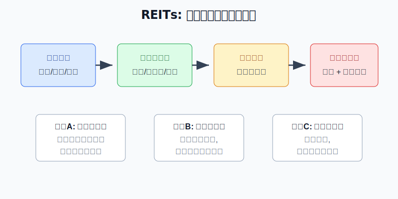
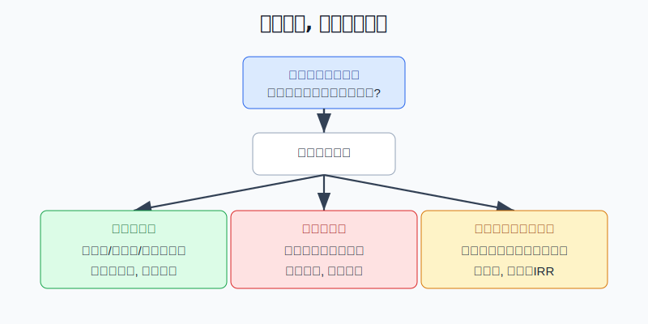
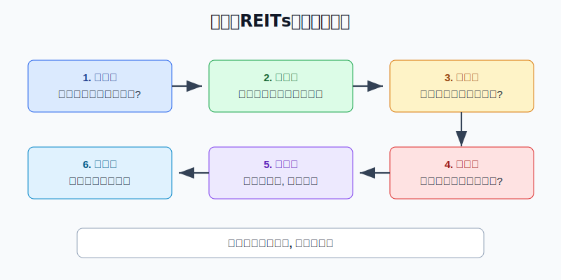

## 散户投资小白金融全品种操盘手册 - 8.1 REITs是什么: 买的是基础设施现金流
  
### 作者  
digoal  
  
### 日期  
2026-06-06   
  
### 标签  
金融产品 , 金融工具 , 散户 , 投资小白 , 全品操盘手册  
  
----  
  
## 背景 
   

> 适用读者: 第一次接触公募REITs, 容易把它误解成“买房收租”或“高息债券”的小白和散户。
> 本文定位: 投资教育框架, 不构成个性化投资建议。

## 一句话先懂

买REITs, 不是买一套房, 也不是借钱给别人收固定利息。你买的是一段基础设施现金流: 高速公路收通行费, 产业园收租金, 仓储物流收租金, 清洁能源项目收电费, 然后基金把可供分配的钱按规则分给持有人。

## 核心概念

REITs, 中文常叫不动产投资信托基金。放到中国公募市场里, 更准确地说, 第八章讨论的是基础设施公募REITs。它把一类本来很难由普通人直接投资的资产, 做成可以在证券交易所买卖的基金份额。

小白可以先把它想成一台“现金流转换机”:

底层资产负责赚钱, 比如路、园区、仓库、保租房、能源站、消费基础设施; 基金结构负责把这些资产装进标准化产品; 交易所负责让份额能买卖; 投资者拿到的回报, 来自现金分配和二级市场价格变化。

这里最容易误解的一点是: REITs有分红, 但不是保本理财; REITs背后有不动产, 但不是你拥有某一套房; REITs价格会波动, 所以也不能只看“分派率”三个字就冲进去。

## 逻辑推导链

【论证链标题】: REITs的回报先由底层资产现金流决定, 再由买入价格放大或压缩, 所以小白买REITs不能只看分红率。

前提A: REITs的底层资产必须能持续产生经营现金流。高速公路靠车流量和收费规则, 产业园靠出租率和租金, 仓储物流靠租户和收缴率, 清洁能源靠发电量和结算电价。这是变量, 会随经济、竞争、政策和运营能力变化。

前提B: 公募REITs有高比例分配规则。证监会《公开募集基础设施证券投资基金指引(试行)》明确, 基础设施基金80%以上基金资产投资于基础设施资产支持证券, 并以获取租金、收费等稳定现金流为主要目的; 收益分配比例不低于合并后基金年度可供分配金额的90%。这是制度前提, 相对稳定。

前提C: REITs在交易所上市交易, 成交价格每天变化。价格高了, 同样的分红对应的现金分派率会下降; 价格跌了, 看上去分派率会变高, 但背后可能是资产经营变差或市场流动性变弱。这是变量。

前提D: 不同REITs的资产类型和剩余期限不同。产权类资产更像“持有物业收租”, 经营权类资产更像“在有限期限内回收现金流”, 不能只拿一个分派率横向比较。这是结构变量。

由A+B可得: 因为REITs先要靠底层资产赚钱, 再把可供分配金额分给投资者, 所以分红不是凭空来的利息, 而是项目经营结果的分配。底层现金流越稳, 分配越有基础; 底层现金流下滑, 分配也会承压。

再由A+B+C可得: 因为REITs既有现金分配, 又有二级市场价格波动, 所以正常情景下的结论不是“分派率越高越好”, 而是“现金流稳定 + 买入价格合理 + 仓位可控”时, 它才适合作为收益型资产的一部分。

最后加上D: 如果买的是经营权类REITs, 还要看剩余期限和全周期内部收益率; 如果买的是产权类REITs, 要重点看出租率、租金、资产估值和后续扩募能力。资产结构不同, 复盘指标不能混用。

正常情景下的操作结论是: 小白可以把REITs当作组合里的收益型资产观察和小比例配置, 但买入前必须先回答三件事: 这只REITs靠什么现金流赚钱? 最近的经营数据有没有恶化? 现在价格对应的回报是否已经被追高压低?

## 数据怎么验证

第一组证据验证制度前提。证监会在2020年发布的《公开募集基础设施证券投资基金指引(试行)》中, 对基础设施基金的结构、现金流目的和90%以上可供分配金额分配规则作出要求。这个规则说明, REITs确实是围绕基础设施现金流设计的产品, 不是普通股票, 也不是银行理财。

第二组证据验证市场已经从试点走向常态化。国家发展改革委2025年11月披露, 截至当时, 已累计向证监会推荐105个基础设施REITs项目, 83个项目已发行上市, 覆盖10个行业18种资产类型, 发售基金总额2070亿元, 预计可带动新项目总投资超1万亿元。这说明REITs不是一个孤立产品, 而是盘活存量资产和连接资本市场的制度化工具。

第三组证据验证“现金流资产”在好年份确实能贡献分配。上交所2026年4月3日发布的沪市公募REITs 2025年年报汇总显示, 2025年沪市52只公募REITs收入145亿元, 同比增长71%; 可供分配金额88亿元, 同比增长42%; 全年实施分红110次, 累计派发近78亿元, 较上年增长30%。其中, 收费公路板块通行费收入69亿元, 日均车流量32万辆, 整体现金流完成度97%。

但反例也必须看。2023年, 公募REITs二级市场曾明显回调。每日经济新闻基于市场数据报道, 2023年中证REITs全收益指数下跌22.67%, 当时29只已上市产品中只有1只年内收益为正。这个失败案例说明: 即使产品有分红, 如果市场定价过高、经营低于预期、流动性变弱, 价格下跌也可能吞掉分红收益。

所以这几组数据合在一起, 只支持一个结论: REITs值得学习, 但不能神化。它的底层逻辑是现金流, 它的风险也来自现金流、价格和期限。

## 前提变化时怎么办

第一种情景: 现金流稳定, 价格也没有明显追高。比如出租率、车流量、收缴率、可供分配金额都和预期接近, 当前价格对应的分派率没有被快速上涨压得太低。此时可以把REITs放进收益型资产观察区, 小仓位、分批买、按季度复盘。

第二种情景: 现金流变弱。比如产业园出租率下降, 高速车流量低于预期, 仓储租户退租, 或可供分配金额连续下降。此时推导路径变了: 因为分红来自底层资产现金流, 所以现金流变弱时, 高分派率可能只是价格下跌后的表象。对应操作不是补仓, 而是暂停加仓, 读公告, 查经营原因。

第三种情景: 现金流没变, 但价格涨太多。假设一只REITs过去12个月每份分配0.20元, 价格从4元涨到5元, 粗略分派率就从5%降到4%。现金流没有变, 只是你买贵了。此时推导结论是: 不追高, 等价格或等分配增长确认。

第四种情景: 买的是经营权类REITs, 剩余期限较短。此时不能只看当年分红, 因为你的回报里包含有限期限内的本金回收逻辑。正确动作是看全周期内部收益率、剩余期限、项目到期安排, 不把它和永久产权类资产简单比较。

## 实操例子

假设小周有10万元投资资金, 已经留好生活备用金, 组合里有货币基金、宽基ETF和短债基金。他想拿5000元学习REITs, 目标不是暴富, 而是理解现金流资产。

第一步, 定角色。小周写下: REITs在我的账户里属于收益型资产, 不是保本资产, 也不是进攻主仓。这一步对应前提C, 因为REITs有二级市场价格波动。

第二步, 看资产。候选REITs如果是产业园, 他就看出租率、租金水平、租户集中度和剩余租期; 如果是高速公路, 他就看车流量、通行费收入和收费期限; 如果是清洁能源, 他就看发电量、电价结算和补贴依赖。这一步对应前提A, 因为不同资产的现金流来源不同。

第三步, 看分配。小周不直接问“分派率多少”, 而是先查最近年报或季报里的收入、可供分配金额、实际分红金额和同比变化。若可供分配金额下降超过一成, 他不会因为价格跌了、分派率看起来变高就立刻买入, 而是先查现金流为什么变弱。

第四步, 看价格。假设某REITs过去12个月每份分配0.20元, 当前价格4.50元, 粗略现金分派率约4.44%。如果同类资产价格更低、经营更稳, 或这只REITs刚经历快速上涨, 小周就先不追。这个动作对应前提C: 买入价格会压缩未来回报。

第五步, 定仓位。他先买2000元作为观察仓, 不超过账户2%; 只有当两个季度经营指标稳定、价格没有明显追高、自己能读懂公告时, 才考虑把REITs仓位提高到5%左右。这里不是推荐比例, 而是示范: 小白先用小钱学习现金流逻辑。

第六步, 写纠偏。如果买入后出租率、车流量或可供分配金额连续恶化, 他停止加仓并考虑减仓; 如果价格上涨导致仓位超过计划, 他不因为赚钱就继续追; 如果只是短期价格波动, 但现金流前提没有坏, 他按季度复盘, 不被日线牵着走。

如果小周犯错, 最常见的错误是只看分派率。比如价格跌到3.50元后, 表面分派率从4.44%升到5.71%, 他以为更便宜; 但如果同一时期可供分配金额正在下降, 那就不是便宜, 而可能是市场在重新给风险定价。纠偏方法是回到论证链: 先查现金流, 再谈分红率。

## 可复用框架

【现金流三问】

适用前提: 你想买REITs, 但还不能判断它是好资产还是高分红陷阱。

核心逻辑: 因为REITs分红来自底层资产现金流, 所以先看现金流来源、现金流稳定性、现金流对应的买入价格。

操作步骤:

1. 问来源: 这只REITs靠租金、通行费、电费、仓储费还是其他收费赚钱?
2. 问稳定: 出租率、车流量、收缴率、剩余租期、可供分配金额有没有恶化?
3. 问价格: 当前分派率是经营改善带来的, 还是价格下跌“算出来”的?

前提失效时: 现金流来源说不清、经营指标下滑、价格短期涨太多, 任意一个出现, 先暂停买入。

举一反三: 这个框架也能用在高股息股票、红利ETF和部分债券基金上。凡是你想拿“现金收益”的资产, 都要先问现金流从哪里来。

【价格闸门法】

适用前提: 你已经看懂REITs的底层资产, 但不知道现在能不能下手。

核心逻辑: 因为REITs的分配金额不等于你的实际回报, 买入价格越高, 未来回报越容易被压缩, 所以买前要设置价格闸门。

操作步骤:

1. 用过去12个月实际分配金额除以当前价格, 粗算现金分派率。
2. 对比同类资产和无风险利率环境, 判断补偿够不够。
3. 若价格上涨快于可供分配金额增长, 暂停追高。
4. 若价格下跌但经营指标同步恶化, 不把高分派率当便宜。

前提失效时: 如果公告显示项目经营逻辑被破坏, 价格再低也先不接; 如果价格已经充分上涨, 现金流再稳也要等回报重新变得合理。

举一反三: 这个方法同样适用于第八章后面要讲的高股息资产。高息不是免费午餐, 高息背后要么是好现金流, 要么是高风险定价。

## 本节行动清单

| 买入前问题 | 判断标准 |
|---|---|
| 它到底靠什么赚钱? | 租金、通行费、电费、仓储费等现金流来源必须说清 |
| 经营指标稳不稳? | 看出租率、车流量、收缴率、剩余租期、可供分配金额 |
| 分红是不是有基础? | 分红要能回到收入和可供分配金额, 不能只看软件显示的分派率 |
| 当前价格贵不贵? | 价格上涨但分配没涨时, 未来回报被压缩 |
| 仓位有没有上限? | REITs是收益型资产, 不是保本工具, 小白先小仓位学习 |

## 一句话总结

REITs的核心不是“高分红”三个字, 而是“基础设施现金流 + 高比例分配规则 + 二级市场定价”。现金流稳、价格合理、仓位可控, 它才是收益型资产; 现金流变弱或价格买贵, 分红率再好看也可能是陷阱。

## 参考资料

- 中国证监会: 《证监会发布〈公开募集基础设施证券投资基金指引(试行)〉》, 2020-08-07, https://www.csrc.gov.cn/csrc/c100028/c1000722/content.shtml
- 上海证券交易所: 基础设施公募REITs介绍, 访问日期 2026-06-06, https://star.sse.com.cn/reits/intro/
- 国家发展改革委: 《国家发展改革委部署推进基础设施领域不动产投资信托基金(REITs)项目常态化发行》, 2024-07-26, https://www.ndrc.gov.cn/xxgk/jd/jd/202407/t20240726_1392008.html
- 国家发展改革委: 新闻发布文字实录, 固定资产投资司副司长关鹏答记者问, 2025-11-11, https://www.ndrc.gov.cn/xwdt/wszb/cjmjtzfzqk/wzsl/202511/t20251111_1401528.html
- 上海证券交易所: 《深耕实体沃土 共绘发展新篇——沪市公募REITs 2025年年报“出炉”》, 2026-04-03, https://big5.sse.com.cn/site/cht/www.sse.com.cn/aboutus/mediacenter/hotandd/c/c_20260403_10814138.shtml
- 每日经济新闻: 《公募REITs的2023: 二级市场表现乏力, 常态化发行加速推进中》, 2023-12-29, https://www.nbd.com.cn/articles/2023-12-29/3188866.html

> ⚠️ **声明**：本文内容为投资教育目的，所有历史数据、策略框架均为辅助学习工具，不构成证券投资建议。市场有风险，投资需谨慎。实际操作请结合自身风险承受能力，必要时咨询专业投顾。
  
#### [PostgreSQL 解决方案集合](../201706/20170601_02.md "40cff096e9ed7122c512b35d8561d9c8")
  
  
#### [德哥 / digoal's Github - 公益是一辈子的事.](https://github.com/digoal/blog/blob/master/README.md "22709685feb7cab07d30f30387f0a9ae")
  
  
#### [About 德哥](https://github.com/digoal/blog/blob/master/me/readme.md "a37735981e7704886ffd590565582dd0")
  
  

  
