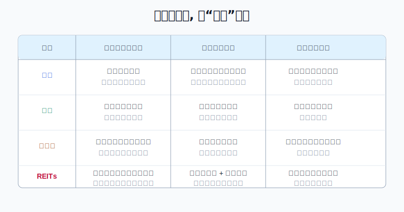
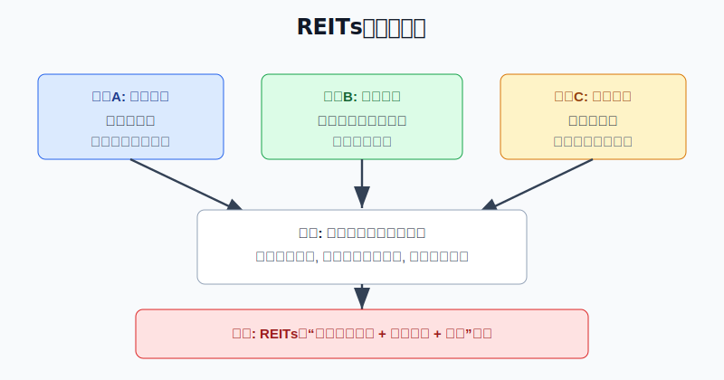
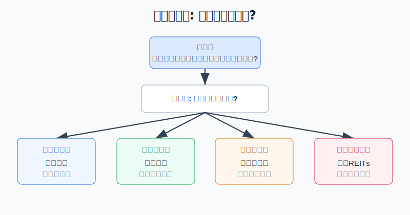

## 散户投资小白金融全品种操盘手册 - 8.2 公募REITs和股票、债券、房地产的区别
  
### 作者  
digoal  
  
### 日期  
2026-06-06   
  
### 标签  
金融产品 , 金融工具 , 散户 , 投资小白 , 全品操盘手册  
  
----  
  
## 背景 
   

> 适用读者: 已经知道REITs买的是基础设施现金流, 但还会把它当成“高息债券”“房地产股票”或“线上买房”的小白和散户。
> 本文定位: 投资教育框架, 不构成个性化投资建议。

## 一句话先懂

REITs最容易讲错, 因为它同时长得像三样东西: 像股票一样在交易所买卖, 像债券一样经常分红, 又像房地产一样背后有不动产。但真正下单时, 你不能按长相买, 要按权利买。

## 核心概念

股票是一张“公司所有权凭证”。你买股票, 本质上是买公司的一小部分, 未来回报来自公司利润增长、分红和估值变化。公司做大, 股票有上行空间; 公司经营变坏或估值太高, 股价就会下跌。

债券是一张“借条”。你买债券, 本质上是把钱借给发行人, 发行人按约定付利息、到期还本金。它不是绝对安全, 仍有违约、利率上行和流动性风险, 但它的核心规则是债权债务关系。

直接房地产是一项具体资产。你买房、买商铺、买厂房, 本质上是拥有一个明确物业的控制权, 收益来自租金和资产价格变化, 同时承担税费、空置、维护、折价出售和大额资金占用。

公募REITs不是这三者的简单拼接。中国公募REITs是上市交易的封闭式公募基金, 通过资产支持证券等载体持有基础设施项目, 由管理人运营项目, 再把大部分可供分配金额分给投资者。你买到的是基金份额, 背后对应的是基础设施项目现金流, 不是某家公司股票、不是固定付息债券, 也不是你能自己处置的一套房。

## 逻辑推导链

【论证链标题】: REITs的决策规则, 由“权利性质 + 现金流来源 + 交易方式”共同决定, 所以不能用股票、债券或房地产的单一规则套进去。

前提A: 股票、债券、房地产代表的权利不同。股票偏公司所有权, 债券偏收款权, 房地产偏具体物业控制权。这是常量, 是金融工具的底层分类。

前提B: 公募REITs的制度结构不同。证监会2020年发布的《公开募集基础设施证券投资基金指引(试行)》明确, 基础设施基金80%以上基金资产投资于基础设施资产支持证券, 通过特殊目的载体取得基础设施项目完全所有权或经营权利, 以获取租金、收费等稳定现金流为主要目的, 并将90%以上合并后基金年度可供分配金额分配给投资者。这是制度前提, 相对稳定。

前提C: REITs在交易所上市交易, 价格每天变化。上交所公募REITs介绍也强调, 我国公募REITs按规定在证券交易所上市交易。也就是说, 它有现金分配, 也有二级市场价格波动。这是变量, 会受利率、风险偏好、流动性和项目经营影响。

由A+B可得: 因为REITs买到的不是上市公司经营权, 也不是债务人的固定还款承诺, 所以它既不能按“成长股”逻辑只看收入利润扩张, 也不能按“债券”逻辑只问票息和到期本金。

再由B+C可得: 因为REITs的分配来自底层项目现金流, 但买入价格来自交易所撮合成交, 所以同一只REITs在现金流没变时, 买贵了会压低未来回报; 价格跌了也不必然便宜, 因为底层现金流也可能同步变差。

正常情景下的操作结论是: 小白买REITs前, 先不要问“它像不像股票、债券或房子”, 而要连续回答三件事: 第一, 这只REITs背后是哪类现金流; 第二, 这类现金流是否稳定; 第三, 当前价格给你的回报补偿够不够。

## 数据怎么验证

第一组证据验证制度结构。证监会《公开募集基础设施证券投资基金指引(试行)》把公募REITs定义为上市交易的封闭式公募基金, 核心是持有基础设施资产支持证券并获取基础设施现金流, 同时要求90%以上合并后年度可供分配金额按要求分配。这说明REITs有分配机制, 但不是债券的固定票息。

第二组证据验证它已经成为独立资产类别。上交所2021年发布基础设施REITs三项业务规则时提到, 公募REITs为投资者提供除股票、债券、基金和衍生品之外新的大类资产配置类别。这句话很关键: 监管和交易所并没有把REITs简单归到股票或债券里, 而是把它看成一类新工具。

第三组证据验证现金流确实是回报核心。上交所2026年4月3日披露的沪市公募REITs 2025年年报汇总显示, 截至2026年3月31日, 沪市52只公募REITs完成2025年年报披露; 2025年收入145亿元, 同比增长71%; 可供分配金额88亿元, 同比增长42%; 全年分红110次, 累计派发近78亿元, 较上年增长30%。这些数字说明, 好年份里REITs确实能把项目经营现金流转化为投资者分配。

第四组证据验证“上市交易”会带来波动。每日经济新闻基于市场数据报道, 2023年中证REITs全收益指数下跌22.67%, 当时29只已上市产品中只有1只年内收益为正。这个反例说明, 如果你把REITs当成保本债券或只涨不跌的房产替代品, 一遇到二级市场重定价, 心理预期就会错位。

历史数据不代表未来, 但这些证据仍有参考价值: 它们验证的是产品结构, 不是预测某只REITs的涨跌。结构不变, 决策框架就有复用价值。

## 前提变化时怎么办

第一种情景: 你想赚企业高速成长的钱。推导路径变为: 因为目标是企业利润扩张和估值提升, 所以核心研究对象应是股票或股票型基金, 不是REITs。对应动作是去研究行业空间、竞争优势、利润率和估值, 不要拿REITs去追成长股式弹性。

第二种情景: 你想要明确的还本付息。推导路径变为: 因为目标是债权人的固定收款权, 所以核心研究对象应是国债、政策性金融债、信用债或债券基金。REITs有分配, 但没有固定票息和到期还本承诺。对应动作是看债券久期、信用等级和利率环境, 不把REITs当保本理财。

第三种情景: 你想拥有和使用具体物业。推导路径变为: 因为目标是控制某个房产, 所以REITs不满足这个前提。买REITs不能让你决定租给谁、租多少钱、什么时候卖楼。对应动作是研究房产本身、区位、税费、贷款和流动性, 不把REITs当“众筹买房”。

第四种情景: 你想参与基础设施现金流, 但不想大额买房、不想自己运营物业。此时REITs才进入候选区。对应动作是看底层资产类型、出租率、车流量、收缴率、可供分配金额、剩余期限、交易价格和仓位上限。

## 实操例子

假设小周有10万元投资资金, 已经留好6个月生活备用金。他准备拿5000元学习收益型资产, 在四个选项里犹豫: 高股息股票、债券基金、直接买小商铺、公募REITs。

第一步, 写清目标。小周写下: 我不是为了企业高速成长, 也不是为了固定还本付息, 更没有能力买卖和运营一套物业; 我的目标是学习基础设施现金流资产。这一步对应论证链的前提A, 先把权利类型分清。

第二步, 排除不匹配工具。若他追求企业成长, 去研究股票; 若他追求更接近固定收益的工具, 去研究债券基金; 若他想拥有物业控制权, 去研究房地产。目标既然是项目现金流, REITs才留下。这一步对应“A+B推导”: 工具不匹配时, 后面的分红率比较没有意义。

第三步, 查REITs底层资产。候选REITs如果是产业园, 他看出租率、租金单价、租户集中度和剩余租期; 如果是高速公路, 他看车流量、通行费收入和收费期限; 如果是消费基础设施, 他看出租率、客流、商户销售和收缴率。这一步对应前提B: 分配来自项目现金流。

第四步, 算价格补偿。假设某REITs过去12个月每份分配0.20元, 当前价格4.80元, 粗略分派率约4.17%。如果同类REITs经营更稳、价格更低, 或这只REITs刚被追高, 小周不买满5000元, 只先观察。这一步对应前提C: 上市交易价格会改变未来回报。

第五步, 定仓位和纠偏。小周先买2000元作为观察仓, 不超过总资金2%。如果两个季度后经营指标稳定、价格没有明显追高, 再考虑提高到5%以内; 如果可供分配金额连续下降或出租率明显恶化, 停止加仓; 如果价格上涨导致分派率被压低, 不追高。

如果他犯错, 最典型的错误是把REITs当债券。比如看到“分红”两个字就以为收益固定, 结果2023年那样的二级市场回调出现时, 分红抵不过价格下跌。纠偏方法不是安慰自己“长期总会回来”, 而是回到论证链: 现金流是否还稳? 买入价格是否过高? 这笔仓位是否超过收益型资产上限?

## 可复用框架

【三不像法】

适用前提: 你看见一个REITs产品, 但还不知道该用股票、债券还是房地产的眼光分析。

核心逻辑: 因为REITs同时有上市交易、现金分配和不动产底层资产, 所以先说清它“不是什么”, 再说清它“是什么”。

操作步骤:

1. 不当股票: 不只看成长故事和行情弹性, 先看底层项目现金流。
2. 不当债券: 不把分红当固定利息, 先看可供分配金额是否稳定。
3. 不当房子: 不以为自己拥有某个物业控制权, 先看基金结构、管理人和交易价格。

前提失效时: 如果你的真实目标是成长、固定利息或物业控制权, 直接切换到股票、债券或房地产框架。

举一反三: 这个方法也能用来区分红利ETF、高股息个股和债券基金。名字像“收息”, 不等于风险一样。

【权利先行】

适用前提: 你准备比较四类资产, 但容易被收益率数字带着跑。

核心逻辑: 因为收益率只是结果, 权利性质才决定风险来源, 所以先判断“我买到什么权利”, 再比较收益。

操作步骤:

1. 先写权利: 股东权、债权、物业控制权, 还是REITs基金份额。
2. 再写现金流: 利润、利息、租金, 还是基础设施收费和租赁收入。
3. 最后写价格: 当前买入价是否已经把好处提前透支。

前提失效时: 权利说不清、现金流说不清、价格补偿说不清, 三者任意一个说不清, 就先不下单。

举一反三: 后面讲高股息资产时也要用这个框架。高股息股票不是债券, 红利ETF不是保本产品, 分红率永远不能替代权利分析。

## 本节行动清单

| 买入前问题 | 判断标准 |
|---|---|
| 我买到的是哪种权利? | 股票是股东权, 债券是债权, 房地产是物业控制权, REITs是基金份额对应的项目权益 |
| 收益从哪里来? | REITs主要看租金、通行费、仓储费、电费等项目现金流 |
| 分配是不是固定利息? | 不是。分配依赖可供分配金额, 会受项目经营影响 |
| 价格会不会波动? | 会。上市交易带来流动性, 也带来二级市场涨跌 |
| 我该用什么仓位? | 小白把REITs放在收益型资产区, 先小仓位学习, 不替代核心宽基和现金防守 |

## 一句话总结

REITs不是股票、不是债券、也不是直接买房; 它是一种上市交易的基础设施现金流工具。买它之前, 先分清权利, 再看现金流, 最后看价格和仓位。

## 参考资料

- 中国证监会: 《证监会发布〈公开募集基础设施证券投资基金指引(试行)〉》, 2020-08-07, https://www.csrc.gov.cn/csrc/c100028/c1000722/content.shtml
- 上海证券交易所: 《公募REITs介绍》, 访问日期 2026-06-06, https://www.sse.com.cn/reits/intro/
- 上海证券交易所: 《上交所发布基础设施证券投资基金(REITs)三项主要业务规则》, 2021-01-29, https://www.sse.com.cn/reits/news/c/c_20210129_5313804.shtml
- 上海证券交易所: 《深耕实体沃土 共绘发展新篇——沪市公募REITs 2025年年报“出炉”》, 2026-04-03, https://www.sse.com.cn/aboutus/mediacenter/hotandd/c/c_20260403_10814138.shtml
- 中国投资者网: 《资本市场投资理财实务》, 2023-02, https://www.investor.org.cn/xxzx/tjzl/tjnrgmjytx/bk/kj/jyxl_3401/202302/P020230226502261354858.pdf
- 每日经济新闻: 《公募REITs的2023: 二级市场表现乏力, 常态化发行加速推进中》, 2023-12-29, https://www.nbd.com.cn/articles/2023-12-29/3188866.html

> ⚠️ **声明**：本文内容为投资教育目的，所有历史数据、策略框架均为辅助学习工具，不构成证券投资建议。市场有风险，投资需谨慎。实际操作请结合自身风险承受能力，必要时咨询专业投顾。
  
#### [PostgreSQL 解决方案集合](../201706/20170601_02.md "40cff096e9ed7122c512b35d8561d9c8")
  
  
#### [德哥 / digoal's Github - 公益是一辈子的事.](https://github.com/digoal/blog/blob/master/README.md "22709685feb7cab07d30f30387f0a9ae")
  
  
#### [About 德哥](https://github.com/digoal/blog/blob/master/me/readme.md "a37735981e7704886ffd590565582dd0")
  
  

  
