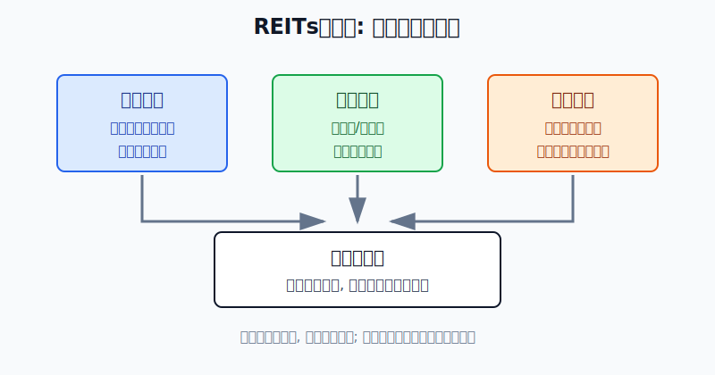
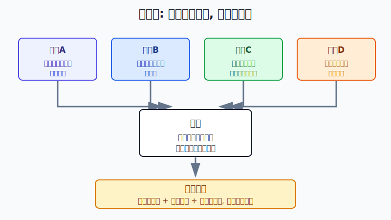
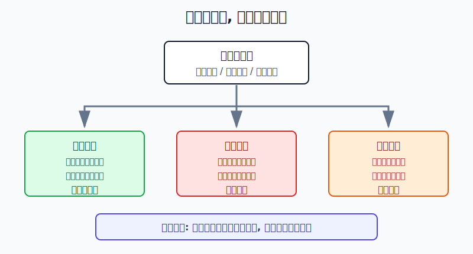

## 散户投资小白金融全品种操盘手册 - 8.3 REITs收益来源: 分红、资产运营、估值变化
  
### 作者  
digoal  
  
### 日期  
2026-06-06   
  
### 标签  
金融产品 , 金融工具 , 散户 , 投资小白 , 全品操盘手册  
  
----  
  
## 背景 
   

> 适用读者: 已经知道REITs是基础设施现金流, 但还分不清“分红率”和“总收益”的小白和散户。
> 本文定位: 第八章第三节, 帮你把REITs收益拆成三个账本, 买入前先判断哪一部分可靠。

## 先问一个反直觉问题

一只REITs今年分红5%, 你的实际收益就一定是5%吗?

答案是否定的。REITs有分红, 但它也在交易所交易, 价格每天涨跌。分红只是收益的一部分, 资产运营和估值变化同样会改变你的账户结果。

## 核心概念: 三个账本

小白看REITs, 不要先问“分红率高不高”, 要先把收益拆成三个账本。

第一个账本是**现金分配**。REITs底层资产收租金、通行费、电费、仓储费, 扣掉成本、税费、必要支出后形成可供分配金额, 再按规则分给投资者。它像果树今年结出来的果子, 果子多不多, 取决于树本身是否健康。

第二个账本是**资产运营**。同一座产业园, 出租率从90%提高到97%, 租金收缴率接近100%, 现金流就更扎实; 同一条收费公路, 车流量恢复, 通行费收入提高, 可供分配金额就更有基础。运营改善不是立刻变成账户收益, 但会支撑后续分红和资产价值。

第三个账本是**估值变化**。你买的是交易所里的基金份额, 不是锁定收益的存款。市场情绪、利率、流动性、项目经营预期都会影响价格。价格上涨会放大收益, 价格下跌也会吞掉分红。

所以REITs总回报可以用一句话理解: **总回报 = 现金分配 + 运营改善带来的价值变化 + 二级市场估值变化**。

## 逻辑推导链

【论证链标题】: REITs不是“看分红率买入”的产品, 而是“先拆收益来源, 再判断可持续性”的现金流资产。

前提A: 公募REITs有高比例分配规则。证监会2020年发布的《公开募集基础设施证券投资基金指引(试行)》明确, 基础设施基金80%以上基金资产投资于基础设施资产支持证券, 并将90%以上合并后基金年度可供分配金额按要求分配给投资者。这个制度前提相对稳定。

前提B: 可供分配金额来自底层资产经营。上交所REITs专栏介绍, 公募REITs通过特殊目的载体持有不动产项目, 由基金管理人等主动管理运营, 并把产生的绝大部分收益分配给投资者。这个前提是变量, 因为出租率、车流量、发电量、收缴率都会变化。

前提C: 资产运营会改变未来现金流。运营改善时, 同样的资产能产生更多或更稳的现金流; 运营恶化时, 当期分红看起来还高, 后续分配也会承压。这是变量。

前提D: REITs在交易所上市交易, 价格每天变化。价格涨得太快, 同样的分红对应的未来回报被压低; 价格跌得太深, 如果现金流没有坏, 反而会提高配置性价比。这个前提也是变量。

由A+B可得: 因为REITs按规则把可供分配金额高比例分给投资者, 而可供分配金额来自底层经营, 所以分红不是固定利息, 而是经营结果的分配。经营结果越稳, 分红越有基础。

再由B+C可得: 因为底层经营数据会变化, 所以只看过去分红不够。出租率提高、车流量恢复、收缴率稳定, 才能支持后续现金分配; 如果这些指标恶化, 高分红率会变成风险提示。

最后由A+B+C+D可得: 因为REITs既有现金分配, 又有运营变化, 还叠加市场定价, 所以正常情景下的操作结论是: **只有当现金分配有来源、运营趋势不坏、当前价格没有提前透支收益时, REITs才适合作为收益型资产小仓位配置。**

对应操作很简单: 买入前给每只REITs填三列。第一列写现金分配来自哪里; 第二列写运营指标是改善、稳定还是恶化; 第三列写当前价格有没有把未来收益提前涨完。三列有一列说不清, 就先不买。

## 数据怎么验证

第一组证据验证“分红来自制度和现金流”。证监会2020年发布的《指引》要求基础设施基金高比例投资基础设施资产支持证券, 并把90%以上合并后基金年度可供分配金额分配给投资者。这里的关键词是“可供分配金额”, 不是承诺收益。它告诉我们: REITs分红有制度约束, 但分红基础仍是项目经营。

第二组证据验证“运营改善能支撑收益”。上交所2026年4月3日披露, 截至2026年3月31日, 沪市52只公募REITs完成2025年年报披露; 2025年这些产品合计收入145亿元, 同比增长71%, 可供分配金额88亿元, 同比增长42%。同一篇披露里, 消费板块平均出租率升至98%, 收缴率接近100%; 保障性租赁住房板块出租率95%、租金收缴率100%; 高速公路板块通行费收入69亿元、日均车流量32万辆、整体现金流完成度97%。这些数据说明, 分红背后要看真实运营指标。

第三组证据验证“估值变化会改变总回报”。上交所同篇披露显示, 2025年沪市公募REITs全年实施分红110次, 累计派发近78亿元; 当年除权价格平均上涨6.3%, 若计入分红再投资, 复权价格涨幅为11.9%。这说明REITs的投资回报不是单一分红, 而是分红和价格共同作用。

反例也很关键。每日经济新闻2023年12月29日报道, 2023年中证REITs全收益指数下跌22.67%, 当时29只已上市产品中仅1只年内收益为正。报道还提到, 部分产业园、物流园出租和续租不及预期, 以及流动性偏弱, 都影响了二级市场表现。这个失败案例说明: 即使有分红制度, 如果运营预期变差或估值回落, 账户仍会亏损。

这些数据合在一起, 只支持一个结论: **分红率不能单独作为买入理由。分红要有现金流来源, 运营要能持续, 价格要有安全边际。**

历史数据不代表未来收益, 但它仍有参考价值: 因为REITs的分红、运营和估值变化都会留下可复盘的公开记录, 小白可以用这些记录检查自己的买入理由是否还成立。

## 前提变化时怎么办

第一种情景: 现金分配稳定, 运营指标稳定或改善, 价格没有明显追高。比如出租率、车流量、收缴率和可供分配金额都达标, 当前价格对应的分派率没有被快速上涨压得太低。此时可以小仓位、分批买, 并按季度复盘。

第二种情景: 分红率看起来高, 但运营变弱。比如产业园出租率下降, 仓储租户退租, 高速车流量低于预期, 或可供分配金额连续下滑。此时推导路径变了: 因为分红来自经营现金流, 所以经营变弱时, 高分红率可能只是价格下跌后算出来的表象。对应操作是暂停加仓, 先读季报和临时公告。

第三种情景: 运营没坏, 但价格涨太多。假设过去12个月每份分配0.24元, 价格从4元涨到6元, 粗略分派率就从6%降到4%。现金流没有恶化, 但你买贵了。对应操作是不追高, 等价格回到可接受区间, 或等后续可供分配金额增长把估值消化掉。

第四种情景: 价格下跌, 但运营没有坏。此时不能自动恐慌, 要回到三账本。如果可供分配金额、出租率、车流量、收缴率都没有恶化, 下跌主要来自市场流动性或情绪, 那就进入观察名单; 如果价格下跌同时运营恶化, 就不是便宜, 而是风险重新定价。

## 实操例子

假设小林有10万元投资资金, 已经留好6个月生活备用金, 组合里主要是货币基金、宽基ETF和短债基金。他想拿5000元学习REITs, 目标是建立收益型资产仓位, 不是短线炒作。

第一步, 先填“现金分配账”。候选REITs过去12个月每份累计分配0.24元, 当前价格4.80元, 粗略现金分派率是5%。小林不直接下单, 而是查年报里的可供分配金额是否覆盖这0.24元, 以及分配是不是来自正常经营现金流。这一步对应前提A+B。

第二步, 再填“运营账”。如果这只REITs是产业园, 他看出租率、租金水平、租户集中度、租金收缴率; 如果是高速公路, 他看车流量、通行费收入和收费期限; 如果是能源项目, 他看发电量、结算电价和补贴依赖。若最近两个季度出租率从96%降到88%, 他不因为分派率5%就买入。这一步对应前提C。

第三步, 最后填“估值账”。如果价格过去半年从4.00元涨到4.80元, 但每份分配仍是0.24元, 分派率已经从6%降到5%。若同类资产运营更稳、价格更低, 或这只REITs涨幅主要来自情绪修复, 他就先等。这一步对应前提D。

第四步, 设仓位。三账本都通过时, 小林先买2000元观察仓, 占账户2%; 后续两个季度运营指标继续稳定, 再考虑把REITs仓位提高到5%左右。这里不是推荐比例, 而是示范小白如何用小钱学习。

第五步, 写纠偏规则。买入后如果可供分配金额连续下降、出租率或车流量明显恶化, 他停止加仓并考虑减仓; 如果价格上涨让仓位超过计划, 他减回目标仓位; 如果只是价格短期波动, 但现金流和运营没有坏, 他按季度复盘, 不被日线带着跑。

操作错误的后果也要写清楚: 如果小林只看5%分派率, 忽略出租率下降, 可能买到的是“高息陷阱”; 如果只看价格上涨, 忽略分派率被压低, 可能买在预期透支之后。纠偏方法只有一个: 回到三账本, 逐项重算。

## 可复用框架

【三账本法】

适用前提: 你想买REITs, 但分不清收益来自分红、运营还是价格上涨。

核心逻辑: 因为REITs总回报由现金分配、资产运营和估值变化共同决定, 所以买入前必须把三部分分开看。

操作步骤:

1. 现金分配账: 查过去12个月每份分配、可供分配金额和分配来源。
2. 运营账: 查出租率、车流量、收缴率、收入、剩余期限等核心指标。
3. 估值账: 查当前价格、分派率变化、同类资产比较和价格涨跌原因。

前提失效时: 分配来源说不清、运营指标恶化、价格涨幅快于现金流增长, 任意一项出现, 先暂停买入。

举一反三: 这个框架也能用在高股息股票、红利ETF和美股REITs上。凡是你为了现金收益买入的资产, 都要先拆收益来源。

【先真后价】

适用前提: 你看到某只REITs价格下跌、分派率升高, 心里想抄底。

核心逻辑: 因为高分派率既可能来自真实现金流, 也可能来自价格下跌, 所以必须先判断现金流真假, 再判断价格便宜不便宜。

操作步骤:

1. 先真: 确认可供分配金额、经营收入、出租率或车流量没有明显恶化。
2. 后价: 再看价格下跌后, 分派率是否足以补偿项目和流动性风险。
3. 小仓: 只用观察仓验证判断, 不因“高息”一次性重仓。

前提失效时: 如果经营指标同步恶化, 下跌不是机会, 而是风险定价; 如果价格上涨过快, 现金流再稳也要等回报重新合理。

举一反三: 债券基金、高股息股票、银行股都适用“先真后价”。先看收益是否真实, 再看价格是否便宜。

## 本节行动清单

| 买入前问题 | 合格答案 |
|---|---|
| 分红从哪里来? | 能回到可供分配金额和经营现金流 |
| 运营有没有变坏? | 出租率、车流量、收缴率、收入等指标稳定或改善 |
| 当前价格贵不贵? | 价格上涨没有明显快于现金流增长 |
| 高分派率是不是陷阱? | 不是单纯由价格下跌“算出来”的 |
| 仓位怎么控制? | 小白先观察仓, 再按季度经营数据决定是否加仓 |

## 一句话总结

REITs收益不是一个“分红率”能讲清的东西。现金分配告诉你今年拿了多少, 资产运营告诉你以后能不能继续拿, 估值变化决定市场愿意用什么价格买这段现金流。三账本都说得通, 才值得小仓位参与。

## 参考资料

- 中国证监会: 《证监会发布〈公开募集基础设施证券投资基金指引(试行)〉》, 2020-08-07, https://www.csrc.gov.cn/csrc/c100028/c1000722/content.shtml
- 上海证券交易所: 公募REITs介绍, 访问日期 2026-06-06, https://star.sse.com.cn/reits/
- 上海证券交易所: 《深耕实体沃土 共绘发展新篇——沪市公募REITs 2025年年报“出炉”》, 2026-04-03, https://www.sse.com.cn/aboutus/mediacenter/hotandd/c/c_20260403_10814138.shtml
- 每日经济新闻: 《公募REITs的2023: 二级市场表现乏力, 常态化发行加速推进中》, 2023-12-29, https://www.nbd.com.cn/articles/2023-12-29/3188866.html

> ⚠️ **声明**：本文内容为投资教育目的，所有历史数据、策略框架均为辅助学习工具，不构成证券投资建议。市场有风险，投资需谨慎。实际操作请结合自身风险承受能力，必要时咨询专业投顾。
  
#### [PostgreSQL 解决方案集合](../201706/20170601_02.md "40cff096e9ed7122c512b35d8561d9c8")
  
  
#### [德哥 / digoal's Github - 公益是一辈子的事.](https://github.com/digoal/blog/blob/master/README.md "22709685feb7cab07d30f30387f0a9ae")
  
  
#### [About 德哥](https://github.com/digoal/blog/blob/master/me/readme.md "a37735981e7704886ffd590565582dd0")
  
  

  
