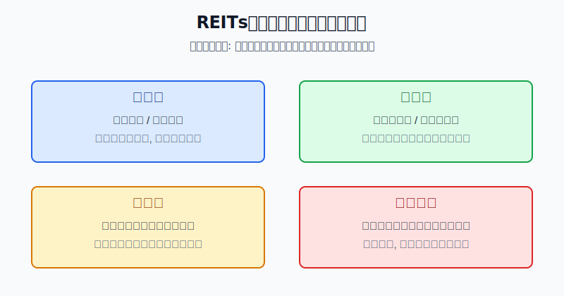
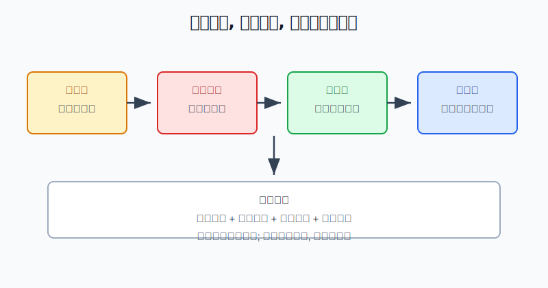
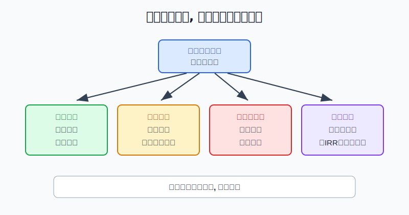

## 散户投资小白金融全品种操盘手册 - 8.4 关键指标: 分派率、出租率、收费权、剩余期限
  
### 作者  
digoal  
  
### 日期  
2026-06-06   
  
### 标签  
金融产品 , 金融工具 , 散户 , 投资小白 , 全品操盘手册  
  
----  
  
## 背景 
   

> 适用读者: 已经知道REITs是基础设施现金流, 但一看到“年化分派率”就想下单的小白和散户。
> 本文定位: 教你读REITs四个关键指标, 不构成个性化投资建议。

## 先问你一个问题

同样显示5%分派率的两只REITs, 一只可能是现金流稳定、价格合理; 另一只可能是出租率下滑、价格跌出来的“高息”。所以这一节的核心不是记公式, 而是学会判断: 这个分派率到底是奖励, 还是警报。

## 先把四个指标翻译成人话

分派率, 可以粗略理解成“过去或预计分给你的现金, 除以你买入时付出的价格”。它看起来像利息, 但不是利息。银行存款的利息由合同约定, REITs的分派来自底层项目经营和基金可供分配金额。项目赚得少、价格买得贵, 分派率就不可靠。

出租率, 是物业类REITs最直观的经营指标。产业园、仓储物流、保租房、商业零售, 都要看有多少面积真正租出去了。出租率就像餐馆的上座率: 桌子摆在那里不等于有人吃饭, 资产在账上不等于产生现金流。

收费权, 是经营权类REITs的根。高速公路靠通行费, 能源项目靠电费或相关结算, 市政环保靠处理费。你买的不是永久资产, 而是一段时间内的收费现金流。收费规则、价格机制、车流量、发电量, 都会影响钱能不能按预期回来。

剩余期限, 是所有现金流的倒计时。产权类资产要看土地使用权、租约期限和资产可持续运营能力; 经营权类资产更要看收费权还能持续多少年。期限越短, 越不能只看当年分红, 因为未来留给你回收本金和收益的时间更少。

## 逻辑推导链

【论证链标题】: REITs四个指标必须按“权利类型 -> 剩余期限 -> 经营现金流 -> 价格补偿”的顺序读, 否则分派率会把小白带进高息陷阱。

前提A: REITs的现金流来自底层资产运营。物业类资产靠出租和收租, 收费类资产靠通行费、电费、处理费等经营收入。这个前提是变量, 会随行业景气、竞争、租户质量、车流量和政策规则变化。

前提B: REITs有较高比例现金分配规则。证监会《公开募集基础设施证券投资基金指引(试行)》规定, 基础设施基金以获取租金、收费等稳定现金流为主要目的, 收益分配比例不低于合并后基金年度可供分配金额的90%。这个前提是制度常量, 但它只说明“赚到的可分配现金要高比例分”, 不说明“一定赚到这么多”。

前提C: REITs的二级市场价格每天变化。分派率的分母是价格, 价格涨了, 同样分红对应的分派率下降; 价格跌了, 分派率会被动升高。这个前提是变量。

前提D: 产权类和经营权类的期限逻辑不同。产权类资产更像持续持有物业收租, 经营权类资产更像在有限期限内回收一段收费权现金流。这个前提是结构变量。

由A+B可得: 因为REITs先靠底层资产经营产生现金流, 再按规则进行现金分配, 所以分派率的根不是“基金公司承诺给你多少钱”, 而是项目本身能不能持续赚钱。

再由A+B+C可得: 因为分派率还受买入价格影响, 所以高分派率至少有两种来源: 第一种是经营好、分配稳; 第二种是价格跌、风险被重新定价。小白如果只看数字高低, 就会把风险补偿误读成安全收益。

最后加上D可得: 因为资产权利和剩余期限不同, 所以同样4%或5%的表面回报不能横向硬比。产权类REITs重点看出租率、收缴率、租金和估值; 经营权类REITs重点看收费规则、现金流完成度、剩余期限和全周期内部收益率。

正常情景下的操作结论是: 只有当收费权或产权边界清楚、剩余期限足够、出租率或收费现金流稳定、当前价格给出的分派率补偿合理时, 小白才可以把REITs放进观察仓。四个条件里任意一个说不清, 动作不是“先买一点试试”, 而是先停下来读公告。

## 数据怎么验证

第一组证据验证制度前提。证监会2020年发布的《公开募集基础设施证券投资基金指引(试行)》明确, 基础设施基金通过特殊目的载体取得基础设施项目完全所有权或经营权利, 以获取租金、收费等稳定现金流为主要目的, 并要求收益分配比例不低于合并后基金年度可供分配金额的90%。这说明REITs确实围绕现金流和分配设计, 但“可供分配金额”才是分红基础。

第二组证据验证经营指标的重要性。上交所2026年4月3日发布的沪市公募REITs 2025年年报汇总显示, 沪市52只公募REITs全年收入145亿元, 同比增长71%; 可供分配金额88亿元, 同比增长42%; 全年分红110次, 累计派发近78亿元, 同比增长30%。同一篇汇总还披露, 消费板块平均出租率升至98%, 收缴率接近100%; 保障性租赁住房板块出租率95%, 租金收缴率100%。这说明出租率和收缴率不是装饰性数据, 它们直接解释现金流为什么能支持分配。

第三组证据验证经营权类不能只看分派率。上交所同一份汇总显示, 2025年沪市高速公路板块实现69亿元通行费收入、日均32万辆车流量, 整体现金流完成度97%; 产权类REITs整体分派率为4.18%, 经营权类REITs全周期内部收益率约4.05%。这里故意用了两个不同口径: 产权类看分派率更直观, 经营权类要看全周期内部收益率, 因为经营权有期限。

反例也很清楚。每日经济新闻基于市场数据报道, 2023年中证REITs全收益指数下跌22.67%, 当时29只已上市产品中只有1只年内收益为正。这个失败案例说明: 即使有分红规则, 如果市场价格下跌、部分项目出租续租不及预期、流动性变弱, 分红也不能抵消价格回撤。历史不代表未来, 但它提醒你: 高分派率不是防跌护身符。

## 前提变化时怎么办

第一种情景: 权利清楚、期限足够、经营稳定、价格合理。比如保租房出租率维持在高位, 收缴率稳定, 过去几个季度可供分配金额没有明显下滑, 当前价格没有短期大幅上涨。此时分派率才有参考价值, 对应动作是小仓观察、分批买入、按季报复盘。

第二种情景: 经营稳定, 但价格追高。假设某REITs过去12个月每份分配0.20元, 价格从4元涨到5元, 粗略分派率从5%降到4%。现金流没变, 只是买入成本变高。此时推导路径变为: 因为价格上涨压低未来现金回报, 所以不追高, 等价格回落或等可供分配金额增长确认。

第三种情景: 表面分派率升高, 但出租率下降。假设一只产业园REITs价格从4元跌到3.4元, 过去分配0.20元, 表面分派率从5%升到约5.88%。如果同一时间出租率和续租价格下降, 新结论不是“更便宜”, 而是“市场在给现金流变差重新定价”。对应动作是暂停加仓, 查年报里的租户结构、租约到期、收缴率和可供分配金额变化。

第四种情景: 收费权剩余期限偏短。经营权类REITs即使当年分派率好看, 也要问还能收多少年。如果期限缩短而现金流没有明显增长, 未来回收空间会变窄。对应动作是看全周期内部收益率, 不把经营权类产品和产权类产品用同一个分派率表格硬比。

## 实操例子

假设小林有20万元投资资金, 已经留好6个月生活备用金, 想拿1万元学习REITs。他看到两只产品都显示5%左右分派率: A是保障性租赁住房REITs, B是高速公路REITs。

第一步, 先分清权利。A的核心是物业出租现金流, 小林要看出租率、租金收缴率、租约期限和租户分散度。B的核心是收费权现金流, 他要看收费期限、车流量、收费规则和现金流完成度。这一步对应前提D: 资产结构不同, 不能直接比数字。

第二步, 查剩余期限。A看土地使用权和主要租约剩余期限; B看高速收费权剩余年限。如果B只剩较短期限, 小林不能因为B分派率高就认为更好, 必须看全周期内部收益率。这一步对应“还能收多久”的推导。

第三步, 查经营现金流。A如果出租率维持在95%以上、收缴率接近100%、可供分配金额稳定, 说明现金流发动机正常。B如果车流量和通行费收入完成度接近预期, 说明收费现金流没有明显掉链子。若其中一个连续两个季度低于预期, 小林先不买。

第四步, 算价格补偿。小林用最近12个月实际分配金额除以当前价格, 只做粗算, 不把它当保证收益。若某只产品价格短期上涨20%, 但可供分配金额没有同步增长, 他把它从买入名单移到观察名单。

第五步, 定仓位。他先用3000元建立观察仓, 不把REITs仓位一次打满。只有当两个季度后四个指标仍然成立, 才考虑把REITs总仓位提高到组合的5%左右。这里的数字是学习示例, 不是推荐比例。

第六步, 写纠偏。如果买入后出租率下滑、车流量下降、可供分配金额低于预期, 他停止加仓并复查买入理由; 如果只是价格波动, 但经营指标和期限前提没有坏, 他按季度复盘; 如果价格上涨导致分派率被压低, 他不因为赚钱就追买。

如果小林犯错, 最危险的错误是把软件上的分派率当“年息”。正确纠偏只有一句话: 先回到现金流, 再回到期限, 最后才回到价格。

## 可复用框架

【四问读表】

适用前提: 你准备研究一只REITs, 已经能找到它的年报、季报或基金公告。

核心逻辑: 因为REITs分派来自底层现金流, 且价格和期限会改变最终回报, 所以必须按四个问题顺序读指标。

操作步骤:

1. 问权利: 它靠租金、通行费、电费还是其他收费赚钱?
2. 问期限: 土地、租约、收费权或经营权还剩多久?
3. 问经营: 出租率、收缴率、车流量、通行费收入、可供分配金额有没有恶化?
4. 问价格: 当前分派率是经营改善带来的, 还是价格下跌算出来的?

前提失效时: 权利说不清、期限偏短、经营转弱、价格追高, 任一项出现, 都先暂停买入。

举一反三: 这个框架也能用于第八章后面的高股息资产。高股息股票也要先问现金流来源, 再问分红能持续多久, 最后才看股息率。

【高息拆解法】

适用前提: 你看到一只REITs分派率明显高于同类产品, 想判断它是机会还是陷阱。

核心逻辑: 高分派率只有两种主要来源: 分配金额真的稳, 或价格因为风险下跌。先拆来源, 再决定动作。

操作步骤:

1. 看最近一年和最近两个季度的可供分配金额是否稳定。
2. 看出租率、收缴率、车流量或收费完成度是否同步稳定。
3. 看价格是否因为短期下跌把分派率“抬高”。
4. 看剩余期限是否足够覆盖你期待的收益。

前提失效时: 若高分派率来自价格下跌, 同时经营指标转弱, 不补仓; 若高分派率来自期限缩短前的集中回收, 不把它当长期稳定收益。

举一反三: 债券基金、红利ETF、银行股都可以用这套方法。凡是看起来“息高”的资产, 都先拆现金流和价格。

## 本节行动清单

| 买入前问题 | 判断标准 |
|---|---|
| 分派率从哪里来? | 先查实际分配金额和当前价格, 不把分派率当保证收益 |
| 出租率稳不稳? | 物业类REITs重点看出租率、收缴率、租金和续租 |
| 收费权清不清楚? | 经营权类REITs重点看收费规则、车流量、电量、处理量等 |
| 剩余期限够不够? | 期限越短, 越要看全周期内部收益率和本金回收逻辑 |
| 价格有没有追高? | 分配没增长而价格大涨时, 未来回报被压缩 |

## 一句话总结

REITs的分派率不是答案, 只是入口。先看收费权和剩余期限, 再看出租率和现金流完成度, 最后才看分派率给不给足价格补偿; 顺序反了, 高息就容易变成陷阱。

## 参考资料

- 中国证监会: 《公开募集基础设施证券投资基金指引(试行)》, 2020-08-07, https://www.csrc.gov.cn/csrc/c101877/c1029531/content.shtml
- 上海证券交易所: 《上海证券交易所公开募集不动产投资信托基金(REITs)规则适用指引第6号——年度报告(试行)》, 2025-12-31, https://www.sse.com.cn/lawandrules/sselawsrules2025/reits/c/c_20251231_10803749.shtml
- 上海证券交易所: 《深耕实体沃土 共绘发展新篇——沪市公募REITs 2025年年报“出炉”》, 2026-04-03, https://www.sse.com.cn/aboutus/mediacenter/hotandd/c/c_20260403_10814138.shtml
- 每日经济新闻: 《公募REITs的2023: 二级市场表现乏力, 常态化发行加速推进中》, 2023-12-29, https://www.nbd.com.cn/articles/2023-12-29/3188866.html

> ⚠️ **声明**：本文内容为投资教育目的，所有历史数据、策略框架均为辅助学习工具，不构成证券投资建议。市场有风险，投资需谨慎。实际操作请结合自身风险承受能力，必要时咨询专业投顾。
  
#### [PostgreSQL 解决方案集合](../201706/20170601_02.md "40cff096e9ed7122c512b35d8561d9c8")
  
  
#### [德哥 / digoal's Github - 公益是一辈子的事.](https://github.com/digoal/blog/blob/master/README.md "22709685feb7cab07d30f30387f0a9ae")
  
  
#### [About 德哥](https://github.com/digoal/blog/blob/master/me/readme.md "a37735981e7704886ffd590565582dd0")
  
  

  
