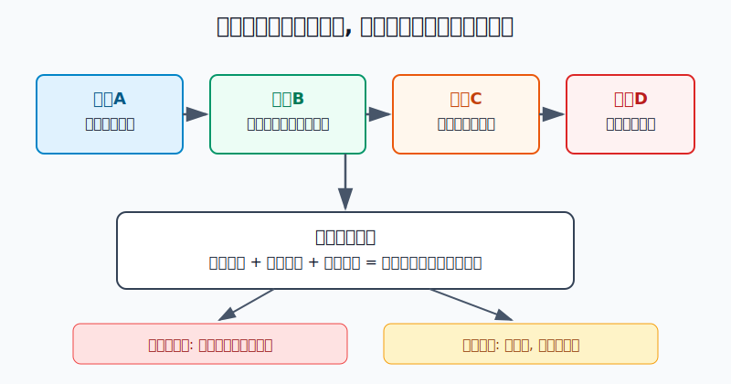
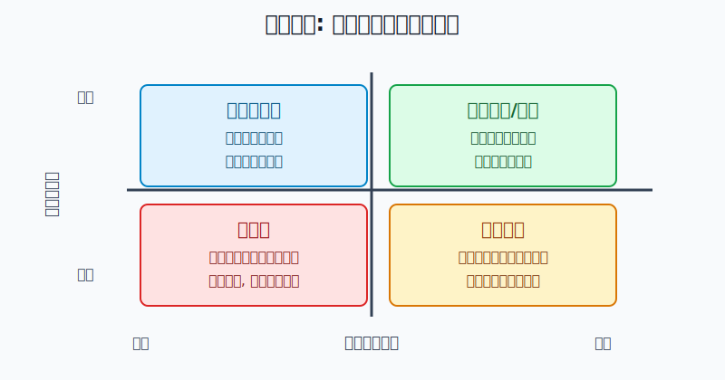
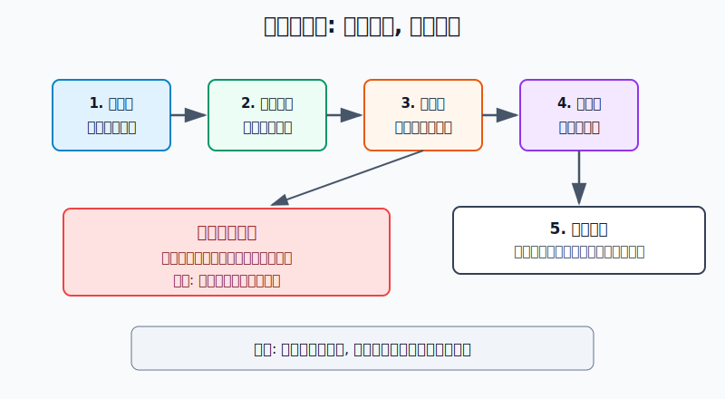

## 散户投资小白金融全品种操盘手册 - 8.5 适合环境 —— 利率下行、现金流资产受欢迎时
  
### 作者  
digoal  
  
### 日期  
2026-06-06   
  
### 标签  
金融产品 , 金融工具 , 散户 , 投资小白 , 全品操盘手册  
  
----  
  
## 背景 
   

> 适用读者: 已经知道REITs靠基础设施现金流赚钱, 但不知道什么时候适合买REITs和高股息资产的小白和散户。
> 本文定位: 投资教育框架, 不构成个性化投资建议。

## 先问一个反直觉问题

降息了, REITs和高股息资产就一定该买吗?

答案是否定的。利率下行只是在告诉你: 市场开始更重视稳定现金流。它不是在告诉你: 任何高分红、任何高股息、任何REITs都可以买。

## 先把概念讲透

利率可以理解成市场给“安全钱”的基础报价。这个报价越高, 投资者越愿意躺在存款、货币基金、短债里; 这个报价越低, 投资者就会去找能持续分钱的资产, 比如REITs、红利ETF、高股息股票。

但这里有一个关键差别: **利率下行只是提高现金流资产的吸引力, 不保证现金流资产本身安全。**

REITs的现金流来自租金、通行费、电费、仓储费、保租房租金等; 高股息股票的分红来自公司利润和现金流。它们都不是银行存款。如果底层经营变差, 分红会承压; 如果价格已经被抢得太高, 未来收益会被压低。

你可以把这件事想成买一家早餐店。银行利息从3%降到2%, 会让“每年稳定赚钱的早餐店”更吸引人。但如果这家店客流下降、租金上涨、老板还把价格开得很贵, 你不能因为银行利息低就闭眼买。

## 逻辑推导链

【论证链标题】: 利率下行会抬高稳定现金流资产的相对吸引力, 但只有现金流稳定、买入价格合理时, REITs和高股息资产才进入可操作区。

前提A: 市场利率下行时, 低风险资产的收益预期下降。小白可以把它理解成“市场给安全钱的工资变低了”。这个前提是变量, 要看LPR、国债收益率、存款利率、货币基金收益等指标。

前提B: REITs和高股息资产的核心卖点都是现金流。REITs把基础设施项目的租金、收费等现金流分给持有人; 高股息股票把公司利润的一部分分给股东。这个前提相对稳定, 但具体资产的现金流质量是变量。

前提C: 现金流资产的价格每天波动。价格越高, 同样一笔分红对应的分派率或股息率越低; 价格越低, 表面收益率会变高, 但背后可能是市场在给经营风险重新定价。这个前提是变量。

前提D: 现金流必须能持续。REITs要看出租率、车流量、收缴率、可供分配金额、剩余期限; 高股息股票要看利润、自由现金流、负债和分红政策。这个前提是最重要的变量。

由A+B可得: 因为利率下行会降低低风险资产的吸引力, 而REITs和高股息资产能提供现金分配, 所以稳定现金流资产在低利率环境下更容易受到资金关注。

再由B+C可得: 因为投资者买到的是“现金流 + 二级市场价格”, 所以分红不是最终收益。买贵了, 未来收益会被压缩; 价格跌了, 分红也可能被亏损吞掉。

最后由A+B+C+D可得: 正常情景下的核心结论是, **利率下行 + 现金流稳定 + 价格合理** 三个条件同时成立时, REITs和高股息资产才适合进入小仓位、分批买、定期复盘的操作区。

正常情景对应操作: 不因为“降息”两个字立刻买; 先确认利率环境, 再确认现金流质量, 再确认价格没有被抢贵, 最后才决定仓位。

## 数据怎么验证

第一组证据验证“利率确实下行”。中国银行披露的全国银行间同业拆借中心LPR数据显示, 2024年1月22日1年期LPR为3.45%、5年期以上LPR为4.20%; 到2026年5月20日, 1年期LPR为3.00%、5年期以上LPR为3.50%。这说明近两年贷款基准报价已经明显下移, 市场处在低利率背景中。

第二组证据验证“REITs确实是现金流资产”。中国证监会2020年8月7日发布的《公开募集基础设施证券投资基金指引(试行)》规定, 基础设施基金80%以上基金资产投资于基础设施资产支持证券, 以获取基础设施项目租金、收费等稳定现金流为主要目的, 收益分配比例不低于合并后基金年度可供分配金额的90%。这说明REITs不是普通股票, 它的制度设计就是围绕现金流和分配展开。

第三组证据验证“低利率环境中, 现金流资产会受到资金关注”。上交所2026年4月3日发布的沪市公募REITs 2025年年报汇总显示, 2025年沪市52只公募REITs收入145亿元, 同比增长71%; 可供分配金额88亿元, 同比增长42%; 全年分红110次, 累计派发近78亿元, 较上年增长30%。同一篇汇总还提到, 在低利率环境常态化背景下, 沪市REITs 2025年除权价格平均上涨6.3%, 若计入分红再投资, 复权价格涨幅为11.9%。

第四组证据专门提醒你不要把低利率等同于无风险。中证指数公司中证REITs(收盘)指数事实表显示, 截至2026年3月31日, 该指数2023年收益率为-28.26%, 2024年为4.38%。这说明REITs即使有分红, 也会经历二级市场回撤。

第五组证据对应高股息资产。中证指数公司中证红利指数事实表显示, 截至2026年3月31日, 中证红利指数选取100只现金股息率高、分红较稳定且具有规模和流动性的上市公司证券, 股息率为4.94%。这说明高股息不是保本标签, 它仍然是股票资产。

这几组证据合在一起, 只支持一个结论: 利率下行会让市场重新寻找现金流, 但现金流资产能不能买, 仍然取决于现金流质量和买入价格。

## 前提变化时怎么办

第一种情景: 利率下行, 现金流稳定。比如LPR、存款利率、短债收益率下行, 同时REITs的出租率、车流量、收缴率、可供分配金额没有恶化; 或高股息公司的利润、自由现金流和分红政策没有变坏。此时推导路径成立, 对应动作是进入观察区, 小仓位分批配置。

第二种情景: 利率下行, 但现金流变弱。比如产业园出租率下降, 高速车流低于预期, 消费基础设施客流下降, 或高股息公司利润下滑、负债上升。此时推导路径变为: 因为分红来自现金流, 所以现金流变弱会抵消利率下行的估值支持。对应动作不是补仓, 而是暂停买入, 查公告, 等经营数据修复。

第三种情景: 利率下行, 现金流稳定, 但价格已经涨太多。假设某REITs过去12个月每份分配0.20元, 价格从4元涨到5元, 粗略分派率就从5%降到4%。现金流没有变, 只是买入价格变贵了。此时对应动作是不追高, 等价格回落或等可供分配金额增长。

第四种情景: 利率重新上行, 现金流也变弱。这是风险区。因为低风险资产收益变得更有吸引力, 现金流资产估值压力上升; 同时底层经营变差, 分红基础变弱。对应动作是停止加仓, 检查卖出条件, 不用“长期持有”四个字掩盖前提失效。

失败案例就是2023年的公募REITs回撤。即使REITs有现金分配制度, 中证REITs(收盘)指数在2023年仍然下跌28.26%。这不是说REITs不能投, 而是说明: 当市场定价、流动性、经营预期发生变化时, 分红挡不住价格回撤。

## 实操例子

假设小林有10万元投资资金, 已经留足6个月生活费。现在组合里有6万元宽基ETF、2万元货币基金、1万元短债基金、1万元黄金ETF。他看到利率下行, 想拿5000元学习REITs和红利ETF。

第一步, 先确认环境。这一步对应前提A。小林不只看新闻里的“降息”, 而是写下当前可观察事实: 2026年5月20日1年期LPR为3.00%、5年期以上LPR为3.50%, 相比2024年初明显降低。结论是: 低利率环境成立, 现金流资产值得观察。

第二步, 再确认现金流。这一步对应前提B和D。如果候选是REITs, 他看年报和季报里的收入、可供分配金额、出租率、车流量、收缴率; 如果候选是红利ETF, 他看指数规则、行业分布、成分股是否集中在周期行业, 以及基金跟踪误差。只要现金流来源说不清, 他就不买。

第三步, 计算价格闸门。这一步对应前提C。假设某REITs过去12个月实际分配0.20元, 当前价格4.40元, 粗略分派率为4.55%。如果它的经营指标稳定, 这个回报可以进入观察; 如果价格短期涨到5.20元, 粗略分派率降到3.85%, 但可供分配金额没有增长, 小林就暂停追买。

第四步, 定仓位。他不把5000元一次性打满, 而是先买2000元观察仓, 剩余3000元分两次等季度报告或价格回落。REITs和高股息资产在他的账户里是收益型资产, 不是保本资产, 所以单类资产先不超过账户5%。

第五步, 写好情景切换。如果利率继续下行、现金流稳定、价格没有明显追高, 他可以按计划补第二笔; 如果现金流变弱, 即使分派率看起来更高, 他也停止加仓; 如果价格上涨导致仓位超计划, 他用再平衡把仓位拉回上限。

如果小林操作错误, 最常见的错误是把“分派率变高”理解成“更便宜”。比如价格从4.40元跌到3.80元, 表面分派率从4.55%升到5.26%。但如果同期可供分配金额也在下降, 这不是捡便宜, 而是市场在给风险重新定价。纠偏方法是回到论证链: 先查现金流, 再算分派率, 最后才谈买入。

## 可复用框架

【三闸门法】

适用前提: 你看到利率下行, 想买REITs、红利ETF或高股息股票, 但不确定能不能下手。

核心逻辑: 因为利率下行只提高现金流资产的相对吸引力, 所以买入前必须同时通过利率闸门、现金流闸门、价格闸门。

操作步骤:

1. 利率闸门: 确认市场利率、存款利率、货币基金或短债收益是否处于下行或低位。
2. 现金流闸门: 确认REITs的经营指标没有恶化, 或高股息公司的利润和自由现金流能支撑分红。
3. 价格闸门: 用过去12个月实际分配金额或股息除以当前价格, 估算回报是否已被追高压低。
4. 仓位闸门: 小白先小仓位、分批买, 不把收益型资产当保本工具。

前提失效时: 利率上行、现金流恶化、价格过热, 任意一个出现, 都先停止加仓; 如果现金流连续恶化, 检查减仓条件。

举一反三: 这个框架还能用在债券ETF、红利低波ETF、公用事业股票和部分海外REITs上。凡是你想买“稳定现金流”, 都先过这三个闸门。

【分红溯源法】

适用前提: 你看到某个资产分红率、分派率、股息率很高, 想判断它是机会还是陷阱。

核心逻辑: 因为分红来自现金流, 而不是来自软件上的收益率数字, 所以必须追问分红从哪里来。

操作步骤:

1. 看来源: REITs看租金、通行费、电费、仓储费; 高股息股票看主营利润和经营现金流。
2. 看稳定: 查出租率、车流量、收缴率、可供分配金额、利润和负债。
3. 看价格: 分派率变高是因为分红增加, 还是因为价格下跌。

前提失效时: 如果分红来自一次性收益、举债硬撑、资产出售, 或价格下跌背后是经营恶化, 不把高收益率当机会。

举一反三: 后面讲“高股息资产: 稳定现金流还是价值陷阱”时, 仍然用这套方法。

## 本节行动清单

| 买入前问题 | 合格答案 |
|---|---|
| 利率环境是否支持现金流资产? | LPR、存款、货币基金或短债收益处于下行或低位 |
| 现金流是否稳定? | REITs经营指标或高股息公司利润现金流没有恶化 |
| 分红从哪里来? | 来自持续经营现金流, 不是一次性收益或价格下跌造成的表面高收益 |
| 价格是否合理? | 分派率或股息率没有被短期上涨压得过低 |
| 仓位是否可控? | 小白先观察仓、分批买, 单类资产设上限 |

## 一句话总结

利率下行会让市场更喜欢现金流资产, 但真正的买入条件不是“降息”, 而是“现金流稳定、价格合理、仓位可控”。REITs和高股息资产能做收益型资产, 不能当保本工具。

## 参考资料

- 中国银行: 贷款市场报价利率(LPR), 访问日期 2026-06-06, https://www.boc.cn/fimarkets/lilv/fd32/201310/t20131031_2591219.html
- 中国证监会: 《公开募集基础设施证券投资基金指引(试行)》, 2020-08-07, https://www.csrc.gov.cn/csrc/c101877/c1029531/content.shtml
- 上海证券交易所: 《深耕实体沃土 共绘发展新篇——沪市公募REITs 2025年年报“出炉”》, 2026-04-03, https://www.sse.com.cn/aboutus/mediacenter/hotandd/c/c_20260403_10814138.shtml
- 中证指数有限公司: 中证REITs(收盘)指数事实表, 2026-03-31, https://oss-ch.csindex.com.cn/static/html/csindex/public/uploads/indices/detail/files/zh_CN/932006factsheet.pdf
- 中证指数有限公司: 中证红利指数事实表, 2026-03-31, https://oss-ch.csindex.com.cn/static/html/csindex/public/uploads/indices/detail/files/zh_CN/000922factsheet.pdf

> ⚠️ **声明**：本文内容为投资教育目的，所有历史数据、策略框架均为辅助学习工具，不构成证券投资建议。市场有风险，投资需谨慎。实际操作请结合自身风险承受能力，必要时咨询专业投顾。
  
#### [PostgreSQL 解决方案集合](../201706/20170601_02.md "40cff096e9ed7122c512b35d8561d9c8")
  
  
#### [德哥 / digoal's Github - 公益是一辈子的事.](https://github.com/digoal/blog/blob/master/README.md "22709685feb7cab07d30f30387f0a9ae")
  
  
#### [About 德哥](https://github.com/digoal/blog/blob/master/me/readme.md "a37735981e7704886ffd590565582dd0")
  
  

  
