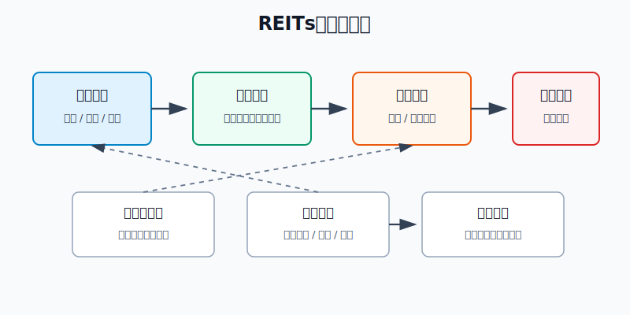
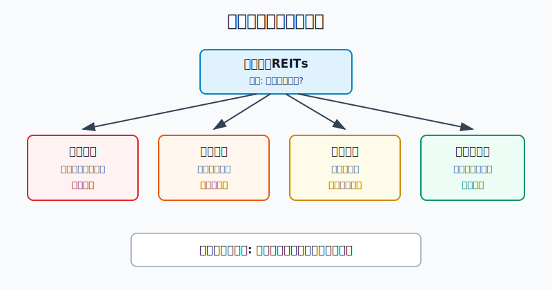
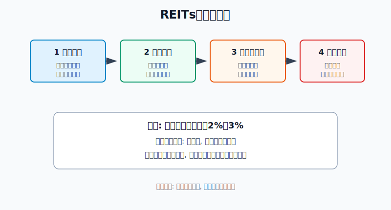

## 散户投资小白金融全品种操盘手册 - 8.6 REITs风险来源: 项目经营、估值波动、流动性、政策变化
  
### 作者  
digoal  
  
### 日期  
2026-06-06   
  
### 标签  
金融产品 , 金融工具 , 散户 , 投资小白 , 全品操盘手册  
  
----  
  
## 背景 
   

> 适用读者: 已经知道REITs是基础设施现金流, 但容易把“有分红”误解成“风险低”的小白和散户。  
> 本文定位: 投资教育框架, 不构成个性化投资建议。

## 先问一个反直觉的问题

一只REITs明明每年分红, 为什么账户还会亏钱? 答案很简单: 分红只是现金流的一部分, 账户盈亏还要看买入价格、卖出价格和能不能顺利成交。REITs不是银行存款, 它的风险藏在四个地方。

## 核心概念

第八章第一节说过, REITs买的是基础设施现金流。到了第六节, 你要把这句话补完整: **REITs买的是会变化、会定价、会交易、会受规则影响的基础设施现金流。**

这四个“会”, 对应四类风险:

项目经营风险, 是底层资产本身赚钱能力变差。产业园出租率下降, 高速公路车流量不及预期, 仓储物流租户退租, 清洁能源发电量或结算电价变化, 都会影响收入和可供分配金额。可供分配金额, 简单说就是基金能拿出来分给持有人的现金基础。

估值波动风险, 是资产没坏, 但市场给它的价格变了。利率上升、风险偏好下降、同类资产更便宜, 都会让投资者要求更高回报。结果就是同样一份现金流, 市场愿意给的价格下降。

流动性风险, 是你想卖的时候, 不一定能按心里价顺利卖出。成交量小、买卖价差大、短期抛压集中, 都会让卖出成本变高。小白最容易忽视这一点, 因为软件上显示一个价格, 不代表你一大笔都能按这个价格成交。

政策变化风险, 是收费规则、租赁政策、扩募规则、资产期限、信息披露和监管要求变化后, 现金流或估值逻辑被重新计算。政策不一定只带来坏消息, 但它一定会改变某些前提。

## 逻辑推导链

【论证链标题】: REITs不是看分派率就能买, 因为四类风险会从现金流、估值、成交和规则四条路影响最终收益。

前提A: REITs的分红来自底层项目经营现金流。高速收费、园区租金、仓储租金、能源收费都不是固定利息, 而是经营结果。这是变量。

前提B: REITs上市后每天交易, 价格由市场决定。市场价格会受利率、风险偏好、同类产品供给、投资者预期影响。这是变量。

前提C: REITs的成交活跃度弱于主流宽基ETF和大盘股。成交量越小, 大资金买卖对价格的影响越明显; 买卖价差越大, 交易摩擦越高。这是变量。

前提D: REITs底层资产依赖合同、期限和政策规则。收费权期限、租约结构、补贴安排、扩募规则、行业监管变化, 都会影响投资者对未来现金流的判断。这也是变量。

由A可得: 因为分红来自项目经营, 所以经营指标变差时, 高分派率不是安全信号, 而是需要查原因的风险信号。价格下跌会把表面分派率“算高”, 但它不能修复现金流。

由A+B可得: 因为账户收益 = 分红 + 价格变化, 所以只看分红会漏掉估值波动。现金流没有明显恶化时, 如果利率上行或风险偏好下降, 价格照样会跌。

再由A+B+C可得: 因为REITs还存在流动性差异, 所以小白不能把它当成随时无成本进出的现金管理工具。仓位越大, 越要考虑卖出时的成交量和价差。

最后加上D可得: 因为政策和合同会改变现金流前提, 所以买REITs必须读公告和定期报告, 不能只看交易软件上的分派率、涨跌幅和K线。

正常情景下的操作结论是: **只有当经营没有连续恶化、价格没有明显追高、成交量足够支撑你的仓位、公告里没有重大不利变化时, REITs才适合小仓位进入收益型资产池。任意一项不通过, 动作不是补仓, 而是暂停。**

## 数据怎么验证

第一组证据说明REITs确实围绕现金流设计。中国证监会2020年发布《公开募集基础设施证券投资基金指引(试行)》, 要求基础设施基金80%以上基金资产投资于基础设施资产支持证券, 并将90%以上合并后基金年度可供分配金额按要求分配给投资者。这个制度安排解释了为什么REITs有分红, 也解释了为什么分红要回到“可供分配金额”去看。

第二组证据说明经营正常时, 现金流资产可以产生实际分配。据中新网援引上海证券交易所2026年4月3日发布的信息, 截至2026年3月31日, 沪市52只公募REITs完成2025年年报披露; 2025年合计收入145亿元, 同比增长71%; 可供分配金额88亿元, 同比增长42%; 全年实施分红110次, 累计派发近78亿元, 较上年增长30%。这组数据验证的是“经营现金流是分红基础”。

第三组证据说明有分红不等于价格稳定。每日经济新闻2023年12月29日报道, 2023年中证REITs全收益指数下跌22.67%, 当时29只已上市产品中仅1只年内收益为正。这个失败案例很关键: 如果买入价格偏高、市场重新定价、项目业绩低于预期, 分红抵不过价格下跌。

第四组证据说明风险会叠加。每日经济新闻2023年6月5日报道, 当时公募REITs二级市场出现大面积下挫, 有产品一周下跌8.13%; 报道引用机构分析提到, 影响因素包括债市调整、部分项目业绩低于市场预期、扩募相关价格博弈。它对应的不是单一风险, 而是估值、经营和交易预期一起变化。

历史数据不代表未来。它们的价值不在于告诉你下一次跌多少, 而在于证明一件事: REITs的风险不是理论题, 它已经在价格里发生过。

## 前提变化时怎么办

第一种情景: 项目经营变弱。比如产业园出租率连续下降, 高速车流量低于招募说明书假设, 仓储物流租户集中退租, 可供分配金额连续两个报告期下滑。此时推导路径变为: 因为分红来自经营现金流, 所以经营变弱会削弱分红基础。新结论是暂停加仓, 先读季报、年报和临时公告, 查明下降是短期扰动还是长期问题。

第二种情景: 价格涨太多。假设一只REITs过去12个月每份分配0.24元, 价格从4元涨到5.20元, 粗略现金分派率从6%降到4.62%。如果同期可供分配金额没有同步增长, 推导路径就是: 现金流没变, 价格变贵, 未来回报被压缩。新结论是不追高, 等价格回到合理补偿区间, 或等现金流增长兑现。

第三种情景: 流动性太差。假设你计划买入2万元, 但这只REITs日成交额只有几百万元, 买卖五档价差明显。此时推导路径变为: 仓位越大, 卖出时越依赖对手盘; 对手盘不足, 实际卖出价格会低于你看到的价格。新结论是降低仓位上限, 用更小金额观察, 不把它当成短期备用金。

第四种情景: 政策或合同前提改变。比如收费规则调整、特许经营期限安排变化、扩募价格低于市场预期、信息披露提示重大运营变化。此时推导路径变为: 规则改变会让未来现金流或估值折现重新计算。新结论是重新估值, 看不懂公告时不做加仓动作。

反例就是2023年的市场回调。很多人把REITs当成“高分红低波动”, 但当估值、经营预期和交易情绪同时变化时, 全收益指数仍然出现明显下跌。这说明第一个前提一旦被误读, 后面的操作都会错。

## 实操例子

假设小李有20万元投资资金, 已经留出6个月生活费, 组合里有货币基金、短债基金、宽基ETF和少量黄金ETF。他想拿REITs做收益型资产, 计划最多配置1万元。

这个例子对应论证链的正常结论: 四项前提都过关, 才能小仓位进入。

第一步, 定仓位。小李先把REITs上限定为账户5%, 首次观察仓只买4000元, 占账户2%。判断依据是前提C: REITs有流动性差异, 小白不能一开始就用大仓位测试交易成本。

第二步, 查经营。候选REITs如果是产业园, 他记录出租率、租金收缴率、前五大租户占比和租约到期结构; 如果是高速公路, 他记录车流量、通行费收入和剩余收费期限; 如果是清洁能源, 他记录发电量、上网电价和补贴回款。这一步对应前提A: 分红来自经营现金流。

第三步, 查分配质量。他不只看软件上的分派率, 而是打开最近一期年报或季报, 看收入、可供分配金额、实际分红和同比变化。规则很硬: 如果可供分配金额连续两个报告期下滑, 不买; 如果下滑原因说不清, 不买; 如果只是一次性维修、季节性因素, 也要等下一期确认。

第四步, 查价格。假设过去12个月每份分配0.24元, 当前价格4.60元, 粗略分派率约5.22%。如果价格过去三个月快速上涨, 但可供分配金额没有增长, 他不追。判断依据是前提B: 买贵会压缩未来收益。

第五步, 查流动性。他看最近20个交易日成交额和买卖价差。如果日成交额太低, 或盘口价差让一笔小单都要明显让价, 他把观察仓从4000元降到2000元。判断依据是前提C: 想卖时能不能顺利成交, 也是收益的一部分。

第六步, 查政策和公告。他至少读三类文件: 招募说明书里的风险因素, 最近一期定期报告, 最近3个月临时公告。若出现收费规则、扩募定价、重大租户变化、经营权期限变化等信息, 他先不下单, 把这只REITs放进观察名单。

如果前提不成立, 操作直接切换: 经营变弱就停止加仓; 价格买贵就等待; 流动性不足就降低仓位; 政策或合同看不懂就退出观察。最糟糕的错误是看到价格跌了、分派率变高, 立刻补仓。后果是现金流继续变差时, 高分派率会变成“越跌越高、越高越危险”。纠偏方法只有一个: 回到四个闸门重新检查。

## 可复用框架

【四闸门法】

适用前提: 你想买一只REITs, 但还不知道它是合理收益资产, 还是高分派率陷阱。

核心逻辑: 因为REITs收益由经营现金流、市场估值、交易流动性和政策规则共同决定, 所以买入前必须让四个闸门依次通过。

操作步骤:

1. 经营闸门: 收入、出租率、车流量、发电量、可供分配金额没有连续恶化。
2. 价格闸门: 当前分派率不是靠价格大跌“算出来”的, 也没有被追高压得太低。
3. 流动性闸门: 成交额和买卖价差能支撑你的仓位进出。
4. 政策闸门: 最近公告没有重大不利变化, 招募说明书里的核心前提仍然成立。

前提失效时: 任一闸门没过, 暂停买入; 两个闸门没过, 从候选池移出; 已持有时, 先降低仓位, 再查清原因。

举一反三: 这个框架也能用于高股息股票、红利ETF和经营权类现金流资产。凡是靠“持续现金回报”吸引你的产品, 都要先问现金流有没有变, 再谈收益率。

【分派率反查】

适用前提: 你看到某只REITs分派率高, 想判断它是机会还是陷阱。

核心逻辑: 因为分派率 = 分配金额 / 市场价格, 所以分派率升高有两种来源: 分配金额上升, 或价格下跌。前者是经营改善, 后者要先查风险。

操作步骤:

1. 先查分子: 过去12个月分配金额和可供分配金额有没有增长。
2. 再查分母: 价格下跌是市场整体回调, 还是项目自身风险重估。
3. 最后查公告: 如果经营、估值、流动性或政策任何一项恶化, 不把高分派率当便宜。

前提失效时: 可供分配金额下降而分派率上升, 这不是买入信号, 是风险信号。

举一反三: 高股息股票也一样。股息率高, 可能是公司赚钱能力强, 也可能是股价下跌反映基本面恶化。

## 本节行动清单

| 检查项 | 具体动作 | 不通过时怎么办 |
|---|---|---|
| 项目经营 | 看收入、出租率、车流量、发电量、可供分配金额 | 连续恶化就暂停 |
| 估值价格 | 用过去12个月分配金额除以当前价格, 粗算分派率 | 追高或跌出高分派率都不急买 |
| 流动性 | 看近20日成交额、盘口价差、单笔成交难度 | 降低仓位上限 |
| 政策公告 | 读招募说明书、定期报告、临时公告 | 看不懂就不加仓 |
| 仓位纪律 | 首次观察仓控制在账户2%至3% | 盈亏都按季度复盘 |

## 一句话总结

REITs的风险不是一句“会波动”能概括的, 它来自项目经营、估值波动、流动性和政策变化四条链。四个前提都稳, 才能小仓位学习; 任一前提变坏, 分派率越好看, 越要先停下来查原因。

## 参考资料

- 中国证监会: 《公开募集基础设施证券投资基金指引(试行)》, 2020-08-07, https://www.csrc.gov.cn/csrc/c101877/c1029531/content.shtml
- 中新网: 《2025年沪市公募REITs产品收入同比增长71%》, 2026-04-03, https://www.chinanews.com.cn/cj/2026/04-03/10598589.shtml
- 每日经济新闻: 《公募REITs的2023: 二级市场表现乏力, 常态化发行加速推进中》, 2023-12-29, https://www.nbd.com.cn/articles/2023-12-29/3188866.html
- 每日经济新闻: 《公募REITs二级市场大幅下挫, 有产品一周跌8.13%!》, 2023-06-05, https://www.nbd.com.cn/articles/2023-06-05/2857229.html

> ⚠️ **声明**：本文内容为投资教育目的，所有历史数据、策略框架均为辅助学习工具，不构成证券投资建议。市场有风险，投资需谨慎。实际操作请结合自身风险承受能力，必要时咨询专业投顾。
  
#### [PostgreSQL 解决方案集合](../201706/20170601_02.md "40cff096e9ed7122c512b35d8561d9c8")
  
  
#### [德哥 / digoal's Github - 公益是一辈子的事.](https://github.com/digoal/blog/blob/master/README.md "22709685feb7cab07d30f30387f0a9ae")
  
  
#### [About 德哥](https://github.com/digoal/blog/blob/master/me/readme.md "a37735981e7704886ffd590565582dd0")
  
  

  
