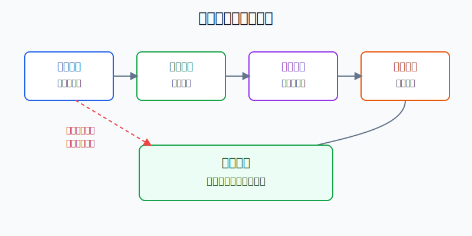
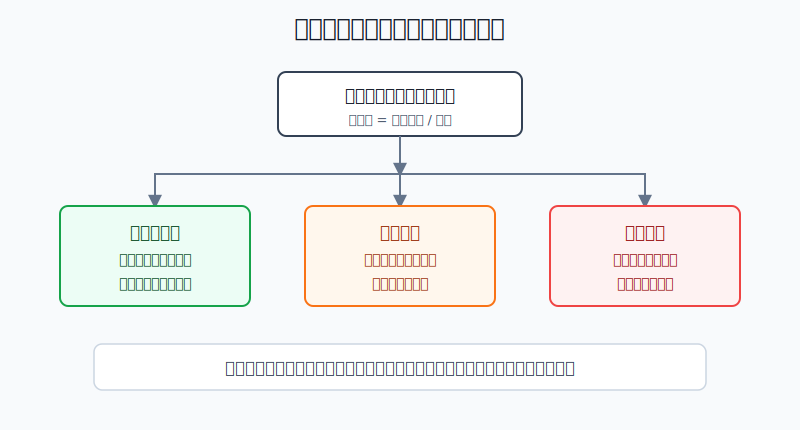
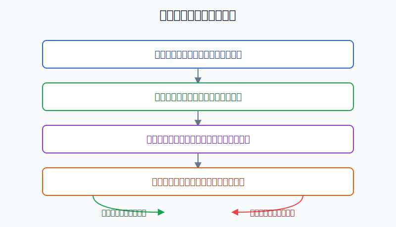

## 散户投资小白金融全品种操盘手册 - 8.7 高股息资产：稳定现金流还是价值陷阱
  
### 作者  
digoal  
  
### 日期  
2026-06-06   
  
### 标签  
金融产品 , 金融工具 , 散户 , 投资小白 , 全品操盘手册  
  
----  
  
## 背景 
   

> 适用读者：看到“股息率6%”“年年分红”就心动，但又分不清现金流资产和价值陷阱的小白和散户。
> 本文定位：投资教育框架，不构成个性化投资建议。

## 先问你一个问题

一只股票股息率从4%变成8%，你第一反应是更便宜了，还是更危险了？

很多小白会选“更便宜”。但股息率有两种变高方式：一种是公司赚钱多、分红多；另一种是股价跌太多，把股息率“算高”了。前者可能是稳定现金流，后者可能是价值陷阱。

## 核心概念：高股息不是高利息

高股息资产，通常指分红比例较高、股息率较高的一类股票或基金。股息率就是“每年拿到的现金分红 / 买入价格”。比如一只股票价格10元，过去12个月每股分红0.50元，粗略股息率就是5%。

但这里有一个关键差别：银行存款的利息来自合同约定；股票分红来自公司经营结果和董事会分配安排。公司赚不到钱，现金流变差，分红就可能下降。股价下跌时，软件上显示的股息率还可能变高，让人误以为“更香了”。

所以本节先给你一个最重要的结论：**高股息不是收益承诺，而是对一家公司现金流质量、分红纪律和买入价格的综合考试。**

## 逻辑推导链

【论证链标题】：只有利润、现金流、分红纪律和价格同时过关，高股息才是收益型资产；任一前提失效，高股息就可能变成价值陷阱。

前提A：分红必须来自真实、可持续的主业利润。就像一个家庭只有工资收入稳定，才有长期拿钱出来生活和储蓄的基础。公司如果只靠资产处置、一次性收益或周期高点利润分红，这个前提就是变量，随时会变。

前提B：利润还要变成现金流。会计利润是账面结果，经营现金流是公司真正收回来的钱。公司账面赚钱但收不回现金，就像店铺说生意很好，却全是赊账，分红基础并不牢。这个前提是变量。

前提C：公司要有相对稳定的分红纪律。稳定分红不是承诺永远不变，而是公司在多数年份愿意把一部分利润回报给股东，并且不过度透支未来经营。这个前提受公司治理、行业周期和监管环境影响，是变量。

前提D：买入价格不能太贵。股息率的分母是价格。价格越高，同样的分红对应的未来现金回报越低；价格暴跌导致的高股息率，也可能是在给坏消息重新定价。这个前提每天都在变。

由A+B可得：因为分红不是凭空来的，必须先有真实利润，再有足够现金，所以高股息的第一步不是看股息率，而是看“钱从哪里来、钱有没有到手”。

再由A+B+C可得：因为公司愿不愿分、能不能连续分，决定了高股息能否重复，所以稳定分红需要主业、现金流和治理共同支撑，不是看一年高分红就够。

最后由A+B+C+D可得：因为投资人的实际回报取决于买入价格，所以正常情景下的核心结论是：当主业利润稳定、经营现金流覆盖分红、分红纪律清晰、价格没有被追高时，高股息资产可以作为组合里的收益型资产；反过来，若利润下滑、现金流恶化、分红不可持续，或者股价下跌把股息率“算高”，高股息就是价值陷阱的信号。

正常情景下的操作结论是：小白可以把高股息资产放在组合的“收益型资产”区域，小仓位、分批、定期复盘；不要把它当保本理财，也不要因为股息率高就重仓单只股票。

## 数据怎么验证

第一组证据说明“分红资产”确实值得研究。根据中国上市公司协会2025年披露的信息，A股上市公司2024年度现金分红总额约2.4万亿元，再创历史新高；分红家数、分红总额和中期分红积极性都在提升。这个数据支持前提C：A股市场里愿意用现金回报股东的公司越来越多，高股息不是凭空想象出来的主题。

第二组证据说明“高股息”本身也需要筛选规则。中证指数公司发布的中证红利指数资料显示，该指数从沪深市场中选取现金股息率高、分红比较稳定、具有一定规模和流动性的100只上市公司证券作为样本，并采用股息率加权。注意这里不是只选“股息率最高”，还要看分红稳定性、规模和流动性。这正好验证了本节论证链：股息率只是入口，不是结论。

第三组证据看稳定现金流的正面案例。中国神华2024年年度报告显示，2024年公司归属于上市公司股东的净利润586.71亿元，年度现金分红预案为每股2.26元，现金分红总额约449.03亿元。煤炭、电力、运输等主业现金流较强，是它能长期高比例分红的重要基础。这个案例支持“利润真实 + 现金流够 + 分红纪律清晰”时，高股息有收益型资产属性。

第四组证据看周期反例。中远海控2022年归属于上市公司股东的净利润约1096亿元，2023年下降到约238.6亿元，主要原因是集装箱航运景气从高位回落；对应年度现金分红总额也从2022年度约548亿元下降到2023年度约119亿元。这个案例不是说公司不好，而是说明周期行业的高分红可能来自景气高点。当前提A改变，分红能力就会跟着变。

这几组证据合在一起，只能推出一个稳妥结论：高股息资产值得学习，但不能机械买入。历史分红不能保证未来分红，历史股息率也不能保证未来收益。它有参考价值，是因为分红把公司利润、现金流和治理纪律放到了桌面上；它有风险，是因为这些前提都会变。

## 前提变化时怎么办

第一种情景：利润稳定，现金流覆盖分红，分红政策连续，价格没有明显追高。此时推导链完整成立。对应操作是把它纳入收益型资产观察池，小仓位分批买，按季报和年报复盘，不因为短期涨跌频繁交易。

第二种情景：股息率升高，是因为股价大跌。推导路径变为：因为股息率等于分红除以价格，所以价格下跌会机械抬高股息率；但如果下跌来自利润下滑、行业恶化或政策变化，那么高股息率不是安全垫，而是风险提示。对应操作是先查下跌原因，不急着补仓。

第三种情景：利润来自周期高点。比如航运、煤炭、有色、钢铁等行业，景气高点利润很厚，分红也可能很高；但一旦价格、运价或需求回落，利润和分红都可能下降。此时新结论是：周期高股息不能按“永久年金”估值，只能按周期资产管理仓位。对应操作是降低单一行业仓位，不用过去最高分红推算未来。

第四种情景：公司为了维持形象而过度分红，分红超过经营现金流可承受范围。推导路径变为：因为分红消耗现金，所以若公司一边高分红、一边高负债或现金流紧张，未来经营安全垫会变薄。对应操作是直接剔除，至少等现金流修复后再看。

失败案例的共同点是：投资者把“高股息率”当成原因，其实它只是计算结果。真正的原因在利润、现金流、分红政策和股价里。

## 实操例子：10万元账户怎么检查一只高股息股

假设小李有10万元投资资金，已经留好6个月生活费。他想拿8000元学习高股息资产，看到一只股票过去12个月每股分红0.60元，当前股价10元，软件显示股息率6%。这对应论证链的正常情景，但需要逐项验证。

第一步，看利润来源。小李打开年报，先问：净利润是不是来自主营业务？如果利润主要来自一次性卖资产、补贴或投资收益，他不把6%当稳定收益。这个动作对应前提A。

第二步，看现金流覆盖。若公司过去一年净利润100亿元，经营现金流净额120亿元，现金分红50亿元，说明分红大致有现金支持；若净利润100亿元，但经营现金流只有20亿元，分红50亿元就要警惕。这个动作对应前提B。

第三步，看分红连续性。小李查看最近3到5年分红记录。如果公司多数年份都稳定分红，且分红比例没有长期超过净利润和现金流承受能力，它才进入观察池；如果只是在某一年突然高分红，他不把它当长期收益资产。这个动作对应前提C。

第四步，看价格。假设同一家公司分红0.60元不变，股价从10元涨到15元，股息率就从6%降到4%。公司没变，但买入价格变贵了，未来现金回报被压缩。若股价从10元跌到6元，股息率变成10%，小李也不立刻加仓，而是先查利润和现金流是否恶化。这个动作对应前提D。

第五步，定仓位。如果四步都通过，小李先买3000元观察仓，占总资金3%；连续两个财报期验证利润和现金流稳定，再考虑提高到5%到8%。单只高股息股票不替代宽基ETF，不因为分红看起来稳定就满仓。

如果前提不成立，操作要切换。若利润下滑超过30%且行业景气继续走弱，停止加仓；若经营现金流连续低于分红，剔出观察池；若价格短期上涨导致股息率明显下降，不追高；若买入后发现自己只看股息率、没看现金流，立刻重做检查表，必要时减仓纠错。

## 可复用框架

【四门检查】

适用前提：你看到一只股票或一只红利基金股息率很高，想判断它是现金流资产还是陷阱。

核心逻辑：因为分红来自利润和现金流，又会被买入价格放大或压缩，所以必须同时过四道门：利润、现金流、分红纪律、价格。

操作步骤：

1. 利润门：利润是否来自主业，是否处在周期高点。
2. 现金门：经营现金流是否覆盖分红，负债压力是否可控。
3. 纪律门：过去3到5年是否持续分红，分红比例是否不过度。
4. 价格门：当前股息率是经营改善带来的，还是股价下跌算出来的。

前提失效时：四道门任意一道不过，先暂停买入；如果已经持有，降低仓位或重新设定卖出条件。

举一反三：这个框架不仅能用在高股息股票，也能用在红利ETF、REITs和部分现金流型资产上。

【高息反问】

适用前提：你被“年化”“股息率”“现金分红”这类词吸引，想快速降温。

核心逻辑：高收益数字本身没有意义，必须反问它为什么高。

操作步骤：

1. 是分子变大，还是分母变小？也就是分红增加，还是股价下跌。
2. 分红增加来自长期能力，还是周期高点和一次性因素。
3. 股价下跌是市场错杀，还是基本面变坏。
4. 如果下一年分红下降30%，这笔投资还值得买吗？

前提失效时：只要你答不清“为什么高”，就把它当风险信号，而不是机会信号。

举一反三：可转债到期收益率突然很高、REITs分派率突然升高、债券基金收益率异常高，都可以用这个反问。

## 本节行动清单

| 买入前问题 | 合格答案 |
|---|---|
| 股息率为什么高？ | 分红稳定或增长，而不是单纯股价暴跌 |
| 利润从哪里来？ | 主业利润为主，不依赖一次性收益 |
| 现金流够不够？ | 经营现金流能覆盖分红，负债压力可控 |
| 分红能不能延续？ | 过去多年有纪律，分红比例不过度透支 |
| 价格是否合理？ | 不用高位买入来换一个被压低的未来回报 |
| 仓位有没有上限？ | 单只股票小仓位，红利资产只是组合一部分 |

## 一句话总结

高股息的关键不是“息高”，而是“息从哪里来、能分多久、你买得贵不贵”。利润真实、现金流够、分红纪律清楚、价格合理，它是收益型资产；这些前提坏掉，高股息率越诱人，越可能是价值陷阱。

## 参考资料

- 中国上市公司协会：《中国上市公司2024年经营业绩报告》，2025-05-12，https://www.capco.org.cn/pub/zgssgsxh/sjfb/dytj/202505/20250512/j_2025051214042700017470299884234849.html
- 中证指数有限公司：中证红利指数资料及编制规则，指数代码000922，访问日期2026-06-06，https://oss-ch.csindex.com.cn/static/html/csindex/public/uploads/indices/detail/files/zh_CN/000922factsheet.pdf
- 中国神华能源股份有限公司：《2024年年度报告》，2025年披露；中证网报道摘录，2025-03-24，https://www.cs.com.cn/ssgs/gsxw/202503/t20250324_6480973.html
- 中远海运控股股份有限公司：《2022年年度报告》《2023年年度报告》，2023年、2024年披露；2023年年报公告摘录，https://money.finance.sina.com.cn/corp/view/vCB_AllBulletinDetail.php?id=9917575&stockid=601919
- 国务院：《关于加强监管防范风险推动资本市场高质量发展的若干意见》，2024-04-12，https://www.gov.cn/zhengce/zhengceku/202404/content_6944878.htm

> ⚠️ **声明**：本文内容为投资教育目的，所有历史数据、策略框架均为辅助学习工具，不构成证券投资建议。市场有风险，投资需谨慎。实际操作请结合自身风险承受能力，必要时咨询专业投顾。
  
#### [PostgreSQL 解决方案集合](../201706/20170601_02.md "40cff096e9ed7122c512b35d8561d9c8")
  
  
#### [德哥 / digoal's Github - 公益是一辈子的事.](https://github.com/digoal/blog/blob/master/README.md "22709685feb7cab07d30f30387f0a9ae")
  
  
#### [About 德哥](https://github.com/digoal/blog/blob/master/me/readme.md "a37735981e7704886ffd590565582dd0")
  
  

  
