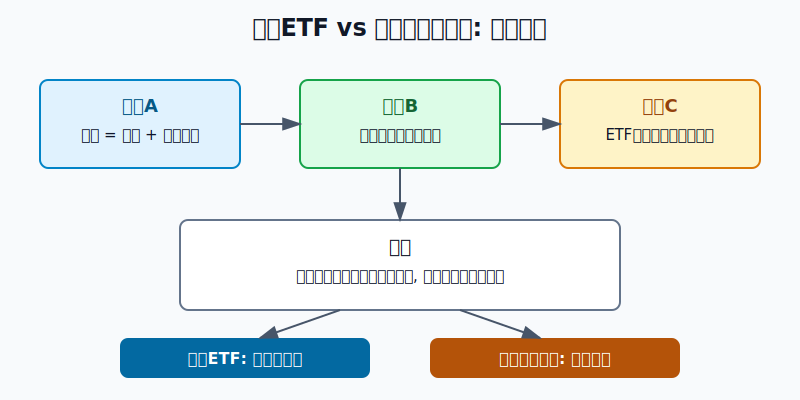
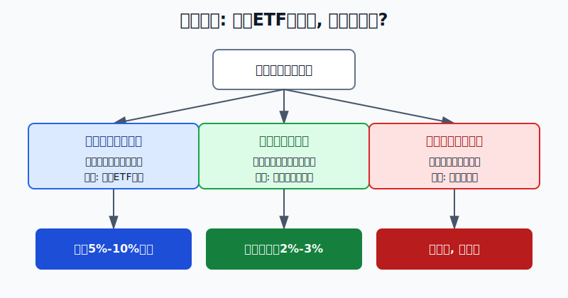
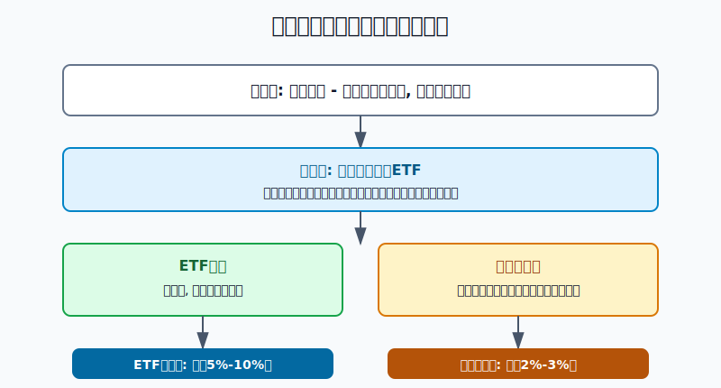

## 散户投资小白金融全品种操盘手册 - 8.8 红利ETF vs 单只高股息股票
  
### 作者  
digoal  
  
### 日期  
2026-06-06   
  
### 标签  
金融产品 , 金融工具 , 散户 , 投资小白 , 全品操盘手册  
  
----  
  
## 背景 
   

> 适用读者: 已经知道高股息资产能分红, 但不知道该买红利ETF还是自己挑高股息股票的小白和散户。  
> 本文定位: 投资教育框架, 不构成个性化投资建议。

## 先问一个反直觉问题

股息率最高的股票, 一定比红利ETF更赚钱吗?

不一定。高股息股票像一棵果树, 果子多不多, 要看这棵树明年还健不健康。红利ETF像一篮子果树, 单棵树少结果, 不至于让整篮子断粮。小白真正要比较的不是“谁股息率更高”, 而是“谁更适合放进自己的账户”。

## 先把概念讲透

**红利ETF**, 是跟踪红利指数的交易型基金。你买的不是一家公司, 而是一套规则挑出来的一篮子高分红股票。比如中证红利指数, 规则目标就是选取现金股息率高、分红较稳定、并具有一定规模和流动性的上市公司证券。

**单只高股息股票**, 是某一家公司的股票。它现在股息率高, 可能因为公司现金流强、愿意分红; 也可能因为股价跌得多, 把股息率“算高”了。股息率, 简单说就是每年分红除以当前股价。分子是分红, 分母是股价, 这两个数字都可能变。

两者最大的区别是: 红利ETF买的是“高股息风格”, 单只高股息股票买的是“这家公司还能不能继续赚钱和分红”。前者重点看指数规则、行业分布、估值、基金规模和流动性; 后者还要看公司利润、自由现金流、负债、行业周期、分红政策和管理层是否可靠。

所以本节的行动结论先放在前面: **小白默认用红利ETF做收益型权益资产的核心仓; 单只高股息股票只能做小比例卫星仓, 而且必须先通过现金流、负债和分红可持续性检查。**

## 逻辑推导链

【论证链标题】: 小白优先选红利ETF, 不是因为ETF一定涨, 而是因为它用分散和规则降低了单只股票分红失效的冲击。

前提A: 高股息资产的账户收益来自两部分: 现金分红和股价变化。股息到账是真的, 但如果股价跌得更多, 账户仍然亏钱。这个公式是常量, 但股息和股价都是变量。

前提B: 单家公司分红来自利润和现金流, 还受负债、资本开支、行业周期和分红政策影响。煤炭、航运、银行、地产、公用事业看起来都可能高股息, 但它们赚钱的稳定性不一样。这个前提是变量。

前提C: 红利ETF用指数规则和一篮子股票分散单家公司风险。某家公司利润下滑、分红减少、被调出指数, 对ETF的影响会被其他成分股分摊。这个分散机制相对稳定, 但ETF仍有行业集中、估值波动和跟踪误差风险。

前提D: 小白通常没有足够时间持续跟踪单家公司财报、公告和行业周期。如果把大仓位压在一只“看起来很会分红”的股票上, 一旦分红前提失效, 亏损会集中打到账户上。这个前提对大多数散户成立。

由A+B可得: 因为单只股票的股息和股价都可能变, 所以“股息率高”不能直接推出“值得买”。如果股息率变高是因为股价暴跌, 而股价暴跌又来自利润下滑, 那高股息率就是风险提示, 不是便宜标签。

由B+C可得: 因为红利ETF不是押单家公司, 所以它更适合小白获取高股息风格的平均收益。它不能消灭市场下跌, 但能减少“单家公司突然不分红、少分红、基本面恶化”对账户的冲击。

再由C+D可得: 因为小白的信息处理能力有限, 所以更合理的账户结构是红利ETF做核心, 单只高股息股票做小卫星。核心仓追求规则、分散和可复盘; 卫星仓追求研究后的少量增强, 错了也不能伤到账户。

正常情景下的操作结论是: **当你只是想配置高股息风格, 选择红利ETF; 当你能看懂公司利润、自由现金流、负债和分红政策, 且愿意持续跟踪公告, 才用不超过账户2%至3%的仓位买单只高股息股票。**

## 数据怎么验证

第一组证据说明红利ETF背后确实有一套“分散筛选”机制。中证指数公司中证红利指数事实表显示, 中证红利指数选取100只现金股息率高、分红较稳定, 并具有一定规模及流动性的上市公司证券作为样本; 事实表还显示, 截至2026年5月29日, 该指数股息率为4.94%。这组数据验证的是: 红利ETF买的不是一只股票, 而是一套高股息筛选规则。

第二组证据说明A股高分红资产池正在变大。中国上市公司协会披露的数据经中新网、人民网等媒体报道, 2024年度沪深A股上市公司现金分红总额为2.4万亿元, 较2023年度增加9%; 人民网报道还提到, 在4445家上市满三年的沪深A股上市公司中, 2447家近三年连续现金分红, 在3569家上市满五年的公司中, 1681家近五年连续现金分红。它说明“分红稳定”不是空概念, 市场里确实有可筛选的样本。

第三组证据提醒你: 单只高股息股票会被行业周期打穿。中远海控2022年实现归母净利润1095.95亿元, 全年共计派发现金红利547.22亿元; 但2023年归母净利润降至238.60亿元, 同比下降78.25%, 年度利润分配预案为每10股派2.3元。这个案例不是说中远海控不好, 而是说明周期行业的高分红可能来自阶段性高景气。当前提从“行业高利润”变成“行业利润回落”, 股息预期也会变。

历史数据不代表未来。它们的价值在于帮你识别因果关系: 红利ETF的优势来自规则和分散, 单只高股息股票的风险来自单家公司经营前提变化。两者都不是保本工具。

## 前提变化时怎么办

第一种情景: 你没有时间研究公司, 只是想让组合里有一块偏收益的权益资产。此时推导路径是: 因为你要的是高股息风格, 又无法持续跟踪单家公司, 所以红利ETF比单只股票更合适。对应动作是选规模较大、成交活跃、买卖价差小、跟踪指数清楚的红利ETF, 仓位先控制在账户5%至10%以内。

第二种情景: 你能读财报, 也能接受单股波动。此时单只高股息股票可以进入卫星仓, 但必须先过三关: 利润没有连续恶化, 经营现金流能覆盖分红, 负债和资本开支没有把未来现金流吃掉。对应动作是单只股票不超过账户2%至3%, 且买入理由写清楚。

第三种情景: 某只股票股息率突然很高, 但高出来的原因是股价大跌。此时推导路径变为: 因为股息率 = 分红 / 股价, 所以股价暴跌会被动抬高股息率; 如果暴跌背后是利润下滑或行业反转, 高股息率反而是警报。对应动作不是补仓, 而是先查利润、现金流、公告和行业景气。

第四种情景: 红利ETF短期涨得太快。红利ETF也会买贵。假设股息率从5%左右被价格上涨压到3.5%左右, 而成分股盈利没有同步增长, 未来回报补偿就变薄。对应动作是不追涨, 等估值和股息率回到能补偿股票波动的位置。

失败案例就是把“高股息”当成“保本”。2022年高景气行业里有公司能大额分红, 2023年景气度回落后, 利润和分红能力也会回落。前提错了, 结论就要改。

## 实操例子

假设小王有10万元投资资金, 已经留出6个月生活费, 组合里有宽基ETF、短债基金、货币基金和黄金ETF。他想拿1万元配置高股息资产, 目标不是短炒, 而是让组合多一块现金流风格。

这个例子对应论证链的正常结论: 红利ETF做核心, 单只高股息股票只做小卫星。

第一步, 先定功能。小王把这1万元定义为“收益型权益资产”, 不是保本资产, 也不是现金管理。判断依据是前提A: 股息会到账, 但价格也会波动。

第二步, 默认先筛红利ETF。他检查四件事: 跟踪哪个红利指数, 基金规模和日成交额够不够, 买卖价差是否很小, 前十大成分股和行业是否过度集中。如果这些都合格, 他先买5000元红利ETF观察仓, 剩余3000元分两次等回调或月度定投。

第三步, 如果还想买单只高股息股票, 仓位最多2000元。他只看自己能解释清楚的公司, 并要求过去三年现金分红不是靠一次性收益撑出来的; 经营现金流能覆盖分红; 资产负债表没有明显恶化; 最近公告没有利润大幅下滑、重大诉讼、监管处罚或分红政策改变。

第四步, 写好卖出条件。如果红利ETF涨幅较大, 导致高股息资产超过账户10%, 小王用再平衡减回目标仓位。如果单只股票出现利润连续两个报告期下滑、经营现金流明显变差、分红大幅减少, 他不等“回本”, 先减仓或清仓。

第五步, 复盘。每季度他只问三个问题: 红利ETF的指数规则和行业分布有没有变? ETF规模、成交和跟踪误差有没有恶化? 单只高股息股票的利润和现金流还能不能支撑分红? 这三个问题都回到论证链的前提B和C。

如果操作错误, 最常见的后果是单股仓位太重。比如小王把1万元全买成一只煤炭、航运或地产链高股息股票, 一旦行业景气反转, 分红下降和股价下跌会一起发生。纠偏方法是把单股仓位降回2%至3%, 把核心仓重新放回红利ETF或宽基ETF。

## 可复用框架

【篮子优先法】

适用前提: 你想买高股息资产, 但没有能力持续研究单家公司。

核心逻辑: 因为高股息收益取决于分红和股价, 而单家公司分红会受经营变化影响, 所以先用红利ETF获取分散后的高股息风格。

操作步骤:

1. 先定功能: 高股息资产是收益型权益资产, 不是现金替代品。
2. 先选篮子: 优先看红利ETF的指数规则、规模、成交、价差和行业集中度。
3. 再控仓位: 小白先把红利ETF控制在账户5%至10%以内。
4. 最后复盘: 每季度检查估值、股息率、行业分布和基金跟踪情况。

前提失效时: 如果红利ETF行业过度集中、成交太差、溢价过高或短期涨太多, 暂停买入; 如果高股息资产整体估值过热, 用再平衡减仓。

举一反三: 这个框架也适用于行业ETF、债券ETF和黄金ETF。只要你无法研究单个标的, 就优先考虑规则清楚的一篮子工具。

【股息反查法】

适用前提: 你看到某只股票股息率很高, 想判断它是机会还是陷阱。

核心逻辑: 因为股息率 = 分红 / 股价, 所以先查分红能不能持续, 再查股价为什么便宜。

操作步骤:

1. 查分子: 最近三年分红来自持续利润和经营现金流, 还是一次性收益。
2. 查分母: 股价下跌是市场整体回调, 还是公司基本面恶化。
3. 查负债: 高负债、高资本开支、现金流紧张会削弱未来分红。
4. 查政策: 公司章程、分红规划、公告里有没有改变分红节奏的信号。

前提失效时: 利润下滑、现金流恶化、分红政策改变, 任一出现, 都不把高股息率当买入理由。

举一反三: 这个框架也能用于REITs分派率、高收益债和高分红港股。所有“高收益率”都要先问: 收益从哪里来, 还能不能继续来。

## 本节行动清单

| 检查项 | 红利ETF怎么做 | 单只高股息股票怎么做 |
|---|---|---|
| 目标定位 | 收益型权益资产核心仓 | 研究后的卫星仓 |
| 核心检查 | 指数规则、规模、成交、价差、行业分布 | 利润、自由现金流、负债、分红政策 |
| 仓位上限 | 小白先控制在账户5%至10% | 单只不超过账户2%至3% |
| 买入条件 | 估值不过热, 股息率能补偿波动 | 分红可持续, 不是股价暴跌算出的高股息 |
| 失效动作 | 过热就暂停或再平衡 | 利润和现金流变坏就减仓 |

## 一句话总结

红利ETF和单只高股息股票的差别, 不是“哪个股息率更高”, 而是“你承担的是一篮子风格风险, 还是一家公司的经营风险”。小白先用红利ETF做核心, 单股只做小卫星, 才不会把分红投资做成押注单家公司。

## 参考资料

- 中证指数有限公司: 中证红利指数事实表, 访问日期 2026-06-06, https://oss-ch.csindex.com.cn/static/html/csindex/public/uploads/indices/detail/files/zh_CN/000922factsheet.pdf
- 中国上市公司协会数据, 中新网: 《2024年度沪深A股上市公司现金分红总计2.4万亿元》, 2025-08-08, https://www.chinanews.com.cn/cj/2025/08-08/10461671.shtml
- 人民网: 《2024年度A股上市公司现金分红总额为2.4万亿元》, 2025-08-12, https://finance.people.com.cn/n1/2025/0812/c1004-40540776.html
- 新浪财经: 《中远海控: 2022年归母净利1095.95亿元, 同比增长22.66%, 2022年共计派发现金红利547.22亿元》, 2023-03-30, https://finance.sina.com.cn/jjxw/2023-03-30/doc-imynsimy4620866.shtml
- 新浪财经: 《中远海控: 2023年净利润同比下降78.25% 拟10派2.3元》, 2024-03-29, https://finance.sina.com.cn/roll/2024-03-29/doc-inapytuq4469895.shtml

> ⚠️ **声明**：本文内容为投资教育目的，所有历史数据、策略框架均为辅助学习工具，不构成证券投资建议。市场有风险，投资需谨慎。实际操作请结合自身风险承受能力，必要时咨询专业投顾。
  
#### [PostgreSQL 解决方案集合](../201706/20170601_02.md "40cff096e9ed7122c512b35d8561d9c8")
  
  
#### [德哥 / digoal's Github - 公益是一辈子的事.](https://github.com/digoal/blog/blob/master/README.md "22709685feb7cab07d30f30387f0a9ae")
  
  
#### [About 德哥](https://github.com/digoal/blog/blob/master/me/readme.md "a37735981e7704886ffd590565582dd0")
  
  

  
