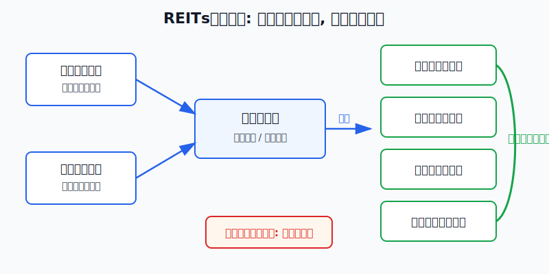
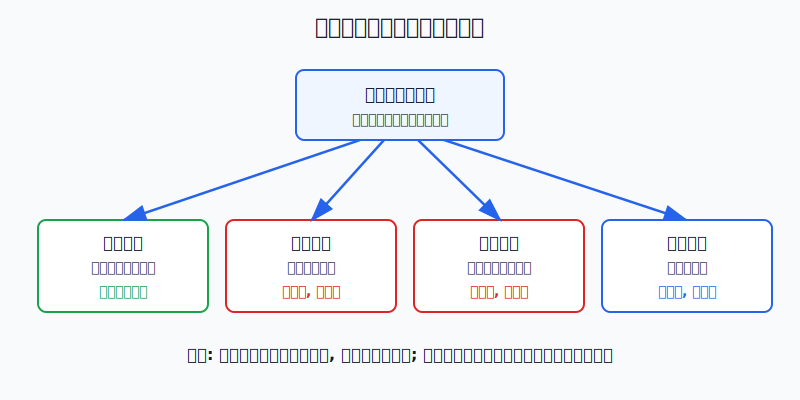
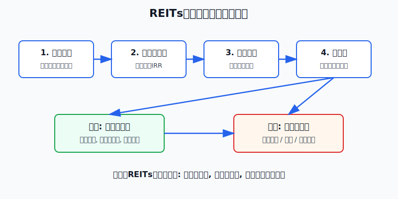

## 散户投资小白金融全品种操盘手册 - 8.9 REITs买入卖出 —— 不要只看分红率
  
### 作者  
digoal  
  
### 日期  
2026-06-06   
  
### 标签  
金融产品 , 金融工具 , 散户 , 投资小白 , 全品操盘手册  
  
----  
  
## 背景 
   

> 适用读者: 已经知道REITs有分红, 但容易把“分红率高”直接等同于“可以买”的小白和散户。  
> 本文定位: 投资教育框架, 不构成个性化投资建议。

## 先问一个反直觉问题

一只REITs分派率从4%变成7%, 是不是更便宜了?

答案不是“是”, 也不是“不是”, 而是先问一句: **它是因为分红变多了, 还是因为价格跌多了?** 前者可能是现金流改善, 后者可能是市场在给风险重新定价。小白买卖REITs, 最大的坑就是把一个计算结果当成买入理由。

## 先把概念讲透

REITs的分派率, 可以粗略理解为“过去或预计能分的钱, 除以你现在看到的价格”。它像饭店门口写的“年回报菜单”, 让你快速知道这份现金流大概有多贵。但菜单不是食品安全报告, 更不是保证书。

因为分派率有两个部件: 分子是可供分配金额或实际分配金额, 来自底层项目现金流; 分母是二级市场价格, 由买卖双方每天重新定价。

所以分派率升高有两种完全不同的含义:

第一种是好情况: 项目经营变好, 可供分配金额增加, 分红变多。比如出租率提升、车流量恢复、租金收缴率稳定, 分派率升高来自分子变大。

第二种是危险情况: 分红没有变, 甚至在变弱, 但价格下跌了。此时分派率看起来升高, 只是因为分母变小。它不是白捡的便宜, 而是市场正在要求更高的风险补偿。

买REITs看分派率, 就像买二手车看油耗。油耗当然要看, 但还要看发动机、事故记录、车况和价格。只看一个数字, 最容易买到“看起来省油、实际大修”的车。

## 逻辑推导链

【论证链标题】: REITs的买卖条件不是分派率高低, 而是现金流稳定、价格补偿、流动性和仓位角色四项同时过关。

前提A: REITs分红来自底层项目经营现金流。高速公路靠车流和收费, 产业园靠出租率和租金, 仓储物流靠租户和收缴率, 清洁能源靠发电量和结算电价。这是变量。

前提B: REITs有高比例分配规则。证监会2020年发布的《公开募集基础设施证券投资基金指引(试行)》明确, 基础设施基金80%以上基金资产投资于基础设施资产支持证券, 并将90%以上合并后基金年度可供分配金额按要求分配给投资者。这个制度前提相对稳定。

前提C: REITs上市后价格每天波动。价格上升会压低表面分派率, 价格下跌会抬高表面分派率; 但价格变化本身不证明资产变好或变坏。这是变量。

前提D: REITs不是现金管理工具。它有二级市场波动、成交量差异、买卖价差和估值重估, 所以必须放在组合里的“收益型资产”位置, 而不是“随时要用的钱”。这是操作前提。

由A+B可得: 因为REITs先由项目经营产生现金流, 再按规则把可供分配金额分出去, 所以分红率高不等于安全。真正要看的第一件事, 是分红背后的现金流有没有变强。

再由A+B+C可得: 因为分派率 = 分配金额 / 市场价格, 所以分派率升高必须拆成两种路径: 如果分配金额上升且经营指标同步改善, 这是正向信号; 如果只是价格下跌造成分派率升高, 就必须先排查经营、估值和流动性风险。

最后由A+B+C+D可得: 正常情景下的核心结论是, **只有当现金流没有连续恶化、价格给出的补偿合理、成交流动性能支撑你的仓位、资金角色不是短期备用金时, REITs才适合买入或继续持有。任意一项不通过, 操作不是加仓, 而是暂停、观察或卖出。**

正常情景对应操作: 买入前做四项检查; 持有后按季度复盘; 卖出时看前提是否失效, 不用“分红率高”替自己找理由。

## 数据怎么验证

第一组证据验证“REITs确实围绕现金流和分配设计”。中国证监会2020年发布《公开募集基础设施证券投资基金指引(试行)》, 对80%以上基金资产投资基础设施资产支持证券、90%以上合并后基金年度可供分配金额分配给投资者作出要求。这个规则解释了为什么REITs天然有分红, 也解释了为什么买卖要回到可供分配金额。

第二组证据验证“经营好时, 分红和价格可以一起贡献回报”。上海证券交易所2026年4月3日发布的沪市公募REITs 2025年年报汇总显示, 截至2026年3月31日, 沪市52只公募REITs完成2025年年报披露; 2025年合计收入145亿元, 同比增长71%; 可供分配金额88亿元, 同比增长42%; 全年分红110次, 累计派发近78亿元, 较上年增长30%。同一汇总还披露, 2025年沪市REITs除权价格平均上涨6.3%, 若计入分红再投资, 复权价格涨幅为11.9%。

第三组证据提醒“有分红也会亏”。中证指数公司中证REITs(收盘)指数事实表显示, 截至2026年3月31日, 该指数2023年收益率为-28.26%, 2024年为4.38%, 2025年为-1.39%。这说明REITs即使有现金分配制度, 二级市场价格回撤仍然会影响账户收益。

第四组证据来自失败案例。每日经济新闻2023年12月29日报道, 2023年中证REITs全收益指数下跌22.67%, 当时29只已上市产品中只有1只年内收益为正。这个案例对应本节的证伪: 如果买入价格偏高、经营不及预期、流动性和风险偏好同时转弱, 分红不能抵消价格下跌。

历史数据不代表未来。它们的作用不是预测下一次涨跌, 而是证明一条稳定规律: REITs买卖不能只看分红率, 必须把现金流、价格和流动性放在同一张表里。

## 前提变化时怎么办

第一种情景: 分派率升高, 同时经营改善。比如过去12个月每份分配从0.20元升到0.24元, 出租率、车流量、收缴率和可供分配金额同步改善, 当前价格没有大幅追高。此时推导路径成立: 因为现金流变强, 所以更高分派率有经营基础。操作是小仓位、分批买, 并设置季度复盘。

第二种情景: 分派率升高, 但价格下跌且经营变弱。比如价格从4.50元跌到3.50元, 表面分派率从4.44%升到5.71%, 但同一时期可供分配金额连续两个报告期下降。此时推导路径变为: 因为分母下跌而分子变弱, 所以高分派率是风险信号。操作是不补仓, 先查公告和定期报告。

第三种情景: 分派率下降, 但原因是价格涨太多。比如每份分配仍是0.24元, 价格从4元涨到5.50元, 粗略分派率从6%降到4.36%。现金流没变, 只是买入价格变贵。操作是不追高, 已持有者检查仓位是否超过计划。

第四种情景: 分派率看着合理, 但成交太弱。比如你想买2万元, 但近20个交易日成交额偏低, 买卖价差明显。此时推导路径变为: 即使现金流和价格看起来合格, 流动性也会抬高买卖成本。操作是降低单笔金额, 不把REITs当短线交易工具。

反例就是2023年的REITs回撤。很多人当时把REITs理解成“高分红、低波动”, 但当价格、经营预期和风险偏好一起变化时, 高分派率没有自动保护本金。这不是说REITs不能买, 而是说买卖条件必须比“分红率高”更完整。

## 实操例子

假设小陈有20万元投资资金, 已经留出6个月生活费, 组合里有货币基金、短债基金、宽基ETF和黄金ETF。他想拿REITs做收益型资产, 计划最高配置1万元, 首次只买4000元。

这个例子对应论证链的正常结论: 四项前提都过关, 才买入或继续持有。

第一步, 定角色。小陈在交易前写下: REITs是收益型资产, 不是保本理财, 也不是3个月内要用的钱。账户上限先设为5%, 单只REITs不超过2%。这一步对应前提D, 防止把波动资产当现金管理。

第二步, 查现金流。他打开候选REITs最近一期年报或季报, 记录收入、可供分配金额、实际分红、出租率或车流量等核心指标。规则很硬: 可供分配金额连续两个报告期下滑, 不买; 下滑原因说不清, 不买; 只是一次性维修或季节性扰动, 也等下一期确认。这一步对应前提A。

第三步, 算价格补偿。假设某REITs过去12个月每份分配0.24元, 当前价格4.80元, 粗略分派率为5%。如果同类资产、利率环境和项目质量都能解释这个补偿, 它进入观察区; 如果价格涨到6元, 分派率降到4%, 但可供分配金额没有增长, 小陈不追。这一步对应前提C。

第四步, 查流动性。他看近20个交易日成交额、盘口买卖价差和单笔成交难度。如果成交不足以支撑4000元顺利进出, 他把首次买入降到2000元; 如果要买1万元也需要明显让价, 他放弃这只REITs。这一步对应前提D里的交易成本。

第五步, 下单和复盘。他不一次性打满1万元, 而是先买4000元观察仓。买入后每个季度只问四个问题: 现金流有没有坏? 分派率是靠分配增长还是靠价格下跌? 流动性有没有变差? 仓位有没有超过计划?

第六步, 写卖出条件。出现三类情况就减仓或卖出: 可供分配金额连续恶化且原因不是短期扰动; 价格上涨导致分派率明显低于自己的补偿要求, 同时仓位超标; 公告出现重大不利变化, 自己看不懂影响范围。这里的卖出不是情绪反应, 而是前提失效后的操作切换。

如果小陈操作错误, 最常见的错法是看到价格下跌、分派率升高就补仓。后果是现金流继续恶化时, 他会越补越重, 最后用分红掩盖本金亏损。纠偏方法只有一个: 先查分子, 再看分母, 最后才谈买卖。

## 可复用框架

【分子分母法】

适用前提: 你看到一只REITs分派率很高, 想判断是机会还是陷阱。

核心逻辑: 因为分派率 = 分配金额 / 当前价格, 所以先拆分子和分母, 再决定动作。

操作步骤:

1. 查分子: 最近4个季度可供分配金额和实际分红有没有增长。
2. 查分母: 当前价格上涨还是下跌, 是市场整体变化还是项目自身风险。
3. 查同步: 分派率升高如果伴随经营改善, 才进入买入观察; 如果伴随经营变弱, 直接进入排雷。
4. 查仓位: 通过检查也只小仓位分批买, 不把一次判断押成重仓。

前提失效时: 可供分配金额下降而分派率升高, 不买; 价格快速上涨而现金流没涨, 不追; 流动性变差, 降低仓位。

举一反三: 高股息股票、红利ETF也可以用这套方法。股息率高, 要先看利润和现金流, 再看是不是股价下跌“算出来”的高股息。

【三触发卖出】

适用前提: 你已经持有REITs, 不知道什么时候卖。

核心逻辑: 因为买入理由来自现金流、价格补偿和仓位角色, 所以卖出也只看这三类前提是否失效。

操作步骤:

1. 现金流触发: 收入、出租率、车流量、可供分配金额连续恶化, 减仓或卖出。
2. 价格触发: 价格上涨压低未来补偿, 且仓位超过计划, 做再平衡。
3. 角色触发: 这笔钱变成短期要用的钱, 或流动性不足以支撑退出, 降仓位。

前提失效时: 如果只是日内波动, 但现金流、价格补偿和仓位都没变, 不因短线涨跌卖出; 如果公告改变核心前提, 不用“长期持有”硬扛。

举一反三: 这个框架也适用于债券ETF、高股息股票和收益型基金。凡是靠现金流吸引你的资产, 卖出条件都应回到现金流和价格补偿。

## 本节行动清单

| 动作 | 具体做法 | 不通过时怎么办 |
|---|---|---|
| 买入前看分子 | 查过去4个季度可供分配金额、实际分红、经营指标 | 分子变弱, 不买 |
| 买入前看分母 | 用过去12个月分配金额除以当前价格, 看补偿是否合理 | 价格追高, 不追 |
| 买入前看流动性 | 看近20日成交额、盘口价差、单笔成交难度 | 降低仓位或放弃 |
| 持有中复盘 | 每季度查经营、分派率来源、公告变化 | 前提变坏, 暂停加仓 |
| 卖出看触发器 | 现金流坏、价格贵、仓位超标、资金用途改变 | 减仓或卖出 |

## 一句话总结

REITs买卖不是看分红率高低, 而是先拆分派率的分子和分母: 现金流变强、价格补偿合理、流动性够、仓位可控, 才能买; 现金流坏、价格买贵、仓位失控, 分红率再好看也要停。

## 参考资料

- 中国证监会: 《证监会发布〈公开募集基础设施证券投资基金指引(试行)〉》, 2020-08-07, https://www.csrc.gov.cn/csrc/c100028/c1000722/content.shtml
- 上海证券交易所: 《深耕实体沃土 共绘发展新篇——沪市公募REITs 2025年年报“出炉”》, 2026-04-03, https://www.sse.com.cn/aboutus/mediacenter/hotandd/c/c_20260403_10814138.shtml
- 中证指数有限公司: 中证REITs(收盘)指数事实表, 2026-03-31, https://oss-ch.csindex.com.cn/static/html/csindex/public/uploads/indices/detail/files/zh_CN/932006factsheet.pdf
- 每日经济新闻: 《公募REITs的2023: 二级市场表现乏力, 常态化发行加速推进中》, 2023-12-29, https://www.nbd.com.cn/articles/2023-12-29/3188866.html
- 中国证券投资基金业协会: 基础设施公募REITs投资者教育, 2021-10-15, https://investor.amac.org.cn/community/tzzhdzthd/jcssreits/202110/t20211015_13006.html

> ⚠️ **声明**：本文内容为投资教育目的，所有历史数据、策略框架均为辅助学习工具，不构成证券投资建议。市场有风险，投资需谨慎。实际操作请结合自身风险承受能力，必要时咨询专业投顾。
  
#### [PostgreSQL 解决方案集合](../201706/20170601_02.md "40cff096e9ed7122c512b35d8561d9c8")
  
  
#### [德哥 / digoal's Github - 公益是一辈子的事.](https://github.com/digoal/blog/blob/master/README.md "22709685feb7cab07d30f30387f0a9ae")
  
  
#### [About 德哥](https://github.com/digoal/blog/blob/master/me/readme.md "a37735981e7704886ffd590565582dd0")
  
  

  
