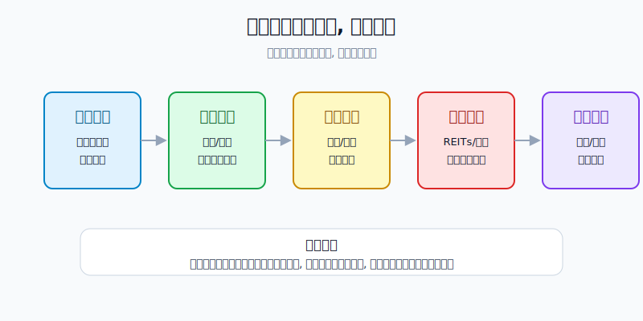
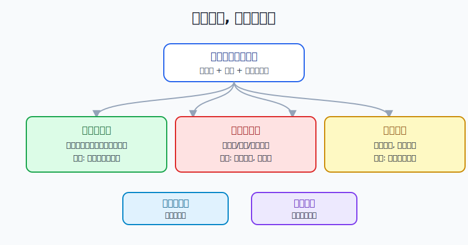
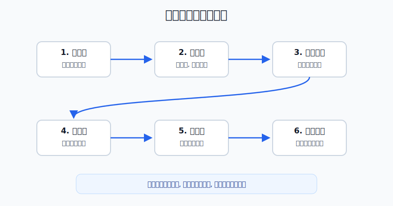

## 散户投资小白金融全品种操盘手册 - 8.10 小白组合中的位置 - 收益型资产, 不是保本工具
  
### 作者  
digoal  
  
### 日期  
2026-06-06   
  
### 标签  
金融产品 , 金融工具 , 散户 , 投资小白 , 全品操盘手册  
  
----  
  
## 背景 
   

> 适用读者: 已经读过REITs和高股息资产基础章节, 但还分不清“收分红”和“保本”的小白投资者。
> 本文定位: 投资教育框架, 不构成个性化投资建议。

## 先问一个扎心问题

如果一个产品每年能分红, 但价格一年跌了20%, 它还算“稳”吗?

很多小白第一次看REITs、高股息股票、红利ETF, 眼睛只盯着分派率和股息率。问题是, **现金流不等于保本, 分红也不等于稳赚**。这一节只解决一个问题: 收益型资产在组合里到底该坐哪个位置。

## 核心概念: 收益型资产是什么

收益型资产, 不是指“稳赚的资产”, 而是指回报里有一部分来自现金分配的资产。

REITs的现金流通常来自底层基础设施, 比如租金、通行费、电费、仓储费。高股息股票的现金流来自公司利润分红。红利ETF则是把一篮子高股息股票装进基金里, 让你不用押注单家公司。

把它们放进组合, 目的不是替代银行存款, 也不是替代货币基金。它们更像账户里的“现金流发动机”: 发动机正常时, 能给组合补一部分现金回报; 发动机出故障、或者你买得太贵时, 价格波动会把分红吞掉。

所以小白要先记住一句话: **收益型资产是组合里的收益仓, 不是保本仓。**

## 逻辑推导链

【论证链标题】: 收益型资产只有在现金流可持续、价格合理、仓位可控时, 才适合放进小白组合; 它不能替代现金和保本需求。

── 第一步: 前提陈述

前提A: 一个合格的小白组合, 先要分清每笔钱的角色。生活钱负责随时可用, 核心资产负责长期增长, 防守资产负责降低冲击, 收益型资产负责提供现金流。这是常量。就像一个家庭不能把饭钱、房租钱和旅游钱混在一个信封里, 投资账户也不能把所有资产都当“赚钱工具”。

前提B: REITs和高股息资产的分红, 来自底层现金流或公司利润, 不是固定利息。证监会2020年发布的基础设施公募REITs指引说明, 基础设施基金以获取租金、收费等稳定现金流为主要目的, 并将90%以上合并后基金年度可供分配金额按要求分配给投资者。这是制度前提, 相对稳定, 但底层现金流本身是变量。

前提C: 收益型资产通常在交易所交易, 价格每天波动。REITs有二级市场价格, 红利ETF有基金净值和场内价格, 高股息股票更直接受行业、利润和估值影响。这是变量。

前提D: 小白的信息处理能力和纪律通常不足。看公告、看年报、判断现金流质量, 都需要学习成本。这是现实前提, 对新手尤其重要。

── 第二步: 逻辑推导

由A+B可得: 因为组合里每笔钱都有不同任务, 而收益型资产的分红来自经营现金流或企业利润, 所以它适合承担“提高组合现金流”的任务, 不适合承担“短期本金安全”的任务。

再由B+C可得: 因为现金流会变化, 价格也会变化, 所以“有分红”只能说明它有收益来源, 不能推出“本金不会亏”。如果价格跌幅大于分红, 账户仍然亏钱。

最后由A+B+C+D可得: 因为小白既需要保留现金, 又无法持续准确判断每个项目的现金流变化, 所以正常结论不是重仓押收益型资产, 而是把它放在组合的中间位置: 比现金和短债风险高, 比个股和主题资产更偏收益, 但必须有仓位上限。

── 第三步: 正常情景下的操作结论

✅ 正常情景: 生活备用金已经留好, 核心资产已经建立, 候选REITs或红利资产现金流没有明显恶化, 当前价格没有被短期追高。

对应操作: 小白可以把REITs、红利ETF、高股息资产合并放进“收益仓”, 作为组合的一小部分。演示模板是: 收益仓先不超过账户的10%-15%, 单只REITs或单只高股息股票不超过2%-3%; 如果还看不懂年报和公告, 优先用红利ETF或小额观察仓学习, 不把单只资产当核心仓。

── 第四步: 数据和案例证实

证据1: 制度上, REITs确实有现金分配设计。证监会2020年8月7日发布《公开募集基础设施证券投资基金指引(试行)》, 明确基础设施基金属于上市交易的封闭式公募基金, 80%以上基金资产投资于基础设施资产支持证券, 以获取稳定现金流为主要目的, 并将90%以上合并后基金年度可供分配金额按要求分配给投资者。

证据2: 现实中, 现金流资产在经营正常时确实能分红。上交所2026年4月3日披露, 截至2026年3月31日, 沪市52只公募REITs完成2025年年报披露; 2025年这些产品合计收入145亿元、可供分配金额88亿元, 全年实施分红110次, 累计派发近78亿元。上交所同时披露, 产权类REITs整体分派率为4.18%, 经营权类REITs全周期内部收益率约4.05%。

证据3: 高股息资产也有明确筛选逻辑, 但不是保本逻辑。中证指数有限公司2026年5月29日的中证红利指数事实说明显示, 中证红利指数选取100只现金股息率高、分红较为稳定, 并具有一定规模及流动性的上市公司证券作为样本。这个定义说明红利指数关注分红和流动性, 但同一份资料也显示, 该指数2022年收益率为-5.45%, 2025年收益率为-1.39%, 说明红利资产也会下跌。

反例: 2023年公募REITs二级市场就给过一次提醒。每日经济新闻2023年12月29日报道, 2023年中证REITs全收益指数下跌22.67%。这说明即使是“全收益指数”, 也就是把分红因素考虑进去以后, 遇到估值回调、流动性偏弱、基本面预期变化, 仍然可能出现明显亏损。

历史数据不代表未来, 但这些数据能验证同一个规律: **现金流是真实的, 波动也是真实的。**

── 第五步: 前提变化时的替代结论

若前提B改变, 也就是底层现金流变弱, 推导路径就变成: 因为分红来自现金流, 所以现金流下降会削弱分红基础; 如果价格下跌后分派率看起来更高, 可能不是便宜, 而是风险重估。新结论: 停止加仓, 查经营数据, 必要时减仓。

若前提C改变, 也就是价格短期涨太多, 推导路径就变成: 因为现金流没有同步增长, 所以买入价格越高, 未来可获得的现金回报越低。新结论: 不追高, 等价格回落或等分配增长确认。

若前提A改变, 也就是你没有备用金、三个月内要用钱, 推导路径就更简单: 因为收益型资产不能保证短期本金稳定, 所以短期钱不该放进去。新结论: 先补现金仓, 再谈收益仓。

失败案例就是2023年REITs回调。很多人当时看的是分派率, 市场惩罚的是价格和预期。前提变了, 结论就不能还停留在“有分红所以安全”。

## 实操例子: 10万元账户怎么放

假设小周有10万元可投资资金, 生活备用金已经另外放好。他已经有宽基ETF和短债基金, 想加入REITs和红利ETF, 目标是让组合多一点现金分配, 不是追求短线暴富。

第一步, 先定角色。小周在计划里写清楚: 收益型资产只负责现金流补充, 不负责保本, 不负责翻倍。这一步对应前提A。如果这句话写不出来, 说明他还在把分红当稳赚。

第二步, 设上限。演示模板里, 他把收益仓上限定为10%, 也就是1万元。其中红利ETF 6000元, REITs观察仓4000元。单只REITs最多2000元。这个比例不是推荐答案, 而是为了让小白即使判断错, 也不会让单一资产伤到账户根基。

第三步, 买前查现金流。红利ETF看指数规则、行业集中度、前十大权重和历史分红稳定性; REITs看项目类型、收入、出租率或车流量、可供分配金额、剩余期限。这个动作对应前提B。凡是现金流来源说不清, 小周就不买。

第四步, 买前查价格。假设某REITs过去12个月每份分配0.20元, 价格4元时粗略分派率是5%; 如果价格涨到5元, 分配金额没变, 粗略分派率就降到4%。同一个资产, 只是买贵了, 未来现金回报就被压低。这一步对应前提C。

第五步, 分批而不是一口吃完。他先买红利ETF 3000元、REITs 2000元, 剩下5000元留作观察。只有当两个季度后经营指标没有恶化、价格没有明显追高、自己能读懂公告, 再补第二笔。

第六步, 写纠偏规则。若REITs可供分配金额连续下降, 或项目出租率、车流量、收缴率明显低于预期, 他停止加仓; 若红利ETF行业过度集中且相关行业盈利下行, 他降低仓位; 若收益仓上涨后超过15%, 他通过再平衡把仓位拉回计划内。

如果他操作错误, 最常见后果是把收益仓买成重仓。比如1万元收益仓涨得不错, 他加到3万元, 然后遇到2023年那种REITs整体回调, 分红覆盖不了价格下跌, 整个账户会被拖累。纠偏方法不是预测下一天涨跌, 而是回到论证链: 现金流、价格、仓位三件事, 哪一件坏了就处理哪一件。

## 可复用框架

【三仓定位法】

适用前提: 你已经有一些闲钱, 想把REITs、红利ETF或高股息资产放进组合。

核心逻辑: 因为不同资产承担不同任务, 所以先确定现金仓、核心仓、收益仓, 再决定买什么。

操作步骤:

1. 现金仓: 放生活备用金和短期要用的钱, 不追求高收益。
2. 核心仓: 放宽基、分散型资产, 承担长期增长任务。
3. 收益仓: 放REITs、红利ETF和少量高股息资产, 只承担现金流补充任务。

前提失效时: 如果备用金不足, 暂停收益仓; 如果核心仓还没建立, 不要先重仓收益型资产; 如果收益仓超过计划上限, 用再平衡降回去。

举一反三: 这个框架也能用在黄金、债券ETF、美股REITs上。先问角色, 再问收益。

【现金流闸门】

适用前提: 你看上一个有分红的资产, 但不确定是不是陷阱。

核心逻辑: 因为分红来自现金流, 价格决定实际回报, 仓位决定出错后果, 所以买入前必须过三道闸门。

操作步骤:

1. 现金流闸门: 分红来自租金、通行费、企业利润, 还是来自不可持续的短期因素?
2. 价格闸门: 当前价格有没有把未来收益提前透支?
3. 仓位闸门: 即使判断错, 亏损会不会伤到账户根基?

前提失效时: 现金流看不懂、价格刚被炒高、仓位会失控, 任意一项出现, 动作都是暂停。

举一反三: 这个框架同样适用于高股息股票。股息率高, 有时是公司分红好; 有时是股价跌出来的风险信号。

## 本节行动清单

| 动作 | 合格标准 |
|---|---|
| 先定角色 | 明确写下: 收益型资产不是保本资产 |
| 先留现金 | 三个月内要用的钱不放进REITs和红利资产 |
| 查现金流 | REITs看可供分配金额和经营指标, 红利资产看利润与分红稳定性 |
| 查价格 | 分红没变但价格上涨时, 未来回报会被压低 |
| 控仓位 | 收益仓先小比例, 单只资产不替代核心资产 |
| 做复盘 | 至少按季度检查现金流、价格、仓位三件事 |

## 一句话总结

REITs和高股息资产可以给组合增加现金流, 但它们不是保本工具。小白真正该学的不是追最高分派率, 而是把收益型资产放在正确位置: 现金流可持续、价格合理、仓位可控, 才能进收益仓。

## 参考资料

- 中国政府网: 《证监会发布〈公开募集基础设施证券投资基金指引(试行)〉》, 2020-08-08, https://www.gov.cn/xinwen/2020-08/08/content_5533334.htm
- 上海证券交易所: 《深耕实体沃土 共绘发展新篇 - 沪市公募REITs 2025年年报“出炉”》, 2026-04-03, https://www.sse.com.cn/aboutus/mediacenter/hotandd/c/c_20260403_10814138.shtml
- 中证指数有限公司: 《中证红利指数事实说明》, 2026-05-29, https://oss-ch.csindex.com.cn/static/html/csindex/public/uploads/indices/detail/files/zh_CN/000922factsheet.pdf
- 每日经济新闻: 《公募REITs的2023: 二级市场表现乏力, 常态化发行加速推进中》, 2023-12-29, https://www.nbd.com.cn/articles/2023-12-29/3188866.html

> ⚠️ **声明**：本文内容为投资教育目的，所有历史数据、策略框架均为辅助学习工具，不构成证券投资建议。市场有风险，投资需谨慎。实际操作请结合自身风险承受能力，必要时咨询专业投顾。
  
#### [PostgreSQL 解决方案集合](../201706/20170601_02.md "40cff096e9ed7122c512b35d8561d9c8")
  
  
#### [德哥 / digoal's Github - 公益是一辈子的事.](https://github.com/digoal/blog/blob/master/README.md "22709685feb7cab07d30f30387f0a9ae")
  
  
#### [About 德哥](https://github.com/digoal/blog/blob/master/me/readme.md "a37735981e7704886ffd590565582dd0")
  
  

  
