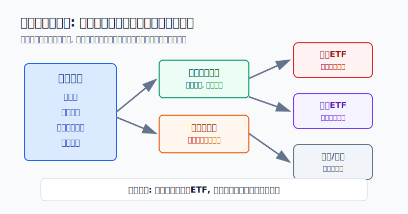
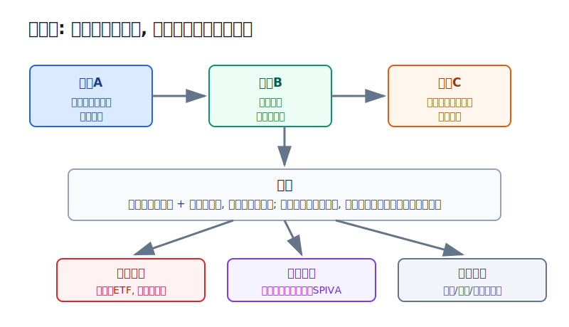
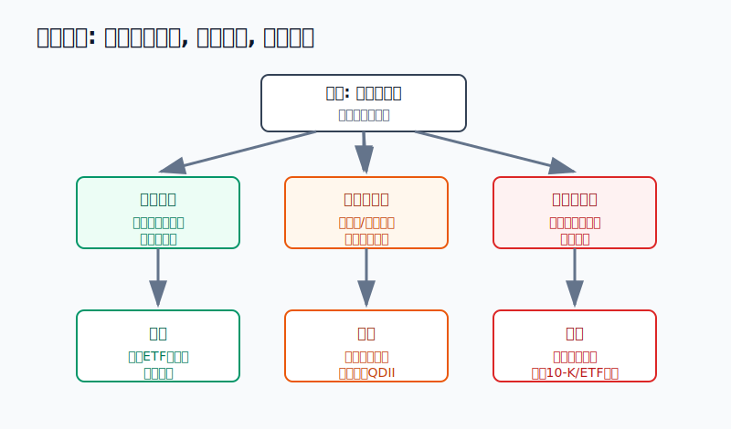

## 散户投资小白金融全品种操盘手册 - 9.1 为什么要学美股 - 全球资产配置的重要组成部分
  
### 作者  
digoal  
  
### 日期  
2026-06-07   
  
### 标签  
金融产品 , 金融工具 , 散户 , 投资小白 , 全品操盘手册  
  
----  
  
## 背景 
   

> 适用读者: 已经知道A股、ETF、黄金、REITs等基础工具, 但还没系统接触美股的小白投资者。
> 本文定位: 投资教育框架, 不构成个性化投资建议。

## 先问一个反直觉的问题

学美股的第一步, 不是问“英伟达还能不能涨”, 也不是问“标普500现在贵不贵”。真正的第一步是问: **如果全球最重要的一块股票市场你完全不懂, 你的资产配置是不是少了一张地图?**

## 核心概念: 美股不是一个热点, 而是一类全球资产入口

很多小白听到美股, 第一反应是苹果、微软、英伟达、特斯拉, 或者“晚上开盘”“美元账户”“涨得猛”。这些都只是表面。

更准确地说, **美股是用美元计价、按美国规则交易和披露的一大类资产入口**。它里面有个股, 有ETF, 有REITs, 有债券ETF, 有货币市场基金, 也有期权和杠杆产品。对小白来说, 这不是一个“能不能赚钱”的问题, 而是一个“要不要纳入学习地图”的问题。

打个比方: 你学开车, 不是为了马上开赛车, 而是为了知道高速路、城市路、山路分别怎么走。美股也是这样。你可以暂时不买, 但最好知道它在全球资产系统里扮演什么角色。

所以这一节先给出结论: **美股值得学, 因为它是全球资产配置的重要组成部分; 但小白的起点不是个股和期权, 而是规则、汇率、指数ETF和仓位边界。**

## 逻辑推导链

【论证链标题】: 美股因为全球权重高、工具丰富、披露体系成熟而值得学习; 但因为汇率、估值和规则都是变量, 小白不能把“值得学”直接推导成“马上重仓买”。

── 第一步: 前提陈述

前提A: 美国股票市场在全球股票市场里占很大权重。这是相对稳定的事实, 但具体比例会随市场涨跌变化。就像一个城市的主干道, 你可以暂时不走, 但如果完全不知道它在哪里, 整张交通图就不完整。

前提B: 美股的工具非常丰富, 从标普500ETF、纳斯达克100ETF, 到个股、REITs、债券ETF、货币市场基金、期权和杠杆ETF都有。这是常量。工具丰富的好处是选择多, 坏处是小白很容易跳过简单工具, 直接碰复杂工具。

前提C: 美股的信息披露体系相对成熟, 上市公司有10-K、10-Q、8-K等文件。10-K可以理解为年度体检报告, 10-Q是季度体检报告, 8-K是重大事件通知。这是常量, 但读懂它需要时间。

前提D: 美股资产对中国散户来说通常叠加了美元汇率、跨境通道、税务、交易时间和监管规则。这些都是变量。股票本身赚钱, 不代表换回人民币后一定赚钱; 股票本身便宜, 也不代表账户规则和税务成本可以忽略。

── 第二步: 逻辑推导

由A+B可得: 因为美国股票市场在全球股票资产里占重要位置, 而且美股工具覆盖宽基、行业、个股、债券和现金管理, 所以学美股不是追一个热点, 而是补齐全球资产配置地图。

再由A+B+C可得: 因为美股既有分散化ETF入口, 又有公开披露资料可以验证公司和基金, 所以小白可以从“规则清楚、分散度高、信息容易查”的工具开始学习, 而不是一上来押单只热门股。

最后由A+B+C+D可得: 因为汇率、估值、税务和账户规则都会改变实际结果, 所以“美股重要”只能推出“应该学习并纳入观察”, 不能推出“现在就重仓买入”。正常结论是: 先把美股放进全球配置框架, 再用指数ETF和小仓位建立经验。

── 第三步: 正常情景下的操作结论

✅ 正常情景: 你已有生活备用金, A股或本土资产有基本配置, 这笔钱是三年以上不用的闲钱, 能接受美元汇率波动和美股回撤, 并愿意先学习规则。

对应操作: 先学习美股市场结构、交易时间、汇率、税务和信息披露; 如果要实操, 优先从QDII基金、跨境ETF或美股宽基ETF开始, 单次投入小, 总仓位有上限。个股研究放在指数ETF之后, 期权和杠杆产品放在最后。

── 第四步: 数据和案例证实

证据1: 美国市场在全球股票市场中确实占重要权重。SIFMA《2025 Capital Markets Fact Book》披露, 2024年全球股票市场市值约126.7万亿美元, 其中美国股票市场约62.2万亿美元, 占49.1%, 是第二大市场中国的5.3倍。这个数字说明: 不理解美股, 就很难说自己真正理解全球股票资产。

证据2: 全球宽基指数里, 美国也是核心部分。以跟踪MSCI ACWI的iShares MSCI ACWI ETF为例, 其官网披露的国家和地区配置中, 美国长期是最大权重国家。ACWI代表全球发达市场和新兴市场股票的一篮子组合, 这说明很多“全球股票”产品并不是平均买全球, 而是天然包含很高比例的美国股票。

证据3: 美股指数不是只适合专业投资者, 它本身就是普通人学习市场的入口。SIFMA同一份Fact Book把S&P 500定义为由500多家美国大型上市公司组成的市值加权指数, 并称其是衡量美国大盘股的最佳指标之一。对小白来说, 这意味着你不必从猜单只股票开始, 可以先用宽基指数理解美国市场。

证据4: 主动选股并不容易。S&P Dow Jones Indices的SPIVA美国年终报告长期跟踪主动基金与基准指数的表现, 其2025年报告继续显示, 不少主动管理基金在长期维度跑输对应指数。这个证据不是说指数ETF一定赚钱, 而是说明“靠自己挑股打败市场”并不是默认简单模式。

反例: 2008年全球金融危机和2022年美联储快速加息都提醒过投资者, 美股不是只涨不跌的资产。SIFMA Fact Book显示, S&P 500在2024年上涨23.3%, Nasdaq Composite上涨28.6%, 但这类年度收益不能代表每一年。遇到金融危机、估值过热、利率快速上行时, 美股也会大幅回撤。历史不代表未来, 但它能说明一个稳定规律: **美股重要, 不等于美股无风险。**

── 第五步: 前提变化时的替代结论

若前提D改变, 也就是美元汇率大幅波动, 推导路径就变成: 因为美股收益最终要叠加人民币/美元变化, 所以美元资产上涨不一定等于人民币口径收益上涨。新结论: 降低单次换汇金额, 用分批方式进入, 或先通过QDII基金学习。

若前提B改变, 也就是你跳过ETF直接买单只热门股或期权, 推导路径就变成: 因为工具越复杂, 对信息、仓位和交易规则的要求越高, 所以小白犯错成本会被放大。新结论: 暂停复杂工具, 回到宽基ETF和规则学习。

若前提C改变, 也就是你不看10-K、10-Q、ETF持仓和费用, 只看中文社区观点, 推导路径就变成: 因为信息来源不可验证, 所以买入理由随情绪变化。新结论: 不下单, 先补信息披露阅读能力。

失败案例不需要找某个散户故事, 2008年和2022年已经足够说明问题: 当前提从“流动性宽松、估值可接受”变成“危机冲击或利率快速上行”时, 原来追涨热门资产的逻辑会失效。前提变了, 结论必须变。

## 实操例子: 10万元账户怎样开始学美股

这个例子对应论证链的正常结论: **美股值得学, 但第一步是纳入全球配置框架, 而不是重仓押单一热门股。**

假设小陈有10万元可投资资金, 生活备用金已经另外留好。他主要持有A股宽基ETF、短债基金和少量黄金ETF, 现在想学习美股。市场环境是: 美股过去几年涨幅不小, 科技股讨论很热, 人民币对美元汇率也有波动。

第一步, 写清角色。小陈先在计划里写一句话: “美股仓位负责全球资产配置和美元资产学习, 不负责短线暴富。”这一步对应前提A。写不出这句话, 说明他还把美股当热点, 不是当配置工具。

第二步, 设学习仓上限。演示模板是: 前三个月只用总资金的3%-5%做学习仓, 也就是3000元到5000元等值资金。这个比例不是推荐答案, 而是为了让小白即使看错汇率、买错时间、理解错规则, 也不会伤到账户根基。

第三步, 先选入口, 不直接押热门个股。小陈可以比较三条路径: QDII基金、境内跨境ETF、境外账户买美股ETF。若他还没搞清账户规则和税务, 先用QDII或跨境ETF学习; 若已经能处理账户安全、交易时间和税务资料, 再考虑境外ETF。这个动作对应前提B和前提D。

第四步, 读资料再下单。买宽基ETF前, 他至少看四件事: 跟踪指数、费用率、规模和前十大持仓。如果是美股个股, 至少读公司年报10-K里的业务、风险因素、收入利润和现金流。这个动作对应前提C。看不懂, 就不买个股。

第五步, 分批进入。假设他决定用5000元等值资金学习, 第一笔只用2500元, 剩下2500元等一个月后再决定。判断依据不是“朋友说要涨”, 而是三件事: 汇率是否大幅不利、指数估值是否明显过热、自己是否能复述买入理由。

第六步, 写纠偏规则。如果买入后美股下跌10%, 但买入理由仍是“长期全球配置学习仓”, 他不因为短期波动清仓; 如果发现自己其实买的是高溢价跨境ETF、或买入理由只是追AI热点, 他停止加仓并纠偏; 如果学习仓因为上涨超过总账户8%, 他通过再平衡降回计划范围。

如果操作错误, 最常见后果是把“学习仓”变成“情绪仓”。例如小陈原计划买5000元宽基ETF, 看到热门股上涨后改成2万元单只科技股, 再遇到财报不及预期或利率上行, 账户波动会远超原计划。纠偏方法不是猜下一次反弹, 而是回到论证链: 市场重要性、信息披露、汇率规则、仓位边界, 哪一项没满足, 就先修哪一项。

## 可复用框架

【地图优先法】

适用前提: 你想学美股, 但还不知道该从指数、个股、基金还是期权开始。

核心逻辑: 因为美股是全球资产配置的一部分, 不是单一热点, 所以先看它在你的组合地图里扮演什么角色, 再决定工具。

操作步骤:

1. 先定角色: 美股是全球配置仓、美元资产仓, 还是短线交易仓? 小白默认只能先放进学习仓和配置仓。
2. 先选简单工具: 宽基ETF优先于行业ETF, 行业ETF优先于个股, 个股优先于期权和杠杆产品。
3. 先控仓位: 第一次参与只用小比例资金, 让错误成本可承受。

前提失效时: 如果你连账户、汇率、税务、交易时间都没搞清, 只学习不下单; 如果你已经被单只热门股吸引到想重仓, 立刻把问题改回“我为什么不用指数ETF开始”。

举一反三: 这个框架也适用于港股、QDII、商品基金。先问地图位置, 再问工具选择。

【三问入场法】

适用前提: 你已经有一笔闲钱, 想开始配置一点美股相关产品。

核心逻辑: 因为美股收益同时受股票、美元和规则影响, 所以下单前必须问三件事。

操作步骤:

1. 问资产: 我买的是美国大盘、科技行业、单家公司, 还是复杂衍生品?
2. 问货币: 如果美元兑人民币波动, 我的最终收益会怎样变化?
3. 问规则: 我是否知道交易时间、费用、税务、信息披露和卖出条件?

前提失效时: 任意一问回答不清, 动作不是“少买一点试试”, 而是回到学习阶段。小白可以用模拟记录和阅读资料代替真实下单。

举一反三: 这个框架同样适用于跨境ETF。跨境ETF看起来在A股账户里交易, 但底层资产和汇率仍然可能影响结果。

## 本节行动清单

| 动作 | 合格标准 |
|---|---|
| 明确定位 | 写下: 学美股是补全球配置地图, 不是追热门股 |
| 先学规则 | 至少知道NYSE、Nasdaq、ETF、10-K、10-Q、8-K是什么意思 |
| 先看汇率 | 知道美元资产最终会叠加人民币/美元波动 |
| 先用简单工具 | 小白优先研究QDII、跨境ETF、美股宽基ETF |
| 控制学习仓 | 第一次参与用小比例资金, 总仓位有上限 |
| 设失效条件 | 看不懂披露、汇率风险过大、产品溢价过高时暂停 |

## 一句话总结

美股值得学, 因为它是全球资产配置绕不开的一块拼图; 但小白真正该做的不是追热门个股, 而是先学规则、看懂汇率、从指数ETF开始, 用小仓位把地图补全。

## 参考资料

- SIFMA: 《2025 Capital Markets Fact Book》, 2025, https://www.sifma.org/wp-content/uploads/2024/07/2025-SIFMA-Capital-Markets-Factbook.pdf
- iShares: 《iShares MSCI ACWI ETF》, 2026年访问, https://www.ishares.com/us/products/239600/ishares-msci-acwi-etf
- S&P Dow Jones Indices: 《SPIVA U.S. Scorecard》, 2025年报入口, https://www.spglobal.com/spdji/en/research-insights/spiva/
- U.S. SEC: 《EDGAR - Search and Access》, 2026年访问, https://www.sec.gov/edgar/search-and-access

> ⚠️ **声明**：本文内容为投资教育目的，所有历史数据、策略框架均为辅助学习工具，不构成证券投资建议。市场有风险，投资需谨慎。实际操作请结合自身风险承受能力，必要时咨询专业投顾。
  
#### [PostgreSQL 解决方案集合](../201706/20170601_02.md "40cff096e9ed7122c512b35d8561d9c8")
  
  
#### [德哥 / digoal's Github - 公益是一辈子的事.](https://github.com/digoal/blog/blob/master/README.md "22709685feb7cab07d30f30387f0a9ae")
  
  
#### [About 德哥](https://github.com/digoal/blog/blob/master/me/readme.md "a37735981e7704886ffd590565582dd0")
  
  

  
