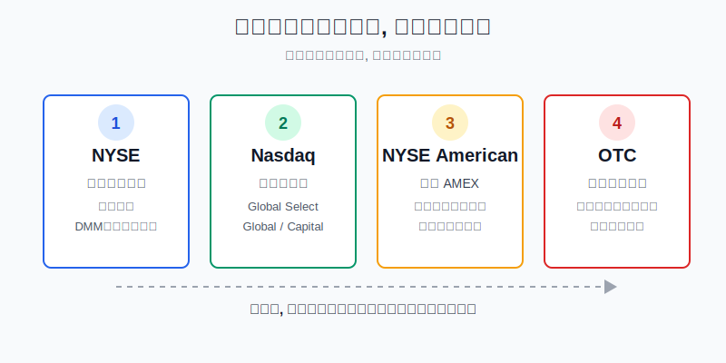
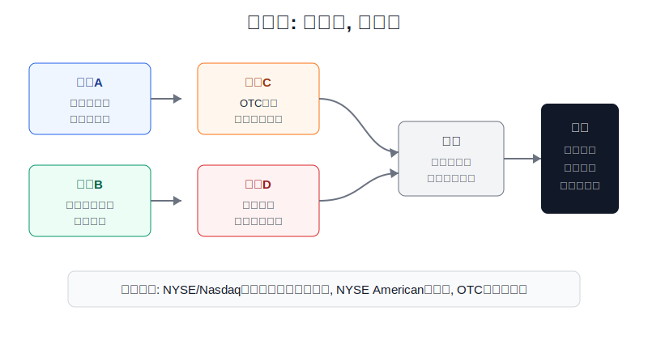
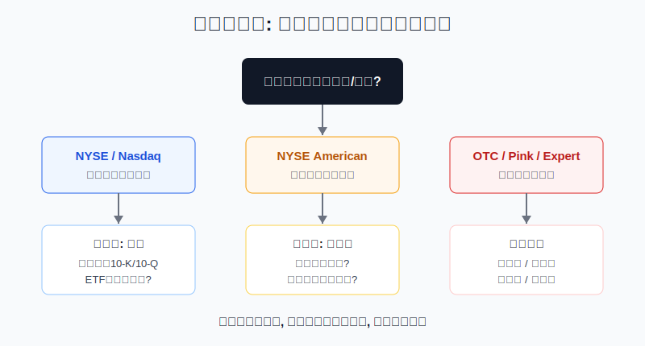

## 散户投资小白金融全品种操盘手册 - 9.2 美股市场结构 - NYSE、Nasdaq、AMEX、OTC
  
### 作者  
digoal  
  
### 日期  
2026-06-07   
  
### 标签  
金融产品 , 金融工具 , 散户 , 投资小白 , 全品操盘手册  
  
----  
  
## 背景 
   

> 适用读者: 刚开始学美股, 看到交易软件里一堆英文代码, 但分不清“交易所上市”和“场外报价”的小白投资者。
> 本文定位: 规则认知和风险边界, 不构成个性化投资建议。

## 先问一个反直觉的问题

同样叫“美股”, 苹果和一只 OTC 粉单小票, 不是同一种路况。前者像高速主干道, 后者可能像没有路灯的小巷。小白第一步不是问能不能涨, 而是问: **这只股票到底在哪一层市场里交易?**

## 核心概念: 美股市场先分层, 再选股

美股不是只有“纽约证券交易所”和“纳斯达克”两个名字。对小白最有用的分法是四层:

第一层是 **NYSE**。它通常承载很多大型成熟公司。NYSE 的特色是还有交易大厅、指定做市商 DMM、开盘和收盘集合竞价。DMM 可以理解为被分配到某些股票上的“秩序维护员”, 不是保证股价上涨, 而是在开收盘和不平衡时帮助价格发现。

第二层是 **Nasdaq**。它是电子化程度很高的市场, 里面又分 Nasdaq Global Select Market、Nasdaq Global Market、Nasdaq Capital Market 三个层级。简单说, Global Select 的初始财务和流动性要求更高, Capital Market 更偏成长型和较小规模公司。

第三层是 **AMEX 的现代版本: NYSE American**。很多老资料会写 AMEX, 现在更准确的说法是 NYSE American。它偏向成长型、小盘公司, 仍然属于交易所市场, 也有电子指定做市商 eDMM, 但小盘属性意味着流动性和波动要额外检查。

第四层是 **OTC**。OTC 是 over-the-counter, 可以理解为“场外报价市场”。它不是传统意义上公司在主板交易所上市, 而是通过经纪商和场外报价系统形成交易。OTC 里有 OTCQX、OTCQB、OTCID、Pink Limited 等层级, 披露质量、成交活跃度、投资者保护差异很大。对小白来说, OTC 默认不是入门工具。

这里要分清两个词: **上市地**和**成交地**。一家公司可以在 NYSE 或 Nasdaq 上市, 你的订单最终可能通过不同交易场所执行; 但小白做第一层筛选时, 最该看的还是它的主要上市或报价层级。因为这个层级决定了公司至少经过了什么门槛、持续要遵守什么规则、你能不能找到基本信息。

## 逻辑推导链

【论证链标题】: 美股的交易层级决定信息质量、流动性和小白的操作边界; 所以小白应先分层, 再研究估值和买卖。

── 第一步: 前提陈述

前提A: 交易所上市股票要满足初始上市标准和持续上市标准。这是常量。Investor.gov 对上市标准的解释很清楚: 公司股票在交易所交易前, 要满足市值、股价、公众持股、股东数量等财务和非财务要求; 上市后如果持续不达标, 交易所可以将其退市。打个比方, 交易所上市不是名牌大学录取, 但至少有入学门槛和留级规则。

前提B: NYSE、Nasdaq、NYSE American 的定位不同。这是常量, 但具体规则会更新。NYSE 强调主板上市、交易大厅、DMM 和开收盘拍卖; Nasdaq 有 Global Select、Global、Capital 三个层级; NYSE American 承接了 AMEX 的历史定位, 更偏成长型和小盘公司。它们都不是“赚钱保证书”, 只是不同质量筛网。

前提C: OTC 的披露、流动性和投资者保护差异很大。这是变量。OTC 里既有海外大公司 ADR 或优先股, 也有信息很少、成交很淡、容易被推广的小票。场外报价不等于一定骗局, 但它要求投资者自己承担更多筛选工作。

前提D: 小白在券商软件里看到的只是代码和价格, 页面往往会弱化“这只股票在哪一层市场”。这是变量。很多亏损不是因为看错估值模型, 而是买之前根本没看清: 自己碰的是主板股票、成长小盘股, 还是 OTC 微型股。

── 第二步: 逻辑推导

由 A + B 可得: 因为交易所市场有初始和持续上市标准, 而且不同交易所层级有不同定位, 所以“NYSE/Nasdaq/NYSE American”这几个标签本身就提供了第一层风险信息。主板上市不代表好公司, 但至少说明它经过了交易所的门槛筛选。

再由 A + B + C 可得: 因为 OTC 不按传统交易所上市标准筛选, 披露和流动性差异更大, 所以小白不能把 OTC 股票和 NYSE、Nasdaq 股票放在同一个篮子里比较。你不能只看“股价低”“涨幅大”, 就把一条小巷当高速公路开。

最后由 A + B + C + D 可得: 因为券商页面可能让这些差异看起来都只是一个代码, 所以下单前必须先查交易层级。正常结论是: 小白先研究 NYSE/Nasdaq 宽基 ETF 和大盘股; NYSE American 小盘股要额外查成交额、买卖价差和 SEC 文件; OTC 默认不交易, 除非你已经能完整核验披露、流动性、推广风险和退市历史。

── 第三步: 正常情景下的操作结论

✅ 正常情景: 你只是刚开始学美股, 资金主要目标是长期配置和学习规则, 还没有能力读复杂财报和识别微型股推广。

对应操作: 先把自选股分成三类。第一类是 NYSE/Nasdaq 宽基 ETF 和大盘公司, 可以进入正常学习流程; 第二类是 NYSE American 或 Nasdaq Capital Market 的小盘公司, 只观察或小仓研究, 不做核心仓; 第三类是 OTC、Pink、Expert Market 等场外层级, 默认不买。

── 第四步: 数据和案例证实

证据1: SEC 投资者教育网站 Investor.gov 对“上市标准”的定义说明, 交易所初始上市标准通常包括公司总市值、股价、公众流通股数量和股东数量; 如果公司不能持续满足标准, 交易所可以将其股票退市。这个证据证明: 交易所层级确实是一道规则筛网。

证据2: Nasdaq 官网说明, Nasdaq Stock Market 有 Global Select、Global、Capital 三个层级, 申请公司必须满足财务、流动性和公司治理要求; Nasdaq 还可以在保护投资者和公共利益需要时拒绝初始上市或附加条件。这个证据说明: “在 Nasdaq”本身也要继续细分层级。

证据3: NYSE 官网说明, NYSE 有交易大厅、DMM、主上市股票的开收盘拍卖; NYSE American 则定位为成长型公司市场, 使用电子指定做市商 eDMM, 并服务 NYSE American 上市公司。这个证据说明: 老资料里的 AMEX 不是消失后就不用管, 而是要按 NYSE American 的现代规则理解。

证据4: SIFMA 2026 年 6 月 1 日发布的美国权益及相关统计显示, 2026 年截至 5 月的美国股票日均成交量为 194 亿股, 同比增长 15.4%。这说明美国交易所和相关市场整体流动性很深, 但“整体很深”不能推出“每只小票都好卖”。小白真正要查的是自己买的那只股票的成交额和买卖价差。

证据5: OTC Markets Group 2026 年 3 月发布的 2025 年全年业绩说明, 其市场覆盖 12,000 只美国和国际证券; 年末有 574 家 OTCQX 公司、1,106 家 OTCQB 公司、1,052 家 OTCID 公司, 2025 年平均每日约 62,000 笔交易。这个数据说明 OTC 不是一个小角落, 但也说明它是一个庞杂分层市场, 不能用“便宜”二字概括。

证伪证据: SEC 的 Microcap Stock Basics 明确提醒, 很多微型股在 OTC 市场交易, 常见风险包括公开信息不足、没有交易所最低上市标准、流动性差、高波动和欺诈操纵风险。历史不代表未来, 但这条规律对小白很有参考价值: 信息越少、成交越淡、推广越猛, 越不能用“股价低”当安全边际。

── 第五步: 前提变化时的替代结论

若前提C改变, 也就是你发现目标股票不是 NYSE/Nasdaq/NYSE American 上市, 而是 OTC Pink 或 Expert Market, 推导路径就变成: 因为它没有交易所上市门槛保护, 披露和流动性要自己核验, 所以小白没有能力时不应下单。新结论: 只记录观察, 不用真钱交易。

若前提B改变, 也就是股票虽在交易所上市, 但属于极小盘、成交额很低、买卖价差很宽, 推导路径就变成: 因为交易所门槛只能筛掉一部分风险, 不能保证二级市场流动性, 所以它不能进入核心仓。新结论: 降为研究对象或放弃, 不因为“也是 Nasdaq”就买。

若前提D改变, 也就是券商软件没有清楚标注层级, 推导路径就变成: 因为信息入口不完整, 所以下单前必须到 SEC EDGAR、公司 IR、NYSE、Nasdaq 或 OTC Markets 页面核对。新结论: 核对不到, 不交易。

失败案例不是某个散户故事, 而是一类规则结果: 公司如果持续不满足上市标准, 会收到警示、进入整改期, 甚至从交易所退市后转入 OTC 报价。这个时候原来“交易所上市”的前提已经失效, 你的操作结论也必须从“正常研究”切换为“退市风险处理”。

## 实操例子: 5万元学习资金怎样筛一只美股

这个例子对应论证链的正常结论: **先查交易层级, 再查披露和流动性, 最后才谈买卖。**

假设小林有 5 万元人民币等值的海外资产学习资金, 已经留好生活备用金。他在券商软件里看到四类标的: 一只标普 500 ETF, 一家 Nasdaq 大型科技公司, 一家 NYSE American 小盘公司, 一只价格只有 0.8 美元的 OTC 股票。

第一步, 查层级。小林不看涨跌幅, 先看标的在哪里上市或报价。标普 500 ETF 和 Nasdaq 大型科技公司进入“可研究池”; NYSE American 小盘公司进入“谨慎观察池”; OTC 股票直接进入“默认不交易池”。这一步对应前提A、B、C。

第二步, 查披露。ETF 至少看基金官网的跟踪指数、费用率、规模、持仓和折溢价; 个股至少能在 SEC EDGAR 找到 10-K、10-Q 或 8-K。10-K 是年度体检报告, 10-Q 是季度体检报告, 8-K 是重大事项公告。如果资料只能靠社交媒体帖子和中文社区转述, 不下单。这一步对应前提D。

第三步, 查流动性。对小白来说, 不是“能买到”就够了, 而是“想卖时能不能用合理价格卖掉”。演示规则可以写成: 买卖价差长期超过 1%, 或者日成交额小到一笔普通散户订单就可能影响价格, 这类标的不进实盘。这个 1% 不是官方红线, 而是个人风控阈值, 目的是把交易摩擦先挡在门外。

第四步, 定仓位。标普 500 ETF 如果符合学习目标, 可以作为第 10 章继续研究的核心工具; Nasdaq 大型科技公司如果只是因为热门新闻吸引你, 暂时只放观察; NYSE American 小盘公司即使研究, 也只能用很小的试错仓; OTC 股票不投入真钱。

第五步, 写纠偏条件。如果买入后发现标的其实是 OTC, 或者公司被交易所通知不满足持续上市标准, 小林不再补仓摊低成本, 而是回到原始问题: “我买它时依据的交易层级还成立吗?” 如果不成立, 操作从研究买入切换为风险退出。

如果操作错误, 最常见后果是把“低价”错看成“低风险”。例如一只 0.8 美元 OTC 股票涨到 1.2 美元, 看起来涨了 50%, 但如果成交很少、价差很宽、信息不透明, 真正卖出时未必能按屏幕价成交。纠偏方法不是再找消息, 而是回到三问: 层级、披露、流动性。三问缺一项, 就先停。

## 可复用框架

【四层筛选法】

适用前提: 你看到一只美股代码, 还不知道它适不适合进入自选池。

核心逻辑: 因为市场层级决定最低信息质量和流动性边界, 所以先分层, 再估值。

操作步骤:

1. 第一层看 NYSE/Nasdaq: 宽基 ETF 和大盘公司优先进入学习池。
2. 第二层看 Nasdaq Capital Market 和 NYSE American: 小盘属性更强, 必须额外查成交额、买卖价差和 SEC 文件。
3. 第三层看 OTCQX/OTCQB/OTCID/Pink: 小白默认不交易, 只做规则学习。
4. 第四层看异常信号: 退市通知、停牌记录、推广痕迹、缺少当前财报, 任何一个出现都降级处理。

前提失效时: 如果查不到上市层级, 不要用真钱测试; 如果股票从交易所转到 OTC, 原来的研究结论作废, 重新评估退市和流动性风险。

举一反三: 这个框架也适用于港股创业板、A股北交所和跨境 ETF。先看市场层级, 再看产品本身。

【OTC红灯法】

适用前提: 你被一只低价 OTC 股票吸引, 想知道能不能碰。

核心逻辑: 因为 OTC 的披露和流动性差异大, 所以小白只要看到红灯条件, 动作就是不交易。

操作步骤:

1. 没有当前 SEC 报告或可靠公开资料: 红灯。
2. 买卖价差很宽、成交额很低: 红灯。
3. 主要信息来自陌生人推荐、社交媒体推广、夸张题材: 红灯。
4. 有 SEC 停牌、频繁改名、业务说不清: 红灯。

前提失效时: 如果你已经具备专业微型股研究能力, 仍然要用极小仓位和书面退出条件; 如果你只是小白, 不需要证明自己能识别所有骗局, 直接不碰就是最省钱的选择。

举一反三: 这个框架也适用于任何“低价、高涨幅、信息少”的资产。看不清的便宜, 往往不是安全边际。

## 本节行动清单

| 动作 | 合格标准 |
|---|---|
| 查层级 | 下单前确认是 NYSE、Nasdaq、NYSE American 还是 OTC |
| 查披露 | ETF 看持仓和费用, 个股看 SEC 文件和公司 IR |
| 查流动性 | 看成交额、买卖价差, 不只看屏幕上的最新价 |
| 分优先级 | 宽基 ETF 和大盘股优先, 小盘股谨慎, OTC 默认不碰 |
| 写失效条件 | 退市、停牌、缺披露、推广过猛时停止买入或退出 |

## 一句话总结

美股入门先别急着问哪只股票会涨, 先问它在哪一层市场里交易: 层级看不清, 后面的估值、故事和K线都不该进入实盘决策。

## 参考资料

- Investor.gov: Listing Standards, 2026年访问, https://www.investor.gov/introduction-investing/investing-basics/glossary/listing-standards
- NYSE: NYSE Equities, 2026年访问, https://www.nyse.com/trade/equities
- Nasdaq: Nasdaq Listing Requirements, 2026年访问, https://www.nasdaq.com/solutions/listings/markets
- SIFMA: US Equity and Related Statistics, 2026-06-01, https://www.sifma.org/research/statistics/us-equity-and-related-securities-statistics
- Investor.gov: Microcap Stock Basics Part 1, 2016-09-30, https://www.investor.gov/index.php/introduction-investing/general-resources/news-alerts/alerts-bulletins/investor-bulletins/investor-3
- Investor.gov: Microcap Stock Basics Part 3, 2016-10-21, https://www.investor.gov/introduction-investing/general-resources/news-alerts/alerts-bulletins/investor-bulletins/investor-2
- OTC Markets Group: 2025 Full Year Results, 2026-03-04, https://www.globenewswire.com/news-release/2026/03/04/3249770/0/en/otc-markets-group-reports-fourth-quarter-and-full-year-2025-results-delivering-strong-revenue-operating-income-and-earnings-growth.html

> ⚠️ **声明**：本文内容为投资教育目的，所有历史数据、策略框架均为辅助学习工具，不构成证券投资建议。市场有风险，投资需谨慎。实际操作请结合自身风险承受能力，必要时咨询专业投顾。
  
#### [PostgreSQL 解决方案集合](../201706/20170601_02.md "40cff096e9ed7122c512b35d8561d9c8")
  
  
#### [德哥 / digoal's Github - 公益是一辈子的事.](https://github.com/digoal/blog/blob/master/README.md "22709685feb7cab07d30f30387f0a9ae")
  
  
#### [About 德哥](https://github.com/digoal/blog/blob/master/me/readme.md "a37735981e7704886ffd590565582dd0")
  
  

  
