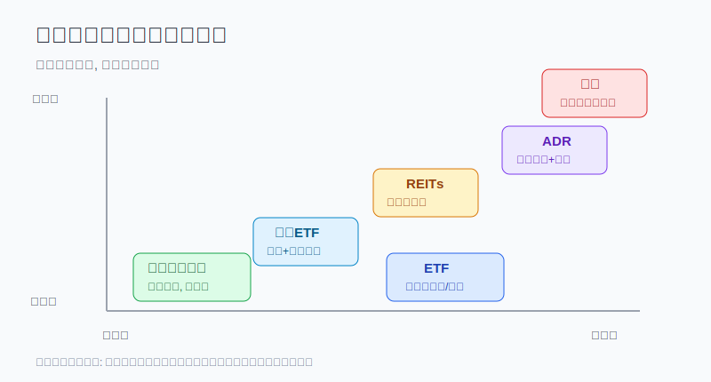
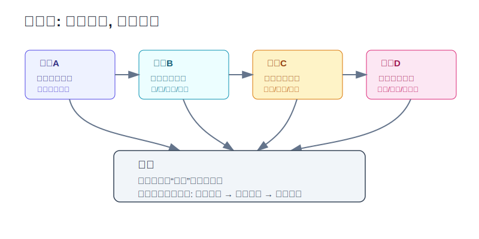
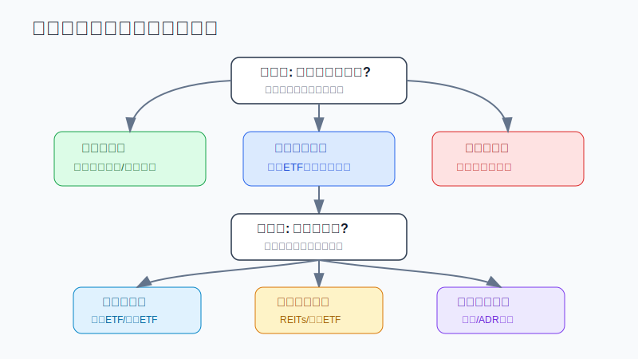

## 散户投资小白金融全品种操盘手册 - 9.3 美股主要资产 - 个股、ETF、REITs、ADR、债券ETF、货币市场基金
  
### 作者  
digoal  
  
### 日期  
2026-06-07   
  
### 标签  
金融产品 , 金融工具 , 散户 , 投资小白 , 全品操盘手册  
  
----  
  
## 背景 
   

> 适用读者: 已经知道“美股很重要”, 但分不清美股账户里到底能买什么的小白投资者。
> 本文定位: 投资教育框架, 不构成个性化投资建议。

## 先问一个反直觉的问题

同样是买“美股”, 一个账户里可以买苹果股票, 也可以买标普500 ETF、美国房地产REITs、长期国债ETF、货币市场基金, 还可以买外国公司的ADR。名字都在美股市场交易, 但风险完全不是一回事。**小白最容易犯的错, 就是把“都能在美股账户买”误解成“风险差不多”。**

## 核心概念: 美股账户像一个超市, 不是一种商品

你可以把美股账户想成一个大型超市。货架上有水果、药、米、酒、刀具, 它们都在同一个超市里卖, 但你不能因为“都在超市”就把它们当成同一种东西。

美股资产也是这样:

| 资产 | 小白版解释 | 主要赚什么 | 主要怕什么 |
|---|---|---|---|
| 个股 | 直接买一家公司的所有权份额 | 公司成长、利润、估值提升 | 公司判断错、估值过高、财报暴雷 |
| ETF | 用一只基金买一篮子股票、债券或其他资产 | 一篮子资产的整体表现 | 底层资产下跌、费用、跟踪误差、流动性 |
| REITs | 买经营性房地产现金流的上市公司或基金 | 租金、分红、资产价值变化 | 利率上行、出租率下降、物业经营变差 |
| ADR | 在美国市场买外国公司的存托凭证 | 外国公司的股价表现 | 汇率、所在地监管、披露差异、退市风险 |
| 债券ETF | 用ETF买一篮子债券 | 利息、利率下行带来的债券价格上涨 | 利率上行、久期过长、信用风险 |
| 货币市场基金 | 买短期债务工具和现金等价物 | 短期利息 | 收益低、通胀侵蚀、极端流动性风险 |

所以本节的行动结论很简单: **小白不要先问“哪个美股资产最能涨”, 而要先问“它的底层风险是什么, 在我的组合里承担什么角色, 我最多能放多少仓位”。**

## 逻辑推导链

【论证链标题】: 美股主要资产必须按底层风险分层, 不能按交易市场统一对待。

── 第一步: 前提陈述

前提A: 美股账户只是一个交易入口, 不是一个资产类别。这是常量。就像“菜市场”不是食物本身, “美股账户”也不是风险本身。

前提B: 不同工具的收益来源不同, 这是常量。个股靠公司经营和估值, ETF靠一篮子资产, REITs靠房地产现金流, 债券ETF靠利息和利率变化, 货币市场基金靠短期利率, ADR还叠加外国公司和本国监管。

前提C: 小白的信息处理能力是变量。能看懂ETF费用率, 不等于能读懂个股10-K; 能看懂分红率, 不等于能判断REITs的出租率、债务成本和物业质量。

前提D: 市场环境是变量。利率上行时, 长久期债券ETF和REITs可能承压; 风险偏好上升时, 成长股和行业ETF可能弹性更大; 汇率波动时, ADR和美元资产的人民币口径收益会变化。

── 第二步: 逻辑推导

由A+B可得: 因为同一个美股账户可以买到完全不同收益来源的工具, 所以不能把“美股资产”当作一个整体来买, 必须先拆成股票风险、债券风险、地产风险、现金风险和跨境风险。

再由B+C可得: 因为工具越复杂, 对信息阅读能力要求越高, 所以小白的默认顺序应该是先宽基ETF和现金类工具, 再行业ETF和REITs, 最后才是个股和ADR。

最后由B+C+D可得: 因为利率、估值、汇率和流动性都会改变实际结果, 所以每个工具都必须写清组合角色和仓位上限。正常结论是: **用货币市场基金和短债工具处理短期钱, 用宽基ETF做学习和核心研究入口, 用REITs、债券ETF、行业ETF、个股、ADR做卫星或专题研究, 不把任何一个单项工具当成万能答案。**

── 第三步: 正常情景下的操作结论

✅ 正常情景: 你有三年以上不用的闲钱, 已经留好生活备用金, 能接受美元汇率波动, 但还没有系统读美股财报和基金说明书。

对应操作: 第一层只学习货币市场基金、短债ETF和宽基ETF; 第二层再研究REITs、债券ETF和行业ETF; 第三层才用小仓位研究个股和ADR。任何时候, 如果看不懂底层资产、费用、披露文件和卖出条件, 就不进入下一层。

── 第四步: 数据和案例证实

证据1: ETF不是小众工具。ICI《2026 Investment Company Fact Book》显示, 截至2025年底, 美国ETF市场有4495只基金、总净资产13.4万亿美元, 其中大型美国股票ETF为5.0万亿美元, 债券ETF为2.2万亿美元。这说明ETF和债券ETF已经是普通投资者参与美股资产的重要入口, 不是专业机构才用的复杂玩具。

证据2: 货币市场基金是现金管理工具, 但不是银行存款。ICI在2026年6月4日发布的数据中披露, 截至2026年6月3日, 美国货币市场基金总资产为7.89万亿美元。规模大说明它常被用来停泊现金, 但SEC Investor.gov也提醒, 货币市场基金仍是基金, 不是FDIC保险存款。

证据3: REITs不是“高分红股票”四个字能概括。Nareit 2026年资料显示, REITs拥有超过4.5万亿美元商业地产资产; 2026年4月行业资料中, FTSE Nareit All REITs权益市值约1.60万亿美元。它背后对应的是办公楼、仓储、数据中心、住宅、医疗等真实物业现金流, 所以必须看物业类型、负债和利率环境。

证据4: 债券ETF也会亏钱。SEC Investor.gov说明, 债券基金有信用风险、利率风险和提前偿付风险; 利率上升时, 债券基金持有债券的市场价值通常会下降。一个现实反例是iShares 20+ Year Treasury Bond ETF: BlackRock/iShares资料显示, 这只长期美国国债ETF在2022年按NAV计算总回报为-31.41%。这说明“债券”两个字不等于“稳”, 久期太长时波动会很大。

反例: 货币市场基金也不是绝对无风险。SEC披露, Reserve Primary Fund在2008年9月16日“跌破1美元净值”, 意味着投资者在货币市场基金里也可能亏钱。历史不代表未来, 而且货币市场基金规则后来已经多次改革, 但这个案例足够说明: **资产名称听起来安全, 不等于你可以不看底层风险。**

── 第五步: 前提变化时的替代结论

若前提D改变, 也就是利率快速上行, 推导路径变为: 因为长久期债券ETF和REITs对利率更敏感, 所以不能把它们当现金替代品。新结论: 短期钱只放现金类或短久期工具, 长久期债券ETF只能作为利率下行情景的卫星仓。

若前提C改变, 也就是你已经能读10-K、10-Q、ETF招募说明和REITs经营指标, 推导路径变为: 因为信息能力提高, 所以可以把少量仓位放到个股、REITs和ADR研究上。新结论: 仍然先写仓位上限和失效条件, 不因为“看懂一点”就重仓。

若前提B被误判, 也就是你把ADR当成普通美国公司股票, 推导路径变为: 因为ADR背后是外国公司, 所以还叠加当地监管、汇率、披露和退市风险。新结论: ADR只能放在“跨境股票风险”一栏, 不能和美国本土宽基ETF混为一谈。

## 实操例子: 10万元账户怎样认识美股资产

这个例子对应论证链的正常结论: **先分底层风险和组合角色, 再决定是否买入。**

假设小林有10万元可投资资金, 生活备用金已经留好。他想拿1万元等值资金学习美股, 但还没读过美股财报, 也没处理过境外账户税务。

第一步, 先把1万元分成“学习现金”和“风险资产”两格。3000元等值资金只研究货币市场基金或短债ETF, 作用是熟悉美元现金管理; 7000元等值资金才考虑宽基ETF。这个动作对应前提B: 短期债务工具和股票ETF不是同一种风险。

第二步, 不碰单只热门股。小林如果想买某只科技龙头, 必须先能说清三件事: 公司收入来自哪里, 估值为什么合理, 如果财报不及预期怎么卖。说不清, 就停在宽基ETF。这个动作对应前提C: 信息能力决定工具复杂度。

第三步, REITs只作为专题学习。若他看到某只REITs分红率很高, 不能直接买, 必须看物业类型、出租率、债务期限和利率环境。看不懂, 就先用REITs ETF观察, 不买单只REIT。这个动作对应前提B和D。

第四步, 债券ETF先看久期。若他买长期国债ETF, 计划里必须写明: 这是押注利率下行的工具, 不是现金替代品。若未来利率继续上行, 价格可能继续下跌。这个动作对应2022年的反例。

第五步, ADR放到最后。若他想买某个中概或欧洲公司ADR, 先确认它是外国公司风险, 不是“美国公司”。买入前至少看SEC披露、公司本国监管风险、汇率影响和退市风险。做不到, 就不买。

如果小林操作错误, 最常见的后果是资产角色错位: 把长期债券ETF当现金, 把ADR当美国本土股, 把REITs当保本高息, 把个股当核心配置。纠偏方法不是猜涨跌, 而是回到三句话: **这是什么底层资产? 它在组合里负责什么? 如果前提失效, 我怎么减仓?**

## 可复用框架

【三层分拣法】

适用前提: 你已经知道美股账户里有很多工具, 但不知道先学哪个。

核心逻辑: 因为同一个账户里装的是不同底层风险, 所以先按风险分层, 再按能力进入。

操作步骤:

1. 第一层: 现金和低波动工具, 包括货币市场基金、短债ETF, 只负责停泊和流动性。
2. 第二层: 分散化核心工具, 包括宽基ETF和部分债券ETF, 负责组合骨架。
3. 第三层: 专题和高难度工具, 包括REITs、行业ETF、个股、ADR, 只做卫星仓。

前提失效时: 如果你连工具说明书和费用都看不懂, 停在第一层; 如果你开始因为热门新闻想跳到第三层, 先把仓位降到学习仓。

举一反三: 这个框架也适用于港股和跨境ETF。交易入口不是风险分类, 底层资产才是。

【角色仓位表】

适用前提: 你准备把某个美股资产放进账户。

核心逻辑: 因为每个资产只能承担一个主要角色, 所以下单前必须写清它是现金、核心、卫星还是试错。

操作步骤:

1. 写角色: 现金停泊、核心配置、收益型资产、行业卫星、个股试错, 五选一。
2. 写上限: 现金类按资金用途定, 宽基ETF按长期仓位定, 个股和ADR必须设单项上限。
3. 写失效条件: 利率、估值、汇率、财报、费用或流动性哪一项变坏时减仓。

前提失效时: 如果一个资产被你赋予多个角色, 例如既想保本、又想高分红、又想暴涨, 说明你还没看懂它。暂停下单, 重新归类。

举一反三: A股行业ETF、可转债、黄金ETF也可以用这张表。先定角色, 再谈买卖。

## 本节行动清单

| 动作 | 合格标准 |
|---|---|
| 先分类 | 把目标资产归入股票、债券、地产、现金、跨境风险之一 |
| 看底层 | ETF看持仓和费用, REITs看物业和负债, 债券ETF看久期 |
| 控复杂度 | 不会读10-K、10-Q和基金说明书时, 不买个股和复杂ADR |
| 设角色 | 每个资产只承担一个主要角色: 现金、核心、卫星或试错 |
| 写上限 | 个股、ADR、行业ETF和单只REITs必须有单项仓位上限 |
| 写失效条件 | 利率、汇率、估值、财报、流动性变化时知道怎么减仓 |

## 一句话总结

美股账户不是一种资产, 而是一排货架; 小白真正要学的不是先猜哪个会涨, 而是把个股、ETF、REITs、ADR、债券ETF和货币市场基金按底层风险分清楚, 再给每个工具安排清晰的组合角色和仓位边界。

## 参考资料

- SEC Investor.gov: Stocks - FAQs, 2026年访问, https://www.investor.gov/introduction-investing/investing-basics/investment-products/stocks
- SEC Investor.gov: Exchange-Traded Funds (ETFs), 2026年访问, https://www.investor.gov/introduction-investing/investing-basics/investment-products/mutual-funds-and-exchange-traded-2
- SEC Investor.gov: Real Estate Investment Trusts (REITs), 2026年访问, https://www.investor.gov/index.php/introduction-investing/investing-basics/investment-products/real-estate-investment-trusts-reits
- SEC Investor.gov: Money Market Funds, 2026年访问, https://www.investor.gov/index.php/introduction-investing/investing-basics/investment-products/mutual-funds-and-exchange-traded-5
- SEC Investor.gov: American Depositary Receipts (ADRs), 2026年访问, https://www.investor.gov/introduction-investing/investing-basics/glossary/american-depositary-receipts-adrs
- SEC Investor.gov: Bond Funds and Income Funds, 2026年访问, https://www.investor.gov/introduction-investing/investing-basics/glossary/bond-funds-and-income-funds
- ICI: 2026 Investment Company Fact Book, 2026, https://www.ici.org/system/files/2026-04/2026-factbook.pdf
- ICI: Money Market Fund Assets, 2026-06-04, https://www.ici.org/research/stats/mmf
- Nareit: REIT Industry Financial Snapshot, 2026年访问, https://www.reit.com/data-research/reit-market-data/reit-industry-financial-snapshot
- Nareit: REITs by the Numbers, 2026年访问, https://www.reit.com/data-research/data/reits-numbers
- BlackRock/iShares: iShares 20+ Year Treasury Bond ETF (TLT), 2026年访问, https://www.ishares.com/us/products/239454/TLT
- SEC: SEC Charges Operators of Reserve Primary Fund With Fraud, 2009, https://www.sec.gov/news/press/2009/2009-104.htm

> ⚠️ **声明**：本文内容为投资教育目的，所有历史数据、策略框架均为辅助学习工具，不构成证券投资建议。市场有风险，投资需谨慎。实际操作请结合自身风险承受能力，必要时咨询专业投顾。
  
#### [PostgreSQL 解决方案集合](../201706/20170601_02.md "40cff096e9ed7122c512b35d8561d9c8")
  
  
#### [德哥 / digoal's Github - 公益是一辈子的事.](https://github.com/digoal/blog/blob/master/README.md "22709685feb7cab07d30f30387f0a9ae")
  
  
#### [About 德哥](https://github.com/digoal/blog/blob/master/me/readme.md "a37735981e7704886ffd590565582dd0")
  
  

  
