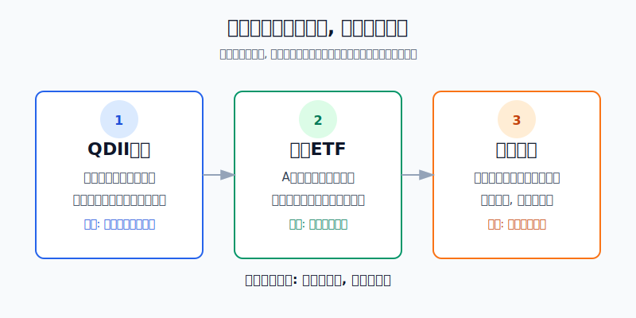
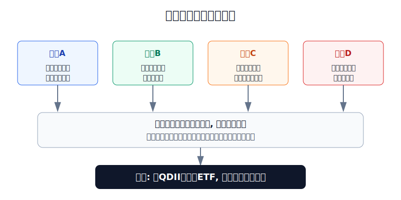
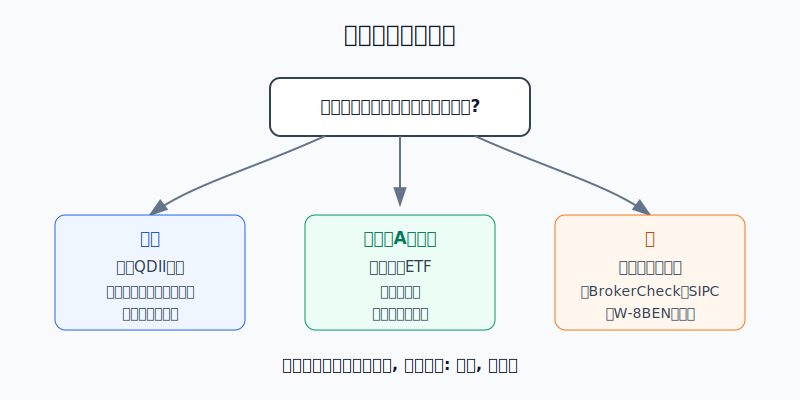

## 散户投资小白金融全品种操盘手册 - 9.4 三种参与路径 - QDII基金、跨境ETF、境外券商账户
  
### 作者  
digoal  
  
### 日期  
2026-06-07   
  
### 标签  
金融产品 , 金融工具 , 散户 , 投资小白 , 全品操盘手册  
  
----  
  
## 背景 
   

> 适用读者: 已经知道美股是全球配置的一部分, 但还不知道该通过哪条路参与的小白投资者。  
> 本文定位: 投资教育框架, 不构成个性化投资建议。

## 先问一个反直觉的问题

买美股最重要的问题, 不是“哪条路径收益最高”。同一个标普500, 你通过QDII基金、跨境ETF、境外券商账户买, 底层方向可能相似, 但你承担的规则、溢价、汇率、税务和账户责任完全不同。**路径选错, 指数看对也可能亏在规则上。**

## 核心概念: 三条路不是三种收益, 而是三种责任分工

把参与美股想成去海外买东西。

**QDII基金**像“正规代购”。你把人民币交给境内基金, 基金公司用合规额度去投资海外市场。你不用自己开境外账户, 但要接受基金净值、申赎节奏、额度约束和费用。

**跨境ETF**像“商场里的海外专柜”。你用A股证券账户买卖, 交易体验像场内ETF, 但底层资产在海外。它方便, 也更容易出现一个小白常忽视的问题: 二级市场交易价格会偏离基金份额参考净值, 也就是“花1.05元买1元货”的溢价风险。

**境外券商账户**像“自己出国开店买货”。工具最多, 费用可能更低, 可以直接买美股ETF、个股、债券ETF和货币市场基金; 但账户安全、入金合规、税务表格、汇率、交易时间、密码保护、券商资质核查, 都要自己负责。

所以本节先给出结论: **小白选择路径, 先看责任边界, 再看产品; 先选能解释清楚的低复杂度入口, 再考虑自由度更高的境外账户。**

## 逻辑推导链

【论证链标题】: 三种路径都能接触美股, 但小白应按“合规边界、操作复杂度、价格偏离、账户保护”排序, 而不是按“看起来能买得更多”排序。

── 第一步: 前提陈述

前提A: 三条路径的底层目标都可以是美国资产, 但责任分工不同。QDII基金把海外交易和外汇额度交给基金公司处理; 跨境ETF把交易放在境内证券账户里; 境外券商账户把更多决定权交给你自己。这是常量。就像同样去远方, 可以坐旅行团、坐高铁转机, 也可以自己开车, 自由度越高, 你要承担的责任越多。

前提B: 境内个人资金跨境使用有合规边界。国家外汇管理局北京分局《经常项目常见问题解答》写明, 境内个人购汇年度总额为每人每年等值5万美元; 同时境内个人购汇不得用于境外买房、证券投资、购买人寿保险和投资性返还分红类保险等尚未开放的资本项目。这是规则前提, 对小白来说不能绕开。

前提C: QDII和部分跨境ETF背后有额度约束。外汇局截至2026年4月末的QDII投资额度审批表显示, QDII累计批准额度总计1761.69亿美元, 其中证券基金类972.80亿美元、银行类292.30亿美元、保险类406.43亿美元、信托类90.16亿美元。额度存在, 说明这是正规通道; 额度有限, 也说明热门产品可能因为额度、申赎和市场供求出现限制。

前提D: 跨境ETF虽然方便, 但场内价格不等于净值。上交所《ETF行业发展报告(2025)》显示, 截至2024年底, 境内跨境ETF共有137只, 总规模4240.2亿元; 截至2024年中报, 119只有披露数据的跨境ETF中, 个人投资者持仓占比为63.5%。这说明跨境ETF已经是散户常用入口, 但散户越多, 越要警惕追涨时的溢价。

前提E: 境外券商账户有投资者保护, 但保护范围不是“亏钱赔你”。Investor.gov对SIPC的说明是: 如果SIPC成员券商倒闭且不能履行对客户的义务, 客户证券和现金可能受到最高50万美元保护, 其中现金限额25万美元; 但SIPC不保护证券市场价格下跌造成的损失。这是常量。

── 第二步: 逻辑推导

由A+B可得: 因为三条路径不是简单的“买入按钮不同”, 而是把合规、交易和账户责任放在不同位置, 所以小白不能只问“哪条路可以买到更多美股”, 必须先问“哪条路的责任我能承担”。

再由B+C可得: 因为境内个人直接把购汇资金用于境外证券投资有合规边界, 而QDII是被额度管理的正规通道, 所以没有能力处理境外账户和资金合规的人, 应先从QDII基金或境内可交易的跨境ETF学习。

再由C+D可得: 因为跨境ETF供给受额度和市场供求影响, 场内价格可能偏离净值, 所以跨境ETF的买入条件不是“指数想涨”, 而是“产品本身没有明显溢价、成交量足够、申赎和停复牌状态正常”。

最后由A+B+C+D+E可得: 因为境外券商账户自由度最高, 但合规、税务、账户保护和交易错误都需要自己处理, 所以它不该是小白默认第一站。只有当你能核查券商资质、理解SIPC边界、知道W-8BEN和分红预扣税、能解释资金来源和用途时, 境外券商账户才进入选择范围。

── 第三步: 正常情景下的操作结论

✅ 正常情景: 你只是想学习和配置一点美股相关资产, 没有成熟的境外账户经验, 资金是三年以上不用的闲钱, 能接受汇率和净值波动。

对应操作: 第一优先研究QDII基金和跨境ETF; 如果已经有A股证券账户, 可以优先比较跨境ETF的成交量、溢价率、跟踪指数和费用; 如果还不熟悉场内交易, 可以从QDII联接基金或普通QDII基金开始。境外券商账户只作为进阶路径, 不作为小白默认入口。

── 第四步: 数据和案例证实

证据1: QDII不是“灰色通道”, 而是有额度审批的正规跨境投资机制。外汇局数据截至2026年4月末显示, QDII累计批准额度总计1761.69亿美元。这个数字验证了前提C: 境内资金参与海外证券投资有制度化入口, 但入口受额度管理。

证据2: 跨境ETF已经成为散户参与海外资产的重要工具。上交所《ETF行业发展报告(2025)》披露, 2013年首批投资于美国市场的ETF在上交所上市, 内地投资者得以通过产品间接投资纳斯达克和标普500; 到2024年底, 境内跨境ETF数量达到137只, 总规模4240.2亿元。这个数据验证了前提D: 跨境ETF不是小众玩具, 但规模越大, 越需要看价格是否偏离净值。

证据3: 境外券商账户的保护有边界。Investor.gov说明SIPC保护上限为50万美元, 其中现金25万美元, 但不保护市场价格下跌。这个数据验证了前提E: “券商有保护”不能推导成“账户不会亏损”。

证据4: 税务不是细枝末节。IRS《Publication 515 (2026)》说明, 外国人取得美国来源收入通常适用30%预扣税, 税收协定可能降低税率; Form W-8BEN用于证明非美国人身份和适用预扣规则。这个证据说明, 直接用境外券商买美国资产时, 分红到手金额和税务资料会影响真实收益。

失败案例: 2026年4月16日, 博时基金发布标普500ETF博时(513500)溢价风险提示公告, 提醒该基金二级市场交易价格出现较大幅度溢价, 偏离基金份额参考净值, 盲目投资可能遭受重大损失。这个案例说明: 即使你看对了标普500, 如果在跨境ETF高溢价时追买, 买入的第一秒就可能先输给价格偏离。

历史数据不代表未来, 但这里的参考价值很明确: 三条路径的收益最终都来自底层资产、汇率和产品结构, 不是来自“路径名字”。路径只是入口, 入口有成本和规则。

── 第五步: 前提变化时的替代结论

若前提B改变, 也就是你准备绕开合规边界, 借用他人额度、地下换汇或把个人购汇直接用于境外证券投资, 推导路径变为: 因为资金路径无法解释, 所以投资问题先变成合规问题。新结论: 停止操作, 只使用规定渠道, 不用“朋友说可以”的路径。

若前提D改变, 也就是跨境ETF出现明显溢价、暂停申购、成交萎缩或频繁风险提示, 推导路径变为: 因为场内价格已经不能代表底层资产净值, 所以买入不再是买美股, 而是在额外买一层溢价。新结论: 暂停买入, 等溢价回落或改用其他低偏离产品。

若前提E改变, 也就是你没有查券商是否在FINRA BrokerCheck可查、没有确认SIPC成员身份、没有设置双重验证、没有提交W-8BEN, 推导路径变为: 因为账户风险和税务信息不清楚, 所以自由度越高, 错误成本越高。新结论: 不开仓, 先补账户安全和税务资料。

## 实操例子: 10万元账户怎样选第一条美股路径

这个例子对应论证链的正常结论: **小白先用低复杂度入口学习美股, 境外券商账户放在最后。**

假设小林有10万元可投资资金, 生活备用金已经另外留好。他现在只有A股证券账户和基金账户, 没有境外券商经验。他想拿一小部分钱学习美股, 但还没搞清楚税务、汇率和交易时间。

第一步, 定学习仓上限。小林把第一阶段美股学习仓控制在总资金的5%以内, 也就是不超过5000元。这个动作对应前提A: 他先学习路径责任, 不把第一次尝试变成重仓押注。

第二步, 先排除不合规资金路径。凡是需要借用别人额度、地下换汇、说不清用途的方案, 直接删除。这个动作对应前提B。原因很简单: 如果资金路径不清楚, 后面讨论指数、估值、费率都没有意义。

第三步, 在QDII基金和跨境ETF之间选。若小林不想盯盘, 也不熟悉场内折溢价, 他选QDII基金或联接基金, 看清楚跟踪指数、管理费、托管费、申赎费和到账时间。若他想用A股账户场内交易, 他选跨境ETF, 下单前看四个数: 成交额、买卖价差、溢价率、基金公告。

第四步, 给跨境ETF设“溢价刹车”。演示规则是: 溢价在1%以内, 才进入观察买入区; 溢价在1%-3%, 只观察不追; 溢价超过3%或基金公司发布溢价风险提示, 不买。这个阈值不是收益承诺, 而是小白防止“买贵入口”的纪律线, 对应前提D。

第五步, 暂不使用境外券商账户。小林只有在能完成四件事后再考虑: 在FINRA BrokerCheck核查券商或清算相关信息, 确认SIPC成员身份和保护边界, 理解W-8BEN和美国来源分红预扣税, 能解释资金入出境的合规路径。任意一项说不清, 就不开户交易。这个动作对应前提E。

第六步, 写纠偏规则。如果小林买入QDII后发现产品暂停申购, 他不追买同类高溢价跨境ETF; 如果跨境ETF上涨但溢价同步升高, 他不因为“怕踏空”追; 如果后来开了境外账户, 第一笔也只买宽基ETF, 不碰期权、杠杆ETF和不熟悉的小盘股。

如果操作错误, 最常见后果是把“路径选择”误当成“行情判断”。例如小林看好纳斯达克100, 但在跨境ETF高溢价时追入, 即使指数之后没跌, 溢价回落也会吞掉一部分收益。纠偏方法不是继续加仓摊薄, 而是回到论证链: 底层资产、资金合规、额度约束、溢价、账户保护, 哪一项没满足, 就先修哪一项。

## 可复用框架

【路径三问法】

适用前提: 你想参与美股, 但不知道该选QDII基金、跨境ETF还是境外券商账户。

核心逻辑: 因为三条路径的底层资产可能相似, 但责任分工不同, 所以先问责任, 再问产品。

操作步骤:

1. 问合规: 这条路的资金来源、资金用途和交易主体能否解释清楚?
2. 问复杂度: 账户、交易、税务、汇率、公告, 哪些由机构处理, 哪些由我自己处理?
3. 问价格: 我买到的是净值附近的资产, 还是额外付了明显溢价?

前提失效时: 合规说不清, 不做; 复杂度说不清, 降级到QDII或跨境ETF; 价格明显偏离净值, 等待。

举一反三: 这个框架也适用于港股、商品基金、海外债券ETF。越是跨境资产, 越要先看入口规则。

【溢价刹车法】

适用前提: 你已经决定用A股账户买跨境ETF。

核心逻辑: 因为跨境ETF场内价格会受供求影响偏离净值, 所以买入前必须先检查溢价, 不能只看海外指数涨跌。

操作步骤:

1. 看公告: 最近是否有溢价风险提示、暂停申购、停牌提示。
2. 看价格: 用行情软件查看溢价率或IOPV偏离, 明显高溢价时不追。
3. 看流动性: 成交额太低、买卖价差太大, 说明进出成本高。
4. 看替代品: 同类指数如果有多只产品, 优先选规模、成交和溢价更合理的。

前提失效时: 如果产品已经高溢价, 不用“少买一点试试”安慰自己; 如果同类产品都高溢价, 说明当前入口拥挤, 先等。

举一反三: 这个框架也适用于商品ETF、港股ETF和其他场内基金。只要有场内交易, 就要防止价格偏离。

## 本节行动清单

| 动作 | 合格标准 |
|---|---|
| 先选责任边界 | 能说清QDII、跨境ETF、境外券商分别把哪些责任交给谁 |
| 先排除违规路径 | 不借额度、不地下换汇、不使用说不清资金用途的方案 |
| QDII看额度和申赎 | 买前查看基金公告、申购状态、费用和到账时间 |
| 跨境ETF看溢价 | 明显溢价、风险提示、成交稀疏时不追买 |
| 境外券商先核查 | 用BrokerCheck、SIPC信息、W-8BEN、双重验证做开户前检查 |
| 控制学习仓 | 第一阶段只用小比例资金, 不把路径学习变成重仓押注 |

## 一句话总结

三种参与美股的路径, 本质上是三种责任分工: QDII基金最省心, 跨境ETF最方便, 境外券商最自由; 小白的正确顺序是先把规则和入口成本搞清楚, 再决定买什么。

## 参考资料

- 国家外汇管理局: 《合格境内机构投资者(QDII)投资额度审批情况表》, 截至2026年4月末, https://www.safe.gov.cn/safe/file/file/20260430/b4e13fd3928e4d89a1a4531fddcc887a.pdf
- 国家外汇管理局北京分局: 《经常项目常见问题解答》, https://www.safe.gov.cn/beijing/file/file/20191127/b29df7fa63504266b9ccb23429185d40.pdf
- 上海证券交易所: 《上海证券交易所ETF行业发展报告(2025)》, https://etf.sse.com.cn/fundtrends/c/10770698/files/69a55dcfb84b4e8e87dc6cf396c628f7.pdf
- 博时基金: 《博时标普500交易型开放式指数证券投资基金溢价风险提示公告》, 2026-04-16, https://big5.sse.com.cn/site/cht/www.sse.com.cn/disclosure/fund/announcement/c/new/2026-04-16/513500_20260416_9DQE.pdf
- Investor.gov: 《Securities Investor Protection Corporation (SIPC)》, https://www.investor.gov/introduction-investing/investing-basics/glossary/securities-investor-protection-corporation-sipc
- FINRA: 《About BrokerCheck》, https://www.finra.org/investors/investing/working-with-investment-professional/about-brokercheck
- IRS: 《Publication 515 (2026), Withholding of Tax on Nonresident Aliens and Foreign Entities》, https://www.irs.gov/publications/p515

> ⚠️ **声明**：本文内容为投资教育目的，所有历史数据、策略框架均为辅助学习工具，不构成证券投资建议。市场有风险，投资需谨慎。实际操作请结合自身风险承受能力，必要时咨询专业投顾。
  
#### [PostgreSQL 解决方案集合](../201706/20170601_02.md "40cff096e9ed7122c512b35d8561d9c8")
  
  
#### [德哥 / digoal's Github - 公益是一辈子的事.](https://github.com/digoal/blog/blob/master/README.md "22709685feb7cab07d30f30387f0a9ae")
  
  
#### [About 德哥](https://github.com/digoal/blog/blob/master/me/readme.md "a37735981e7704886ffd590565582dd0")
  
  

  
