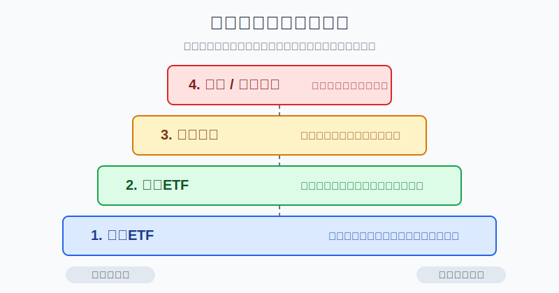
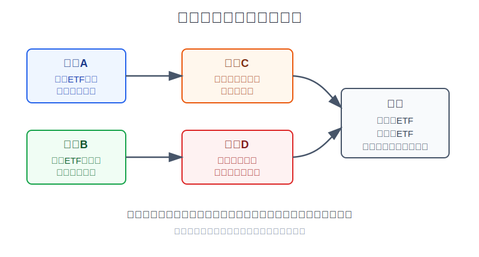
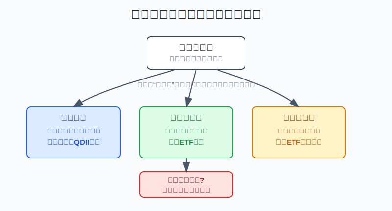

## 散户投资小白金融全品种操盘手册 - 9.5 小白优先级 - 先指数ETF，再行业ETF，再龙头个股，最后才是期权和杠杆产品
  
### 作者  
digoal  
  
### 日期  
2026-06-07   
  
### 标签  
金融产品 , 金融工具 , 散户 , 投资小白 , 全品操盘手册  
  
----  
  
## 背景 
   

> 适用读者: 已经知道美股有个股、ETF、期权、杠杆产品，但不知道先学哪个、先买哪个、哪些暂时不能碰的小白投资者。
> 本文定位: 投资教育框架，不构成个性化投资建议。

## 先问一个反直觉的问题

美股最危险的地方，不是工具太少，而是工具太多。你一打开账户，标普500ETF、半导体ETF、英伟达、特斯拉、0DTE期权、三倍杠杆ETF都在同一个屏幕上。对小白来说，真正的本事不是“找到最猛的那个”，而是先知道：**哪些工具应该排在前面，哪些工具必须排在最后。**

## 核心概念: 这不是收益排序，而是生存排序

很多人会把工具优先级理解错：指数ETF是不是收益最低？行业ETF是不是比指数ETF更赚钱？个股是不是更刺激？期权是不是小资金逆袭的机会？

这个想法从一开始就错了。

**小白优先级不是按想象收益排序，而是按“犯错后还能不能活下来”排序。** 指数ETF是一篮子股票，错在时间点上，通常还有时间和分散度帮你缓冲；行业ETF是一篮子同类公司，错在行业上，回撤会更集中；龙头个股只买一家公司，错在财报、估值、竞争或监管上，波动会直接打到账户；期权和杠杆产品还会把时间、波动和方向判断一起压到你身上，错一次可能不是少赚，而是本金快速缩水。

所以本节先给出行动结论：**小白学习和实操美股，顺序必须是先指数ETF，再行业ETF，再龙头个股，最后才是期权和杠杆产品。这个顺序不能反过来。**

## 逻辑推导链

【论证链标题】: 因为美股工具的分散度逐级下降、复杂度和犯错成本逐级上升，所以小白必须从指数ETF开始，而不是从热门个股、期权或杠杆产品开始。

── 第一步: 前提陈述

前提A: 宽基指数ETF买的是一篮子股票，分散度高，规则透明。这是常量。用生活里的话说，它像一次买下整条主街，而不是押注主街上一家店。S&P Dow Jones Indices介绍S&P 500时，称它覆盖约80%的美国可投资股票市值，并被广泛视为衡量美国大盘股的最佳单一指标。对小白来说，宽基指数ETF的核心价值不是保证赚钱，而是先把“选错单家公司”的风险降下来。

前提B: 行业ETF也是一篮子股票，但它只买一个行业，分散度低于宽基ETF。这是常量。它像只买主街上的餐饮店、药店或科技店。你不用选单家公司，但你仍然要判断这个行业是不是估值太贵、周期是不是在变、资金是不是过热。

前提C: 龙头个股只对应一家公司，收益和风险都集中在这家公司身上。这是变量。公司基本面、竞争格局、估值、财报预期、管理层和监管环境都会变化。你买的不是“美国经济”，而是一家公司未来现金流和市场预期的组合。

前提D: 期权和杠杆产品会把方向、时间、波动和仓位错误放大。这是常量。SEC提醒过投资者，杠杆和反向ETF通常追求单日目标，长期持有时结果可能因为复利效应偏离你以为的倍数；期权则有到期日，方向看对但时间不够，也可能亏钱。

── 第二步: 逻辑推导

由A可得: 因为宽基ETF覆盖一篮子大公司，单家公司出问题不会决定整个账户的生死，所以它适合作为美股小白的第一层学习工具。你先学市场规则、费用、交易时间、汇率和估值，不需要同时解决“我能不能看懂某家公司”的难题。

由A+B可得: 因为行业ETF比分散宽基更集中，所以它应该排在第二层。只有当你能说清行业上涨靠什么、估值贵不贵、景气度是否还能延续时，行业ETF才适合做卫星仓，而不是替代核心仓。

再由A+B+C可得: 因为个股风险集中到一家公司，所以龙头个股必须排在行业ETF之后。买龙头不是因为名字熟，而是因为你能读懂它的业务、财报、估值和失效条件。否则，你只是把“听说很好”当成买入理由。

最后由A+B+C+D可得: 因为期权和杠杆产品会放大时间和波动错误，所以它们应该排在最后。对小白来说，能看懂不等于能实盘，能小仓位学习也不等于能重仓交易。

── 第三步: 正常情景下的操作结论

✅ 正常情景: 你已有生活备用金，这笔钱三年以上不用，能接受美股和汇率波动，还没有稳定读财报、做估值和管理杠杆的能力。

对应操作: 第一层只研究并小仓位参与宽基指数ETF；第二层在看懂行业周期后，用小比例行业ETF做卫星仓；第三层在能读10-K、10-Q、财报电话会和估值指标后，再研究龙头个股；第四层的期权和杠杆产品先放进学习区，默认不作为小白实盘工具。

── 第四步: 数据和案例证实

证据1: 主动选股和长期跑赢指数并不容易。S&P Dow Jones Indices的SPIVA美国记分卡长期比较主动基金与基准指数的表现。其2025年美国报告入口显示，主动管理基金在长期维度跑输基准是持续被跟踪的核心事实。这个证据对小白的含义很直接：连专业基金经理都不容易长期跑赢指数，散户不应该默认自己一上来就靠选个股打败市场。

证据2: 宽基指数本身就是美国股票市场的主干。S&P Dow Jones Indices在S&P 500页面披露，S&P 500覆盖约80%的美国可投资股票市值。这个数字说明，先学宽基指数ETF，不是“保守到没想法”，而是先抓住市场主干。

证据3: 复杂工具的交易规模很大，但规模大不等于适合小白。OCC在2026年1月发布的2025年业绩摘要中披露，2025年其清算总合约量超过152亿张。期权市场很活跃，恰恰说明小白更要先明白：流动性充足和交易热闹，不等于规则简单。

证据4: 杠杆和反向ETF不是长期配置工具。SEC的投资者教育材料提醒，许多杠杆/反向ETF追求的是单日投资目标，持有超过一天时，复利和波动可能导致结果偏离投资者直觉。这个证据对应前提D：如果你还没搞清“单日目标”和“长期持有结果”的区别，就不能把杠杆ETF当成普通ETF。

失败案例: 2022年是很好的反例。当年美联储快速加息，成长股、长久期资产和高估值科技板块承压，美股宽基指数也出现明显回撤。如果小白只是持有少量宽基ETF，错误主要是买点和仓位问题；如果重仓单一高估值科技股，回撤会更集中；如果再叠加杠杆ETF或短期期权，时间和波动会把错误放大。历史不代表未来，但它说明一个稳定规律：**工具越复杂，前提变化时的伤害越快。**

── 第五步: 前提变化时的替代结论

若前提A改变，也就是你买的并不是宽基ETF，而是高溢价跨境ETF、成交稀疏的小ETF，推导路径就变成: 因为工具表面叫ETF，但流动性、折溢价和跟踪误差会影响结果，所以“先ETF”不能简化成“随便买一个ETF”。新结论: 暂停下单，先检查规模、成交量、买卖价差、费用和溢价。

若前提B改变，也就是你并不能解释行业周期，只是看到半导体、AI、医疗、能源讨论很热，推导路径就变成: 因为你没有行业判断，只是在追热点，所以行业ETF不再是卫星仓，而是情绪仓。新结论: 降低仓位或回到宽基ETF。

若前提C改变，也就是你能完整读懂公司财报、业务、估值和失效条件，推导路径才可以变成: 因为你具备个股研究能力，所以可以在组合里给龙头个股小比例仓位。新结论: 个股仓位必须有单票上限，买入理由和卖出条件提前写清。

若前提D改变，也就是你把期权或杠杆产品当作短线刺激工具，推导路径就变成: 因为你没有用它们对冲风险或执行成熟策略，而是在用复杂工具放大情绪，所以实盘前提不成立。新结论: 停止实盘，先模拟和学习，不把它放进真实账户。

## 实操例子: 10万元账户怎样按优先级学美股

这个例子对应论证链的正常结论: **小白先用宽基指数ETF建立规则感，再用行业ETF做小比例卫星，个股和复杂工具必须延后。**

假设小林有10万元可投资资金，生活备用金已经留足。他想参与美股，但还没系统读过10-K，也没做过期权交易。他能接受三年以上不用这笔钱，但不希望一次错误伤到整个账户。

第一步，先定总边界。小林把美股相关学习仓上限定为总资金的10%，也就是1万元。这个比例不是统一建议，而是为了演示“先把错误成本封住”。这一步对应前提D：复杂和陌生市场不能先给大仓位。

第二步，第一层只放指数ETF。他把第一笔资金控制在5000元等值以内，只研究标普500、全市场或纳斯达克100这类宽基ETF。买之前必须写清四件事：跟踪什么指数、费用率是多少、前十大持仓是什么、自己能承受多大回撤。这一步对应前提A。

第三步，行业ETF暂时只做观察名单。比如他看好半导体或医疗，但还不能说清行业景气、估值、库存周期、监管风险和龙头公司盈利变化，那就先不买。等他能写出“为什么这个行业现在值得配、错了在哪里卖”，再允许用2000元以内做卫星仓。这一步对应前提B。

第四步，龙头个股必须通过三张表。第一张是业务表：公司靠什么赚钱；第二张是财务表：收入、利润、自由现金流和负债怎样；第三张是估值表：现在价格透支了多少预期。三张表写不出来，哪怕公司名字再熟，也不买。这一步对应前提C。

第五步，期权和杠杆产品只进学习笔记，不进真实仓位。小林可以记录一个模拟策略，比如“如果我买入看跌期权给持仓做保险，成本是多少，到期日是什么，最大亏损是多少”。但只要他说不清最大亏损和到期归零，就不能实盘。这一步对应前提D。

第六步，设纠偏规则。如果宽基ETF买入后下跌10%，但仓位仍在计划内、买入理由没有变，可以按原计划复盘；如果行业ETF上涨让他想临时加仓到总账户20%，停止加仓；如果个股财报后大跌而他看不懂原因，先减回观察仓；如果期权模拟连续三次看错方向或时间，继续模拟，不用真金白银交学费。

如果操作错误，最典型的后果是顺序倒置。比如小林原计划用5000元买宽基ETF，结果看到短视频讲某只期权一天翻倍，就用2万元买短期期权。即使方向判断接近正确，也可能因为时间价值损耗、波动变化或到期日太近而亏损。纠偏方法不是再买一次“摊低成本”，而是回到工具优先级：先宽基，后行业，再个股，最后复杂工具。

## 可复用框架

【四层阶梯】

适用前提: 你想参与美股，但不知道该从ETF、个股、期权还是杠杆产品开始。

核心逻辑: 因为工具越往上越集中、越复杂、犯错成本越高，所以学习和实操顺序必须从低复杂度开始。

操作步骤:

1. 第一层: 宽基指数ETF。先用它学习市场、汇率、费用、估值和仓位。
2. 第二层: 行业ETF。能解释行业周期和估值后，才用小比例做卫星仓。
3. 第三层: 龙头个股。能读财报、估值和风险因素后，才允许小仓位研究。
4. 第四层: 期权和杠杆产品。先模拟和学习，默认不作为小白真实账户工具。

前提失效时: 如果ETF有高溢价、低成交、跟踪误差大，就不能因为它叫ETF而买；如果个股研究只靠中文社区和股价走势，就退回ETF；如果复杂工具说不清最大亏损，就不实盘。

举一反三: 这个框架也适用于港股、商品和A股行业主题。不是名字越熟越先买，而是越分散、越透明、越可控，越适合小白排在前面。

【三不升级】

适用前提: 你已经买过一点宽基ETF，想升级到行业ETF、个股或期权。

核心逻辑: 因为升级工具会提高复杂度，所以每次升级前都要先确认自己不是在追涨、不是在加杠杆、不是在逃避复盘。

操作步骤:

1. 不懂行业，不从宽基ETF升级到行业ETF。
2. 不会读财报，不从行业ETF升级到个股。
3. 说不清最大亏损，不从个股升级到期权或杠杆产品。

前提失效时: 一旦发现买入理由变成“它涨得多”“大家都在买”“我想快点回本”，立刻停止升级，把仓位降回上一层工具。

举一反三: 这个框架也能用在转债、黄金T+D、期货和期权。升级前先问能力是否升级，而不是只问收益想象有没有升级。

## 本节行动清单

| 动作 | 合格标准 |
|---|---|
| 写出工具顺序 | 指数ETF → 行业ETF → 龙头个股 → 期权/杠杆产品 |
| 检查宽基ETF | 看清指数、费用、规模、成交量、持仓和汇率影响 |
| 行业ETF只做卫星 | 能解释行业周期和估值后，才给小比例仓位 |
| 个股先过三张表 | 业务表、财务表、估值表写不出，就不买 |
| 复杂工具先模拟 | 不知道最大亏损、到期日、保证金或日内复利，就不实盘 |
| 顺序倒置立刻纠偏 | 一旦从期权、杠杆、热门个股开始，先停手回到宽基ETF |

## 一句话总结

小白参与美股，真正的顺序不是“哪个涨得快就买哪个”，而是先指数ETF，再行业ETF，再龙头个股，最后才是期权和杠杆产品；这个顺序保护的不是面子，而是账户的生存能力。

## 参考资料

- S&P Dow Jones Indices: S&P 500指数介绍，2026年访问，https://www.spglobal.com/spdji/en/indices/equity/sp-500/
- S&P Dow Jones Indices: SPIVA U.S. Scorecard，2026年访问，https://www.spglobal.com/spdji/en/spiva/article/spiva-us/
- The Options Clearing Corporation: OCC 2025 Performance Highlights，2026年1月，https://www.theocc.com/getcontentasset/1ba80ee4-4a91-4e9e-bf16-568760f0a94e/dfc3d011-8f63-43f6-9ed8-4b444333a1d0/occ-toolkit-perfhighlights-jan2026-f.pdf
- U.S. SEC Investor.gov: Updated Investor Bulletin: Leveraged and Inverse ETFs，2023年8月29日，https://www.investor.gov/introduction-investing/general-resources/news-alerts/alerts-bulletins/investor-alerts/sec

> ⚠️ **声明**：本文内容为投资教育目的，所有历史数据、策略框架均为辅助学习工具，不构成证券投资建议。市场有风险，投资需谨慎。实际操作请结合自身风险承受能力，必要时咨询专业投顾。
  
#### [PostgreSQL 解决方案集合](../201706/20170601_02.md "40cff096e9ed7122c512b35d8561d9c8")
  
  
#### [德哥 / digoal's Github - 公益是一辈子的事.](https://github.com/digoal/blog/blob/master/README.md "22709685feb7cab07d30f30387f0a9ae")
  
  
#### [About 德哥](https://github.com/digoal/blog/blob/master/me/readme.md "a37735981e7704886ffd590565582dd0")
  
  

  
