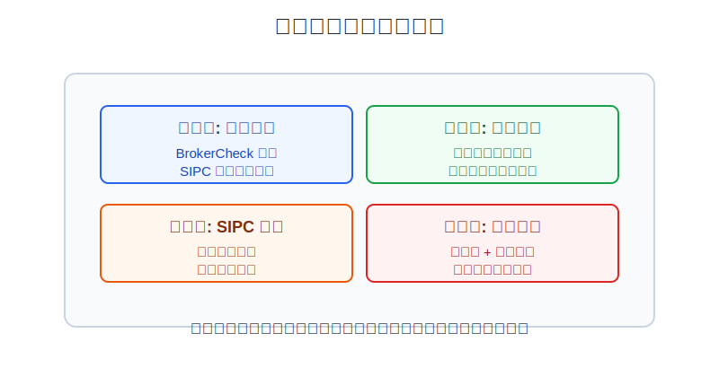
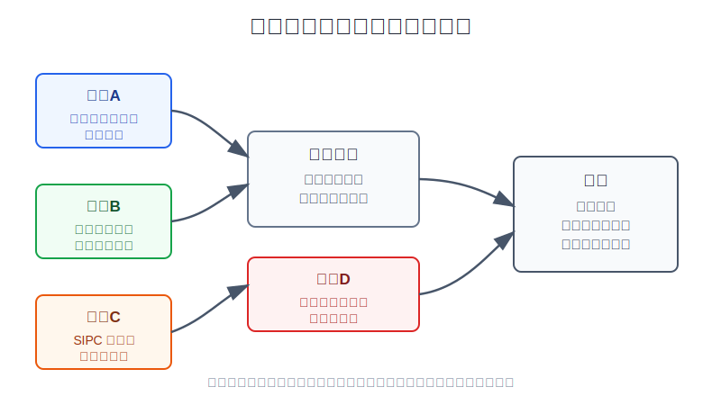
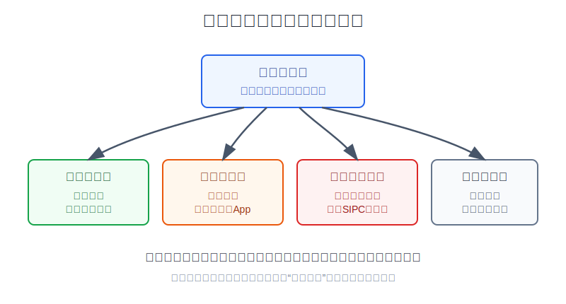

## 散户投资小白金融全品种操盘手册 - 9.6 美股账户安全 - 券商资质、SIPC保护、账户托管、双重验证
  
### 作者  
digoal  
  
### 日期  
2026-06-07   
  
### 标签  
金融产品 , 金融工具 , 散户 , 投资小白 , 全品操盘手册  
  
----  
  
## 背景 
   

> 适用读者: 已经知道境外券商账户是一条参与美股的路径，但不知道开户前该查什么、账户里哪些风险有人兜底、哪些风险必须自己承担的小白投资者。  
> 本文定位: 投资教育框架，不构成个性化投资建议。

## 先问一个反直觉的问题

买美股之前，最先要看的不是苹果、英伟达、标普500，也不是手续费。真正的第一步是问：**这个账户出事时，我的钱和证券到底在哪里，谁负责，保护到哪一步？** 如果这个问题答不上来，后面所有收益测算都是空中楼阁。

## 核心概念: 账户安全不是防亏钱，而是防“入口风险”

很多小白听到“账户安全”，第一反应是：券商这么大，应该没事；有SIPC保护，应该更没事；我只买ETF，又不是做期权，应该不会复杂。

这三个想法都要拆开。

**券商资质**解决的是“你进的是不是真门”。美国市场有正规券商、介绍经纪、清算机构，也有冒充券商的假App、假网站和钓鱼链接。你要先确认对方是不是能在FINRA BrokerCheck里查到。

**账户托管**解决的是“资产是不是被分开保管”。正规券商不是把你的股票和自己的钱混在一起随便用，而要遵守客户资产保护规则，把客户证券和现金按规定隔离。

**SIPC保护**解决的是“成员券商倒闭且客户资产短缺时怎么办”。它不是保险箱，更不是投资亏损赔付。股票跌了、ETF跌了、你买错了、汇率亏了，SIPC不赔。

**双重验证**解决的是“别人能不能假装成你登录”。正规券商也挡不住你自己把密码交给钓鱼网站，或者邮箱、短信、设备被接管。账户安全最后一公里，必须由你自己守。

所以本节的行动结论很简单：**开户前按四层门检查：券商资质、账户托管、SIPC边界、登录防线。四层都说得清，才允许小额开户；任一层说不清，先暂停，不用“先买一点试试”安慰自己。**

## 逻辑推导链

【论证链标题】: 因为境外券商账户把更多责任交给投资者自己，所以小白必须先验证账户入口和保护边界，再谈买什么资产。

── 第一步: 前提陈述

前提A: 美股账户的第一风险不是市场波动，而是入口真假。这是常量。用生活里的话说，你先要确认自己进的是正规银行网点，而不是一个装修得很像银行的房间。FINRA的BrokerCheck就是给投资者查经纪人和券商背景的免费工具；如果一个平台、人员或公司无法被合理核验，小白不应继续开户。

前提B: 正规券商的客户资产有隔离规则，但你仍要看清账户和清算主体。这是常量。美国SEC的客户保护规则要求券商保护客户证券和现金，核心是让客户资产与券商自有资产分开，降低券商经营失败时客户资产被挪用或混同的风险。对小白来说，这不需要背法规条款，但要知道“我买的股票托管在哪里、清算机构是谁、月结单从哪里来”。

前提C: SIPC保护有明确边界。这是常量。SIPC说明，其保护对象是成员券商倒闭、客户证券和现金缺失时的客户财产；保护上限通常为每名客户50万美元，其中现金最高25万美元。SIPC同时强调，它不保护证券价格下跌、糟糕投资建议或无价值证券造成的损失。

前提D: 账户登录风险会把正规账户变成危险入口。这是变量。SEC在2026年4月投资者公告中建议投资者保护线上投资账户，包括使用强密码、启用多因素认证、谨慎对待钓鱼信息、定期检查账户活动。也就是说，券商是真的，不等于登录行为就安全。

── 第二步: 逻辑推导

由A可得: 因为入口真假决定你是不是在和真实券商交易，所以开户前第一步不是比较佣金，而是在FINRA BrokerCheck、券商官网、监管披露和SIPC成员信息里核验平台身份。

由A+B可得: 因为真实券商还涉及托管、清算和月结单，所以你不能只看App界面是否好用，还要看资产记录是否清楚、结算主体是否清楚、账户声明是否能下载。否则，一旦发生争议，你连“钱和证券记录在哪里”都说不清。

再由A+B+C可得: 因为SIPC保护的是券商失败导致的客户资产短缺，不保护市场亏损，所以小白不能把“SIPC成员”理解成“买美股有保险”。正确理解是：它降低的是券商倒闭风险，不降低你买错资产的风险。

最后由A+B+C+D可得: 因为账户密码、邮箱、设备和钓鱼链接是投资者自己控制的最后一道门，所以即使券商资质、托管和SIPC都合格，只要没有强密码、双重验证和异常登录提醒，实盘条件仍然不完整。

── 第三步: 正常情景下的操作结论

✅ 正常情景: 你准备使用境外券商账户学习美股，资金来源和合规路径能解释清楚，第一阶段只打算小额参与宽基ETF或货币市场工具，不做期权和杠杆。

对应操作: 开户前完成四项检查。第一，券商或相关经纪主体在FINRA BrokerCheck可查，并能从券商官网跳转或交叉验证。第二，确认账户托管、清算、月结单和客户资产记录路径。第三，确认券商是否为SIPC成员，并写清“SIPC不赔投资亏损”。第四，开户后立即设置独立强密码、双重验证、提现白名单或通知提醒，第一次入金只用小额测试。

── 第四步: 数据和案例证实

证据1: SIPC保护有数字边界。SIPC官方说明显示，成员券商失败且客户证券和现金缺失时，SIPC通常为每名客户提供最高50万美元保护，其中现金最高25万美元；但它不保护市场价格下跌。这一证据验证前提C：保护存在，但保护的是券商失败场景，不是投资收益。

证据2: 券商资质核验有公开工具。FINRA说明BrokerCheck是帮助投资者查询经纪人和券商背景的免费工具，信息包括注册状态、从业经历、披露事件等。这一证据验证前提A：开户前先查入口，不是小题大做，而是美国监管体系本身给普通投资者的基础动作。

证据3: 线上账户攻击不是低概率故事。FBI《2025 Internet Crime Report》披露，2025年IC3收到1,008,597起投诉，报告损失约208.77亿美元；其中加密货币投资欺诈损失约72.28亿美元，账户接管相关投诉约4,700起、损失约3.597亿美元。这个证据对应前提D：哪怕你买的是普通ETF，登录入口被盗也会让账户暴露在转账、交易和资料泄露风险中。

证据4: SEC在2026年4月的投资者公告中专门提示保护线上投资账户，建议使用强密码、多因素认证、识别钓鱼信息并定期检查账户活动。这说明账户安全不是“懂技术的人才需要”，而是每个线上投资者都必须执行的基本动作。

失败案例: 最常见的失败不是“买的券商倒闭”，而是“进错门”。投资者看到社交媒体广告、中文社群推荐或陌生人发来的开户链接，下载了仿冒App；界面像券商，客服像真人，入金也能显示余额，但平台本身无法在监管工具中核验。等投资者想出金时，平台要求追加税费、保证金或解冻费。这个案例说明：当前提A不成立时，后面的托管、SIPC和交易策略全部失效。

历史数据不代表未来，但这里的规律有参考价值：账户安全不是预测市场涨跌，而是排除不可逆损失。市场亏损还有复盘空间；假平台开户、密码被盗、资金出不来，往往连复盘对象都没有。

── 第五步: 前提变化时的替代结论

若前提A改变，也就是券商、介绍人、开户链接或App无法在FINRA BrokerCheck、SIPC成员名单或官方渠道交叉核验，推导路径变为: 因为入口真假无法确认，所以投资问题先变成资金安全问题。新结论: 停止开户，不入金，不提交身份证件，不下载陌生安装包。

若前提B改变，也就是你说不清账户由谁清算、月结单在哪里、客户资产记录由谁提供，推导路径变为: 因为资产记录链条不清楚，所以后续争议和取证成本会上升。新结论: 暂不交易，先补齐账户文件、客户协议和月结单下载路径。

若前提C改变，也就是你把SIPC理解成“亏钱有人赔”或“现金无限安全”，推导路径变为: 因为保护边界被误读，所以仓位和现金留存会被错误放大。新结论: 降低账户现金留存，不把单一券商当现金仓库，不把市场风险误认为可赔付风险。

若前提D改变，也就是你没有双重验证、密码与邮箱重复、点击陌生链接登录、把验证码发给客服，推导路径变为: 因为登录权可能被他人拿走，所以真实账户也会变成危险入口。新结论: 先改密码、启用双重验证、检查邮箱和设备安全，再谈交易。

## 实操例子: 小额开通境外券商账户前怎么做

这个例子对应论证链的正常结论: **开户前先过四层安全门，四层不完整就不入金。**

假设小林有10万元可投资资金，已经在前一节确定境外券商账户只是进阶路径。他准备拿5000元等值资金做美股学习仓，第一阶段只研究标普500ETF和美元现金管理工具，不碰期权、杠杆ETF和不熟悉个股。

第一步，核验入口。小林不通过陌生社群链接下载App，而是从券商官网进入。他在FINRA BrokerCheck查询券商或经纪主体名称，确认注册状态和披露信息；再到券商官网核对公司名称、网址和联系信息。这一步对应前提A。查不到，或者查到的名称和App主体对不上，直接停止。

第二步，确认托管和记录。开户前，小林阅读客户协议，找到清算机构、客户资产记录、月结单和交易确认单的位置。开户后，他先不交易，登录账户下载一次空白或初始账户文件，确认以后能拿到正式记录。这一步对应前提B。说不清清算主体，不入金。

第三步，写清SIPC边界。小林在开户笔记里写一句话：SIPC通常最高保护50万美元，其中现金25万美元，但不赔股票ETF下跌，不赔我买错资产，不赔汇率损失。这一步对应前提C。写不出这句话，说明他还没把账户保护和投资风险分开。

第四步，设置登录防线。小林给券商账户设置独立强密码，不和邮箱、社交软件、其他券商重复；启用双重验证；开启登录、交易、转账提醒；把券商邮箱加入白名单；不在搜索广告和陌生短信链接里登录。这一步对应前提D。

第五步，小额测试而不是重仓入金。小林第一笔只入100美元等值资金，确认到账路径、账户显示、出入金记录和通知提醒正常。测试完成后，才把学习仓提高到计划上限，且仍不超过总资金的5%。这一步对应正常结论：账户检查通过，才进入小额交易。

第六步，设置异常纠偏。若收到所谓客服要求提供验证码，小林不回复，改从官网或App内客服入口核实。若账户出现陌生登录提醒，立即冻结登录、改密码、联系券商并检查邮箱。若券商发来客户协议、清算主体或SIPC成员状态变化通知，暂停新增资金，重新核验。

如果操作错误，最典型后果是把“能登录App”误认为“账户安全”。比如小林从微信群链接下载了一个仿冒App，充值后页面显示5000美元余额，还提示买入热门股盈利。等他提现时，平台要求先缴纳20%税费。这个时候再讨论股票涨跌已经没有意义。纠偏方法不是继续交钱解冻，而是保存证据、停止转账、联系银行或支付渠道，并向相关平台和执法渠道举报。

## 可复用框架

【四门检查】

适用前提: 你准备开通或使用境外券商账户。

核心逻辑: 因为境外券商账户把入口核验、托管理解、保护边界和登录安全交给你自己，所以四门不过，不做交易。

操作步骤:

1. 资质门: 用FINRA BrokerCheck、SIPC成员信息和券商官网交叉核验。
2. 托管门: 看清清算主体、客户协议、交易确认单和月结单。
3. 保护门: 写清SIPC保护上限和不保护市场亏损。
4. 登录门: 独立强密码、双重验证、登录提醒、拒绝陌生链接。

前提失效时: 资质查不到，停止开户；托管说不清，不入金；SIPC边界误读，降低现金留存；登录防线没设好，不交易。

举一反三: 这个框架也适用于港股券商、数字资产平台、海外基金平台。凡是跨境和线上账户，先查门，再看收益。

【两账分离】

适用前提: 你已经有境外券商账户，想把它纳入长期资产配置。

核心逻辑: 因为券商账户不是银行保险箱，SIPC也不是现金收益产品保险，所以交易账户和现金储备要分开。

操作步骤:

1. 交易账: 只放计划内要投资的美股ETF、个股或债券ETF资金。
2. 等待账: 短期不用但还没决定买什么的钱，不长期大额闲置在单一券商。
3. 生活账: 生活备用金、短期要用钱，不放进境外券商账户。

前提失效时: 如果你因为“SIPC有保护”而把大量现金长期放在单一券商，说明你把券商风险和现金管理混在一起，先降现金余额，再重新规划。

举一反三: 这个框架也适用于A股、港股和基金账户。交易入口越方便，越要防止把所有钱都塞进一个账户。

## 本节行动清单

| 动作 | 合格标准 |
|---|---|
| 查券商资质 | 能在FINRA BrokerCheck或官方监管信息中核验主体 |
| 查SIPC身份 | 能确认是否为SIPC成员，并知道保护上限和不保护市场亏损 |
| 查托管记录 | 能说清清算主体、月结单、交易确认单和客户协议在哪里 |
| 设登录防线 | 独立强密码、双重验证、登录提醒、拒绝陌生链接 |
| 小额测试 | 第一笔只做小额入金，确认到账、记录和提醒正常 |
| 写异常预案 | 陌生客服要验证码、出金要求补税费、账户异地登录时知道先停手 |

## 一句话总结

美股账户安全的核心不是“有没有大券商背书”，而是四件事能不能说清楚：券商资质、账户托管、SIPC保护边界、自己的登录防线；这四件事没过关，先别急着买任何美股。

## 参考资料

- SIPC: What SIPC Protects, https://www.sipc.org/for-investors/what-sipc-protects
- FINRA: About BrokerCheck, https://www.finra.org/investors/investing/working-with-investment-professional/about-brokercheck
- U.S. SEC: Amendments to Financial Responsibility Rules for Broker-Dealers, https://www.sec.gov/resources-small-businesses/small-business-compliance-guides/amendments-financial-responsibility-rules-broker-dealers
- Investor.gov: Updated Investor Bulletin - Protecting Your Online Investment Accounts from Fraud, 2026-04-23, https://www.investor.gov/introduction-investing/general-resources/news-alerts/alerts-bulletins/investor-bulletins/updated-2
- FBI Internet Crime Complaint Center: 2025 Internet Crime Report, https://www.ic3.gov/AnnualReport/Reports/2025_IC3Report.pdf

> ⚠️ **声明**：本文内容为投资教育目的，所有历史数据、策略框架均为辅助学习工具，不构成证券投资建议。市场有风险，投资需谨慎。实际操作请结合自身风险承受能力，必要时咨询专业投顾。
  
#### [PostgreSQL 解决方案集合](../201706/20170601_02.md "40cff096e9ed7122c512b35d8561d9c8")
  
  
#### [德哥 / digoal's Github - 公益是一辈子的事.](https://github.com/digoal/blog/blob/master/README.md "22709685feb7cab07d30f30387f0a9ae")
  
  
#### [About 德哥](https://github.com/digoal/blog/blob/master/me/readme.md "a37735981e7704886ffd590565582dd0")
  
  

  
