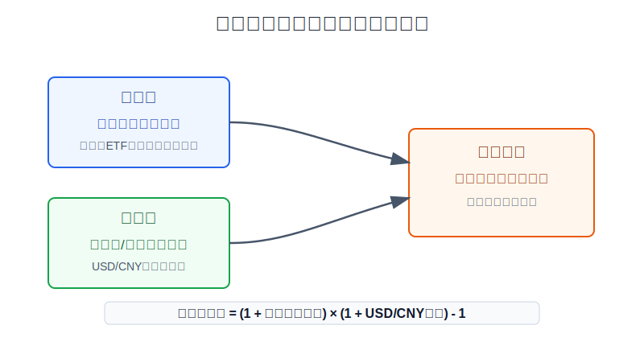
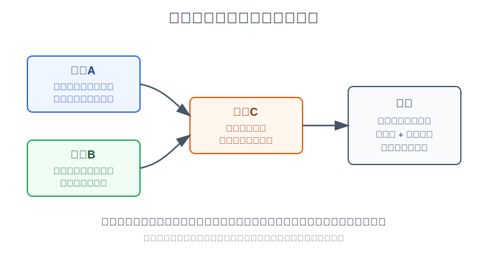
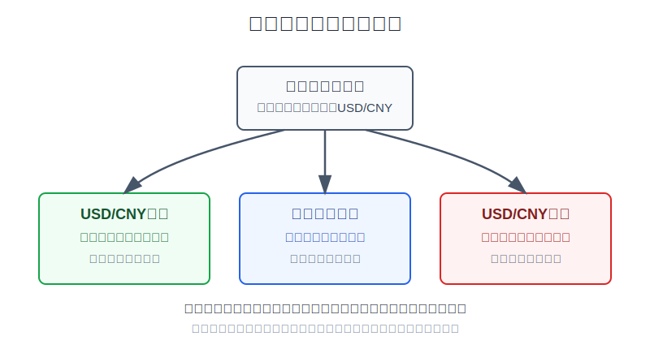

## 散户投资小白金融全品种操盘手册 - 9.7 汇率风险 - 买美股不是只买股票，还叠加人民币/美元波动
  
### 作者  
digoal  
  
### 日期  
2026-06-07   
  
### 标签  
金融产品 , 金融工具 , 散户 , 投资小白 , 全品操盘手册  
  
----  
  
## 背景 
   

> 适用读者: 已经知道美股可以通过QDII、跨境ETF或境外账户参与，但还没把汇率纳入收益和风险计算的小白投资者。  
> 本文定位: 投资教育框架，不构成个性化投资建议。

## 先问一个反直觉的问题

你买的美股涨了10%，最后换回人民币就等于赚10%吗？

答案是否定的。因为你买的不是“单层资产”，而是“美股资产 + 美元汇率”这一套组合。**美股涨跌决定美元账，人民币/美元变化决定你换回人民币时的第二本账。**

## 核心概念: 美股账户里有两本账

第一本账叫**美元账**。你买标普500ETF、纳斯达克100ETF、苹果、微软，账户里看到的涨跌通常是美元价格变化。比如100美元涨到110美元，这是美元账赚10%。

第二本账叫**人民币账**。如果你的工资、生活费、房租、孩子教育金、未来买房首付都用人民币支付，那么你最终关心的不是“美元账看起来赚多少”，而是“换回人民币后还剩多少”。这时汇率就会进入公式。

公式很简单:

**人民币收益 = (1 + 美元资产收益) × (1 + USD/CNY变化) - 1**

这里的USD/CNY就是“1美元能换多少人民币”。USD/CNY从7.00涨到7.35，代表美元相对人民币升值约5%，对人民币投资者是顺风；USD/CNY从7.00跌到6.65，代表美元相对人民币贬值约5%，对人民币投资者是逆风。

所以本节先给出行动结论: **买美股前，必须同时写下两件事: 我买的资产用美元算能承受多大波动；如果未来换回人民币，汇率反向波动5%-10%，我的计划还成不成立。**

## 逻辑推导链

【论证链标题】: 因为美股资产以美元计价，而多数小白最终消费和记账仍以人民币为主，所以美股仓位必须同时接受资产波动和汇率波动的双重检查。

── 第一步: 前提陈述

前提A: 美股资产的日常报价以美元为核心。这是常量。你买一只美股ETF，本质上先买到一份美元计价资产；它涨跌的第一层结果，是美元收益。用生活里的话说，你先在“美元超市”买货，货本身涨价还是跌价，是第一件事。

前提B: 中国散户多数收入、支出和心理记账仍以人民币为主。这是常量。你可以在账户里看美元资产，但如果未来要把钱换回来买房、养老、交学费或补充家庭现金流，最终结算就会回到人民币。也就是说，货买得好不好是一回事，最后把美元换回人民币时的汇率又是另一回事。

前提C: USD/CNY会变化，而且这个变化方向不能靠散户稳定预测。这是变量。FRED的DEXCHUS数据来自美联储H.10外汇数据，单位是“1美元对应多少人民币”，日频数据截至2026年5月29日。这个数上升，对人民币投资者持有美元资产是顺风；这个数下降，就是逆风。

前提D: 你的用钱时间越近，汇率波动越不能被长期收益摊平。这是变量。三年、五年不用的钱，可以靠仓位和再平衡慢慢消化波动；三个月后要用的人民币，就不该承担美股波动再叠加汇率波动。

── 第二步: 逻辑推导

由A+B可得: 因为你买入时接触的是美元资产，但最终用人民币衡量时还要经过换汇，所以只看美股涨跌是不完整的。美元账赚钱，不等于人民币账同幅度赚钱；美元账亏钱，也不代表人民币账完全一样亏。

再由A+B+C可得: 因为USD/CNY变化会进入最终收益公式，所以汇率不是“额外的小数点”，而是一台会放大、缓冲或吞掉美元收益的第二引擎。美元资产收益和汇率变化方向一致时，人民币收益被放大；方向相反时，人民币收益被压缩。

最后由A+B+C+D可得: 因为短期用钱无法承受两层波动，所以小白不能拿短期人民币资金重仓买美股。美股仓位应该来自长期闲钱，并且买入前就记录当时汇率、目标仓位、换回人民币时的承受线。

── 第三步: 正常情景下的操作结论

✅ 正常情景: 你已经留足生活备用金，美股资金三年以上不用，能接受美股回撤，也能接受USD/CNY反向波动5%-10%。

对应操作: 可以用小比例资金参与美股宽基ETF或相关QDII/跨境ETF，但下单前必须做“双收益账”: 先算美元资产涨跌，再算汇率变化后的人民币收益；每次复盘都把“资产判断”和“汇率影响”分开写。

── 第四步: 数据和案例证实

证据1: 监管教育材料明确把汇率列为国际投资风险。Investor.gov在“International Investing”页面说明，汇率变化会增加或减少投资回报，部分国家还可能有外汇管制。FINRA在2024年12月5日的“Currency Risk: Why It Matters to You”文章中也提醒，买外国证券时，你同时投资了资产本身和计价货币。这验证了前提A和前提B: 跨境投资不是只有资产价格一层风险。

证据2: 美联储G.5A年度外汇表显示，人民币兑美元年度平均汇率从2021年的6.4508，到2022年的6.7290，再到2023年的7.0809。这个变化说明，同样是美元资产，人民币投资者每一年面对的换算环境并不一样。这验证了前提C: 汇率不是固定背景板。

证据3: 用FRED的S&P 500与DEXCHUS日频端点做教学复盘，2022年S&P 500从2021年12月31日的4766.18降到2022年12月30日的3839.50，美元账约为-19.44%；同期USD/CNY从2021年12月30日的6.3726升到2022年12月30日的6.8972，汇率项约为+8.23%；合并后的人民币账约为-12.81%。这说明人民币贬值可以缓冲美元资产下跌，但不能把一个大幅下跌的资产自动变成赚钱。

证据4: 2025年出现了相反方向的教学例子。FRED数据中，S&P 500从2024年12月31日的5881.63升到2025年12月31日的6845.50，美元账约为+16.39%；同期USD/CNY从7.2993降到6.9931，汇率项约为-4.19%；合并后的人民币账约为+11.51%。美股涨了，但美元相对人民币走弱，人民币收益被压缩。这个例子验证了前提C的另一面: 汇率顺风不是常态假设，逆风也必须提前算。

失败案例: 最典型的失败不是“美股一定亏”，而是“把短期人民币用途的钱放进美元资产”。例如一笔半年后要用的10万元首付款，临时买入美股ETF。即使ETF半年内美元价格没跌，只要人民币明显升值，换回人民币时就会低于原计划；如果再叠加美股下跌，损失就来自两层。历史数据不代表未来，但它证明了一个稳定规律: **跨境资产的最终结果必须拆成资产收益和汇率收益两部分，不能混在一起凭感觉判断。**

── 第五步: 前提变化时的替代结论

若前提D改变，也就是这笔钱一年内要用，而且必须换回人民币，推导路径变为: 因为短期用钱无法等待美股和汇率修复，所以美股仓位不再是配置，而是在拿刚性用途的钱承担双重波动。新结论: 不买或只用极小学习仓，主体资金留在人民币现金管理、货币基金、短债等低波动工具里。

若前提C改变，也就是USD/CNY已经处在你自己历史复盘中的高位，同时美股估值也不便宜，推导路径变为: 因为你同时面对资产估值和汇率均值回归压力，所以不能因为“美股长期好”就一次性重仓。新结论: 分批、定投、控制仓位，并且接受汇率回落会拖累短期人民币收益。

若前提A改变，也就是你买的不是直接美元资产，而是人民币计价QDII基金或跨境ETF，推导路径仍不消失。原因是底层资产净值仍会受到美元资产和汇率共同影响，只是基金公司或产品结构替你做了换算。新结论: 仍要看基金净值、汇率、溢价和费用，不能因为下单界面显示人民币就以为没有汇率风险。

## 实操例子: 10万元账户怎样把汇率算进美股计划

这个例子对应论证链的正常结论: **美股仓位必须同时看美元账和人民币账，短期人民币用途的钱不能重仓美股。**

假设小林有10万元可投资资金，生活备用金已经留足。他想用其中2万元学习美股宽基ETF。买入时USD/CNY为7.00，也就是2万元人民币大约对应2857美元的美股敞口。小林未来三年不用这笔钱，但他仍然要知道: 自己赚的是美股，还是汇率。

第一步，先写用钱币种。小林确认这2万元不是半年后要用的人民币，而是三年以上不用的长期学习仓。这一步对应前提D。如果这笔钱半年后要交房租或首付，直接停止，不进入美股仓位。

第二步，记录买入汇率。买入计划里写: “本次建仓参考USD/CNY=7.00，未来复盘用这个数做起点。”这一步对应前提C。没有起点，就无法分清后面到底是资产贡献还是汇率贡献。

第三步，做两种压力测试。第一种: 美股ETF美元账上涨8%，但USD/CNY从7.00降到6.65，汇率项为-5%，人民币收益约为1.08×0.95-1=+2.6%。第二种: 美股ETF美元账下跌8%，但USD/CNY从7.00升到7.35，汇率项为+5%，人民币收益约为0.92×1.05-1=-3.4%。这一步对应A+B+C: 同一个美股判断，汇率会明显改写人民币结果。

第四步，设置仓位上限。小林把美股仓位上限定为总账户20%，不是因为20%适合所有人，而是为了演示“跨境资产先封顶”。如果美股上涨和美元升值同时发生，2万元会被资产涨幅和汇率顺风一起推高，这时不是证明自己很厉害，而是风险敞口变大了。超过上限就复盘是否再平衡。

第五步，复盘时分开记。每月复盘表只写三行: 美股ETF美元涨跌、USD/CNY变化、合并后的人民币收益。若人民币收益不好，先拆清楚是ETF本身下跌，还是汇率拖累；若人民币收益很好，也要拆清楚是资产判断正确，还是美元升值帮了忙。

如果操作错误，最常见后果是把汇率顺风当成选股能力。例如小林买入后美股只涨3%，但美元兑人民币涨6%，人民币账看起来赚9%左右。他若误以为自己很会选美股，继续加仓到50%，下一次美元回落时，前面被汇率放大的收益就会变成回撤压力。纠偏方法不是预测汇率，而是回到规则: 记录汇率、拆分收益、限制仓位、短期钱不进场。

## 可复用框架

【双收益账】

适用前提: 你买的是美股、QDII、跨境ETF或其他美元相关资产，最终仍以人民币衡量账户。

核心逻辑: 因为最终人民币收益等于美元资产收益叠加USD/CNY变化，所以复盘必须拆成两层。

操作步骤:

1. 记录买入时USD/CNY。
2. 记录资产本身的美元涨跌。
3. 用公式计算人民币收益: (1 + 美元资产收益) × (1 + USD/CNY变化) - 1。
4. 把收益来源拆成资产贡献和汇率贡献。

前提失效时: 如果你根本不打算换回人民币，而未来支出也是美元，这个框架的重要性下降；如果你未来支出是人民币，框架必须保留。

举一反三: 这个框架也适用于港股美元计价产品、黄金美元价格、海外债券ETF和商品基金。

【币种匹配】

适用前提: 你有明确的未来支出，例如买房、学费、养老、旅游或家庭备用金。

核心逻辑: 因为未来用什么币种花钱，就应该优先用什么币种控制风险，所以短期人民币用途的钱不该重仓美元波动资产。

操作步骤:

1. 一年内要用的人民币钱，不进入美股仓位。
2. 一到三年内有明确支出计划的钱，只保留极小学习仓，不做重仓配置。
3. 三年以上不用的钱，才进入美股配置讨论。
4. 每次美元资产占比被上涨或汇率推高后，检查是否超过上限。

前提失效时: 如果你的收入和支出都在美元区，比如未来留学费用已经确定为美元，持有一部分美元资产反而有币种匹配意义；如果未来支出是人民币，就不能拿“美元资产长期好”替代现金流安排。

举一反三: 这个框架也适用于港股、海外房产基金、外币存款和境外债券。先问未来用什么钱，再问现在买什么资产。

## 本节行动清单

| 动作 | 合格标准 |
|---|---|
| 写下买入汇率 | 每次买入美股、QDII或跨境ETF，都记录USD/CNY起点 |
| 拆成两本账 | 复盘时分别写美元资产收益、汇率变化、人民币收益 |
| 做5%-10%汇率压力测试 | USD/CNY反向波动后，仓位仍在可承受范围 |
| 短期钱不买美股 | 一年内要用的人民币资金，不重仓美元资产 |
| 不把汇率顺风当能力 | 赚钱后先拆贡献，不因为美元升值就盲目加仓 |
| 不用复杂工具乱对冲 | 小白不默认使用外汇、期权、期货对冲汇率风险 |

## 一句话总结

买美股不是只买股票，而是同时买入美元计价资产和人民币/美元波动；小白真正要做的不是预测汇率，而是下单前算清双收益账、控制仓位、让未来用钱币种和投资风险匹配。

## 参考资料

- FINRA: Currency Risk: Why It Matters to You, 2024-12-05, https://www.finra.org/investors/insights/currency-risk-why-it-matters-you
- Investor.gov: International Investing, 2026年访问, https://www.investor.gov/introduction-investing/investing-basics/investment-products/international-investing
- Federal Reserve Bank of St. Louis FRED: DEXCHUS, Chinese Yuan Renminbi to U.S. Dollar Spot Exchange Rate, 数据截至2026-05-29, https://fred.stlouisfed.org/data/DEXCHUS
- Federal Reserve Bank of St. Louis FRED: SP500, S&P 500, 数据截至2026-06-04, https://fred.stlouisfed.org/data/SP500
- Board of Governors of the Federal Reserve System: Foreign Exchange Rates - G.5A Annual, 2024-02-01, https://www.federalreserve.gov/releases/g5a/20240201/

> ⚠️ **声明**：本文内容为投资教育目的，所有历史数据、策略框架均为辅助学习工具，不构成证券投资建议。市场有风险，投资需谨慎。实际操作请结合自身风险承受能力，必要时咨询专业投顾。
  
#### [PostgreSQL 解决方案集合](../201706/20170601_02.md "40cff096e9ed7122c512b35d8561d9c8")
  
  
#### [德哥 / digoal's Github - 公益是一辈子的事.](https://github.com/digoal/blog/blob/master/README.md "22709685feb7cab07d30f30387f0a9ae")
  
  
#### [About 德哥](https://github.com/digoal/blog/blob/master/me/readme.md "a37735981e7704886ffd590565582dd0")
  
  

  
