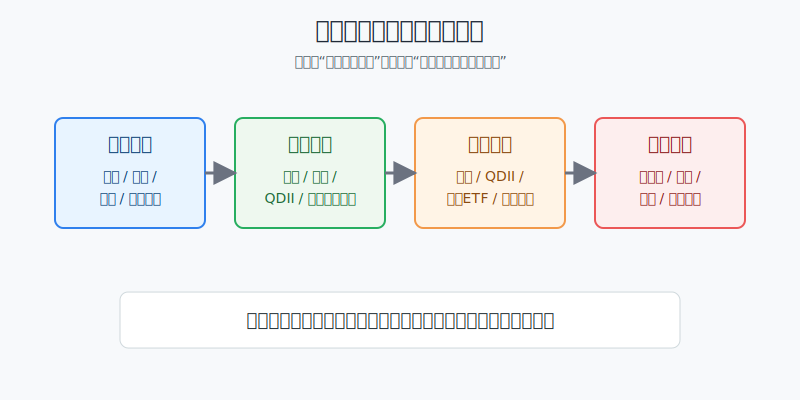
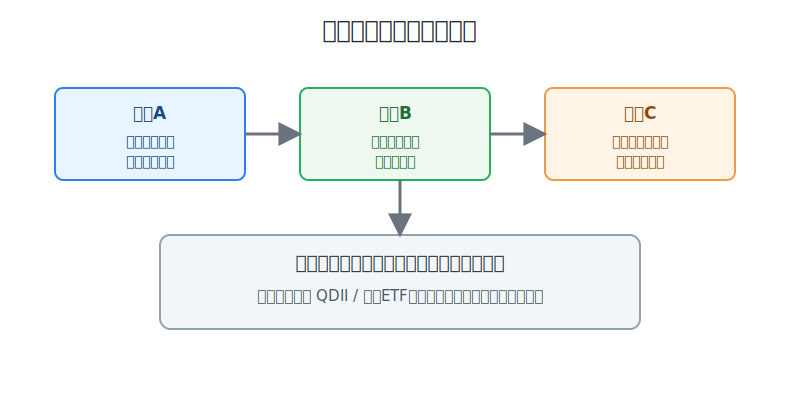
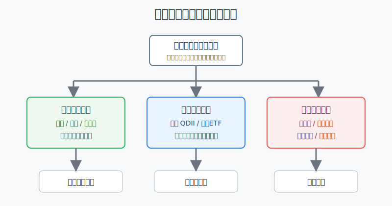

## 散户投资小白金融全品种操盘手册 - 9.8 资金出入境与合规边界
  
### 作者  
digoal  
  
### 日期  
2026-06-07   
  
### 标签  
金融产品 , 金融工具 , 散户 , 投资小白 , 全品操盘手册  
  
----  
  
## 背景 
   

> 适用读者: 已经知道可以通过QDII基金、跨境ETF或境外券商账户接触美股，但还没搞清楚资金怎么进出、哪些红线不能碰的小白投资者。  
> 本文定位: 投资教育框架，不提供绕开监管的资金路径，不构成法律、税务或证券投资建议。

## 先问一个反直觉的问题

买美股之前，很多人最急的问题是“钱怎么转出去”。但对小白来说，更重要的问题其实是：**这笔钱转出去以后，你能不能解释它的来源、用途、路径和凭证。** 资金出入境不是一个手续费问题，而是合规边界问题；边界没弄清楚，后面研究指数、财报、估值都还没开始，就已经把自己放进了风险里。

## 核心概念: 额度不是投资通行证，通道才是责任边界

把跨境资金想成过海关。

你带一个行李箱出门，不是只看箱子能装多少，还要看里面是什么、从哪里来、要去哪里、有没有单据。个人购汇额度也是一样。很多小白听到“每人每年等值5万美元”，就误以为这是“每年可以拿5万美元去境外买股票”。这个理解很危险。

**年度便利化额度是为了便利真实、合法的个人外汇需求，不是给境外证券投资开的万能通行证。** 证券投资属于资本项目，境内个人参与境外固定收益、权益等金融投资，规则上有QDII等合格境内机构投资者通道。你可以学美股，也可以配置海外资产，但路径必须能解释清楚。

所以本节的行动结论先放在前面：**普通小白参与美股，优先使用QDII基金、跨境ETF等境内合规产品；如果考虑境外券商账户，必须先确认资金来源、用途、汇出路径、账户资料和税务留痕，不借额度、不地下换汇、不虚假申报、不分拆转出。**

## 逻辑推导链

【论证链标题】: 因为跨境资金同时受来源、用途、通道和留痕约束，所以小白必须先选合规入口，再讨论买什么美股资产。

── 第一步: 前提陈述

前提A: 个人结汇和境内个人购汇有年度便利化额度，通常为每人每年等值5万美元。这是规则前提，但它不是“任意用途额度”。国家外汇管理局《个人外汇管理办法实施细则》写明，个人年度总额内结汇和购汇凭有效身份证件办理，超过年度总额时，经常项目和资本项目分别按相应规定办理。用生活里的话说，这是快速安检通道，不是免检通道。

前提B: 个人购汇必须有真实、合法的交易基础，不能虚假申报，不能借用或出借额度，不能用于境外证券投资等尚未开放的资本项目。国家外汇管理局的《个人购汇申请书》列出了这些红线，并说明违规者可能被列入关注名单，当年及之后连续2年不享有便利化额度，还可能受到行政处罚。这是常量。

前提C: 境内个人参与境外金融投资，有被制度承认的通道。《个人外汇管理办法实施细则》第十七条写明，境内个人可以通过银行、基金管理公司等合格境内机构投资者进行境外固定收益类、权益类等金融投资。换成小白语言，想买海外资产，不是没有路，而是要走“挂牌路线”，不能自己把生活用汇通道改造成证券投资通道。

前提D: 资金出入境会留下记录。银行办理个人外汇业务时要做真实性审核，个人汇出经常项目外汇支出，外汇储蓄账户当日累计等值5万美元以下凭身份证件办理，超过的要凭经常项目真实性凭证办理。携带外币现钞出境也有额度和申领《携带证》的规则。也就是说，跨境资金不是“转完就结束”，而是从申请、回单、用途到后续解释都有留痕。

── 第二步: 逻辑推导

由A+B可得: 因为5万美元是便利化额度，不是证券投资额度，所以不能从“我能购汇”直接推出“我能把这笔钱用于境外股票账户”。如果用途不匹配，额度本身救不了合规问题。

再由B+C可得: 因为境外证券投资有合格境内机构投资者等通道，所以小白想配置美股时，第一选择应是QDII基金、跨境ETF这类已经把资金出境、额度、托管和产品规则放在制度内处理的工具。

再由C+D可得: 因为即使走合规通道，也会涉及额度、公告、申赎、汇率、税务和账户材料，所以小白不能只问“手续费多少”，还要问“凭证是否完整、用途是否一致、产品公告是否提示限制”。

最后由A+B+C+D可得: 如果你准备用境外券商账户直接交易美股，问题就不只是“券商好不好用”，还包括资金是否来自可解释的合法来源、汇出用途是否真实、账户身份和税务资料是否完整、后续入金出金是否能经得起复核。任意一项说不清，就不该实盘。

── 第三步: 正常情景下的操作结论

✅ 正常情景: 你是普通境内个人，主要资金在境内，想用一小部分长期闲钱学习美股，但没有专业法律、税务和跨境资金经验。

对应操作: 第一优先使用QDII基金、QDII联接基金、跨境ETF等境内合规产品学习美股；如果使用跨境ETF，重点看溢价率、成交额、基金公告和申赎状态；如果进一步考虑境外券商账户，先暂停交易，把资金路径、账户资质、税务表格、入金出金凭证逐项核清。

── 第四步: 数据和案例证实

证据1: 便利化额度确实存在，但它有用途边界。国家外汇管理局天津市分局2025年个人外汇问答提到，个人结汇和境内个人购汇实行年度便利化额度管理，额度分别为每人每年等值5万美元；同一制度下，《个人购汇申请书》明确要求真实、合法申报，并列明不得用于境外证券投资等尚未开放的资本项目。这个证据验证前提A和B：额度不是任意用途。

证据2: QDII是制度化的海外投资入口。国家外汇管理局截至2026年5月末的QDII投资额度审批情况表显示，合格境内机构投资者累计批准额度总计1761.69亿美元，其中证券基金类972.80亿美元、银行类292.30亿美元、保险类406.43亿美元、信托类90.16亿美元。这个数字说明，境内资金投资海外证券不是靠“各显神通”，而是存在被额度管理的正规通道。

证据3: 现金携带也有清晰边界。国家外汇管理局、海关总署《携带外币现钞出入境管理暂行办法》规定，出境携带不超过等值5000美元外币现钞通常无须申领《携带证》；超过5000美元至10000美元应向银行申领；原则上不得携带超过等值10000美元，特殊情况按规定向外汇局申领。这个证据验证前提D：资金出入境不是“现金拿走就行”，连现钞都有明确留痕规则。

证据4: 违规分拆不是理论风险。国家外汇管理局2023年6月通报的案例中，陕西籍乌某利用18名个人名义分拆购汇汇往境外账户，非法转移资金合计70万美元，被处以罚款24.6万元；河北籍刘某利用20名个人名义分拆购汇汇往境外账户，非法转移资金99.3万美元，被罚34.9万元。这验证前提B：借用别人额度、分拆转出，不是“小技巧”，是明确的合规风险。

失败案例: 小林看到美股上涨，想直接开境外券商账户。他让亲友各自购汇后转给他，再统一打入境外账户买ETF。表面看，他只是把多个人的额度“合并使用”；真实逻辑是，资金来源、申报用途和最终用途已经不一致。前提B失效后，推导路径就从“海外资产配置”变成“分拆购汇和用途不实”。新结论不是继续买入，而是停止操作，回到QDII或跨境ETF等可解释通道。

历史案例不代表每个情形都会同样处罚，但它说明一个稳定规律：跨境资金最怕的不是手续费高，而是路径说不清。

── 第五步: 前提变化时的替代结论

若前提A改变，也就是你把5万美元便利化额度理解成“投资额度”，推导路径变为: 因为额度用途被误读，所以买入动作还没开始，合规前提已经不成立。新结论: 不用这条逻辑做境外证券投资，回到QDII、跨境ETF或咨询专业机构。

若前提B改变，也就是你准备借用亲友额度、地下换汇、虚假填写用途或分拆转出，推导路径变为: 因为来源、用途和路径无法一致，所以这是合规风险，不是投资技巧。新结论: 停止操作，保留现有凭证，必要时向银行或专业人士确认如何纠偏。

若前提C改变，也就是QDII产品暂停申购、跨境ETF明显高溢价，推导路径变为: 因为合规通道仍然合规，但产品入口价格和申赎状态变差，所以投资问题从“能不能买”变成“现在买是不是额外付了入口成本”。新结论: 不追高溢价，等待公告和溢价回落，或换成同类低偏离产品。

若前提D改变，也就是你虽然资金来源真实，但没有保存购汇申请、银行回单、基金公告、税务表格和账户资料，推导路径变为: 因为以后无法解释交易链条，所以真实也会变得难以证明。新结论: 先补留痕，再操作。

## 实操例子: 10万元账户怎样做美股资金路径检查

这个例子对应论证链的正常结论: **先确认合规入口和留痕，再讨论买什么美股资产。**

假设小林有10万元可投资资金，生活备用金已经留好。他想拿5000元到1万元学习美股，目标不是短线暴富，而是理解全球资产配置。他现在有A股证券账户、基金账户，还没有境外券商经验。

第一步，先写资金来源。小林在交易笔记里写清楚：资金来自工资结余，已经纳税，不是借款，不是信用卡套现，不是亲友代持。这一步对应前提D。来源写不清，就不进入下一步。

第二步，先选境内合规入口。小林把第一阶段入口限定为QDII基金、QDII联接基金或跨境ETF。理由是：这些产品把境外投资、额度、托管和产品披露放在机构通道里处理，更适合小白学习。这一步对应前提C。

第三步，跨境ETF下单前看三件事。第一看基金公告，是否有暂停申购、溢价风险提示；第二看溢价率，明显高溢价不追；第三看成交额和买卖价差，流动性差不买。这一步不是合规审查本身，但它解决“合规入口也可能买贵”的问题。

第四步，如果想开境外券商账户，先不开仓，只做资料清单。清单包括：券商资质和账户保护边界、本人身份资料、税务表格、入金来源、汇出用途、银行回单、未来出金路径。任意一项说不清，就停留在学习区。这一步对应前提D。

第五步，明确四条红线。小林不借亲友购汇额度，不找地下换汇，不把旅游留学用途写成证券投资资金来源，不用多笔小额分拆来掩盖同一目的。只要交易方案需要靠这些动作完成，就直接删除。这一步对应前提B。

第六步，写纠偏规则。如果QDII暂停申购，他不转去追高溢价跨境ETF；如果跨境ETF因为美股大涨出现明显溢价，他只观察不下单；如果朋友推荐“更快入金办法”，但说不清银行、合同、税务和凭证，他不尝试；如果自己已经误操作，先停止新增交易，整理凭证，向银行或专业人士确认后续处理。

如果操作错误，后果通常不是“少赚一点”，而是把投资风险叠加成合规风险、汇率风险和账户风险。比如小林为了买某只热门美股，临时借5个亲友额度分拆汇出。就算股票后来上涨，这个收益也不能消除资金路径问题。纠偏方法不是继续扩大仓位，而是退出不清晰路径，把美股学习重新放回QDII、跨境ETF和公开披露产品中。

## 可复用框架

【四问过关】

适用前提: 你准备为美股或海外资产安排资金入口。

核心逻辑: 因为跨境资金同时看来源、用途、通道和凭证，所以四问全部过关才进入投资判断。

操作步骤:

1. 问来源: 这笔钱来自哪里，是否是本人合法资金，是否能提供基本证明。
2. 问用途: 申报用途和真实用途是否一致，是否涉及尚未开放的资本项目。
3. 问通道: 是QDII、跨境ETF、银行真实经常项目汇款，还是说不清的中介路径。
4. 问凭证: 申请书、回单、产品公告、账户资料、税务文件是否留存。

前提失效时: 来源说不清，不动；用途不一致，不动；通道靠借额度或地下换汇，不动；凭证缺失，先补齐。

举一反三: 这个框架也适用于港股、海外债券、海外保险和移民资金安排。越是跨境，越要先问路径。

【先内后外】

适用前提: 你是普通小白，只想用小资金学习美股配置。

核心逻辑: 因为境内合规产品已经帮你处理了大部分资金出入境责任，所以学习阶段先用低责任入口，不急着上最高自由度账户。

操作步骤:

1. 第一层: QDII基金或联接基金，适合不想盯盘、不熟悉场内交易的人。
2. 第二层: 跨境ETF，适合已有证券账户、能看懂溢价和公告的人。
3. 第三层: 境外券商账户，只在资金路径、账户安全、税务资料都能解释清楚后再考虑。

前提失效时: QDII暂停申购，就等；跨境ETF高溢价，就不追；境外账户资金路径说不清，就不开仓。

举一反三: 这个框架也适用于第十章的美股ETF操作。工具研究再深入，也不能跳过资金路径。

## 本节行动清单

| 动作 | 合格标准 |
|---|---|
| 区分额度和用途 | 明白5万美元便利化额度不是境外证券投资额度 |
| 优先合规产品 | 小白先研究QDII基金、QDII联接基金、跨境ETF |
| 不碰四条红线 | 不借额度、不地下换汇、不虚假申报、不分拆转出 |
| 下单前查公告 | QDII和跨境ETF看申赎、溢价、成交额和风险提示 |
| 留存资金凭证 | 购汇申请、银行回单、产品公告、账户资料、税务文件都归档 |
| 说不清就停手 | 来源、用途、通道、凭证任一项无法说明，先不交易 |

## 一句话总结

资金出入境的核心不是“怎样把钱最快转出去”，而是“这笔钱的来源、用途、通道和凭证能不能从头到尾说清楚”；小白参与美股，先走合规入口，再谈投资收益。

## 参考资料

- 国家外汇管理局: 《个人外汇管理办法实施细则》，2007-01-05，https://www.safe.gov.cn/safe/2007/0105/22509.html
- 国家外汇管理局天津市分局: 《2025年外汇管理互联网信息——个人外汇（九）》，2025-07-14，https://www.safe.gov.cn/tianjin/2025/0714/2833.html
- 国家外汇管理局: 《个人购汇申请书》，https://www.safe.gov.cn/big5/big5/www.safe.gov.cn%3A443/yunnan/file/file/20210511/a04df91192014a47af175cd1f7d4cdb8.pdf
- 国家外汇管理局: 《合格境内机构投资者（QDII）投资额度审批情况表》，截至2026年5月末，https://www.safe.gov.cn/safe/file/file/20260529/60b3d0380b124a09a5e2c4bb39f23b49.pdf
- 国家外汇管理局、海关总署: 《携带外币现钞出入境管理暂行办法》，https://www.safe.gov.cn/safe/2003/0828/5444.html
- 国家外汇管理局: 《国家外汇管理局关于外汇违规案例的通报》，2023-06-29，https://www.safe.gov.cn/safe/2023/0629/22866.html

> ⚠️ **声明**：本文内容为投资教育目的，所有历史数据、策略框架均为辅助学习工具，不构成证券投资建议。市场有风险，投资需谨慎。实际操作请结合自身风险承受能力，必要时咨询专业投顾。
  
#### [PostgreSQL 解决方案集合](../201706/20170601_02.md "40cff096e9ed7122c512b35d8561d9c8")
  
  
#### [德哥 / digoal's Github - 公益是一辈子的事.](https://github.com/digoal/blog/blob/master/README.md "22709685feb7cab07d30f30387f0a9ae")
  
  
#### [About 德哥](https://github.com/digoal/blog/blob/master/me/readme.md "a37735981e7704886ffd590565582dd0")
  
  

  
