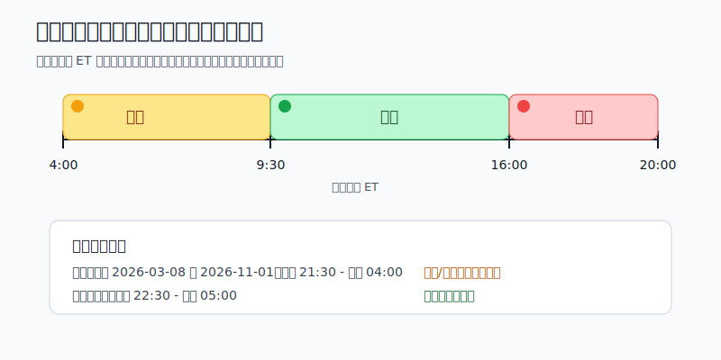
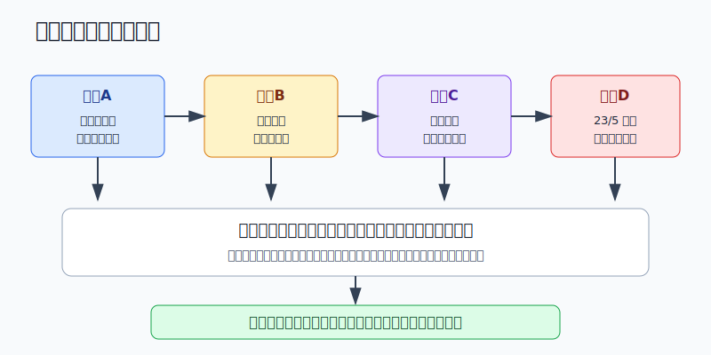
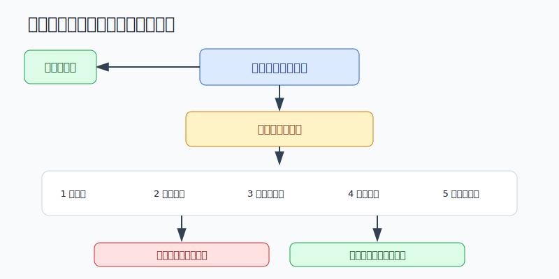

## 散户投资小白金融全品种操盘手册 - 9.9 美股交易时间 - 盘前、盘中、盘后
  
### 作者  
digoal  
  
### 日期  
2026-06-07   
  
### 标签  
金融产品 , 金融工具 , 散户 , 投资小白 , 全品操盘手册  
  
----  
  
## 背景 
   

> 适用读者: 已经知道美股可以买卖，但还分不清盘前、盘中、盘后到底有什么区别的小白投资者。  
> 本文定位: 投资教育框架，不构成个性化投资建议。

## 先问一个反直觉的问题

美股账户最诱人的按钮，不是买入，也不是卖出，而是“现在也能交易”。北京时间半夜，财报刚出，价格跳动，你会觉得自己抢到了先机。可对小白来说，盘前盘后真正多出来的不是机会，而是更薄的流动性、更大的价差和更差的判断状态。

## 核心概念: 交易时间不是开放时间，而是成交质量

把美股交易想成开车。

**盘中**是主干道。车多，路宽，红绿灯和交警都在，虽然也会堵，也会出事故，但价格发现最集中，成交最有参照。

**盘前和盘后**像夜路。不是不能走，而是车少、灯少、对面来车少。你看到的一个价格，不一定代表“市场都同意这个价格”，可能只是少数订单在薄薄的盘口上撞出来的结果。

所以本节先给行动结论: **小白默认只在盘中交易；盘前盘后只用于有预案的例外动作，而且必须用限价单、小仓位、接受不成交。**

## 逻辑推导链

【论证链标题】: 因为盘中、盘前、盘后的流动性和交易保护环境不同，所以小白应把盘中当主交易窗口，把盘前盘后当例外窗口。

### 第一步: 前提陈述

前提A: 美股常规盘中交易时间是美东时间9:30到16:00。这是常量。NYSE公布的Core Trading Session为9:30 a.m. to 4:00 p.m. ET；Nasdaq也公布其股票市场开盘9:30、收盘16:00。对小白来说，这段时间不是因为“官方好看”，而是因为主要交易者、报价、成交和收盘价形成都集中在这里。

前提B: 盘前盘后确实能交易，但开放窗口取决于交易所和券商。这是变量。Nasdaq页面写明，盘前为4:00到9:30 ET，盘后为16:00到20:00 ET，并提醒不同券商的盘前盘后时间可能不同。NYSE体系里，不同市场也有不同早盘和晚盘安排，例如NYSE Arca早盘4:00到9:30、晚盘16:00到20:00。

前提C: 盘前盘后的核心风险不是“时间早晚”，而是流动性更低、波动更高、买卖价差更宽。这是常量。FINRA Rule 2265要求允许客户做延长时段交易的券商提供风险披露，披露重点包括低流动性、高波动、价格变化、市场不联通、新闻影响放大和价差扩大。

前提D: 中国投资者还叠加时差风险。这是变量。NIST显示，2026年美国夏令时从3月8日2:00开始，到11月1日2:00结束。因此北京时间看美股盘中，夏令时是21:30到次日04:00，标准时是22:30到次日05:00。越接近凌晨，越容易把“想睡前处理一下”变成情绪化下单。

前提E: 交易时间正在变长，但“能交易更久”不等于“更适合交易”。这是变量。SEC在2026年4月10日批准Nasdaq把NMS股票交易时间扩展到每周五天、每天23小时的规则变更。这个变化说明未来市场会更接近全天候，但它没有改变低流动性时段更难成交、价差更容易变宽的基本逻辑。

### 第二步: 逻辑推导

由A可得: 因为盘中是主要价格发现窗口，所以小白的默认买卖动作应该放在盘中，而不是为了“抢一步”去盘前盘后成交。

由A+B可得: 因为盘前盘后虽然开放，但不同交易所、不同券商、不同证券的可交易范围和订单类型不同，所以你不能只看行情软件里价格在跳，就默认自己能用同样规则成交。

再由B+C可得: 因为盘前盘后流动性更薄，市价单更容易打到糟糕价格，所以只要进入延长时段，最基础的纪律就是限价单。限价单的意思是，你先写死自己愿意接受的最高买价或最低卖价，成交不了也接受。

再由C+D可得: 因为盘前盘后本来就更难成交，而北京时间又容易把人拖到疲劳状态，所以小白不能在半夜临时改计划。没有提前写下买入理由、卖出理由和价格边界，就不下单。

最后由A+B+C+D+E可得: 即使未来23/5交易更普及，小白也不能把“市场开着”理解成“任何时候都适合交易”。市场开门时间变长，只是把选择变多；选择变多以后，纪律更重要。

### 第三步: 正常情景下的操作结论

✅ 正常情景: 你买的是美股ETF或大盘龙头股，资金不是短线必须处理的钱，没有突发财报或重大新闻，也没有提前写好延长时段交易计划。

对应操作: 默认在盘中交易；如果用北京时间，看夏令时21:30到次日04:00、标准时22:30到次日05:00。对于小白，最稳妥的是避开刚开盘最混乱的几分钟和临近收盘的情绪冲刺，把交易当成计划执行，而不是半夜看见价格跳动就追。

### 第四步: 数据和案例证实

证据1: 交易所时间表验证了“盘中是主交易窗口”。NYSE公布Core Trading Session为9:30到16:00 ET；Nasdaq 2026年交易时间页面也写明股票市场9:30开盘、16:00收盘，并列出盘前4:00到9:30、盘后16:00到20:00。这说明盘前盘后是延长市场，不是常规盘中的替代品。

证据2: 监管机构把延长时段风险单独列出来。FINRA Rule 2265要求券商提供延长时段交易风险披露；FINRA的投资者教育文章也提醒，常规交易时间由SEC定义为9:30到16:00，延长时段可能有更高波动，并且券商必须告知客户相关风险。这个证据对应前提C: 盘前盘后的风险不是散户自己想象出来的。

证据3: SEC早期专题研究给过一个直观数字。SEC在2000年关于ECN和盘后交易的研究中分析了Nasdaq 100中15只大市值股票，发现样本期内平均报价价差中位数从盘中每股8美分扩大到盘后每股26美分；有效价差从13美分扩大到36美分；逐笔成交价格波动从5美分扩大到15美分。历史样本不代表今天每只股票都会这样，但机制仍然有参考价值: 参与者少，价差和波动就更容易放大。

证据4: 交易时间变长是正在发生的制度变化。SEC在2026年4月10日发布Release No. 34-105199，批准Nasdaq将交易时间扩展到每周五天、每天23小时。这个证据对应前提E: 小白以后会看到更多“可交易时间”，但规则变化不是风险消失。

失败案例: SEC同一份研究记录了一个盘后反转例子。2000年1月18日，Corel盘后因财报消息从20美元涨到23又23/32美元，盘后涨幅18.6%；第二天开盘为21又7/8美元，随后常规盘收在20又9/16美元。这个案例不是让你记住Corel，而是让你记住一个规律: 盘后价格可能是真信号，也可能只是薄盘口里的剧烈反应。小白如果在盘后高价追入，第二天主会场重新开门时，价格可能已经换了一套逻辑。

### 第五步: 前提变化时的替代结论

若前提B改变，也就是你的券商只开放部分盘前盘后时间，或者某只股票、ETF、ADR不支持延长时段交易，推导路径变为: 因为账户实际规则不支持，所以行情跳动不等于你能按那个价格成交。新结论: 不下单，先看券商订单页面和风险披露。

若前提C改变，也就是盘前盘后盘口很厚、买卖价差很小、你只是为了降低风险而不是追涨，推导路径变为: 因为成交质量接近可控，所以可以用极小仓位限价处理。新结论: 只做预案内动作，例如减掉超计划仓位，不临时加码。

若前提D改变，也就是你已经疲劳、情绪上头、想在睡前“赌一下财报”，推导路径变为: 因为判断能力下降，所以盘前盘后交易变成情绪交易。新结论: 关掉交易页面，第二天盘中再复盘。

若前提E改变，也就是23/5或更长交易时间已经在你的券商落地，推导路径也不能变成“随时买卖”。新结论: 仍按流动性、价差、订单类型、仓位和自身状态来决定是否交易。时间越长，越要把“不开仓”当成默认选项。

## 实操例子: 北京时间半夜看到财报后大跌怎么办

这个例子对应论证链的替代结论: **盘前盘后不是禁止交易，而是只允许有预案、小仓位、限价、能接受不成交的动作。**

假设小林有10万元账户，其中美股学习仓1万元，持有一只大型科技股ETF 5000元等值，另有一只个股观察仓2000元等值。北京时间凌晨4:20，公司刚发完财报，个股盘后跌了8%。小林第一反应是想马上卖掉。

第一步，先判断是不是必须现在交易。如果这只个股只是2000元观察仓，没有杠杆，也没有超过单票上限，答案通常是否。这个判断对应前提A: 盘中才是主交易窗口，盘后价格不一定是最终价格。

第二步，查盘口，而不是只看涨跌幅。小林必须看买一价、卖一价、最新成交量。如果买价100美元、卖价102美元，价差2%，说明成交成本已经很高。这个判断对应前提C: 盘后最危险的不是跌，而是你以为看到的是一个稳定价格。

第三步，如果确实要降风险，只能用限价单。例如他提前写过规则: 个股财报后若核心逻辑破坏，允许先减半。他可以把1000元等值仓位挂在自己能接受的限价，不成交就等盘中，不用市价单砸出去。这个动作对应前提C的操作纪律。

第四步，禁止临时加仓。很多小白看到盘后跌8%，会想“便宜了，补一点”。但如果财报内容还没读懂、电话会还没听、管理层指引还没看，补仓就是用情绪替代研究。这个动作对应前提D。

第五步，第二天盘中复盘。复盘只问三件事: 财报是否破坏买入逻辑，盘中成交量和价格是否确认盘后方向，当前仓位是否仍在上限内。若三项都指向逻辑破坏，再按原卖出计划减仓；若只是盘后情绪波动，保持计划，不为了昨晚的价格跳动反复交易。

如果操作错误，最常见后果是被盘后价格带着跑。比如小林在102美元市价买入，第二天盘中回到98美元，他亏的不只是方向，还有盘后薄流动性的价差成本。纠偏方法不是继续盯半夜行情，而是把延长时段交易权限降级: 只允许撤单、查看、限价减风险，不允许临时加仓。

## 可复用框架

【三段时间法】

适用前提: 你想参与美股，但不知道盘前、盘中、盘后该怎么用。

核心逻辑: 因为盘中是主要价格发现窗口，盘前盘后的流动性和订单规则更复杂，所以交易时间要按成交质量排序，而不是按可交易时长排序。

操作步骤:

1. 盘中: 默认交易窗口，用来执行计划内买入、卖出和调仓。
2. 盘前: 只观察重大隔夜新闻和经济数据影响，不追小成交量价格。
3. 盘后: 只处理财报、突发公告后的风险动作，不做临时加仓。

前提失效时: 如果盘中也出现剧烈波动、停牌或买卖价差异常，同样暂停下单；如果盘前盘后盘口极薄，哪怕是大公司也不强行成交。

举一反三: 这个框架也适用于港股暗盘、A股集合竞价、商品夜盘。时间窗口不同，成交质量就不同。

【五门限价法】

适用前提: 你确实需要在盘前或盘后处理一笔订单。

核心逻辑: 因为延长时段的核心风险是价格不稳定和成交不确定，所以先检查五道门，再决定是否下单。

操作步骤:

1. 第一门: 是否只能用限价单，且限价是你真能接受的价格。
2. 第二门: 成交量是否足够，不是只有几笔零星成交。
3. 第三门: 买卖价差是否可接受，价差太宽就等盘中。
4. 第四门: 仓位是否很小，错误成交不会伤到账户。
5. 第五门: 是否接受不成交，不成交也不追价。

前提失效时: 任一门过不了，就不交易。尤其是你想用市价单、想追价、想补仓摊平时，直接判定为不合格。

举一反三: 这个框架也能用在流动性差的小盘股、跨境ETF、ADR和节假日前后的交易。能成交不是目标，按可接受价格成交才是目标。

## 本节行动清单

| 动作 | 合格标准 |
|---|---|
| 先记住主窗口 | 美股常规盘中为9:30到16:00 ET |
| 做北京时间换算 | 夏令时盘中21:30到次日04:00，标准时22:30到次日05:00 |
| 默认盘中交易 | 没有突发风险和预案，不用盘前盘后 |
| 盘前盘后只用限价 | 市价单不进入延长时段 |
| 看三项盘口 | 成交量、买卖价差、可用订单类型 |
| 防疲劳下单 | 凌晨状态差时，只记录，不交易 |
| 面对23/5保持纪律 | 交易时间变长，不等于仓位可以变大 |

## 一句话总结

美股交易时间越长，小白越要缩小自己的交易窗口: 默认盘中交易，盘前盘后只做有预案的限价小单，真正保护账户的不是抢先一步，而是不在薄流动性里乱动。

## 参考资料

- NYSE: Holidays & Trading Hours, 2026年访问, https://www.nyse.com/trade/hours-calendars
- Nasdaq: Stock Market Holidays & Trading Hours, 2026年访问, https://www.nasdaq.com/market-activity/stock-market-holiday-schedule
- NIST: Daylight Saving Time Rules, 2026年访问, https://www.nist.gov/pml/time-and-frequency-division/popular-links/daylight-saving-time-dst
- FINRA: Rule 2265, Extended Hours Trading Risk Disclosure, https://www.finra.org/rules-guidance/rulebooks/finra-rules/2265
- FINRA: Extended-Hours Trading: Know the Risks, 2024年7月, https://www.finra.org/investors/insights/extended-hours-trading
- SEC: Special Study, ECNs and After-Hours Trading, 2000年, https://www.sec.gov/news/studies/ecnafter.htm
- SEC: Release No. 34-105199, SR-NASDAQ-2025-109, 2026-04-10, https://www.sec.gov/files/rules/sro/nasdaq/2026/34-105199.pdf

> ⚠️ **声明**：本文内容为投资教育目的，所有历史数据、策略框架均为辅助学习工具，不构成证券投资建议。市场有风险，投资需谨慎。实际操作请结合自身风险承受能力，必要时咨询专业投顾。
  
#### [PostgreSQL 解决方案集合](../201706/20170601_02.md "40cff096e9ed7122c512b35d8561d9c8")
  
  
#### [德哥 / digoal's Github - 公益是一辈子的事.](https://github.com/digoal/blog/blob/master/README.md "22709685feb7cab07d30f30387f0a9ae")
  
  
#### [About 德哥](https://github.com/digoal/blog/blob/master/me/readme.md "a37735981e7704886ffd590565582dd0")
  
  

  
