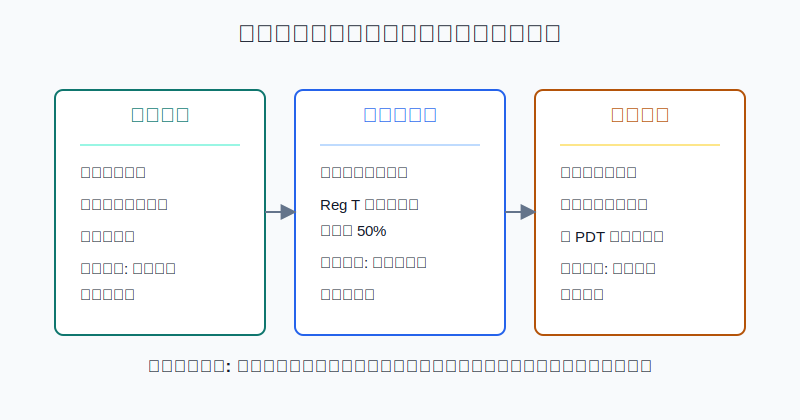
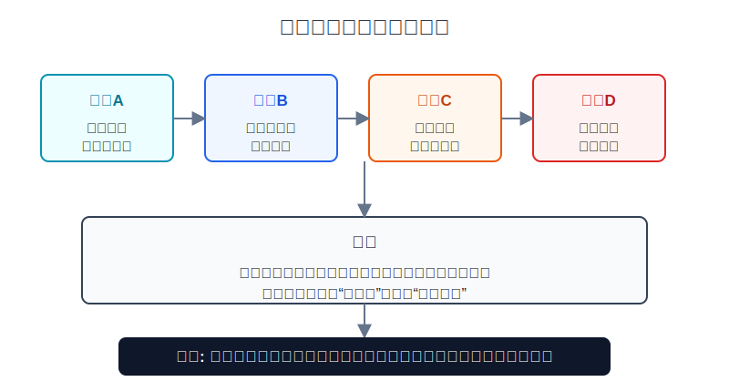
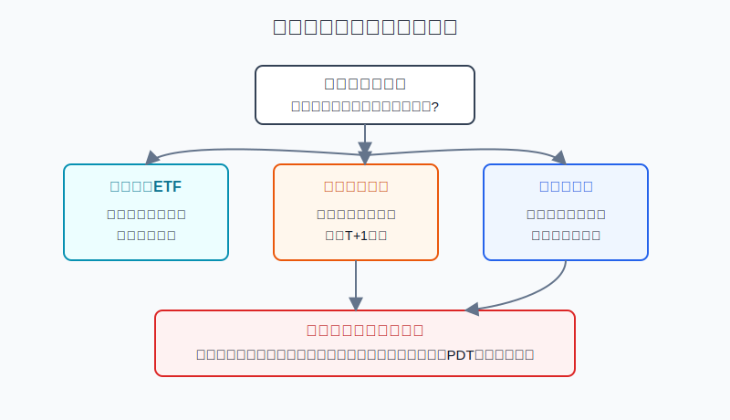

## 散户投资小白金融全品种操盘手册 - 9.10 现金账户、保证金账户、日内交易规则
  
### 作者  
digoal  
  
### 日期  
2026-06-07   
  
### 标签  
金融产品 , 金融工具 , 散户 , 投资小白 , 全品操盘手册  
  
----  
  
## 背景 
   

> 适用读者: 已经知道可以通过境外券商账户买美股, 但分不清现金账户、保证金账户和日内交易规则的小白投资者。  
> 本文定位: 投资教育框架, 不构成个性化投资建议。规则口径按 2026-06-06 可核查公开资料整理, 实盘前仍要以你的券商最新披露为准。

## 先问一个反直觉的问题

很多人以为美股账户的高级感来自“功能多”: 能融资、能融券、能盘前盘后、能日内来回做。其实对小白来说, 功能越多, 账户越像一辆没有限速提示的车。**你最先要学的不是怎么把权限开满, 而是每一种权限会把哪一种错误放大。**

## 核心概念: 账户类型不是身份标签, 而是风险开关

**现金账户**就是只用自己的钱买证券。你卖出股票或ETF后, 钱不是马上完成法律意义上的交割, 而是要等结算。美国证券市场从 2024-05-28 起, 多数证券交易的标准结算周期从 T+2 缩短为 T+1, 也就是交易日后的下一个工作日完成结算。对小白来说, 现金账户的核心纪律是: **没有结算好的钱, 不要当成已经完全到账的钱随便反复买卖。**

**保证金账户**就是券商允许你用证券和现金做抵押, 向券商借钱交易。它不是“更专业的现金账户”, 而是多了一层信用关系。Regulation T 下, 新买入保证金证券时, 券商通常最多可借给客户 50% 的买入金额; FINRA 规则还要求账户维持一定权益比例, 常见最低维持保证金口径是 25%。这意味着: 价格下跌时, 你亏的不只是市场波动, 还可能触发追加保证金、限制交易或被强制卖出。

**日内交易**是同一天买入又卖出, 或同一天卖出又买回同一证券。这里有一个必须更新的口径: 过去很多中文社区反复讲“5个交易日内4次日内交易、账户要 25,000 美元”的 PDT 规则。但 FINRA 已在 Regulatory Notice 26-10 中采用新的日内保证金标准, 用来替代旧的日内交易保证金要求, 包括旧 PDT 交易次数标记和 25,000 美元最低权益要求。新规则生效日是 2026-06-04, 券商如需调整系统, 可过渡到 2027-10-20。

所以本节先给出行动结论: **小白做中长期美股ETF或个股学习, 现金账户通常已经够用; 如果开保证金账户, 第一规则不是“能借多少”, 而是“默认不借钱、不卖空、不把日内交易当主策略”。**

## 逻辑推导链

【论证链标题】: 因为账户权限越高, 结算、借款和日内风险越复杂, 所以小白应先用现金账户建立规则感, 再谨慎理解保证金和日内交易。

── 第一步: 前提陈述

前提A: 现金账户的本质是“先有钱, 再买货”。这是常量。它像去超市用现金付款, 你能买多少取决于钱包里已经可用的钱。美国 T+1 结算让资金周转比过去更快, 但 T+1 仍然不是“卖出后立刻完全结算”。如果你用未结算资金反复买卖, 就可能碰到现金账户交易违规。

前提B: 保证金账户的本质是“券商借你一部分钱”。这是常量。借钱会放大收益, 也会放大亏损和规则后果。Reg T 的 50% 初始保证金不是收益工具, 而是借款边界; 25% 维持保证金也不是安全垫, 而是跌到一定程度后券商可以要求你补钱或处理仓位的警戒线。

前提C: 日内交易规则已经进入新旧衔接期。这是变量。2026-06-04 起, FINRA 新日内保证金标准开始生效, 但部分券商可在 2027-10-20 前完成过渡。因此, 小白不能只背旧 PDT 口诀, 还要看自己券商到底按哪个系统展示日内购买力、日内保证金水平和限制条件。

前提D: 频繁交易会把小错误变成结构性错误。这是常量。现金账户里, 它可能变成未结算资金违规; 保证金账户里, 它可能变成日内保证金缺口; 心理层面, 它会把“看错一次”变成“连续追单、加杠杆、越错越急”。

── 第二步: 逻辑推导

由A可得: 因为现金账户只允许你用自己的、可结算的钱交易, 所以它最适合小白先学习美股规则、汇率、交易时间和ETF/个股买卖。现金账户限制多, 但限制本身就是保护。

由A+B可得: 因为保证金账户引入券商信用, 所以同样买入 1 万美元股票, 风险不再只是“股票跌了多少”, 还包括“账户权益够不够、券商是否发出保证金要求、是否被限制或强制卖出”。因此, 保证金账户不能因为名字看起来高级就默认优于现金账户。

再由B+C可得: 因为日内交易规则已经从旧 PDT 框架转向日内保证金框架, 所以“我不满 25,000 美元是不是不能日内交易”这个问题已经不是唯一核心。更重要的问题变成: 你的券商如何计算日内保证金水平、哪些交易会降低日内保证金、出现缺口后多久要补、补不上会如何限制账户。

最后由A+B+C+D可得: 因为频繁交易会同时触发结算、借款、保证金和心理错误, 所以小白的正确路径不是先学日内交易, 而是先用低频交易把规则学清楚。账户权限越复杂, 仓位和频率越应该下降。

── 第三步: 正常情景下的操作结论

✅ 正常情景: 你只是想用闲钱参与美股ETF或少量龙头个股, 交易频率低, 没有卖空、融资和期权组合经验, 也没有稳定复盘纪律。

对应操作: 优先使用现金账户; 每次卖出后, 等资金完成 T+1 结算再安排下一笔交易; 不用未结算资金做连续买卖; 暂不开启或不使用保证金借款; 日内交易只放在学习笔记里, 不作为真实账户策略。

── 第四步: 数据和案例证实

证据1: 结算周期已经明确缩短, 但仍然存在结算。SEC 在 T+1 结算风险提示中说明, 2024-05-28 起, 美国多数经纪商证券交易的标准结算周期从交易日后两个工作日缩短为一个工作日。这个证据验证了前提A: 现金账户不是不能交易, 而是要尊重“交易完成”和“资金结算完成”的区别。

证据2: 保证金账户天然带杠杆。FINRA 的保证金账户说明中写明, 在 Reg T 下, 券商一般可为客户新买入保证金权益证券提供最高 50% 的购买资金; FINRA 规则还设置维持保证金要求, 示例中权益需维持在证券市值的 25% 以上。这个证据验证了前提B: 保证金账户不是多一个按钮, 而是多一条信用链。

证据3: 日内交易规则在 2026 年发生关键变化。FINRA Regulatory Notice 26-10 披露, 新日内保证金标准将替代旧日内交易保证金要求, 包括旧 PDT 交易次数要求和 25,000 美元最低权益要求; 生效日为 2026-06-04, 券商可过渡到 2027-10-20。这个证据验证了前提C: 小白不能只看旧中文攻略。

失败案例: 假设小林用现金账户卖出 5000 美元ETF, 当天看到另一只股票上涨, 立刻用这笔尚未结算的钱买入, 第二天又卖出。即使他没有借钱, 也可能因为未结算资金使用不当而被券商限制现金账户交易。再假设他用保证金账户同一天频繁买卖多只高波动股票, 旧 PDT 口诀已经不能保护他; 新框架下, 只要交易降低日内保证金水平并形成缺口, 券商就可能要求他尽快补足或限制信用使用。

历史规则不代表未来, 但规则变化本身有参考价值: 市场监管不是为了教小白多交易, 而是不断把风险计算从简单标签转向实时风险。散户越不熟悉规则, 越应该降低频率。

── 第五步: 前提变化时的替代结论

若前提A改变, 也就是你开始用未结算资金连续买卖, 推导路径变为: 因为现金账户的保护来自“只用已结算资金”, 你绕开了这个保护, 所以交易问题变成规则违规问题。新结论: 停止连续买卖, 等 T+1 结算完成, 只用 settled cash 下单。

若前提B改变, 也就是你开了保证金账户并开始借钱买股, 推导路径变为: 因为亏损会被借款放大, 所以仓位上限必须下降, 并且要提前写出最大亏损、补保证金资金来源和强制卖出预案。新结论: 没有预案, 不用保证金借款。

若前提C改变, 也就是你的券商仍在过渡期, 继续沿用部分旧 PDT 提示或混合提示, 推导路径变为: 因为界面显示可能与最新规则衔接, 所以不能靠社区经验下单。新结论: 下单前查看券商日内交易说明、保证金披露和账户限制提示。

若前提D改变, 也就是你把日内交易当成回本工具, 推导路径变为: 因为交易频率上升不是能力提升, 而是情绪升温, 所以错误会被交易成本、点差、波动和保证金要求叠加放大。新结论: 停止日内实盘, 回到低频ETF或模拟盘。

## 实操例子: 1万美元美股账户怎样设置账户规则

这个例子对应论证链的正常结论: **小白先用现金账户和低频交易建立规则感, 不把保证金和日内交易当作默认能力。**

假设小林准备用 1 万美元等值资金学习美股。他的目标是买宽基ETF和少量龙头个股, 资金三年以上不用, 但他没有融资、卖空和日内交易经验。

第一步, 账户类型先选现金账户。小林把第一阶段规则写成: 只买股票和ETF, 不卖空, 不融资, 不碰期权。这个动作对应前提A, 目的是先把最容易出错的信用风险关掉。

第二步, 给结算资金做标记。每次卖出后, 小林在复盘表里写三列: 卖出日期、预计结算日、可再次使用金额。比如周一卖出ETF, 正常情况下周二才按 T+1 结算进入可用资金。周一当天看到其他股票上涨, 不用这笔钱追。这个动作对应证据1。

第三步, 如果券商界面显示“可用购买力”高于现金余额, 先不按最大购买力下单。很多新手看到 buying power 就以为那是自己的钱。小林的规则是: 只按 settled cash 下单, 不按 margin buying power 下单。这一步对应前提B。

第四步, 如果未来必须开保证金账户, 也先写“不借款线”。例如账户 1 万美元, 任何时候持仓市值不得超过现金和已结算资金, 不因为券商给 2 万美元购买力就买到 2 万美元。若账户出现 margin debit, 也就是实际借款, 当天必须降回无借款状态。这一步对应证据2。

第五步, 日内交易只做记录, 不做策略。小林可以在纸面上记录一次模拟日内交易: 买入价、卖出价、点差、手续费、判断依据、如果下跌 3% 怎么办。但真实账户不做“今天买今天卖”的计划。若发生当天买卖, 也必须复盘它是计划内纠错, 还是情绪交易。这一步对应前提D。

第六步, 规则更新要看券商公告。由于 2026-06-04 起 FINRA 新日内保证金标准生效, 但券商可过渡到 2027-10-20, 小林每季度检查一次券商的 margin disclosure、intraday margin、day trading 说明。若券商提示账户存在日内保证金缺口或限制, 先补规则, 不加交易。

如果操作错误, 最常见后果有三种。第一, 现金账户里拿未结算资金反复买卖, 被限制交易; 纠偏是只用已结算资金。第二, 保证金账户里把购买力当本金, 下跌后被追加保证金; 纠偏是把持仓降回现金覆盖范围。第三, 看到旧 PDT 规则变化, 误以为“以后可以随便日内交易”; 纠偏是记住新规则不是鼓励频繁交易, 而是按日内保证金风险重新管理。

## 可复用框架

【账户三问】

适用前提: 你准备通过境外券商账户买美股, 但不知道该选现金账户还是保证金账户。

核心逻辑: 因为账户类型决定结算、借款和强制处理规则, 所以下单前先问账户, 再问标的。

操作步骤:

1. 问资金: 这笔钱是 settled cash, 还是卖出后尚未结算的钱?
2. 问信用: 这笔交易是否使用了券商借款、卖空或保证金购买力?
3. 问频率: 这笔交易是否会变成日内交易或连续频繁交易?

前提失效时: 资金未结算, 等; 使用借款, 降仓; 频率失控, 停止日内实盘。

举一反三: 这个框架也适用于港股、美股期权和杠杆ETF。只要账户权限复杂, 就先问规则, 再问收益。

【三条红线】

适用前提: 你已经开了美股账户, 容易被购买力、盘前盘后和日内波动吸引。

核心逻辑: 因为小白最容易把权限误认为能力, 所以用三条红线把错误成本锁住。

操作步骤:

1. 不用未结算资金连续买卖。
2. 不用保证金借款扩大本金。
3. 不把日内交易当成回本工具。

前提失效时: 只要碰到其中一条, 当天停止新增交易, 写清触发原因和纠偏动作。

举一反三: 这三条红线也适用于A股融资融券、期货保证金和黄金T+D。凡是能借钱、能高频、能强制处理的账户, 都要先把红线写在收益目标前面。

## 本节行动清单

| 动作 | 合格标准 |
|---|---|
| 先选现金账户 | 只做中长期ETF/个股学习时, 默认不用保证金借款 |
| 标记结算资金 | 卖出后记录 T+1 结算日, 只用已结算资金下单 |
| 看懂购买力 | buying power 不等于自己的现金, margin buying power 不等于本金 |
| 保证金先设上限 | 持仓市值不超过现金和已结算资金, 不借钱买股 |
| 更新日内规则 | 了解 FINRA 2026-06-04 新日内保证金标准和券商过渡安排 |
| 停止情绪日内交易 | 为回本、怕踏空、追盘前盘后波动而交易, 当天停手 |

## 一句话总结

美股账户不是权限越多越好; 小白先用现金账户学会结算和低频交易, 再理解保证金和日内交易规则, 才不会把“能下单”误当成“能承受后果”。

## 参考资料

- U.S. SEC: Shortening the Securities Transaction Settlement Cycle, 2024-05-28 起 T+1, https://www.sec.gov/compliance/risk-alerts/shortening-securities-transaction-settlement-cycle
- FINRA: Cash Accounts: What They Are and How to Avoid Problems, https://syndication.finra.org/content/cash-accounts-what-they-are-and-how-avoid-problems
- FINRA: Margin Regulation, https://www.finra.org/rules-guidance/key-topics/margin-accounts
- FINRA: Brokerage Accounts, https://www.finra.org/investors/investing/investment-accounts/brokerage-accounts
- FINRA: Regulatory Notice 26-10, 2026-04-20, https://www.finra.org/rules-guidance/notices/26-10
- FINRA: Understanding the New Intraday Margin Requirements, 2026, https://syndication.finra.org/content/understanding-new-intraday-margin-requirements
- FINRA: SR-FINRA-2025-017, https://www.finra.org/rules-guidance/rule-filings/sr-finra-2025-017

> ⚠️ **声明**：本文内容为投资教育目的，所有历史数据、策略框架均为辅助学习工具，不构成证券投资建议。市场有风险，投资需谨慎。实际操作请结合自身风险承受能力，必要时咨询专业投顾。
  
#### [PostgreSQL 解决方案集合](../201706/20170601_02.md "40cff096e9ed7122c512b35d8561d9c8")
  
  
#### [德哥 / digoal's Github - 公益是一辈子的事.](https://github.com/digoal/blog/blob/master/README.md "22709685feb7cab07d30f30387f0a9ae")
  
  
#### [About 德哥](https://github.com/digoal/blog/blob/master/me/readme.md "a37735981e7704886ffd590565582dd0")
  
  

  
