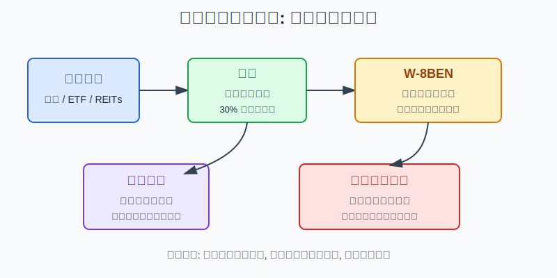
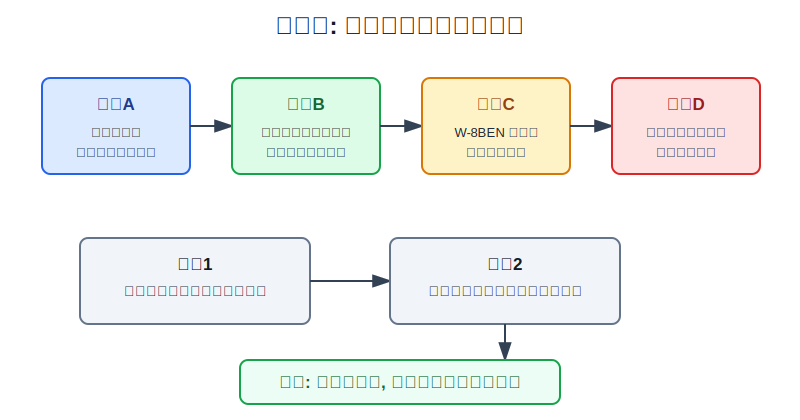
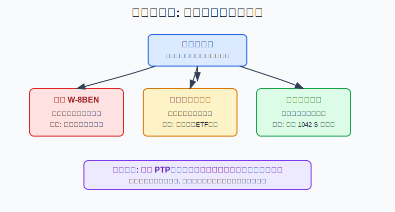

## 散户投资小白金融全品种操盘手册 - 9.11 分红税与非美国居民税务入门
  
### 作者  
digoal  
  
### 日期  
2026-06-07   
  
### 标签  
金融产品 , 金融工具 , 散户 , 投资小白 , 全品操盘手册  
  
----  
  
## 背景 
   

> 适用读者: 已经知道可以通过境外券商账户买美股, 但还分不清分红税、W-8BEN、资本利得和中国居民境外所得申报的小白投资者。  
> 本文定位: 投资教育框架, 不构成税务、法律或证券投资建议。规则口径按 2026-06-06 可核查公开资料整理, 实操前仍要以券商提示、税务机关规则和专业税务意见为准。

## 先问一个反直觉的问题

很多人买美股前先看股价、估值和股息率, 但真正打到你账户里的钱, 不是网页上写的股息率。**分红先经过美国预扣, 再进入你的税务身份和申报链条。** 对小白来说, 税务不是最后填表的小事, 而是决定你到底赚到多少、凭证能不能说清楚的基本规则。

## 核心概念: 分红税不是券商手续费

先把几个词讲清楚。

**非美国居民**在这里指美国税务上的 nonresident alien, 也就是既不是美国公民, 也没有按绿卡测试或实质居留测试成为美国税收居民的人。它不是你护照上“不是美国人”这么简单, 因为如果你长期在美国停留, 税务身份可能变化。

**分红税**不是券商收你的服务费, 而是美国公司或基金把利润分给股东时, 美国税法对非美国投资者的美国来源收入做源泉预扣。源泉预扣可以理解成“钱还没到你手里, 先在源头扣一部分税”。

**W-8BEN**是非美国个人常见的税务表格, 用来向券商或付款方证明你是外国人、你是这笔收入的受益所有人, 并在符合条件时申请税收协定下的较低预扣税率。表格本身不会让你赚钱, 但它会影响券商按什么身份处理你的分红。

所以本节的行动结论先放在前面: **小白买美股时, 先确认自己是不是美国税务非居民, 再正确提交 W-8BEN, 然后用税后分红而不是税前股息率做决策; 如果你是中国税收居民, 还要把美国预扣、中国境外所得申报和抵免凭证一起纳入复盘。**

## 逻辑推导链

【论证链标题】: 因为分红、资本利得和税收居民身份适用不同规则, 所以小白不能只看税前收益, 必须先做税务身份和凭证检查。

── 第一步: 前提陈述

前提A: 非美国居民的美国来源固定、可确定、年度或定期收入, 通常按 30% 税率或较低税收协定税率征税。这是常量。美国 IRS 对非居民的说明中, 把这类收入称为 FDAP income, 分红就是典型项目。用小白语言说, 美股分红不是“公司说发多少, 你就完整拿多少”。

前提B: W-8BEN 是券商识别你非美国身份和适用协定待遇的重要表格。这是常量。IRS 的 W-8BEN 指引说明, 外国个人提交该表可以证明自己不是美国人、是收入受益所有人, 并在适用时申请较低预扣税率。通常表格从签署日到第三个后续日历年的最后一天有效, 信息变化时要重新提交。

前提C: 普通股票卖出收益和分红不是同一种税务问题。这是常量加变量。IRS Publication 519 说明, 非居民投资美国股票市场时, 如果股息和资本利得没有与美国贸易或业务有效连接, 且当年在美国停留少于 183 天, 资本利得通常不在美国征税; 但分红通常按 30% 或较低协定税率预扣。若停留时间、身份或资产类型变化, 结论会变化。

前提D: 如果你是中国税收居民, 境外所得仍然进入中国个人所得税框架。这是常量。《个人所得税法》写明, 居民个人从中国境内和境外取得的所得依法纳税; 利息、股息、红利所得和财产转让所得适用 20% 比例税率; 境外已缴税额可按规则抵免, 但抵免额不得超过境外所得按中国规则计算的应纳税额。

── 第二步: 逻辑推导

由A+B可得: 因为分红默认会被美国源泉预扣, 而 W-8BEN 会影响券商识别身份和适用协定税率, 所以小白不能只问“这只股票股息率多少”, 还要先问“我的 W-8BEN 是否有效、券商显示的预扣税率是多少”。

再由A+C可得: 因为分红和卖出收益适用不同规则, 所以“美股资本利得美国通常不扣税”不能推出“美股没有税”。高分红股票、REITs、派息型ETF和低分红成长ETF的税后体验会不同。

再由C+D可得: 因为美国端预扣不等于中国端申报完成, 所以中国税收居民不能把券商扣税理解成“全部税务结束”。你需要保存年度税表、交易流水、分红明细、汇率换算记录, 用来说明收入、成本、境外已缴税和抵免。

最后由A+B+C+D可得: 美股税务入门的核心不是背一个“分红 10% / 30% / 资本利得 0%”的口诀, 而是先确认身份, 再确认收入类型, 再确认表格和凭证, 最后按税后收益做投资选择。

── 第三步: 正常情景下的操作结论

✅ 正常情景: 你是中国税收居民, 通过境外券商账户买美国上市股票或ETF, 不是美国税务居民, 没有美国贸易或业务, 当年在美国停留少于 183 天, 主要目标是长期配置。

对应操作: 开户后立即完成 W-8BEN; 分红型资产按税后分红率估算, 不用税前股息率做买入理由; 卖出收益和分红分开记录; 每年下载券商提供的 1042-S 或同类税务文件、分红流水、成交记录; 按中国税收居民境外所得规则判断申报和抵免。

── 第四步: 数据和案例证实

证据1: IRS 非居民页面说明, 非居民如果没有从事美国贸易或业务, 美国来源 FDAP income 通常按 30% 或较低协定税率征税, 且不能扣除费用。这个证据验证前提A: 分红税是税法源泉预扣, 不是券商随意收费。

证据2: 中美所得税协定第9条写明, 美国公司向中国居民支付股息时, 如果收款人是股息的受益所有人, 美国对该股息征税不超过股息总额的 10%。这个证据验证前提B: 协定税率存在, 但前提是身份和受益所有人资格能够被正确识别。

证据3: IRS Publication 519 在非居民投资美国股市的问答中说明, 未与美国贸易或业务有效连接时, 非居民当年在美国少于 183 天, 资本利得通常不征美国税; 分红通常按 30% 或较低协定税率, 由券商或付款方源泉预扣。这个证据验证前提C: 分红和资本利得不能混为一谈。

证据4: 中国《个人所得税法》第1条、第3条、第7条和第13条共同给出中国税收居民的境外所得逻辑: 居民个人境内外所得纳税, 股息红利和财产转让适用 20% 比例税率, 境外已缴税额可按限额抵免, 居民个人境外所得在取得所得次年 3 月 1 日至 6 月 30 日申报。这个证据验证前提D: 美国预扣只是链条的一段。

失败案例: 小林看到某美国高股息股票税前股息率 8%, 直接把它当成每年 8% 现金流。结果他没有及时提交 W-8BEN, 券商按默认高税率预扣; 后来补表也不能自动把所有历史扣税变成简单退回。另一种失败是, 小林买了美国公开交易合伙企业 PTP, 以为和普通股票一样, 卖出后才发现券商可能根据 1446(f) 对出售金额做 10% 预扣。前提C中的“普通股票”变成“特殊资产”后, 原来的简化结论立刻失效。

历史规则不代表未来, 税务规则也会更新。它的参考价值在于提醒你: 税后收益、表格有效期和凭证留存, 都是投资系统的一部分。

── 第五步: 前提变化时的替代结论

若前提A改变, 也就是你成为美国税务居民或在美国从事贸易、业务, 推导路径变为: 因为纳税身份改变, 所以非居民源泉预扣框架不再能覆盖你的实际税务义务。新结论: 停止套用本节简化规则, 按美国税务居民或 ECI 规则处理, 必要时找专业税务人士。

若前提B改变, 也就是 W-8BEN 过期、地址或税收居民身份变化, 推导路径变为: 因为券商不能继续可靠使用旧表格, 所以预扣税率和账户税务状态可能变化。新结论: 先更新 W-8BEN, 再重新计算分红收益。

若前提C改变, 也就是你买的是 PTP、美国不动产相关资产、复杂REITs结构、期权或长期在美国停留, 推导路径变为: 因为资产或居留条件不再是普通股票ETF情形, 所以“资本利得通常不扣税”的简化认知失效。新结论: 下单前查看券商税务提示和产品税务文件。

若前提D改变, 也就是你不是中国税收居民, 或者你同时涉及多个国家税收居民身份, 推导路径变为: 因为申报地和抵免规则改变, 所以中国个人所得税法下的 20% 口径不能直接套用。新结论: 按实际税收居民国家规则处理。

## 实操例子: 1万美元账户怎样算税后分红

这个例子对应论证链的正常结论: **先确认身份和表格, 再按税后现金流选择资产。**

假设小林是中国税收居民, 不是美国税务居民, 通过境外券商买入 1 万美元美股ETF。他在美国当年停留少于 183 天, 没有美国贸易或业务。现在他比较两只ETF: A 是高分红ETF, 税前股息率 5%; B 是低分红宽基ETF, 税前股息率 1.5%, 更依赖价格上涨。

第一步, 先查账户税务表格。小林确认 W-8BEN 已提交且未过期, 券商税务页面显示非美国个人身份。如果表格缺失, 他不急着买高分红资产, 因为分红税率还没确认。这一步对应前提B。

第二步, 把税前分红改成税后分红。A 每年税前分红约 500 美元。若适用 10% 美国预扣, 到账约 450 美元; 若未正确提交表格导致按 30% 预扣, 到账约 350 美元。B 每年税前分红约 150 美元, 10% 预扣后约 135 美元。这个动作对应前提A。

第三步, 把美国预扣和中国申报分开记录。小林不能写“美国扣过了, 中国不用管”。他需要记录分红总额、美国已扣税、到账金额、交易日期、美元兑人民币换算依据, 并保存券商年度税表。这一步对应前提D。

第四步, 比较税后策略。高分红ETF税前看起来现金流更强, 但税后现金流被预扣直接削弱; 低分红宽基ETF把更多收益留在价格波动里, 税务节奏不同。小林如果需要现金流, 可以接受A的税后分红; 如果只是长期积累, 不能只因 A 股息率高就重仓。

第五步, 写异常处理。如果 W-8BEN 过期, 先更新表格; 如果收到 1042-S, 归档; 如果买入前看到产品名称里有 Partnership、MLP、PTP 等字样, 不按普通ETF处理; 如果自己当年长期在美国停留, 重新判断是否触发 183 天和税务居民问题。

如果操作错误, 最常见后果有三种。第一, 把税前股息率当真实收益, 买入后发现到账现金少一截。第二, 忘记保存税表, 后续申报和抵免没有凭证。第三, 买了特殊资产, 遇到普通股票没有的预扣或申报问题。纠偏方法不是临时问社区, 而是回到账户税务页面、官方表格和专业税务意见。

## 可复用框架

【税前三问】

适用前提: 你准备通过境外券商账户买美国股票、ETF或REITs。

核心逻辑: 因为税务身份、收入类型和凭证决定税后收益, 所以下单前先问税, 再问收益。

操作步骤:

1. 问身份: 我是不是美国税务非居民? 我是不是中国税收居民?
2. 问类型: 这笔收益是分红、利息、资本利得, 还是特殊资产分配?
3. 问凭证: W-8BEN、1042-S、分红流水、交易记录和汇率记录是否能保存?

前提失效时: 身份不清, 不下单; 类型不清, 不买高分红或特殊资产; 凭证缺失, 先补记录。

举一反三: 这个框架也适用于港股分红税、QDII基金收益说明和海外债券ETF。跨境投资先看税后, 不看税前幻觉。

【税后股息】

适用前提: 你想买高分红美股、REITs或派息型ETF。

核心逻辑: 因为分红会被美国源泉预扣, 中国税收居民还要考虑境外所得申报和抵免, 所以真实现金流必须按税后计算。

操作步骤:

1. 先看税前股息率。
2. 扣掉美国预扣, 得到税后到账分红。
3. 再检查中国申报和抵免凭证, 确认这笔收入能说清楚。

前提失效时: W-8BEN 无效, 先补表; 产品是 PTP 或复杂资产, 先查税务提示; 身份变成美国税务居民, 停止套用非居民口径。

举一反三: 这个框架也能帮你比较“高分红策略”和“低分红成长策略”。税前高不等于税后好。

## 本节行动清单

| 动作 | 合格标准 |
|---|---|
| 确认税务身份 | 明确自己是否为美国税务非居民, 是否为中国税收居民 |
| 提交 W-8BEN | 开户后完成表格, 记录有效期, 信息变化后及时更新 |
| 分红按税后算 | 高分红资产先扣美国预扣, 再比较真实现金流 |
| 分红和卖出分开记 | 分红、资本利得、利息、特殊资产分配不要混成一笔 |
| 保存年度凭证 | 1042-S、分红流水、成交记录、汇率换算依据都归档 |
| 避开不懂的特殊资产 | PTP、MLP、复杂REITs、美国不动产相关资产先查税务提示 |

## 一句话总结

美股税务入门的第一原则不是背税率, 而是先确认身份、表格、收入类型和凭证; 只有按税后口径算出来的收益, 才是小白能真正拿来做决策的收益。

## 参考资料

- IRS: Nonresident aliens, 页面更新 2026-05-22, https://www.irs.gov/individuals/international-taxpayers/nonresident-aliens
- IRS: Instructions for Form W-8BEN, 2021-10, https://www.irs.gov/instructions/iw8ben
- IRS: Publication 519 (2025), U.S. Tax Guide for Aliens, https://www.irs.gov/publications/p519
- IRS: About Form 1042-S, Foreign Person's U.S. Source Income Subject to Withholding, 页面更新 2026-03-31, https://www.irs.gov/forms-pubs/about-form-1042-s
- IRS: Some nonresidents with U.S. assets must file estate tax returns, 页面更新 2026-01-17, https://www.irs.gov/individuals/international-taxpayers/some-nonresidents-with-us-assets-must-file-estate-tax-returns
- IRS: United States - The People's Republic of China Income Tax Convention, https://www.irs.gov/pub/irs-trty/china.pdf
- 国家税务总局: 《中华人民共和国个人所得税法》, 2018-08-31, https://www.chinatax.gov.cn/n810219/n810744/n3752930/n3752974/c3970366/content.html

> ⚠️ **声明**：本文内容为投资教育目的，所有历史数据、策略框架均为辅助学习工具，不构成证券投资建议。市场有风险，投资需谨慎。实际操作请结合自身风险承受能力，必要时咨询专业投顾。
  
#### [PostgreSQL 解决方案集合](../201706/20170601_02.md "40cff096e9ed7122c512b35d8561d9c8")
  
  
#### [德哥 / digoal's Github - 公益是一辈子的事.](https://github.com/digoal/blog/blob/master/README.md "22709685feb7cab07d30f30387f0a9ae")
  
  
#### [About 德哥](https://github.com/digoal/blog/blob/master/me/readme.md "a37735981e7704886ffd590565582dd0")
  
  

  
