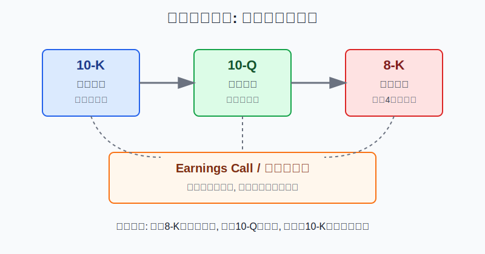
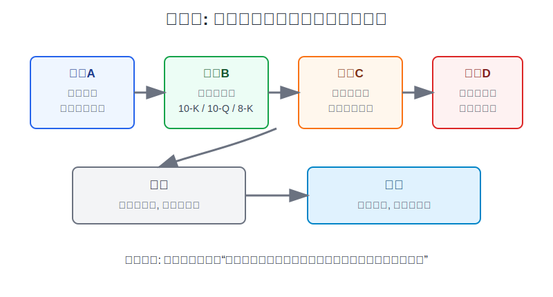
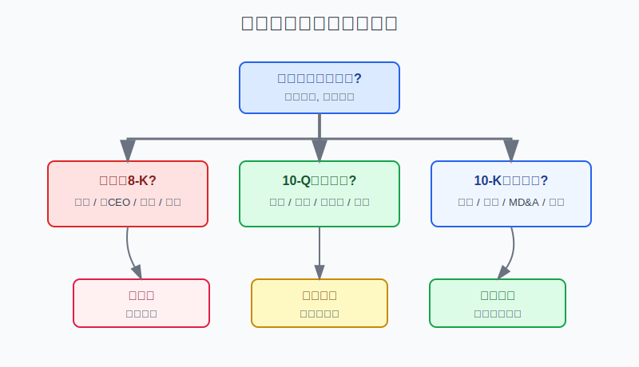

## 散户投资小白金融全品种操盘手册 - 9.12 美股信息披露体系 - 10-K、10-Q、8-K、Earnings Call
  
### 作者  
digoal  
  
### 日期  
2026-06-07   
  
### 标签  
金融产品 , 金融工具 , 散户 , 投资小白 , 全品操盘手册  
  
----  
  
## 背景 
   

> 适用读者: 已经能买美股, 但主要靠中文社区、短视频、券商新闻和股价涨跌判断公司的小白投资者。  
> 本文定位: 投资教育框架, 不构成个性化投资建议。规则口径按 2026-06-06 可核查公开资料整理, 实盘前仍要以 SEC、交易所和公司最新披露为准。

## 先问一个反直觉的问题

美股的信息比A股更透明, 但这不等于小白更容易看懂。透明市场的坑在于: **真正有用的信息公开放在那里, 但你不看; 最容易上头的解读到处推给你, 你反而天天看。**

## 核心概念: 披露文件不是法律作业, 而是公司的体检报告

把一家美股公司想成一个人。

**10-K** 是年度体检报告。它一年一次, 内容最完整, 包括公司做什么生意、靠什么赚钱、有哪些风险、管理层怎么解释经营结果、审计后的财务报表。它不适合用来抢一分钟行情, 但适合回答一个根问题: 这家公司到底是不是值得长期研究。

**10-Q** 是季度复查报告。它在前三个季度后披露, 财务报表通常未经审计, 但能告诉你过去三个月收入、利润、现金流、风险因素和管理层解释有没有变化。它适合回答: 最近一个季度, 公司是在变好、变坏, 还是只是股价在动。

**8-K** 是重大事件通知。公司遇到股东应该知道的重要事情, 例如并购、重大协议、管理层变动、退市通知、财务重述、重大网络安全事件、财报发布等, 通常要更快披露。它适合回答: 今天股价突然大涨大跌, 公司层面到底发生了什么。

**Earnings Call** 是财报电话会。它不是另一份正式财报, 而是管理层对财报的解释和问答。它的价值在于听管理层怎么讲未来, 但它的风险也在这里: 管理层永远有动力把故事讲得更顺。小白应该听, 但不能只听。

所以本节先给行动结论: **买美股个股前, 至少完成一次“8-K查突发、10-Q看变化、10-K看底盘、电话会看解释”的四步检查; 做不到, 就不要把个股仓位做大。**

## 逻辑推导链

【论证链标题】: 因为 SEC 披露文件是美股公司最接近事实原始层的信息, 但不同文件解决不同问题且仍可能失真, 所以小白应先读原始披露, 再看二手解读, 并用仓位控制承认自己的理解边界。

### 第一步: 前提陈述

前提A: 美国上市公司有定期披露义务。这是常量。国内公司通常用 Form 10-K 交年报, 用 Form 10-Q 交前三个季度的季报, 这些文件可以在 SEC 的 EDGAR 系统查到。它像公司的公开档案柜, 你不一定能马上看懂, 但它比社区截图、财经标题和券商摘要更接近源头。

前提B: 10-K、10-Q、8-K 解决的问题不同。这是常量。10-K解决“这家公司长期是什么样”, 10-Q解决“最近季度变成什么样”, 8-K解决“重大事件发生了什么”。如果你把 8-K 当长期研究, 容易被突发消息带着跑; 如果你只看 10-K, 又可能错过最近的风险变化。

前提C: Earnings Call 提供管理层解释, 但不是审计后的完整事实。这是变量。电话会能补充“为什么”和“未来怎么看”, 也可能放大管理层叙事。Regulation FD 的基本精神是避免选择性披露重大非公开信息, 但这不代表电话会里的每句话都等于可验证事实。

前提D: 披露文件不是防骗护身符。这是常量。SEC 设置披露要求, 公司和高管要对 10-K、10-Q 负责, 但 SEC 不为每一份文件的准确性背书。真实世界里, 公司仍可能财务造假、延迟披露、调整口径或用 Non-GAAP 指标包装结果。Non-GAAP 指标就是不按美国通用会计准则直接计算的指标, 例如调整后利润; 它能帮助理解经营, 也能掩盖真实成本。

### 第二步: 逻辑推导

由A可得: 因为公司必须把关键经营和财务信息放进公开披露, 所以小白研究美股个股的第一站不是中文社区, 而是 EDGAR 和公司 Investor Relations 页面。

由A+B可得: 因为文件各有分工, 所以正确阅读顺序不是从头啃几百页, 而是带问题查文件。股价突然跳, 先看 8-K; 判断季度变化, 看 10-Q; 判断长期持有, 看 10-K。

再由B+C可得: 因为电话会解释的是管理层视角, 所以它必须和 10-Q、10-K 里的数字、风险因素、现金流、审计意见互相核对。管理层说“需求强劲”, 你要去看收入增速、递延收入、库存、应收账款和现金流有没有支持它。

最后由A+B+C+D可得: 因为原始披露更可靠但并非绝对可靠, 所以小白不能把“我看过一篇财报解读”当成重仓理由。正确结论是: **没看披露文件, 不买个股; 只看懂一半, 只用观察仓; 文件之间互相打架, 先停手。**

### 第三步: 正常情景下的操作结论

✅ 正常情景: 你想买一只美股个股, 不是指数ETF; 你没有内部信息, 也没有行业深度研究能力; 你看到的主要材料来自新闻、社区或券商研报摘要。

对应操作: 先去 EDGAR 或公司 IR 页面下载最近的 10-K、最近一份 10-Q、最近30天 8-K 和最新 Earnings Call transcript。如果四份材料里, 你不能用自己的话回答“公司怎么赚钱、最近变没变、主要风险是什么、管理层解释是否被数字支持”, 那么不买或只放入观察清单。

### 第四步: 数据和案例证实

证据1: SEC 投资者教育材料说明, 10-K 和 10-Q 能提供公司业务、风险、经营和财务结果的详细图像; 10-K 通常包含经审计财务报表, 10-Q 则在前三个季度后提交, 用来更新季度结果。这个证据验证前提A和B: 披露文件不是可选阅读, 而是美股个股研究的基础入口。

证据2: 披露有明确时限。17 CFR 249.310 规定, 大型加速申报公司 Form 10-K 通常在财年结束后60天内提交, 加速申报公司75天, 其他申报公司90天; 17 CFR 249.308a 规定, 大型加速和加速申报公司的 Form 10-Q 通常在季度结束后40天内提交, 其他公司45天。Form 8-K 的 SEC 表格说明也写明, 除特别规定外, 触发事件后通常4个工作日内提交或提供。这个证据说明: 不同文件不仅内容不同, 速度也不同。

证据3: SEC 的 8-K 投资者说明把 8-K 称为 current report, 用于披露股东应知道的重大事件, 并指出公司通常有4个工作日提交。这个证据验证前提B: 8-K 是突发事件层的信息, 不能拿它替代 10-K 的长期研究, 但也不能在重大事件发生时忽视它。

证据4: Regulation FD 相关 SEC 材料把 earnings information 列为需要审慎判断是否重大的信息类型, 并限制向分析师或机构选择性披露重大非公开信息。这个证据验证前提C: 电话会有信息价值, 但它的制度背景是公平披露, 不是“管理层说什么都可信”。

失败案例: 瑞幸咖啡是最适合小白记住的反例之一。SEC 在 2020-12-16 公告中称, Luckin Coffee 从至少2019年4月至2020年1月通过关联方等方式虚构超过3亿美元零售销售, 并同意支付1.8亿美元罚款以和解会计欺诈指控。这个案例说明前提D: 公司上了美国市场、发过财务材料、讲过增长故事, 也不等于数字一定真实。披露体系提高了查证机会, 但不能替代怀疑精神和仓位控制。

历史案例不代表所有中概股或所有成长股都有同类问题, 但它有一条稳定教训: 如果增长故事太顺、现金流跟不上、风险披露和管理层叙事不一致, 小白不要用“大家都在买”替代文件核对。

### 第五步: 前提变化时的替代结论

若前提A改变, 也就是你买的不是普通美国国内上市公司, 而是 ADR 或外国私人发行人, 推导路径变为: 因为它可能使用 20-F、6-K 等不同披露表格, 而不是完整套用 10-K、10-Q、8-K, 所以你不能照搬国内公司阅读顺序。新结论: 先确认公司身份和适用表格, 再查文件。

若前提B改变, 也就是公司最近出现并购、换审计师、财务重述、退市通知、重大诉讼或网络安全事件, 推导路径变为: 因为重大事件会改变原来的长期判断, 所以最近的 8-K 优先级高于旧 10-K。新结论: 先读 8-K, 不清楚事件影响前不加仓。

若前提C改变, 也就是电话会里的说法和文件数字不一致, 推导路径变为: 因为口头解释没有被财务数据支持, 所以管理层叙事可信度下降。新结论: 降低估值假设, 只保留观察仓或退出。

若前提D改变, 也就是文件本身出现红旗, 例如 auditor opinion 异常、internal control material weakness、财务重述、应收账款大增但现金流变差, 推导路径变为: 因为原始文件已经提示质量问题, 所以不能用低估值或股价大跌来安慰自己。新结论: 先排雷, 后谈买入。

## 实操例子: 想买一只大涨后的AI美股怎么办

这个例子对应论证链的正常结论: **个股买入前先完成披露检查; 看不懂就降仓位, 文件打架就停手。**

假设小林有10万元人民币等值的全球资产配置账户, 其中美股个股学习仓上限是总资产的10%, 单只个股上限是2%。他看到一只AI软件公司过去三个月涨了60%, 社区里都在说“下一只十倍股”。

第一步, 先查最近30天 8-K。小林不先看K线, 而是看公司有没有发布财报、重大合同、增发、管理层变动、并购、会计师变更或财务重述。如果最近 8-K 显示公司刚宣布发行新股, 那么股价上涨背后可能叠加摊薄风险。这个动作对应前提B。

第二步, 查最近 10-Q。小林只看四组数: 收入增速、毛利率、经营现金流、应收账款。假设收入同比增长40%, 但经营现金流持续为负, 应收账款增速高于收入增速, 那么“收入高增长”不能直接等于“生意质量好”。这个动作对应前提C的核对要求。

第三步, 查最近 10-K。小林重点读 Business、Risk Factors、MD&A、Financial Statements and Supplementary Data、Controls and Procedures。Risk Factors 不是废话区, 它告诉你公司自己承认哪些事可能伤害业务; Controls and Procedures 告诉你披露控制和内部控制有没有问题。这个动作对应前提D。

第四步, 再听 Earnings Call。小林把管理层说法分成三类: 已发生事实、未来指引、情绪性表述。已发生事实必须能在 10-Q 或 8-K 找到数字; 未来指引要写进自己的假设; 情绪性表述, 例如“需求非常强劲”“客户反馈很好”, 只能作为线索, 不能当作买入依据。

第五步, 给仓位做结论。如果四步检查都通过, 小林也只能用不超过总资产2%的观察仓买入, 因为他还不是行业专家。如果 8-K 有重述、10-Q 现金流恶化、10-K 内控有重大缺陷, 那么哪怕股价已经跌了30%, 也不抄底。

如果操作错误, 后果通常不是马上亏钱, 而是买入理由从第一天就不清楚。股价涨了, 他会以为自己懂; 股价跌了, 他找不到该止损还是补仓。纠偏方法是把每次个股下单前的理由写成四句话: 8-K 没有重大红旗; 10-Q 证明季度趋势仍在; 10-K 没有破坏长期逻辑的风险; 电话会解释被数字支持。写不出来, 不下单。

## 可复用框架

【四层披露法】

适用前提: 你研究的是普通美国上市公司个股, 需要判断是否买入、持有或卖出。

核心逻辑: 因为不同披露文件对应不同时间尺度, 所以先用 8-K 排突发, 再用 10-Q 看季度变化, 再用 10-K 看长期底盘, 最后用电话会理解管理层解释。

操作步骤:

1. 8-K: 查最近30天有没有重大事件。
2. 10-Q: 看收入、利润、现金流和风险因素是否变化。
3. 10-K: 看业务、风险、MD&A、审计意见和内控。
4. Earnings Call: 核对管理层解释是否被文件数字支持。

前提失效时: 如果公司是外国私人发行人, 先换成 20-F、6-K 等适用表格; 如果文件之间互相冲突, 先停手, 不用股价走势替代解释。

举一反三: 这个框架也适用于港股财报、A股年报季报和跨境ETF成分股研究。只要你买的是公司, 就要先看公司自己正式披露了什么。

【三不重仓】

适用前提: 你准备买美股个股, 但研究能力还在入门阶段。

核心逻辑: 因为披露文件降低信息不对称, 但不能消灭理解错误和财务造假, 所以用仓位承认自己的知识边界。

操作步骤:

1. 没读最近 10-K、10-Q、8-K, 不重仓。
2. 只听电话会或只看中文解读, 不重仓。
3. 看见会计、现金流、审计、内控红旗, 不重仓。

前提失效时: 即使你已经读过文件, 只要新的 8-K 出现重大事件, 原仓位结论立刻作废, 重新评估。

举一反三: 这个框架也适用于高波动中概股、小盘股、SPAC、Meme股和主题股。越靠故事驱动, 越不能跳过披露检查。

## 本节行动清单

| 动作 | 合格标准 |
|---|---|
| 建立资料入口 | 收藏 SEC EDGAR 和公司 Investor Relations 页面 |
| 先查 8-K | 买入前看最近30天重大事件, 尤其是重述、换审计师、退市、增发、管理层变动 |
| 再看 10-Q | 至少比较收入、利润、经营现金流、应收账款、风险因素变化 |
| 补读 10-K | 重点读 Business、Risk Factors、MD&A、Financial Statements、Controls and Procedures |
| 电话会只做核对 | 管理层说法必须回到文件数字验证 |
| 文件打架先停手 | 叙事和现金流、利润、风险披露不一致时, 不加仓 |
| 看不懂就降仓位 | 看不懂披露不丢人, 看不懂还重仓才危险 |

## 一句话总结

美股披露体系给散户的真正优势不是“消息更多”, 而是“原始文件公开”; 小白只要坚持先查 8-K、再读 10-Q、再用 10-K 校准长期逻辑, 就能少被二手故事牵着走。

## 参考资料

- SEC Investor.gov: How to Read a 10-K/10-Q, 2021-01-25, https://www.investor.gov/introduction-investing/general-resources/news-alerts/alerts-bulletins/investor-bulletins/how-read
- SEC Investor.gov: Using EDGAR to Research Investments, https://www.investor.gov/index.php/introduction-investing/getting-started/researching-investments/using-edgar-research-investments
- SEC Investor.gov: Form 8-K, https://www.investor.gov/introduction-investing/investing-basics/glossary/form-8-k
- SEC: Form 8-K, https://www.sec.gov/files/form8-k.pdf
- 17 CFR 249.310: Form 10-K, https://ecfr.io/Title-17/Section-249.310
- 17 CFR 249.308a: Form 10-Q, https://ecfr.io/Title-17/Section-249.308a
- SEC: Selective Disclosure and Insider Trading, Regulation FD adopting release, 2000-08-15, https://www.sec.gov/rules-regulations/2000/08/selective-disclosure-insider-trading
- SEC: Luckin Coffee Agrees to Pay $180 Million Penalty to Settle Accounting Fraud Charges, 2020-12-16, https://www.sec.gov/newsroom/press-releases/2020-319

> ⚠️ **声明**：本文内容为投资教育目的，所有历史数据、策略框架均为辅助学习工具，不构成证券投资建议。市场有风险，投资需谨慎。实际操作请结合自身风险承受能力，必要时咨询专业投顾。
  
#### [PostgreSQL 解决方案集合](../201706/20170601_02.md "40cff096e9ed7122c512b35d8561d9c8")
  
  
#### [德哥 / digoal's Github - 公益是一辈子的事.](https://github.com/digoal/blog/blob/master/README.md "22709685feb7cab07d30f30387f0a9ae")
  
  
#### [About 德哥](https://github.com/digoal/blog/blob/master/me/readme.md "a37735981e7704886ffd590565582dd0")
  
  

  
