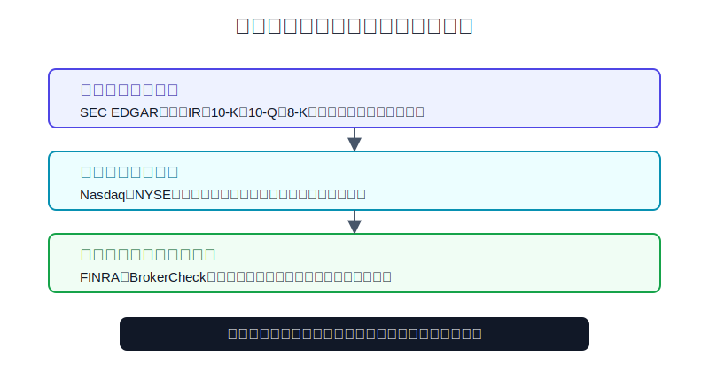
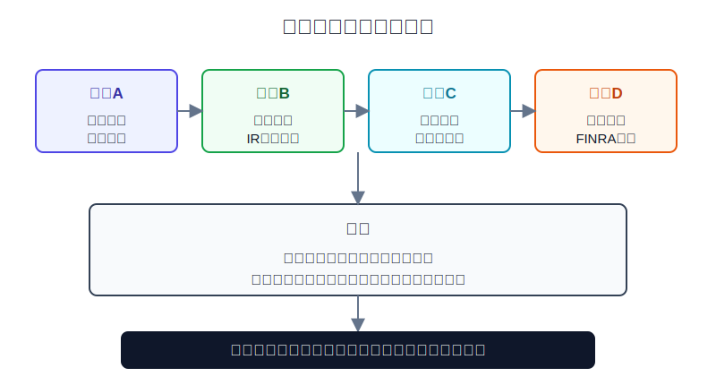
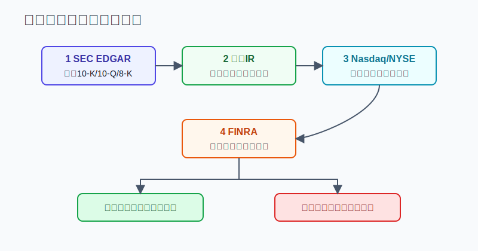

## 散户投资小白金融全品种操盘手册 - 9.13 常用数据来源 - SEC EDGAR、公司IR、Nasdaq、NYSE、FINRA
  
### 作者  
digoal  
  
### 日期  
2026-06-07   
  
### 标签  
金融产品 , 金融工具 , 散户 , 投资小白 , 全品操盘手册  
  
----  
  
## 背景 
   

> 适用读者: 已经会打开美股行情页面，但不知道哪些数据能当作决策依据的小白投资者。  
> 本文定位: 投资教育框架，不构成个性化投资建议。资料口径按 2026-06-06 可核查公开信息整理。

## 先问一个反直觉的问题

美股信息最多的地方，往往不是最可靠的地方。你在社区里看到一句“公司业绩爆了”，在行情软件里看到一根大阳线，都不等于事实已经成立。**小白真正要学的不是收藏更多网站，而是知道每个网站只能回答哪一个问题。**

## 核心概念: 数据源不是资料堆，而是验真顺序

把美股研究想成看病。SEC EDGAR 像医院原始检查报告，公司 IR 像医生对检查结果的解释，Nasdaq 和 NYSE 像挂号和营业时间系统，FINRA 像监管和行为记录。你不能只听病友群的结论，也不能只看体温计。

**SEC EDGAR** 是美国证券交易委员会的公开披露系统。10-K 是年报，10-Q 是季报，8-K 是重大事件当前报告。它回答的问题是: 公司正式向监管提交了什么。

**公司 IR** 是公司投资者关系页面。它通常放财报新闻稿、电话会材料、演示文稿和 SEC filings 链接。它回答的问题是: 公司希望投资者怎样理解这些披露。

**Nasdaq 和 NYSE** 是交易所与市场基础信息入口。它们更适合确认上市地、交易时间、假期、报价、市场状态，而不是替代财报研究。

**FINRA** 是美国金融业监管局。它适合查券商和从业人员背景，也能查做空持仓、做空成交量等市场行为数据。它回答的问题是: 交易中介是否合规，市场拥挤度有没有额外信号。

所以本节先给行动结论: **买美股前，先用 SEC EDGAR 和公司 IR 确认事实，再用 Nasdaq/NYSE 确认交易规则，最后用 FINRA 查券商资质和市场行为；如果三类信息互相打架，默认不追单。**

## 逻辑推导链

【论证链标题】: 因为不同数据源回答的问题不同，所以小白必须按“事实披露 -> 交易规则 -> 监管行为”顺序核对，不能用单一行情信号替代研究。

### 第一步: 前提陈述

前提A: 公司基本面事实必须优先来自原始披露。这是常量。SEC 的 EDGAR Search Filings 页面提供免费公开访问，可以搜索上市公司等主体提交的披露文件；Investor.gov 对 10-K、10-Q、8-K 的解释也明确区分了年报、季报和当前报告。对小白来说，EDGAR 就是“原件”。

前提B: 公司 IR 有解释价值，但它天然带有公司视角。这是常量。苹果投资者关系页面把 SEC Filings、季度业绩和年度报告集中展示；这很方便，但 IR 的新闻稿会强调管理层想表达的重点，所以要回到 10-K、10-Q、8-K 交叉核对。

前提C: Nasdaq 和 NYSE 主要回答“能不能交易、什么时候交易、在哪个市场交易”。这是常量。NYSE 公布核心交易时段为美东时间 9:30 到 16:00；Nasdaq 的交易时间页面也列出盘前、常规盘和盘后安排。交易所数据能确认市场规则，但不能替你判断公司值不值得买。

前提D: FINRA 数据能辅助识别中介风险和拥挤交易，但不能直接变成买卖信号。这是变量。FINRA BrokerCheck 的信息来自 CRD 等注册和执照数据库；FINRA 短仓数据按规则每月两次报告。它能帮助你避免“券商不正规”和“把做空成交量误当做空持仓”这类错误，但不能告诉你股票明天涨跌。

### 第二步: 逻辑推导

由A可得: 因为公司正式披露才是最接近事实源头的信息，所以研究一只美股，第一步不是看社区观点，而是打开 EDGAR 或公司 IR 的 SEC filings 页面，找到最新 10-K、10-Q、8-K。

由A+B可得: 因为 IR 能帮你快速理解财报，但它不是中立裁判，所以你可以先读财报新闻稿抓重点，再回 10-Q 或 10-K 看收入、利润、现金流、风险因素和管理层讨论是否一致。

再由B+C可得: 因为交易所信息解决的是交易规则，不解决价值判断，所以“Nasdaq 页面显示价格在涨”不能推出“公司基本面变好”。价格是结果，披露才是证据。

再由C+D可得: 因为 FINRA 提供的是中介与市场行为数据，所以它适合放在下单前的最后一层校验。例如查券商是否注册，查短仓数据是否真的来自官方口径，而不是被自媒体改写后的“传说数字”。

最后由A+B+C+D可得: 因为每个数据源都有边界，所以小白的正确动作不是找一个“万能网站”，而是按顺序验源。事实不清楚，不下单；规则不清楚，不下单；数据口径不清楚，降仓或等待。

### 第三步: 正常情景下的操作结论

✅ 正常情景: 你准备买入一只美股ETF或龙头个股，资金不是短期要用的钱，没有借钱交易，也没有稳定的信息核对流程。

对应操作: 先查 EDGAR 或公司 IR 的最新披露，再查 Nasdaq/NYSE 的交易时间、上市地和市场状态，最后用 FINRA 做券商资质和做空数据口径校验。只有当“公司事实、交易规则、监管数据口径”都能说清楚，才允许按计划下小仓位。

### 第四步: 数据和案例证实

证据1: SEC 和 Investor.gov 明确区分披露文件层级。Investor.gov 的 EDGAR 指南把 10-K 定义为 annual report，10-Q 定义为 quarterly report，8-K 定义为 current report；Investor.gov 的 8-K 页面还说明，公司通常要在触发事件后 4 个工作日内提交 8-K。这个证据验证了前提A: 美股公司信息不是“等一年看一次年报”，重大事件有更快的披露渠道。

证据2: 公司 IR 和 SEC 披露可以互相印证。苹果公司投资者关系页面在 2025 年披露列表中显示，2025-10-31 有 10-K 年报，2025-10-30 有 8-K 当前报告。这说明同一家公司通常会把 SEC filings 和业绩材料放在 IR 中集中展示。小白可以用 IR 快速入口找文件，但要记住最终文件仍是 SEC 披露。

证据3: 交易所数据解决的是交易规则。NYSE 官方交易时间页面显示核心交易时段为 9:30 到 16:00 ET；Nasdaq 页面显示盘前为 4:00 到 9:30 ET，常规盘开盘和收盘分别为 9:30 与 16:00。这个证据验证了前提C: 交易所适合确认“什么时候交易、市场是否开放”，不是拿来替代财报分析。

证据4: FINRA 做空数据有明确频率和边界。FINRA Short Interest Reporting 页面说明，会员机构要每月两次报告所有客户和自营账户中的股票空头持仓，并且通常要在指定结算日后第二个工作日美东时间 18:00 前提交。FINRA 也提醒，daily short sale volume 不等于 short interest。这个证据验证了前提D: 做空数据能用，但口径错了就会误导。

失败案例: 小林在社交平台看到“某股票做空量暴增，马上要逼空”，于是准备追涨。他打开 FINRA 后发现，帖子把 daily short sale volume 当成 short interest。前者是某些场外成交中被标记为空头卖出的成交量，后者是两次月度报告日上的空头持仓快照。因为口径不同，所以“当天空头成交多”不能推出“现有空头仓位巨大”。如果小林不核对，就可能把一个成交统计误读成买入理由。

历史数据不代表未来，但数据口径有长期参考价值。原因很简单: 股票会换热点，监管披露框架和交易记录口径不会每天重写。小白先学会口径，比猜下一条消息更重要。

### 第五步: 前提变化时的替代结论

若前提A改变，也就是公司没有最新 10-K、10-Q，或者你只看到二手截图，推导路径变为: 因为事实源头缺失，所以买入理由没有地基。新结论: 不下单，先找 SEC filings、公司 IR 或确认它是否属于外国发行人、OTC 公司等不同披露体系。

若前提B改变，也就是公司 IR 新闻稿很好看，但 10-Q 里风险因素、现金流或指引出现压力，推导路径变为: 因为公司叙事和正式报表不一致，所以不能只相信新闻稿。新结论: 降低仓位或放弃买入，等下一份披露验证。

若前提C改变，也就是交易所显示盘前盘后价格剧烈波动、成交很薄，推导路径变为: 因为交易时间和流动性不支持正常成交，所以价格信号失真。新结论: 等常规盘，使用限价单，不在薄盘口追。

若前提D改变，也就是 FINRA 或 BrokerCheck 显示券商、从业人员存在异常记录，推导路径变为: 因为交易中介风险高于标的研究收益，所以先处理账户安全。新结论: 暂停入金或交易，换到可核查资质的平台。

## 实操例子: 看到一只美股财报大涨，买入前怎么查

这个例子对应论证链的正常结论: **三类信息一致才按计划下单；不一致就降仓或等待。**

假设小林有 1 万美元美股学习资金，核心仓是宽基ETF，最多拿 1000 美元做单只龙头个股观察仓。某科技公司财报后盘后上涨 8%，社区里都在说“业绩爆了”。

第一步，打开 SEC EDGAR 或公司 IR 的 SEC filings 页面，找最新 10-Q 或 8-K。小林不先看帖子结论，而是先确认这次业绩是否已经通过 8-K 或 10-Q 披露。判断依据对应前提A: 先拿原件。

第二步，读公司 IR 的财报新闻稿和电话会材料，只抓三件事: 收入是否增长，利润率是否改善，管理层对下一季度的 guidance 是否上调。Guidance 是管理层对未来业绩的指引，不是保证。判断依据对应前提B: IR 帮你抓重点，但要回报表核对。

第三步，回到 10-Q 看现金流和风险因素。如果新闻稿说增长很好，但经营现金流没有跟上，或者风险因素新增了监管、供应链、客户集中问题，小林不把这笔交易当成“确定性机会”。判断依据仍然是 A+B 的交叉验证。

第四步，查 Nasdaq 或 NYSE 的交易状态和时间。如果现在是盘后，小林只记录价格，不用市价单追。若第二天常规盘仍然成交活跃、买卖价差可接受，才考虑按 1000 美元上限中的一部分下限价单。判断依据对应前提C。

第五步，查 FINRA 数据只做辅助。若社交平台说“空头爆仓”，小林要区分 short interest 和 daily short sale volume。即使 short interest 较高，也只能说明交易拥挤度，不等于公司基本面变好。判断依据对应前提D。

第六步，写下买入条件和失效条件。例如: 若最新 10-Q 证实收入和自由现金流同向改善，且常规盘不追高超过计划价，最多买 500 美元；若只是盘后情绪上涨，或公司 IR 与正式披露不一致，则不买。操作错误的后果很直接: 你会把“别人替你解读的数据”当成自己的判断，涨了归运气，跌了不知道错在哪。

## 可复用框架

【四层验源】

适用前提: 你准备研究一只美股个股、ETF或ADR，但信息来源很多，真假难分。

核心逻辑: 因为每个数据源只回答一类问题，所以按事实、解释、规则、行为四层核对。

操作步骤:

1. 事实层: SEC EDGAR 查 10-K、10-Q、8-K。
2. 解释层: 公司 IR 查业绩新闻稿、电话会材料、投资者演示。
3. 规则层: Nasdaq/NYSE 查上市地、交易时间、假期和市场状态。
4. 行为层: FINRA 查券商背景、短仓数据和做空成交量口径。

前提失效时: 任何一层缺失或冲突，都不把仓位打满；事实层缺失时，直接停止买入。

举一反三: 这个框架也适用于港股、ADR、中概股和美股ETF。只是不同市场的一手披露入口会变化。

【三问下单】

适用前提: 你已经想买，但还没有写清楚买入依据。

核心逻辑: 因为小白最容易被价格波动推着走，所以下单前必须把数据源转成三个可回答的问题。

操作步骤:

1. 公司自己正式披露了什么?
2. 交易所规则和当前成交环境允许我按计划成交吗?
3. FINRA 或券商资质、做空数据口径有没有明显异常?

前提失效时: 第一个问题答不出，不买；第二个问题答不出，等常规盘或限价；第三个问题答不出，降低仓位或换平台。

举一反三: 这个框架也能用在财报季、突发新闻、盘后跳涨跳跌和热门股逼空传闻中。

## 本节行动清单

| 动作 | 合格标准 |
|---|---|
| 收藏 EDGAR | 会用公司名、ticker 或 CIK 搜 10-K、10-Q、8-K |
| 收藏公司 IR | 能找到 SEC filings、季度业绩、电话会材料 |
| 区分文件功能 | 10-K 看全年和审计报表，10-Q 看季度更新，8-K 看重大事件 |
| 使用交易所信息 | Nasdaq/NYSE 用来查交易时间、假期、上市地、市场状态 |
| 使用 FINRA | BrokerCheck 查券商/人员，short interest 查官方做空持仓口径 |
| 拒绝单一信号 | 只看到涨跌、截图、热帖、短视频，不构成买入理由 |
| 记录冲突 | IR 和 SEC 披露不一致、价格和流动性不匹配时，先复核不追单 |

## 一句话总结

美股数据源的正确用法不是“哪个网站最神”，而是先用 SEC 和公司 IR 确认事实，再用 Nasdaq/NYSE 确认交易规则，最后用 FINRA 校验中介和市场行为；事实、规则、口径说不清，就不急着下单。

## 参考资料

- SEC: Search Filings, https://www.sec.gov/search-filings
- SEC: EDGAR Full Text Search, https://www.sec.gov/edgar/search/
- Investor.gov: Using EDGAR to Research Investments, https://www.investor.gov/introduction-investing/getting-started/researching-investments/using-edgar-research-investments
- Investor.gov: How to Read a 10-K/10-Q, https://www.investor.gov/introduction-investing/general-resources/news-alerts/alerts-bulletins/investor-bulletins/how-read
- Investor.gov: Form 8-K, https://www.investor.gov/introduction-investing/investing-basics/glossary/form-8-k
- Apple Investor Relations: SEC Filings, https://investor.apple.com/investor-relations/sec-filings/default.aspx
- NYSE: Holidays and Trading Hours, https://www.nyse.com/markets/hours-calendars
- Nasdaq: U.S. Holiday & Trading Hours, https://www.nasdaq.com/holiday-trading-hours
- FINRA: BrokerCheck FAQ, https://www.finra.org/investors/investing/working-with-investment-professional/about-brokercheck/faq
- FINRA: Short Interest Reporting, https://www.finra.org/filing-reporting/regulatory-filing-systems/short-interest
- FINRA: Short Interest - What It Is, What It Is Not, https://www.finra.org/investors/insights/short-interest

> ⚠️ **声明**：本文内容为投资教育目的，所有历史数据、策略框架均为辅助学习工具，不构成证券投资建议。市场有风险，投资需谨慎。实际操作请结合自身风险承受能力，必要时咨询专业投顾。
  
#### [PostgreSQL 解决方案集合](../201706/20170601_02.md "40cff096e9ed7122c512b35d8561d9c8")
  
  
#### [德哥 / digoal's Github - 公益是一辈子的事.](https://github.com/digoal/blog/blob/master/README.md "22709685feb7cab07d30f30387f0a9ae")
  
  
#### [About 德哥](https://github.com/digoal/blog/blob/master/me/readme.md "a37735981e7704886ffd590565582dd0")
  
  

  
