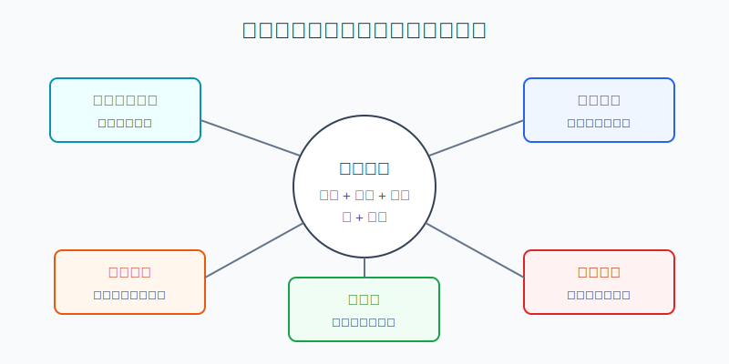
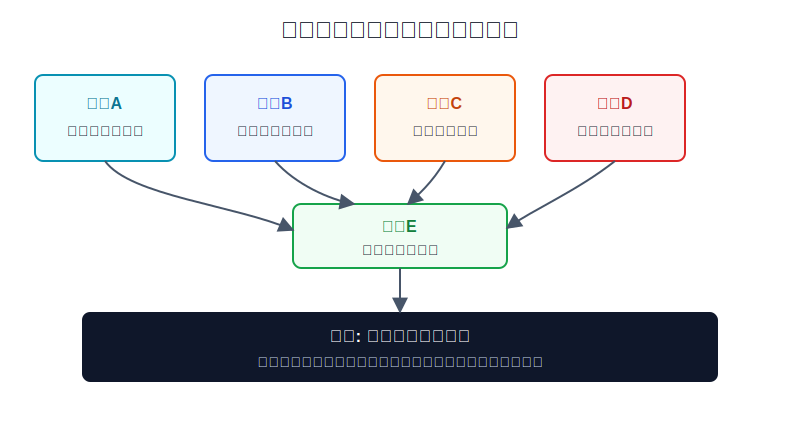
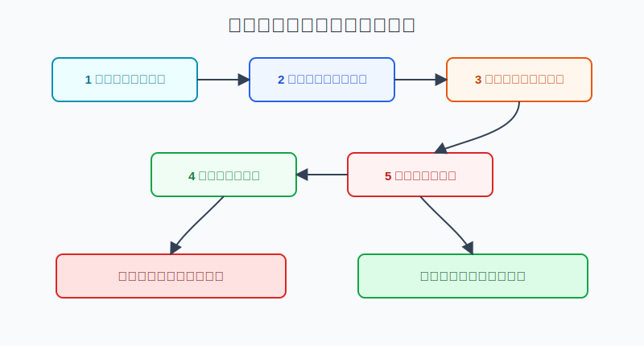

## 散户投资小白金融全品种操盘手册 - 9.14 小白常见误区 - 只看中文社区、只看股价、不看汇率、不看税、不看估值
  
### 作者  
digoal  
  
### 日期  
2026-06-07   
  
### 标签  
金融产品 , 金融工具 , 散户 , 投资小白 , 全品操盘手册  
  
----  
  
## 背景 
   

> 适用读者: 已经知道美股参与路径、交易规则和信息披露体系，但准备开始下第一笔单的小白投资者。  
> 本文定位: 投资教育框架，不构成个性化投资建议。规则口径按 2026-06-06 可核查公开资料整理，实盘前仍要以交易平台、税务规则和自身身份为准。

## 先问一个反直觉的问题

很多小白买美股亏钱，不是因为看不懂英文，而是因为只看了最容易看的东西: 中文社区的热帖、股价涨跌、别人晒的收益。真正决定你拿到手多少钱的，反而是几个“不显眼”的变量: 原始披露、总市值、汇率、税和估值。

## 核心概念: 买美股不是买一个代码，而是买一套结算结果

你在软件里看到的只是一个股票代码和一个美元价格，但真实交易结果不是这么简单。

**中文社区**像别人帮你翻译的菜单。它有用，可以帮你快速知道市场在讨论什么，但它不是厨房，也不是账单。真正的原材料在公司公告、SEC EDGAR、公司投资者关系页面和交易所披露里。

**股价**只是每一小份的价格，不是整家公司便宜还是贵。10美元一股的公司，如果有50亿股，总市值就是500亿美元；200美元一股的公司，如果只有2000万股，总市值是40亿美元。小白说“这只股票才10美元，好便宜”，就像只看一块披萨多少钱，却不看整张披萨有多大。

**汇率**会把美元收益翻译成人民币收益。你买美股赚了8%，如果美元兑人民币贬值5%，折回人民币后就不是8%。反过来，股票没怎么涨，但美元升值，也会让人民币口径收益变好。它不是附加题，而是海外投资的组成部分。

**税**会影响现金流。尤其是高分红股票、REITs和分红型ETF，税前分红率不等于你实际收到的分红率。对非美国居民来说，美国来源收入的预扣税、W-8BEN和税收协定口径，都要在买入前弄清楚。

**估值**是市场已经为好消息付了多少钱。好公司可以太贵，便宜股票也可以更便宜。小白最容易犯的错，是把“公司厉害”直接等同于“现在可以买”。

所以本节先给行动结论: **下单前先过五问: 信息从哪里来、股价对应多大市值、人民币口径收益怎么算、税后现金流剩多少、估值是否已经透支预期。五问答不上，先不买。**

## 逻辑推导链

【论证链标题】: 因为美股真实收益由信息质量、价格含义、汇率、税和估值共同决定，所以小白下单前必须做五项检查，而不是被社区热度和股价跳动牵着走。

### 第一步: 前提陈述

前提A: 中文社区是二手信息。这是变量。好的帖子可以节省入门时间，但社区内容会有情绪、立场、延迟和利益冲突。它像别人给你的旅游攻略，能参考，但不能替代护照、机票和酒店确认单。

前提B: 股价不是便宜或贵的充分证据。这是常量。股价要乘以流通或总股本，才变成市场给公司的整体定价；股价还要和利润、收入、现金流、负债放在一起，才谈得上估值。

前提C: 汇率会改变最终收益。这是变量。中国投资者把人民币换成美元买美股，最后还要把美元资产换算回人民币。股票涨跌是一台发动机，汇率涨跌是另一台发动机，两台一起决定你看到账户总收益。

前提D: 税会改变现金流。这是变量。成长股不分红时，税的感受不明显；高分红股票、REITs、分红型ETF和货币市场基金产生现金流时，税后收益和税前展示收益可能差一截。

前提E: 估值决定容错率。这是常量。估值高，不代表马上跌；估值低，也不代表马上涨。但估值越高，市场对增长、利润率和未来指引的要求越苛刻。只要一点点不及预期，股价就可能大幅波动。

### 第二步: 逻辑推导

由A可得: 因为社区信息是二手解释，所以它只能作为线索，不能作为买入依据。真正的买入依据必须回到公司10-K、10-Q、8-K、财报电话会、ETF招募说明书和指数规则。

由A+B可得: 因为社区最容易传播“这票才几美元”“跌了一半很便宜”这种直观说法，所以小白必须把股价还原成市值、收入、利润和现金流。否则你看到的是价格标签，不是资产质量。

再由B+C+D可得: 因为美元价格并不等于人民币收益，税前收益也不等于到手收益，所以买入前要把收益公式写完整: 人民币实际收益 = 美元资产涨跌 + 汇率变化 + 分红 - 预扣税 - 交易与换汇成本。少算一个变量，就会高估收益。

最后由A+B+C+D+E可得: 因为信息、价格、汇率、税和估值任何一个环节出错，都会让买入理由失真，所以小白不能只问“会不会涨”。更好的问题是: **即使我方向看对了，扣掉汇率和税以后是否还值得买；如果估值回落20%，我的仓位是否还能承受。**

### 第三步: 正常情景下的操作结论

✅ 正常情景: 你想买一只美股个股、行业ETF或分红型资产，买入理由主要来自中文社区、短视频、群聊或朋友推荐，自己还没有看过原始披露，也没有算过汇率、税和估值。

对应操作: 先不下单。用五问检查表把买入理由补齐: 第一问，原始资料在哪里；第二问，股价对应多大市值；第三问，人民币口径收益怎么算；第四问，分红或利息税后剩多少；第五问，估值和同类资产相比是否合理。五问里有两问答不上，就把它放回观察清单，而不是放进持仓。

### 第四步: 数据和案例证实

证据1: SEC 的 Investor.gov 说明，EDGAR 数据库提供免费公开渠道，投资者可以查看上市公司向 SEC 提交的文件，用来研究公司的财务信息和经营情况；其中10-K是年度报告，10-Q是季度报告，8-K用于披露重要事件。这个证据验证前提A: 原始披露不是机构专属工具，小白也能用它核对社区说法。

证据2: 社交媒体荐股风险已经被监管机构反复提示。SEC Investor.gov 在“Social Media and Stock Tip Scams”投资者警示中提醒，股票推荐骗局可能通过社交媒体进行；FINRA 在2026年前后的投资者提示中也提到，自2023年秋以来，社交媒体投资群相关投诉明显增加，FBI在2025年7月公告中提到，与2024年相比，涉及“拉高出货”股票欺诈的受害者投诉至少增加300%。这个证据验证前提A: 社区不是不能看，而是不能直接信。

证据3: FINRA 的股票评估材料说明，P/E是用当前股价除以每股收益，P/S是用公司市值除以收入；FINRA 的市值说明也给出例子: 每股20美元、500万股流通，对应市值1亿美元。这个证据验证前提B和E: 股价只是入口，估值要回到市值、盈利和收入。

证据4: FINRA 的风险教育材料把国际投资中的政治风险和货币风险列为重要风险；其货币风险文章也提醒，外币资产会受到汇率变化影响。这个证据验证前提C: 买美股不是只承担股票风险，还承担美元和人民币之间的换算风险。

证据5: IRS 2026年非居民预扣税资料和Publication 515说明，支付给外国人的美国来源收入通常适用30%预扣税，或适用更低的税收协定税率；Form W-8BEN用于证明非美国身份及在适用时主张协定待遇。这个证据验证前提D: 分红税不是细枝末节，尤其会影响高分红策略的真实收益。

失败案例: 小林看到中文社区热帖，说某只美股“从100美元跌到50美元，已经腰斩，便宜”。他没看10-Q，不知道公司收入增速已经从40%降到10%；没算市值，不知道即使跌到50美元，公司仍有800亿美元市值；没看估值，不知道它仍按未来高增长定价；没算汇率，不知道自己换汇后美元若回落，人民币收益会被吃掉；如果买的是高分红资产，他还没把预扣税算进去。结果股票反弹5%时他以为自己看对了，几个月后公司指引下调，估值从高位回落，股价再跌25%。这不是“运气差”，而是五个前提里至少四个没有验证。

历史数据和监管案例不代表未来每一次都会这样，但它们说明一个稳定机制: 信息越二手，价格越直观，越容易让人忽略真正决定收益的变量。

### 第五步: 前提变化时的替代结论

若前提A改变，也就是你能读懂10-K、10-Q和财报电话会纪要，并且社区观点只是帮助你发现线索，推导路径变为: 因为信息源已经回到原始披露，所以可以进入下一步估值和仓位判断。新结论: 社区可以做雷达，不能做方向盘。

若前提B改变，也就是你只是买宽基ETF，而不是买单只个股，推导路径变为: 因为单家公司估值风险被分散，所以检查重点从公司财报转向指数估值、行业集中度、费用率、跟踪误差和汇率。新结论: ETF也要看规则，不是看到“标普500”四个字就无脑买。

若前提C改变，也就是这笔钱未来一年内要换回人民币使用，推导路径变为: 因为汇率波动可能直接影响用钱计划，所以海外权益仓位要下降。新结论: 短期要用的钱，不适合因为社区热门观点去买高波动美股。

若前提D改变，也就是你买的是高分红资产，推导路径变为: 因为税前分红率会被预扣税和费用改变，所以必须先算税后收益率。新结论: 税后收益不明显优于短债、货币基金或国内可替代工具时，不要只为“高息”买入。

若前提E改变，也就是公司估值已经很高，但市场情绪仍然强，推导路径不能变成“贵了还能更贵，所以重仓追”。新结论: 可以观察或小仓试错，但必须写清失效条件和最大亏损；没有估值边界，就没有重仓资格。

## 实操例子: 看到社区推荐一只高分红美股ETF，怎么买才不犯错

这个例子对应论证链的正常结论: **买入前先把社区观点还原成原始资料、人民币收益、税后现金流和估值边界。**

假设小林有10万元人民币闲钱，计划拿2万元等值资金学习美股。他在中文社区看到一只美股高分红ETF，帖子写着“年化分红率8%，美元资产，躺着收息”。他很心动，但不能直接下单。

第一步，先找原始资料。小林去基金公司官网、SEC EDGAR或券商页面查基金招募说明、持仓、费用率、分红历史和指数规则。若只找到社区截图，找不到基金官方资料，这一步不合格。这个动作对应前提A。

第二步，把“8%分红率”改成税后口径。假设该ETF分红属于美国来源收入，非美国居民默认按30%预扣税估算，8%税前分红到手约为5.6%。如果实际身份、税收协定或券商处理不同，再按真实口径调整。这个动作对应前提D。

第三步，把美元收益改成人民币口径。假设买入时美元兑人民币为7.20，未来一年ETF美元价格不变、税后分红5.6%，但美元兑人民币从7.20变成6.90，美元相对人民币贬值约4.2%。那么人民币口径收益大约只剩1.4%，还没扣换汇和交易成本。这个动作对应前提C。

第四步，看估值和资产质量。高分红不是免费午餐。小林要看ETF持仓是不是集中在高负债公司、REITs、能源、金融或衰退行业；也要看分红来自稳定经营现金流，还是来自资产价格下跌后的被动高分红率。这个动作对应前提E。

第五步，设仓位和失效条件。如果五问都通过，小林也只拿2万元学习仓里的5000元等值资金试买，不把它当成保本理财。失效条件写清楚: 税后收益率低于同类短债工具、汇率波动超过自己承受范围、ETF跟踪标的发生变化、持仓行业风险上升，就停止加仓或减仓。

如果操作错误，最常见后果是被“高分红”三个字骗到。税前8%看起来比现金管理工具高很多，扣掉预扣税、汇率和费用后，真实收益可能并不突出；如果ETF本身价格再下跌，分红根本补不回本金波动。纠偏方法不是继续找更高分红率，而是把所有收益统一换成税后、人民币、总回报口径再比较。

## 可复用框架

【五问下单法】

适用前提: 你准备买美股个股、行业ETF、主题ETF、REITs或分红型资产，但买入理由主要来自社区、行情软件或朋友推荐。

核心逻辑: 因为真实收益由信息、价格、汇率、税和估值共同决定，所以先把直观故事拆成五个可验证问题。

操作步骤:

1. 问信息: 买入理由能否在10-K、10-Q、8-K、基金说明书或公司IR里找到对应证据。
2. 问价格: 当前股价对应多大市值，市值和收入、利润、现金流是否匹配。
3. 问汇率: 如果美元兑人民币反向波动3%到5%，这笔交易还是否值得做。
4. 问税费: 分红、利息、交易费、换汇成本扣完后，到手收益还剩多少。
5. 问估值: 当前价格是否已经把好消息算进去了，若估值回落20%能否承受。

前提失效时: 任一问题答不上，先进入观察清单；如果只能靠社区观点解释买入理由，就不进入持仓。

举一反三: 这个框架也适用于港股、中概ADR、跨境ETF和QDII基金。凡是跨市场、跨币种、跨税制的资产，都要先把收益还原。

【收益还原法】

适用前提: 你看到某个美股资产宣传“涨幅高”“分红高”“美元收益高”，但不知道真实到手收益。

核心逻辑: 因为账户最后承受的是本币总回报，所以把所有收益统一还原成同一种口径。

操作步骤:

1. 先算美元总回报: 价格涨跌 + 分红或利息。
2. 再算税后现金流: 分红或利息扣掉预扣税和费用。
3. 最后换成人民币口径: 加上或减去汇率变化。

前提失效时: 如果税务身份不确定、券商预扣规则不清楚、换汇路径不合规，先不做高分红和高频交易。

举一反三: 这个框架也能用在美元债、货币市场基金、QDII分红基金和海外REITs。收益展示口径越漂亮，越要还原到实际到账口径。

## 本节行动清单

| 动作 | 合格标准 |
|---|---|
| 社区观点回原始资料 | 至少能找到公司IR、SEC EDGAR、基金说明书或交易所资料 |
| 股价换成市值 | 不说“几美元很便宜”，先算市值、收入、利润和现金流 |
| 汇率进入收益表 | 每笔海外资产都记录买入汇率和人民币口径盈亏 |
| 税后再比较 | 分红型资产先用30%或适用协定税率估算税后现金流 |
| 估值写边界 | 写清P/E、P/S、现金流或同类ETF估值，不用故事替代价格 |
| 答不上就不买 | 五问里有两问答不上，先观察，不下单 |

## 一句话总结

美股小白最该戒掉的不是看中文社区，而是只看中文社区；最该戒掉的不是看股价，而是只看股价。下单前把信息、价格、汇率、税和估值五个问题答清楚，才算真正知道自己在买什么。

## 参考资料

- SEC Investor.gov: Using EDGAR to Research Investments, https://www.investor.gov/index.php/introduction-investing/getting-started/researching-investments/using-edgar-research-investments
- SEC Investor.gov: How to Read a 10-K/10-Q, https://www.investor.gov/introduction-investing/general-resources/news-alerts/alerts-bulletins/investor-bulletins/how-read
- SEC Investor.gov: Social Media and Stock Tip Scams, https://www.investor.gov/introduction-investing/general-resources/news-alerts/alerts-bulletins/investor-bulletins/social-media-stock-scams
- FINRA: Investor Alert - Social Media Investment Group Imposter Scams Continue to Rise, https://www.finra.org/investors/insights/investment-group-imposter-scams
- FINRA: Evaluating Stocks, https://www.finra.org/investors/investing/investment-products/stocks/evaluating-stocks
- FINRA: Market Cap Explained, https://www.finra.org/investors/insights/market-cap
- FINRA: Risk, https://www.finra.org/investors/investing/investing-basics/risk
- FINRA: Currency Risk - Why It Matters to You, https://www.finra.org/investors/insights/currency-risk-why-it-matters-you
- IRS: NRA Withholding, https://www.irs.gov/individuals/international-taxpayers/nra-withholding
- IRS: Publication 515 (2026), Withholding of Tax on Nonresident Aliens and Foreign Entities, https://www.irs.gov/node/41756
- IRS: Instructions for Form W-8BEN, https://www.irs.gov/instructions/iw8ben

> ⚠️ **声明**：本文内容为投资教育目的，所有历史数据、策略框架均为辅助学习工具，不构成证券投资建议。市场有风险，投资需谨慎。实际操作请结合自身风险承受能力，必要时咨询专业投顾。
  
#### [PostgreSQL 解决方案集合](../201706/20170601_02.md "40cff096e9ed7122c512b35d8561d9c8")
  
  
#### [德哥 / digoal's Github - 公益是一辈子的事.](https://github.com/digoal/blog/blob/master/README.md "22709685feb7cab07d30f30387f0a9ae")
  
  
#### [About 德哥](https://github.com/digoal/blog/blob/master/me/readme.md "a37735981e7704886ffd590565582dd0")
  
  

  
