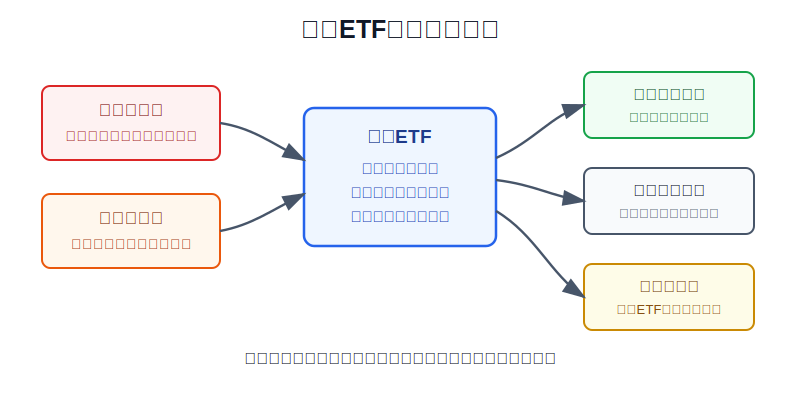
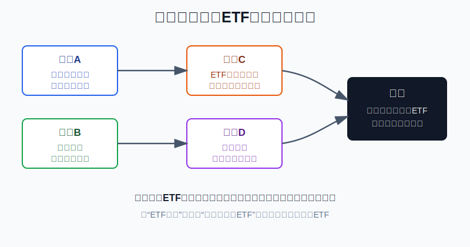
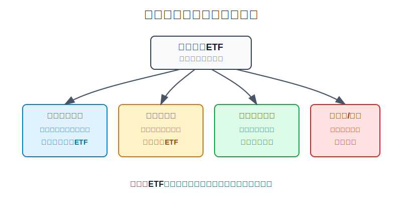

## 散户投资小白金融全品种操盘手册 - 10.1 为什么小白买美股，优先研究指数和ETF
  
### 作者  
digoal  
  
### 日期  
2026-06-07   
  
### 标签  
金融产品 , 金融工具 , 散户 , 投资小白 , 全品操盘手册  
  
----  
  
## 背景 
   

> 适用读者: 已经知道美股可以买个股、ETF和期权，但还不知道第一步该从哪里开始的小白投资者。
> 本文定位: 投资教育框架，不构成个性化投资建议。

## 先问一个反直觉的问题

小白买美股，最容易上来就问: 苹果还能不能买？英伟达贵不贵？特斯拉会不会翻倍？这些问题很吸引人，但顺序错了。**第一课不是猜哪家公司最强，而是先学会用指数和ETF把“单家公司判断”从账户里拿掉一部分。**

## 核心概念: 指数ETF不是稳赚工具，而是训练入口

指数是一套选股规则。比如标普500不是一个神秘代码，而是按规则选出美国大盘股中的一篮子公司。ETF是一个交易外壳，它把这套篮子做成可以在交易所买卖的基金份额。

用生活里的话说，直接买个股像你去陌生城市开店，必须判断地段、租金、客流、竞争、老板能力；买宽基指数ETF像先买下这座城市里很多成熟店铺的一小部分。你不会因为某一家店关门就全盘结束，但城市整体变差时，你也会跟着承受下跌。

所以本节的行动结论很明确: **小白买美股，先研究宽基指数和合格ETF，再研究行业ETF，最后才研究个股。指数ETF优先，不等于无脑买入，也不等于重仓押注；它的价值是先降低第一步的判断难度。**

## 逻辑推导链

【论证链标题】: 因为指数ETF能降低小白第一步的判断难度，但仍保留市场风险和工具风险，所以小白应先研究宽基指数ETF，而不是先从热门个股或主题开始。

── 第一步: 前提陈述

前提A: 小白的最大弱点不是没有观点，而是判断链太长。这是常量。买一家美股公司，你要同时判断业务、财报、估值、竞争、监管、汇率和卖出条件。链条越长，任何一环错了，账户都会付钱。

前提B: 宽基指数能把“选单家公司”的风险变成“一篮子市场风险”。这是常量。S&P Dow Jones Indices在S&P 500页面说明，S&P 500包含500家领先公司，覆盖约80%的可投资市值。它不保证赚钱，但它把问题从“我能不能选中一家公司”变成“我是否愿意承受美国大盘整体波动”。

前提C: ETF把指数变成可交易工具，但ETF本身也有规则和成本。这是变量。SEC Investor.gov说明，ETF通常有分散、低门槛和盘中交易等特点，但ETF不是存款，不受FDIC保险；ETF交易价格也会相对基金净值出现溢价或折价，费用差异也会影响长期结果。

前提D: 主动选股和主动管理长期胜过指数并不容易。这是变量，但长期有统计证据。S&P Dow Jones Indices的SPIVA U.S. Year-End 2025显示，2025年79%的主动美国大盘股票基金跑输S&P 500。对小白来说，这个数字不是让你迷信指数，而是提醒你: 如果专业管理人都不容易持续跑赢基准，散户不该默认自己第一步就能靠热门个股胜出。

── 第二步: 逻辑推导

由A+B可得: 因为小白的判断链越短，犯错点越少；而宽基指数把公司选择问题先压缩成市场整体问题，所以第一步应研究宽基指数，不应从单只热门股开始。

再由B+C可得: 因为ETF只是指数的交易外壳，且存在费用、买卖价差、流动性、折溢价和跟踪误差，所以“ETF优先”不能简化成“随便买一个ETF”。正确动作是先检查指数、规模、费用、成交、持仓和交易路径。

最后由A+B+C+D可得: 因为指数ETF同时降低了选股难度，又保留了可以检查的工具规则，所以小白买美股的第一课应是指数和ETF。正常结论是: **用宽基指数ETF做美股学习入口，用行业ETF做卫星研究，用个股做更高阶研究；不把主题ETF、杠杆ETF或热门个股当成第一步。**

── 第三步: 正常情景下的操作结论

✅ 正常情景: 你已留足生活备用金，这笔钱三年以上不用，能接受美元汇率波动和股市回撤，还没有稳定读懂10-K、10-Q和估值模型的能力。

对应操作: 第一阶段只研究标普500、美国全市场、纳斯达克100这类主流指数和对应ETF；下单前写清指数规则、费用率、规模、成交量、前十大持仓、买卖价差、汇率影响和仓位上限。仓位先按学习仓处理，不用一次买满。

── 第四步: 数据和案例证实

证据1: 宽基指数抓的是市场主干。S&P Dow Jones Indices披露，S&P 500包含500家领先公司，覆盖约80%的可投资市值。这个数据说明，先研究标普500不是“什么都不懂所以买平均”，而是先从美国大盘核心资产开始。

证据2: ETF已经是美国投资市场的主流工具。ICI《2026 Investment Company Fact Book》显示，截至2025年底，美国ETF市场有4495只基金，总净资产13.4万亿美元；其中美国大盘股票ETF净资产约5.0万亿美元，占ETF净资产的38%。这说明ETF不是边缘工具，而是普通投资者和机构都在使用的标准化入口。

证据3: 指数化不是小众选择。ICI同一报告显示，截至2025年底，指数共同基金和指数ETF合计19.1万亿美元，占美国长期基金资产的52%，而2010年底这一比例为19%。这说明投资者长期把更多资金放到指数化工具里，不是因为指数每年都赢，而是因为成本、透明度和纪律更容易管理。

证据4: 选股和主动管理的门槛很高。SPIVA U.S. Year-End 2025显示，2025年79%的主动美国大盘股票基金跑输S&P 500。这个证据对应前提D: 小白第一步不应把“我能选中赢家”当作默认前提。

失败案例: 指数ETF也会跌，而且集中指数跌得更快。Nasdaq官方截至2026年3月31日的Nasdaq-100事实表显示，Nasdaq-100价格指数在2022年日历年下跌32.97%。这说明，如果你把纳斯达克100或科技主题ETF当成“长期必赚、短期也不痛”的工具，前提就错了。历史不代表未来，但它验证了一个稳定规律: **指数降低了单家公司风险，不消灭市场风险；集中指数降低了选股难度，不消灭集中风险。**

── 第五步: 前提变化时的替代结论

若前提“这笔钱三年以上不用”不成立，推导路径变为: 因为股票ETF会经历下跌周期，所以短期资金不能放进美股股票ETF。新结论: 短期要用的钱留在现金管理或短债工具里，美股指数ETF只进入学习清单。

若前提“ETF是宽基且合格”不成立，推导路径变为: 因为高溢价、低成交、杠杆、反向、单一股票或窄主题ETF的风险结构已经变了，所以“ETF优先”失效。新结论: 暂停下单，先排除费用高、成交差、溢价高、规则看不懂的产品。

若前提“你还不会研究个股”改变，推导路径变为: 因为你已经能读懂公司披露、估值和失效条件，所以可以用小比例研究龙头个股。新结论: 个股只能做卫星仓或试错仓，不能替代核心宽基仓。

## 实操例子: 10万元账户怎样从指数ETF开始

这个例子对应论证链的正常结论: **先用宽基指数ETF建立美股规则感，再决定是否升级到行业ETF和个股。**

假设小林有10万元可投资资金，生活备用金已经留好。他想用其中2万元等值资金学习美股，期限三年以上，不急着用钱，但还不会系统读美股财报。

第一步，先写资金角色。2万元只定义为“美股学习仓”，不是“翻倍仓”。如果这笔钱两年内要买房、还债或交学费，直接停止，回到现金管理。这一步对应前提变化的第一种情况。

第二步，只建三类观察名单: 标普500ETF、美国全市场ETF、纳斯达克100ETF。每个标的只看七项: 跟踪指数、费用率、基金规模、日均成交、买卖价差、前十大持仓、历史最大回撤。七项写不全，不下单。这一步对应前提C。

第三步，先排除“名字像ETF但规则不适合第一课”的产品: 杠杆ETF、反向ETF、单只股票ETF、成交稀疏的小ETF、溢价过高的跨境ETF、只押一个热门主题的ETF。这一步对应前提“ETF必须合格”。

第四步，若仍决定开始学习仓，不一次买满。示例做法是把2万元分成4份，每月或每季度只执行一份，并记录当日汇率、指数点位、买入理由和仓位比例。这样做的目的不是提高收益，而是防止第一次判断错误就把账户情绪打乱。

第五步，设升级条件。宽基指数ETF持有和复盘至少3个月后，若能说清行业周期、估值和集中风险，才允许把行业ETF放入卫星仓；若能读懂10-K、10-Q、自由现金流和估值，才允许研究个股。条件没满足，就不升级。

如果操作错误，最常见的后果是把“指数ETF优先”理解成“哪个ETF涨得快就买哪个”。比如小林原计划研究标普500ETF，结果看到AI主题ETF一个月涨得猛，就把2万元一次买进窄主题产品。随后主题降温或估值回落，亏损会集中发生。纠偏方法不是再追另一个主题，而是回到七项检查表: 指数是否宽、仓位是否小、费用是否低、成交是否好、溢价是否可接受、持仓是否看得懂、下跌后是否知道怎么办。

## 可复用框架

【先篮后股】

适用前提: 你想参与美股，但还没有稳定研究个股的能力。

核心逻辑: 因为一篮子指数先降低单家公司判断难度，所以先研究宽基指数ETF；等能力提高后，再研究行业ETF和个股。

操作步骤:

1. 先看篮子: 指数覆盖什么市场，前十大持仓是否过度集中。
2. 再看外壳: ETF费用、规模、成交、买卖价差和折溢价是否合格。
3. 最后看仓位: 这笔钱是否三年以上不用，单次买入是否过大。

前提失效时: 如果ETF是杠杆、反向、单股、窄主题或高溢价产品，就不适用“先篮后股”，先排除。

举一反三: 这个框架也适用于A股宽基ETF、港股ETF和QDII基金。先看底层篮子，再看交易外壳，最后看自己的仓位。

【七项检查】

适用前提: 你已经选出一只候选ETF，准备决定是否进入观察或学习仓。

核心逻辑: 因为ETF风险来自指数、费用、流动性和交易路径，所以每次下单前必须把七项写清。

操作步骤:

1. 写指数: 它跟踪标普500、全市场、纳斯达克100，还是某个窄主题。
2. 写成本: 费用率、买卖价差、佣金和潜在税费。
3. 写交易: 规模、成交量、折溢价、汇率和买入批次。

前提失效时: 七项里有两项以上写不清，先不买；如果写清后发现它不是宽基、成本高或成交差，移出第一课清单。

举一反三: 以后研究债券ETF、黄金ETF、REITs ETF和行业ETF，也先用这张表过滤。

## 本节行动清单

| 动作 | 合格标准 |
|---|---|
| 先定资金期限 | 三年内要用的钱，不进入美股股票ETF学习仓 |
| 先学宽基指数 | 标普500、美国全市场、纳斯达克100先搞懂规则和持仓 |
| 检查ETF外壳 | 费用率、规模、成交、价差、折溢价和跟踪误差写清 |
| 排除不合格ETF | 杠杆、反向、单股、窄主题、高溢价产品不作为第一课 |
| 小仓位分批 | 学习仓分批执行，记录汇率、价格、理由和仓位 |
| 升级有条件 | 不懂行业不买行业ETF，不会读财报不买个股 |

## 一句话总结

小白买美股，先研究指数和ETF，不是因为它们稳赚，而是因为它们把第一步的判断难度降下来；先抓宽基主干，再检查ETF外壳，最后用仓位纪律保护自己。

## 参考资料

- S&P Dow Jones Indices: S&P 500指数介绍，2026年访问，https://www.spglobal.com/spdji/en/indices/equity/sp-500/
- S&P Dow Jones Indices: SPIVA U.S. Year-End 2025，2026年访问，https://www.spglobal.com/spdji/en/spiva/article/spiva-us/
- Investment Company Institute: 2026 Investment Company Fact Book，2026年4月，https://www.ici.org/system/files/2026-04/2026-factbook.pdf
- SEC Investor.gov: Exchange-Traded Funds (ETFs)，2026年访问，https://www.investor.gov/introduction-investing/investing-basics/investment-products/mutual-funds-and-exchange-traded-2
- Nasdaq: Nasdaq-100 Fact Sheet，截至2026年3月31日，https://indexes.nasdaq.com/docs/FS_NDX.pdf

> ⚠️ **声明**：本文内容为投资教育目的，所有历史数据、策略框架均为辅助学习工具，不构成证券投资建议。市场有风险，投资需谨慎。实际操作请结合自身风险承受能力，必要时咨询专业投顾。
  
#### [PostgreSQL 解决方案集合](../201706/20170601_02.md "40cff096e9ed7122c512b35d8561d9c8")
  
  
#### [德哥 / digoal's Github - 公益是一辈子的事.](https://github.com/digoal/blog/blob/master/README.md "22709685feb7cab07d30f30387f0a9ae")
  
  
#### [About 德哥](https://github.com/digoal/blog/blob/master/me/readme.md "a37735981e7704886ffd590565582dd0")
  
  

  
