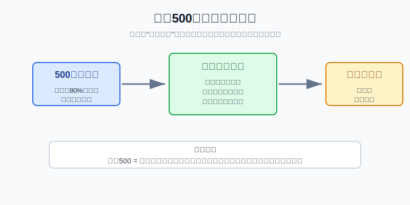
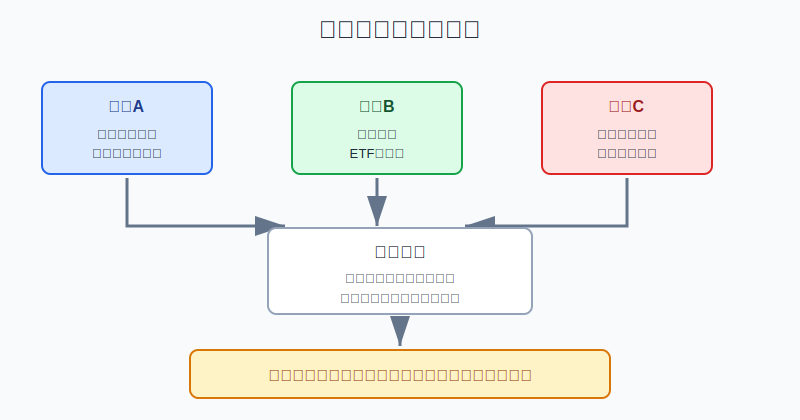
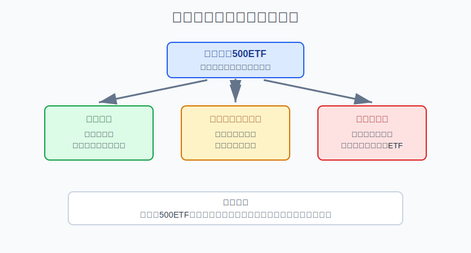

## 散户投资小白金融全品种操盘手册 - 10.2 标普500 - 美国大盘核心资产代表
  
### 作者  
digoal  
  
### 日期  
2026-06-07   
  
### 标签  
金融产品 , 金融工具 , 散户 , 投资小白 , 全品操盘手册  
  
----  
  
## 背景 
   

> 适用读者: 已经知道美股ETF比个股更适合入门, 但还不清楚标普500到底代表什么、为什么常被当作美股核心基准的小白投资者。
> 本文定位: 投资教育框架, 不构成个性化投资建议。

## 先问一个反直觉的问题

很多人买标普500ETF, 以为自己是在买“美国最安全的股票”。这句话只对了一半。标普500确实比单只股票分散, 但它仍然是股票资产, 会跌、会贵、会受美元汇率影响。真正正确的理解是: **标普500不是保本工具, 而是美国大盘股票风险的核心代表。**

## 核心概念: 它买的是美国大盘, 不是美国全部资产

标普500, 全称 S&P 500, 可以理解为“美国大盘股成绩单”。它不是交易所, 也不是一家公司, 而是由S&P Dow Jones Indices编制的股票指数。指数就是一把尺子, 用来衡量一组股票的整体表现。

这把尺子的特点有三个。

第一, 它包含500家左右美国领先上市公司。S&P Dow Jones Indices在标普500页面说明, 该指数包含500家领先公司, 覆盖约80%的美国可投资股票市值。这个数字很重要: 它说明标普500不是只看几只明星股, 而是覆盖了美国股票市场的主干。

第二, 它是自由流通市值加权指数。自由流通市值, 简单说就是“市场上真正能交易的那部分股票市值”; 市值加权, 就是公司越大, 在指数里的影响越大。这让指数更接近真实市场资金的分布, 但也带来一个副作用: 大型科技公司权重上升时, 标普500会看起来越来越像“美国大盘 + 科技龙头”的组合。

第三, 它可以通过ETF低成本跟踪。你不能直接买指数, 但可以买跟踪标普500的ETF。比如Vanguard的VOO和iShares的IVV官方资料都显示费用率为0.03%, State Street的SPY费用率为0.0945%。费用不是唯一标准, 还要看规模、成交量、买卖价差和税务路径, 但低成本确实是标普500ETF适合做核心工具的原因之一。

所以本节先给出行动结论: **如果你要给美股配置一个最基础的股票核心仓, 标普500ETF是优先研究对象; 但它只适合长期闲钱、分批买入、控制仓位, 不能当现金替代品, 更不能满仓赌博。**

## 逻辑推导链

【论证链标题】: 因为标普500覆盖美国大盘、规则透明、ETF执行成本低, 但仍然承担股票回撤和集中度风险, 所以它适合作为美股核心仓候选, 不适合作为短期保本工具。

── 第一步: 前提陈述

前提A: 标普500覆盖美国大盘股主干。这是相对稳定的事实。它像一条城市主干道, 不是每一条小路都在里面, 但城市最重要的车流大多会经过这里。S&P Dow Jones Indices披露, 标普500覆盖约80%的美国可投资股票市值。对小白来说, 这意味着它能把“选错单家公司”的风险降下来。

前提B: 标普500规则透明, ETF执行成本低。这是常量。指数有公开方法论, 主流ETF有公开持仓、费用率和成交数据。对小白来说, 这比直接研究单只美股更容易验证: 你至少能知道自己买的是哪把尺子、费用是多少、前十大持仓占多少。

前提C: 标普500仍然是股票资产, 而且市值加权会带来集中度。这是变量。S&P Dow Jones Indices的标普500 factsheet显示, 截至2026年5月29日, 标普500共有503个成分证券, 前十大成分股权重为39.3%。这不是说大公司一定不好, 而是提醒你: “500家公司”不等于“500家公司平均分摊风险”。

前提D: 中国散户买美股相关产品, 还要叠加汇率、通道和税务变量。这是变量。同一只标普500ETF, 通过QDII基金、境内跨境ETF、境外账户购买, 到手体验可能不同: 申赎限制、溢价、交易时段、换汇成本、分红税务都可能影响结果。

── 第二步: 逻辑推导

由A+B可得: 因为标普500覆盖美国大盘主干, 又能通过透明ETF低成本跟踪, 所以它适合作为小白研究美股股票资产的第一把尺子。你先学它, 比一上来研究某只热门科技股更稳。

再由A+B+C可得: 因为它仍然是股票资产, 而且权重会向大市值公司集中, 所以“适合作为核心仓候选”不能推出“可以满仓买”。核心仓的意思是组合里的长期基础部件, 不是账户里唯一的资产。

最后由A+B+C+D可得: 因为中国散户还要承受美元汇率、跨境通道和税务影响, 所以标普500ETF的正确动作不是一次性重仓, 而是先确认资金期限, 再选路径, 再分批买入, 最后用再平衡控制比例。

── 第三步: 正常情景下的操作结论

✅ 正常情景: 你已经留足生活备用金, 这笔钱三年以上不用, 能接受美股下跌20%以上和人民币/美元汇率波动, 也不想从单只个股开始承担公司风险。

对应操作: 把标普500ETF放进“美股核心仓候选清单”; 用小比例资金开始, 分批买入; 每年或每半年复盘一次仓位比例; 当标普500占比超过计划上限时, 通过再平衡降回来。

── 第四步: 数据和案例证实

证据1: 标普500确实代表美国大盘主干。S&P Dow Jones Indices官方页面披露, 标普500包含500家领先公司, 覆盖约80%的美国可投资股票市值。这对应前提A: 它比单只公司分散, 也比道琼斯30只股票更适合作为美国大盘基准。

证据2: 跑赢标普500并不容易。S&P Dow Jones Indices的SPIVA U.S. Year-End 2025报告显示, 2025年有79%的美国主动大盘股票基金跑输标普500。这个证据不是说指数永远赢, 而是说明: 小白不应该默认自己靠选个股或选主动基金就能轻松打败这把尺子。

证据3: 标普500ETF确实有低成本执行路径。Vanguard官方资料显示VOO费用率为0.03%, iShares官方资料显示IVV费用率为0.03%, State Street官方资料显示SPY费用率为0.0945%。费用率越低, 长期留在投资者账户里的摩擦越少; 但选择ETF时仍要同时看成交量、买卖价差、规模和交易路径。

证据4: 标普500不是没有大跌。Slickcharts整理的标普500总回报年度数据中, 2008年为-37.00%, 2022年为-18.11%。这对应前提C: 即使是美国大盘核心指数, 在金融危机、快速加息或估值收缩时也会明显回撤。

失败案例: 2022年就是很好的反例。当年美联储快速加息, 高估值成长资产承压, 标普500总回报为-18.11%。如果投资者用长期闲钱分批持有, 这是组合回撤问题; 如果用一年内要买房、还贷、留学的钱重仓买入, 这就变成资金期限错配; 如果再叠加杠杆ETF, 回撤会被进一步放大。历史不代表未来, 但它说明一个稳定规律: **标普500可以做核心基准, 不能替代现金和风控。**

── 第五步: 前提变化时的替代结论

若前提C改变, 也就是科技权重和前十大持仓集中度继续上升, 推导路径就变成: 因为标普500的分散度低于表面上的“500只股票”, 所以不能只看成分股数量。新结论: 降低单次买入金额, 或搭配全市场ETF、国际股票ETF、债券/现金类资产来分散。

若前提D改变, 也就是人民币汇率波动很大、跨境ETF溢价过高、QDII额度紧张, 推导路径就变成: 因为底层指数没变, 但你的交易通道成本上升, 所以买入体验会偏离指数本身。新结论: 暂停追高溢价产品, 等溢价回落或换更合适的路径。

若资金期限改变, 也就是这笔钱一年内要用, 推导路径就变成: 因为股票ETF可能在短期内大幅回撤, 所以核心仓逻辑不成立。新结论: 这笔钱不买标普500ETF, 优先放现金管理或短久期低风险工具。

## 实操例子: 10万元账户怎样研究标普500ETF

这个例子对应论证链的正常结论: **标普500ETF可以作为美股股票核心仓候选, 但必须先确认长期资金、路径成本和仓位上限。**

假设小周有10万元可投资资金, 生活备用金已经单独留好。他想开始配置一点美股ETF, 没有读美股个股财报的能力, 也不想碰期权和杠杆产品。这笔钱三年以上不用, 能接受阶段性下跌。

第一步, 先定角色。小周在计划里写下: “标普500ETF负责美股股票核心仓, 不负责短线交易, 不替代现金。”这一步对应前提A和前提C。写不出这句话, 说明他还没区分核心资产和短线筹码。

第二步, 定仓位上限。演示模板是: 美股股票学习仓先不超过总资金的10%, 也就是1万元; 其中标普500ETF占7000元以内, 其他行业ETF或纳斯达克100先只观察。这不是统一建议, 只是为了让小白先把错误成本封住。

第三步, 选路径。若他只熟悉境内基金账户, 先比较QDII基金和跨境ETF; 若已经能处理境外券商账户、换汇、税务和交易时间, 再比较VOO、IVV、SPY等美股ETF。比较标准不是“谁今天涨得多”, 而是跟踪指数、费用率、规模、成交量、买卖价差、分红处理和税务影响。

第四步, 分批买入。假设计划投入7000元, 第一笔只买3000元等值, 第二笔和第三笔间隔一个月或更长。判断依据对应前提C和D: 如果市场估值很热、汇率短期不利、跨境产品溢价高, 就放慢; 如果这些变量没有明显恶化, 再按计划执行。

第五步, 写再平衡规则。小周规定: 标普500ETF若涨到总账户12%以上, 不继续追高, 通过新增资金投向现金、债券或其他资产把比例降回来; 若跌到总账户7%以下, 且买入理由没有破坏, 才考虑按原计划补齐, 不因为恐慌随意清仓。

第六步, 写错误纠偏。若他发现自己买的是高溢价跨境ETF, 先停止加仓, 等溢价回落; 若他把标普500ETF卖掉去追单只科技股, 就回到第九章第五节的工具优先级; 若他因为短期亏损想改买杠杆ETF回本, 直接停止实盘, 因为这已经从核心仓变成情绪交易。

## 可复用框架

【核心四问】

适用前提: 你想买标普500ETF, 但不知道能不能把它放进核心仓。

核心逻辑: 因为标普500是美国大盘股票风险代表, 所以下单前必须同时问清资产、期限、路径和仓位。

操作步骤:

1. 问资产: 我买的是标普500指数, 还是带溢价、杠杆、汇率和通道差异的具体产品?
2. 问期限: 这笔钱三年以上不用吗? 如果一年内要用, 不买股票ETF。
3. 问路径: 我是否看懂费用率、成交量、买卖价差、分红税务和汇率影响?
4. 问仓位: 标普500在总账户里的上限是多少? 超过上限怎样再平衡?

前提失效时: 任意一问回答不清, 动作不是“先买一点试试”, 而是先回到资料阅读和模拟记录。标普500再经典, 也不能替代你的资金计划。

举一反三: 这个框架也适用于纳斯达克100、罗素2000、行业ETF和全球股票ETF。先问它代表什么风险, 再问它该占多少比例。

【三线买法】

适用前提: 你已决定长期学习或配置标普500ETF, 但担心买在高点。

核心逻辑: 因为估值、汇率和市场情绪都会变化, 所以用三条线约束买入节奏。

操作步骤:

1. 资金线: 只用三年以上不用的钱, 且单次买入不超过计划仓位的一半。
2. 产品线: 只买看得懂的普通标普500ETF, 不用杠杆ETF替代。
3. 复盘线: 每半年检查一次仓位比例、汇率影响、ETF费用和跟踪情况。

前提失效时: 如果出现高溢价、短期资金挪用、仓位超过上限, 立刻停止新增买入; 如果买入理由变成“别人都说美股会涨”, 回到核心四问。

举一反三: 这个框架也适用于黄金ETF和债券ETF。核心资产不是买完不管, 而是用规则降低情绪干扰。

## 本节行动清单

| 动作 | 合格标准 |
|---|---|
| 说清标普500是什么 | 500家左右美国领先公司组成的美国大盘股指数 |
| 说清它不是什么 | 不是现金, 不是保本产品, 不是美国全部资产 |
| 检查指数结构 | 看覆盖范围、行业权重、前十大持仓和市值加权规则 |
| 检查ETF产品 | 看费用率、规模、成交量、买卖价差、跟踪误差和分红税务 |
| 设定仓位上限 | 明确标普500ETF在总账户中的比例, 超过就再平衡 |
| 处理前提变化 | 高溢价、短期要用钱、无法承受回撤时, 暂停买入 |

## 一句话总结

标普500是美国大盘股票风险的核心代表, 适合小白作为美股核心仓的第一研究对象; 但它不是保本资产, 正确动作是长期钱、分批买、控仓位、定期再平衡。

## 参考资料

- S&P Dow Jones Indices: S&P 500指数介绍及factsheet, 2026年访问, https://www.spglobal.com/spdji/en/indices/equity/sp-500/
- S&P Dow Jones Indices: S&P U.S. Indices Methodology, 2026年访问, https://www.spglobal.com/spdji/en/methodology/article/sp-us-indices-methodology/
- S&P Dow Jones Indices: SPIVA U.S. Year-End 2025, 2026年访问, https://www.spglobal.com/spdji/en/spiva/article/spiva-us/
- Vanguard: Vanguard S&P 500 ETF (VOO), 2026年访问, https://advisors.vanguard.com/investments/products/voo/vanguard-sp-500-etf
- iShares: iShares Core S&P 500 ETF (IVV), 2026年访问, https://www.ishares.com/us/products/239726/ishares-core-sp-500-etf
- State Street: SPDR S&P 500 ETF Trust (SPY), 2026年访问, https://www.ssga.com/us/en/individual/etfs/state-street-spdr-sp-500-etf-trust-spy
- Slickcharts: S&P 500 Total Returns by Year, 2026年访问, https://www.slickcharts.com/sp500/returns

> ⚠️ **声明**：本文内容为投资教育目的，所有历史数据、策略框架均为辅助学习工具，不构成证券投资建议。市场有风险，投资需谨慎。实际操作请结合自身风险承受能力，必要时咨询专业投顾。
  
#### [PostgreSQL 解决方案集合](../201706/20170601_02.md "40cff096e9ed7122c512b35d8561d9c8")
  
  
#### [德哥 / digoal's Github - 公益是一辈子的事.](https://github.com/digoal/blog/blob/master/README.md "22709685feb7cab07d30f30387f0a9ae")
  
  
#### [About 德哥](https://github.com/digoal/blog/blob/master/me/readme.md "a37735981e7704886ffd590565582dd0")
  
  

  
