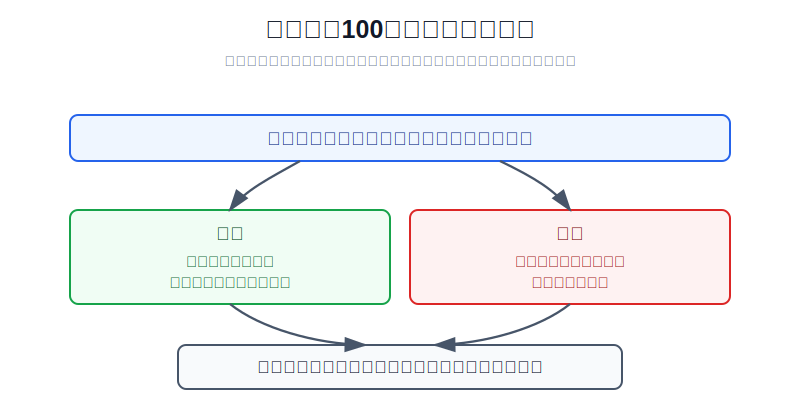
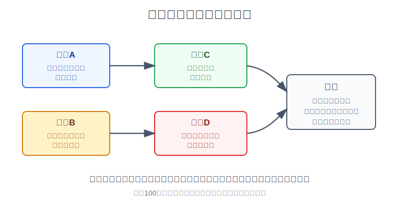
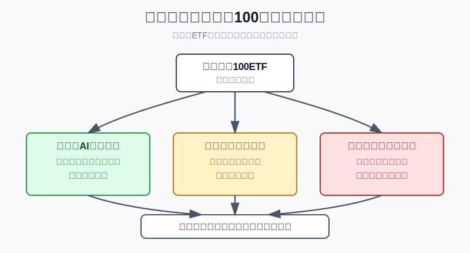

## 散户投资小白金融全品种操盘手册 - 10.3 纳斯达克100 - 科技成长集中度高，弹性大，回撤也大
  
### 作者  
digoal  
  
### 日期  
2026-06-07   
  
### 标签  
金融产品 , 金融工具 , 散户 , 投资小白 , 全品操盘手册  
  
----  
  
## 背景 
   

> 适用读者: 已经知道标普500是美股大盘代表，开始听到纳斯达克100、QQQ、科技成长ETF，但不知道它到底适合放在组合什么位置的小白投资者。
> 本文定位: 投资教育框架，不构成个性化投资建议。

## 先问一个反直觉的问题

很多人以为纳斯达克100就是“更赚钱的标普500”。这句话只说对了一半。它真正的特点不是更高级，而是更集中：当科技成长公司盈利扩张、市场愿意给高估值时，它跑得很快；当前提反过来时，它跌得也更直接。

## 核心概念: 纳指100不是全部美股，而是成长引擎

纳斯达克100指数，英文常写作 Nasdaq-100 或 NDX。它不是纳斯达克交易所所有股票，也不是美国所有科技股，而是由 Nasdaq 规则筛选出的 100 只大型非金融公司证券组成。用小白能理解的话说：它像一支速度更快、发动机更猛的车队，里面有很多科技、通信服务、消费科技和医疗相关公司，但它不是一辆适合装下全家行李的稳重货车。

这里有三个容易混淆的点。

第一，纳斯达克100不是“只买科技股”。它排除金融公司，但会包含信息技术、通信服务、可选消费、医疗等行业的大公司。只是由于美国大盘成长公司的市值结构，科技和科技相关公司长期占比较高，所以它的实际表现很容易被大型成长股牵着走。

第二，纳指100ETF不是没有分散。它至少比单只科技股分散得多。但它的分散不是标普500那种覆盖美国大盘主干的分散，而是“在大盘非金融成长公司里分散”。这就像你不是只押一家餐厅，而是买了一整条热门商业街；风险小于一家店倒闭，但仍然会受这条街租金、人流、估值和消费周期影响。

第三，弹性大不是免费午餐。弹性来自集中度。你想吃到成长公司上涨时的肉，就必须接受成长公司估值收缩时的疼。纳指100适合在美股组合里做成长引擎，不适合让小白把全部美股仓都压在它身上。

## 逻辑推导链

【论证链标题】: 因为纳斯达克100集中在纳斯达克上市的大型非金融成长公司，所以它适合做美股组合里的成长卫星仓，而不是替代全部宽基底仓。

── 第一步: 前提陈述

前提A: 纳斯达克100有清晰规则，主要选择 Nasdaq 上市的大型非金融公司。这是常量。Nasdaq 2026 年 3 月公布的 Nasdaq-100 Index Methodology 写明，指数通常包含 Nasdaq Stock Market 上市的 100 只最大非金融公司证券。对小白来说，这个前提的含义是：你买的不是一个基金经理临时拍脑袋挑出来的组合，而是一套公开规则筛出来的股票篮子。

前提B: 纳斯达克100的行业和公司集中度高于普通全市场宽基。这是常量，但具体权重会变。Nasdaq 的 NDX fact sheet 显示，截至 2026 年 3 月 31 日，Technology 板块权重为 59.77%，前十大成分股合计约 46.91%。这两个数字说明，它虽然叫指数，但不是“每家公司差不多一票”。大公司和科技成长链条对指数结果影响很大。

前提C: 大型成长公司的估值，对利率、盈利预期和风险偏好很敏感。这是变量。简单讲，成长股的很多价值来自未来几年甚至更远的利润想象；当市场利率低、资金愿意相信未来时，这种想象会被放大；当利率上行、盈利预期下修时，未来利润要打折，估值就容易被压缩。

前提D: 散户最大的风险不是买错一个名字，而是把高弹性工具当成低波动底仓。这是变量。纳指100比单只科技股分散，但它仍然可能在利率和估值逆风中出现大回撤。如果小白把它当成“稳赚版科技股”，仓位就会先失控，再被回撤教育。

── 第二步: 逻辑推导

由A可得: 因为纳斯达克100有公开规则，买它比直接挑单只科技股更适合小白入门。你不需要判断哪家公司一定赢，只需要先理解这套指数筛选的是哪类公司。

由A+B可得: 因为指数权重集中在大型非金融成长公司，所以它不是标普500的简单替代品。标普500更像美国大盘核心底仓；纳斯达克100更像在核心底仓之外加上的成长发动机。

再由B+C可得: 因为成长股权重高，而成长股受利率、盈利预期和风险偏好影响大，所以纳斯达克100上涨时可能比普通宽基更猛，下跌时也可能比普通宽基更深。收益弹性和回撤弹性不是两件事，它们来自同一个结构。

最后由A+B+C+D可得: 因为小白无法稳定预测利率、盈利和市场情绪，所以正确动作不是“看好科技就重仓纳指100”，而是先把仓位上限写清楚，把它放在成长仓或卫星仓的位置；当前提变化时，仓位要跟着变化。

── 第三步: 正常情景下的操作结论

✅ 正常情景: 你已经有美股核心宽基或准备建立核心宽基，投资期限三年以上，能接受较大波动，也明白纳指100的集中度来自大型成长公司。

对应操作: 可以把纳指100ETF作为美股组合里的成长卫星仓。对小白示例而言，若美股仓位是总资产的 20%，纳指100可以先控制在总资产 3% 到 6% 的观察仓或小仓范围，不要一上来替代全部标普500、全市场ETF或现金防守仓。这个比例不是统一建议，而是为了强调顺序：先定仓位，再谈买点。

── 第四步: 数据和案例证实

证据1: 纳指100确实高度偏向科技成长。Nasdaq 的 NDX fact sheet 显示，截至 2026 年 3 月 31 日，Technology 板块占 59.77%，前十大成分股合计约占 46.91%。这对应前提B：纳指100的核心风险不是“有没有分散”，而是“分散在什么方向上”。它分散了单家公司风险，但没有分散掉大型成长股这一类资产的共同风险。

证据2: 代表性ETF费用低、流动性强，但低费用不等于低风险。Invesco QQQ 官网披露，截至 2026 年 3 月 31 日，QQQ 总费用率为 0.18%，按美国平均日成交量计算是美国第二大交易量ETF；同页也提醒，基金非分散，可能比更分散的投资波动更大。这个证据说明：工具成熟、费用低、成交活跃，只解决了“能不能方便交易”的问题，没有消灭指数结构本身的波动。

证据3: 2022 年是典型证伪案例。Nasdaq 的 NDX fact sheet 显示，纳斯达克100价格指数 2022 年年度回报为 -32.97%。同一年，美联储快速加息，高估值成长资产承压。这个案例不是说纳指100不能买，而是证明前提C很关键：当利率和估值环境逆风时，成长集中度会从加速器变成放大器。

证据4: 长期回报也曾很强，但强回报不能单独作为重仓理由。Nasdaq NDX fact sheet 显示，截至 2026 年 3 月 31 日，NDX 10 年累计价格回报为 429.48%。这个数字说明纳斯达克100长期阶段性表现很强；但把它和 2022 年回撤放在一起看，真正的结论是：它适合有仓位边界地参与成长，不适合用“过去涨得多”推导出“未来可以重仓”。

历史不代表未来。上面的数据仍有参考价值，是因为它们不是在讲某一次股价故事，而是在验证同一条结构规律：集中在大型成长公司，会同时带来更强上行弹性和更强下行弹性。

── 第五步: 前提变化时的替代结论

若前提C改变，也就是美国利率重新上行、长期实际利率抬升，或者大型科技公司的盈利预期下修，推导路径就变成: 因为高估值成长股的未来现金流折现压力上升，所以纳指100的集中结构会放大回撤。新结论: 不补成重仓，不用下跌当作唯一买入理由，先检查仓位是否超过上限。

若前提B改变，也就是前十大公司权重进一步上升，指数越来越像少数大公司的组合，推导路径就变成: 因为单一公司和单一产业链影响扩大，所以纳指100相对宽基的独立风险上升。新结论: 降低卫星仓比例，把核心仓放回更宽的宽基ETF。

若前提D改变，也就是你没有宽基底仓，只因为AI、芯片、云计算很热就想满仓纳指100，推导路径就变成: 因为买入理由来自情绪和叙事，而不是组合结构，所以你不是在配置成长仓，而是在追热门资产。新结论: 先暂停下单，回到第九章第五节的工具优先级，先指数底仓，再主题和成长卫星。

失败案例: 2022 年的 QQQ 回撤就是前提C失效的反例。很多投资者在 2020-2021 年把高成长资产的上涨误认为“科技股永远更安全”，但当通胀和利率环境变化后，高估值资产回撤很快。这个失败案例的教训不是“别碰纳指100”，而是“不要忘记你买的是高弹性资产”。

## 实操例子: 10万元账户如何放纳指100

这个例子对应论证链的正常结论: **纳指100可以做成长卫星仓，但不能替代全部美股核心仓。**

假设小林有 10 万元可投资资金，生活备用金已留足。他计划把总资产 20% 放在海外权益类资产，也就是 2 万元。小林已经知道标普500和全市场ETF是更宽的底仓，也知道纳指100集中在大盘成长公司。他能接受三年以上不用这笔钱，但不希望一次科技股回撤打乱全部计划。

第一步，先定总美股仓。小林把海外权益仓定为 2 万元，不因为纳指100近期涨得快就把总仓临时加到 5 万元。这一步对应前提D：先管仓位，再看收益想象。

第二步，先建核心仓。2 万元中，先用 1.4 万到 1.6 万元配置更宽的美股核心指数，比如标普500或全市场ETF。这样做不是因为它们不会跌，而是因为它们比纳指100更适合作为美国大盘核心暴露。这一步对应A+B的推导：纳指100不是全部美股。

第三步，纳指100只给成长卫星。剩余 4000 到 6000 元，才考虑纳指100ETF。第一次买入可以只用 2000 元到 3000 元，先观察自己能不能承受它的波动。这里的关键不是精确金额，而是把纳指100限制在总资产 3% 到 6% 的范围内，避免一开始就情绪化重仓。

第四步，买入前写三句话。第一句：我买的是纳斯达克100，不是全部科技股，也不是全部美股。第二句：我接受它在利率上行、估值收缩时可能比普通宽基跌得更多。第三句：如果纳指100涨到超过我的仓位上限，我会再平衡，而不是因为赚钱就继续加仓。这三句话对应B+C+D。

第五步，设前提失效动作。如果买入后下跌 15%，但美股核心仓比例仍合理、纳指100没有超过上限，不急着补仓；如果下跌来自利率上行和盈利预期下修，不把“跌了很多”当成自动加仓理由；如果上涨后纳指100从总资产 5% 变成 10%，先减回计划比例，把收益转回核心宽基或现金防守仓。

如果操作错误，最常见的后果是把卫星仓做成主仓。比如小林原计划只买 5000 元纳指100，结果看到AI主题连续上涨，临时买到 3 万元。只要一次成长股估值回撤，他的总账户波动就会被纳指100牵着走。纠偏方法不是继续赌反弹，而是把仓位降回计划上限，再复盘当初为什么违反了“成长卫星仓”的定位。

## 可复用框架

【成长卫星】

适用前提: 你已经有或准备建立更宽的美股核心仓，并且想用纳指100增加成长弹性。

核心逻辑: 因为纳指100的高弹性来自大型成长公司集中度，所以它应该服务于组合弹性，而不是替代组合底盘。

操作步骤:

1. 先定总美股仓，不因热门行情临时扩大总风险。
2. 先放核心宽基，再放纳指100卫星仓。
3. 给纳指100设置上限，例如示例中的总资产 3% 到 6%。
4. 上涨超过上限就再平衡，下跌时先查前提，不机械补仓。

前提失效时: 如果利率上行、盈利下修、估值过高或仓位超标，纳指100从“成长引擎”变成“波动放大器”，动作应从加仓切换为暂停、降仓或再平衡。

举一反三: 这个框架也适用于半导体ETF、云计算ETF、AI主题ETF。越有弹性的资产，越不能先问能涨多少，而要先问最多放多少。

【三问纳指】

适用前提: 你准备买入纳斯达克100ETF，但不确定现在该不该买、买多少。

核心逻辑: 因为纳指100受集中度、估值和仓位共同影响，所以买入前必须同时回答结构、环境和账户三个问题。

操作步骤:

1. 问结构: 它现在是不是仍高度集中在大型成长公司？
2. 问环境: 利率、盈利预期、风险偏好是顺风、逆风还是看不清？
3. 问账户: 买入后纳指100占总资产多少，超过上限怎么办？

前提失效时: 如果三个问题只能回答“大家都在买”“长期一定涨”“跌了就补”，说明你没有在配置指数，而是在追逐叙事。此时动作应改为观察或小额定投学习，不做重仓。

举一反三: 这三个问题也能用在成长风格基金、港股互联网ETF、创业板ETF。凡是集中度高的指数，都要先问“集中在哪里”和“集中风险由谁承担”。

## 本节行动清单

| 动作 | 合格标准 |
|---|---|
| 说清纳指100定位 | 大型非金融成长公司指数，不是全部美股 |
| 检查集中度 | 看行业权重、前十大权重、单一公司权重 |
| 定仓位上限 | 先写总资产占比，再谈买入价格 |
| 核心和卫星分开 | 标普500或全市场做核心，纳指100做成长卫星 |
| 前提变化要切换 | 利率上行、盈利下修、估值过热时，不机械补仓 |
| 再平衡 | 涨到超过计划比例时，把仓位拉回上限 |

## 一句话总结

纳斯达克100的好处和风险来自同一个地方：大型成长公司的集中度；小白可以用它增加组合弹性，但必须把它放在成长卫星仓，而不是把全部美股仓都交给它。

## 参考资料

- Nasdaq: Nasdaq-100 Index Methodology，2026年3月，https://indexes.nasdaq.com/docs/Methodology_NDX.pdf
- Nasdaq: Nasdaq-100 Index Fact Sheet，截至2026年3月31日，https://indexes.nasdaq.com/docs/FS_NDX.pdf
- Invesco: Invesco QQQ ETF 官方页面，2026年访问，https://www.invesco.com/qqq-etf/en/home.html

> ⚠️ **声明**：本文内容为投资教育目的，所有历史数据、策略框架均为辅助学习工具，不构成证券投资建议。市场有风险，投资需谨慎。实际操作请结合自身风险承受能力，必要时咨询专业投顾。
  
#### [PostgreSQL 解决方案集合](../201706/20170601_02.md "40cff096e9ed7122c512b35d8561d9c8")
  
  
#### [德哥 / digoal's Github - 公益是一辈子的事.](https://github.com/digoal/blog/blob/master/README.md "22709685feb7cab07d30f30387f0a9ae")
  
  
#### [About 德哥](https://github.com/digoal/blog/blob/master/me/readme.md "a37735981e7704886ffd590565582dd0")
  
  

  
