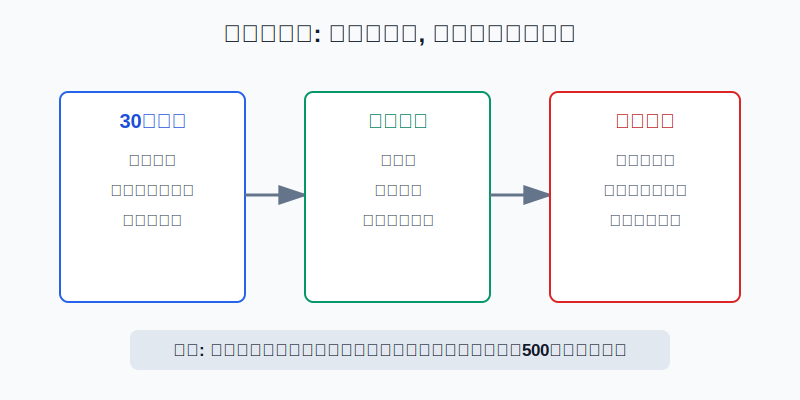
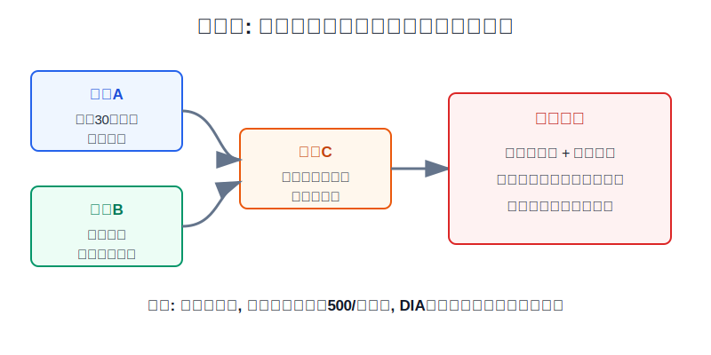
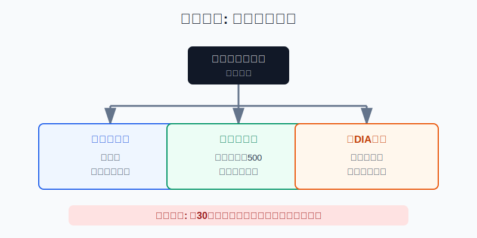

## 散户投资小白金融全品种操盘手册 - 10.4 道琼斯指数 - 历史意义大, 但不是最适合新手的核心基准
  
### 作者  
digoal  
  
### 日期  
2026-06-07   
  
### 标签  
金融产品 , 金融工具 , 散户 , 投资小白 , 全品操盘手册  
  
----  
  
## 背景 
   

> 适用读者: 已经听过“道指大涨”“道指暴跌”, 但分不清道琼斯指数、标普500、纳斯达克100到底该看哪个的小白投资者。  
> 本文定位: 投资教育框架, 不构成个性化投资建议。资料口径按 2026-06-06 可核查公开资料整理。

## 先问一个反直觉的问题

道琼斯指数是全世界最有名的美股指数之一, 但名气大不等于最适合做你的核心仓。它更像财经新闻里的温度计: 读新闻很有用, 但不能把温度计当成整张地图。

## 核心概念: 道指不是“美国股市全部”, 而是30只蓝筹的价格加权指数

先把一句话记住: **道琼斯工业平均指数 = 30只美国蓝筹股 + 价格加权。**

“30只美国蓝筹股”好理解。它选的是美国市场里有代表性的老牌大公司, 覆盖除交通和公用事业以外的行业。它的历史意义很大, 因为它存在时间长、媒体引用多、普通人容易记住。

真正容易误解的是“价格加权”。大多数小白以为指数里谁公司大、谁赚钱多、谁市值高, 谁影响指数就更大。道指不是这样。**价格加权的意思是: 股票价格越高, 对指数影响越大。** 这就像班级平均身高, 不是按每个学生的体重、学习成绩或家庭收入加权, 而是直接看身高数值。这个算法简单, 但它不等于“谁是美国经济最重要的公司, 谁权重最大”。

所以本节先给出行动结论: **小白可以用道指看市场情绪和蓝筹股状态, 但核心配置基准优先看标普500或全市场指数; 如果买跟踪道指的ETF, 也只把它当小比例卫星仓或比较工具。**

## 逻辑推导链

【论证链标题】: 因为道指成分股少且采用价格加权, 所以它适合做市场观察指标, 不适合默认成为小白美股核心基准。

── 第一步: 前提陈述

前提A: 道指只覆盖30只美国蓝筹股。这是常量。S&P Dow Jones Indices 对道指的说明是, 它衡量30家美国蓝筹公司, 覆盖除交通和公用事业以外的行业。用生活里的比喻说, 它像从美国商业街挑出30家老字号门店, 看它们今天整体热不热闹。

前提B: 道指采用价格加权。这是常量。S&P Dow Jones Indices 的道琼斯平均指数方法论说明, 道指属于 price weighted indices。也就是说, 股价高的成分股对指数影响更大, 而不是市值越大的公司影响越大。这像用“商品标价”来算货架影响力, 标价高的商品占更大权重, 但标价高不等于销量最大。

前提C: 小白做美股核心配置, 最需要的是代表性、透明性和可复盘性。这是常量。核心仓不是为了追最刺激的波动, 而是为了代表你想长期暴露的市场风险。如果你想买“美国大盘股整体”, 那么指数覆盖面和权重逻辑必须先过关。

前提D: 道指的媒体影响力很强。这是变量。财经新闻常用“道指涨跌”概括美股情绪, 但新闻里的常用指标不自动等于最适合散户长期配置的指标。

── 第二步: 逻辑推导

由A可得: 因为道指只有30家公司, 所以它能快速反映一组大型蓝筹股的表现, 但不能完整代表美国股票市场。30只股票本身不是问题, 问题是小白不能把“30只蓝筹”误读成“美国股市全部”。

由A+B可得: 因为道指既成分股少, 又按股价加权, 所以它的涨跌会受到少数高价成分股影响。这个结构让它适合做新闻指标, 但不适合当成最直观的市值型市场地图。

再由A+B+C可得: 因为核心仓需要覆盖更广、权重逻辑更贴近公司市场规模, 所以小白如果要建立美股核心基准, 标普500通常比道指更合适。S&P Dow Jones Indices 对标普500的说明是, 它包含500家领先公司, 覆盖约80%的可投资市值, 并被广泛视为美国大盘股的单一代表性指标。

最后由A+B+C+D可得: 因为道指名气大但结构窄, 所以正确用法不是“看新闻就买道指ETF”, 而是把道指放在辅助观察层: 看蓝筹情绪、看传统行业和价值风格, 但核心仓仍先用覆盖更广的宽基指数搭底。

── 第三步: 正常情景下的操作结论

✅ 正常情景: 你是刚开始学美股ETF的小白, 目标是建立长期核心仓, 还没有能力判断30只道指成分股的行业结构、估值和权重变化。

对应操作: 先把道指当作市场观察指标; 核心ETF研究优先顺序为标普500、全市场指数、纳斯达克100, 再到道指ETF; 如果一定要买道指ETF, 仓位定位为卫星仓, 不替代核心宽基仓。

── 第四步: 数据和案例证实

证据1: 道指覆盖面确实窄。S&P Dow Jones Indices 的道指页面披露, 道指是30家美国蓝筹公司的价格加权指标, 覆盖除交通和公用事业以外的行业。这个证据验证前提A和B: 道指不是按市值覆盖美国市场的宽基全图。

证据2: 标普500的代表性更强。S&P Dow Jones Indices 的标普500页面披露, 标普500包含500家领先公司, 覆盖约80%的可投资市值。这个证据验证前提C: 如果小白想先抓美国大盘股主干, 500家公司、约80%覆盖面比30家公司更适合做核心基准。

证据3: 跟踪道指的DIA本身也体现“30只 + 价格加权”的特点。State Street 的 DIA 事实表显示, 截至 2026-03-31, DIA 持仓数量为30, 费用率为0.16%; 前十大持仓里, Goldman Sachs 权重 11.24%, Caterpillar 权重 9.41%, Microsoft 权重 4.92%。这个证据说明, 买DIA不是买“所有美股”, 而是买一组按道指规则排列的蓝筹公司。

失败案例: 假设小林看到新闻说“道指创新高”, 就把全部美股仓位买成DIA。他以为自己买的是美国股市整体, 实际上他买的是30只价格加权蓝筹。如果当年市场主线由道指覆盖不足的成长股、半导体或更广泛的中小盘公司推动, 小林可能发现: 新闻里道指很热闹, 自己的组合却没有跟上他以为的“美国市场”。反过来, 如果道指里的高价蓝筹波动较大, 他的账户也会被少数成分股牵着走。

历史不代表未来, 但结构规律有参考价值: 指数怎么编, 风险就怎么来。道指的历史地位不能替代成分股数量、加权方式和投资目标的匹配。

── 第五步: 前提变化时的替代结论

若前提C改变, 也就是你不是做核心仓, 而是想观察美国老牌蓝筹和价值风格, 推导路径变为: 因为你的目标不是覆盖整个市场, 而是观察一组代表性蓝筹, 所以道指可以成为辅助基准。新结论: 可以跟踪道指和DIA, 但不把它当唯一基准。

若前提D改变, 也就是你只是因为财经新闻天天报“道指涨跌”才想买, 推导路径变为: 因为信息入口替代了投资目标, 所以买入理由不成立。新结论: 暂停下单, 先比较道指、标普500、纳斯达克100和全市场指数的覆盖范围。

若前提B带来的影响被忽视, 也就是你以为道指权重等于公司市值排名, 推导路径变为: 因为权重理解错误, 所以你无法解释组合涨跌。新结论: 买入前先看DIA持仓和权重, 能说清前十大持仓为什么影响组合, 再决定是否配置。

## 实操例子: 10万元美股ETF学习仓怎样处理道指

这个例子对应论证链的正常结论: **道指做辅助观察, 核心仓先用覆盖更广的宽基指数。**

假设小林有10万元人民币等值的长期投资资金, 其中2万元准备用来学习美股ETF。他已经留足生活备用金, 但还没有系统比较过美股指数。

第一步, 先写投资目标: “我要买美国大盘股整体风险。”这一步对应前提C。既然目标是整体风险, 小林不能因为道指名气大就直接买DIA, 而要先看标普500或全市场指数。

第二步, 建立核心观察名单。小林把标普500ETF或全市场ETF放在核心候选, 把纳斯达克100放在成长风格候选, 把DIA放在蓝筹价值观察候选。这个动作对应证据2: 覆盖面越广, 越适合先做核心基准。

第三步, 给DIA设用途而不是设幻想收益。小林写下: “DIA只用于观察30只美国蓝筹和传统行业权重, 不替代核心宽基。”如果他最终配置, 比例不超过美股ETF学习仓的10%到20%。这一步对应证据3: DIA持仓只有30只, 结构特殊, 不能当全市场替代品。

第四步, 买前检查三件事。第一, 看DIA费用率和跟踪指数; 第二, 看前十大持仓和行业权重; 第三, 同时拿标普500ETF做比较基准。若DIA上涨而标普500不涨, 要问是不是高权重道指成分股在推动; 若标普500上涨而DIA不涨, 要问是不是成长股或更广市场在推动。

第五步, 前提不成立就切换操作。如果小林发现自己只是因为“道指又创新高”而冲动下单, 当天不买; 如果他发现自己说不清价格加权, 不买; 如果他已经有足够宽基核心仓, 且想小比例增加传统蓝筹风格, 才可以把DIA放入卫星仓。

如果操作错误, 最常见后果是“基准错配”。小林想买美国市场整体, 却买了30只蓝筹; 后面复盘时, 他会拿DIA和全市场行情互相责怪, 但真正的问题不是市场不配合, 而是一开始选错了基准。纠偏方法是把DIA降回卫星仓, 核心仓回到更广覆盖的宽基指数。

## 可复用框架

【三问基准】

适用前提: 你准备买一个美股指数ETF, 但不知道它能不能做核心仓。

核心逻辑: 因为核心仓要先匹配投资目标, 所以下单前先问覆盖、权重和用途。

操作步骤:

1. 问覆盖: 这个指数有多少家公司, 是否代表我想买的市场?
2. 问权重: 它按市值、价格、等权还是其他规则加权?
3. 问用途: 它是核心仓、卫星仓, 还是只用于观察?

前提失效时: 如果覆盖窄、权重特殊、用途说不清, 就不要把它当核心仓。

举一反三: 这个框架也适用于纳斯达克100、罗素2000、行业ETF和主题ETF。名字越熟, 越要回到指数规则。

【新闻降级】

适用前提: 你因为财经新闻反复提到某个指数, 产生了买入冲动。

核心逻辑: 因为新闻指标负责传播速度, 投资基准负责风险暴露, 所以新闻里的高频名字要先降级为观察指标。

操作步骤:

1. 先把新闻指数放进观察层, 不直接下单。
2. 再查指数成分股数量、加权方式和行业分布。
3. 最后决定它是核心、卫星还是不配置。

前提失效时: 如果你只是因为“它天天被报道”而买, 当天停止交易, 第二天再写买入理由。

举一反三: 这个框架也适用于“AI主题指数”“半导体指数”“黄金价格”“美元指数”。先问它能说明什么, 再问它能不能买。

## 本节行动清单

| 动作 | 合格标准 |
|---|---|
| 记住道指结构 | 30只美国蓝筹 + 价格加权 |
| 区分新闻和配置 | 新闻可以看道指, 核心配置先看更广宽基 |
| 买DIA前查持仓 | 看费用率、前十大持仓、行业权重和成交情况 |
| 不把DIA当全市场 | DIA最多做卫星或比较工具, 不替代标普500/全市场核心 |
| 复盘时用对基准 | 买DIA就和道指/DIA比较, 不拿它承担“全美股”任务 |

## 一句话总结

道琼斯指数值得认识, 但小白不能把名气当代表性; 它适合做蓝筹温度计, 核心美股ETF基准仍应优先选择覆盖更广、权重逻辑更直观的宽基指数。

## 参考资料

- S&P Dow Jones Indices: Dow Jones Industrial Average, 2026年访问, https://www.spglobal.com/spdji/en/indices/equity/dow-jones-industrial-average/
- S&P Dow Jones Indices: Dow Jones Averages Methodology, 2026年访问, https://www.spglobal.com/spdji/en/documents/methodologies/methodology-dj-averages.pdf
- S&P Dow Jones Indices: S&P 500, 2026年访问, https://www.spglobal.com/spdji/en/indices/equity/sp-500/
- State Street: SPDR Dow Jones Industrial Average ETF Trust (DIA) Fact Sheet, 2026-03-31, https://www.ssga.com/library-content/products/factsheets/etfs/us/factsheet-us-en-dia.pdf

> ⚠️ **声明**：本文内容为投资教育目的，所有历史数据、策略框架均为辅助学习工具，不构成证券投资建议。市场有风险，投资需谨慎。实际操作请结合自身风险承受能力，必要时咨询专业投顾。
  
#### [PostgreSQL 解决方案集合](../201706/20170601_02.md "40cff096e9ed7122c512b35d8561d9c8")
  
  
#### [德哥 / digoal's Github - 公益是一辈子的事.](https://github.com/digoal/blog/blob/master/README.md "22709685feb7cab07d30f30387f0a9ae")
  
  
#### [About 德哥](https://github.com/digoal/blog/blob/master/me/readme.md "a37735981e7704886ffd590565582dd0")
  
  

  
