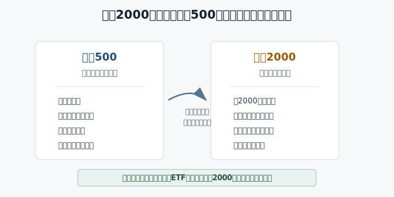
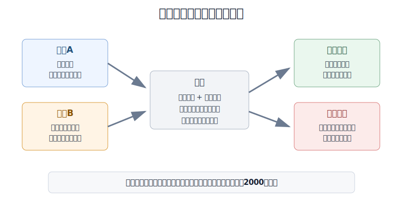
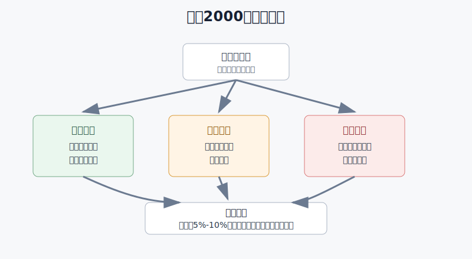

## 散户投资小白金融全品种操盘手册 - 10.5 罗素2000 - 小盘股风险和经济周期敏感度
  
### 作者  
digoal  
  
### 日期  
2026-06-07   
  
### 标签  
金融产品 , 金融工具 , 散户 , 投资小白 , 全品操盘手册  
  
----  
  
## 背景 
   

> 适用读者: 已经知道标普500、纳斯达克100，但不清楚罗素2000代表什么、什么时候能用、为什么它不能替代核心宽基ETF的小白投资者。  
> 本文定位: 投资教育框架，不构成个性化投资建议。

## 先问一个反直觉的问题

罗素2000听起来像“买2000家公司，更分散，所以更安全”。这句话只对了一半。它确实分散到很多公司，但这些公司普遍更小、更依赖美国本土经济、更怕融资环境收紧。**所以罗素2000不是小白的核心仓默认选项，而是一个经济周期放大器。**

## 核心概念: 你买的是“小公司集合”，不是“小号标普500”

罗素2000指数跟踪美国小盘股。小盘股，就是市值较小的上市公司。用生活里的话说，标普500更像全国连锁大公司，罗素2000更像一批地方性公司、细分行业公司和成长早期公司。

这带来两个结果。

第一，弹性更大。经济好、融资松、投资者愿意承担风险时，小公司利润改善的空间更大，股价反应也更剧烈。

第二，脆弱性也更大。经济变差、利率上升、银行和资本市场不愿意给钱时，小公司没有大公司那么强的现金流、品牌和融资渠道，股价也更容易被打下来。

所以本节先给行动结论: **罗素2000适合放在美股ETF组合的卫星仓，默认不替代标普500、全市场ETF或纳斯达克100这类核心工具。小白只在经济改善、利率压力下降、风险偏好回升时小比例参与；一旦这些前提破坏，先减仓或停止加仓。**

## 逻辑推导链

【论证链标题】: 因为罗素2000代表的是更小、更本土、更依赖融资环境的公司集合，所以它是周期卫星仓，不是小白美股核心仓。

── 第一步: 前提陈述

前提A: 罗素2000的成分股更小，盈利和融资能力通常弱于大盘龙头。这是常量。LSEG/FTSE Russell的2026年3月31日指数 factsheet 显示，罗素2000持仓数为1,933只，市值加权平均市值约49.39亿美元，中位数市值约9.67亿美元；同一张表中，罗素3000的市值加权平均市值约10,821.26亿美元。对小白来说，这个差距说明: 罗素2000不是“少买一点大公司”，而是换到了一组完全不同体量的公司。

前提B: 小盘股更依赖美国本土经济。这是常量。Voya Investment Management在2025年的小盘股分析中写到，以罗素2000代表的小盘股约77%的收入来自美国本土；LSEG在《How American is your US equity portfolio?》中也提到，罗素1000公司接近40%的收入来自美国以外，而罗素2000更能代表美国国内经济。用小白能理解的话说，罗素2000更像美国本土经济的温度计: 美国就业、消费、信贷、银行放贷一变化，它的反应更直接。

前提C: 小公司更怕利率和信用环境变化。这是变量。利率，就是借钱成本；信用环境，就是企业能不能顺利借到钱。小公司现金流更薄、评级更弱、融资渠道更窄，所以同样是加息，大公司还能靠现金储备和长期债券扛一扛，小公司更容易被融资成本压住。

前提D: 小白的核心仓需要稳定、透明、可长期跟踪。这是常量。核心仓不是保证赚钱，而是账户的主骨架。主骨架不能依赖太多苛刻前提，否则市场一变，组合会先被波动打乱。

── 第二步: 逻辑推导

由A可得: 因为罗素2000公司体量更小，所以它的波动来源不只是“美国股市涨跌”，还包括小公司盈利、融资、退市、行业景气这些更细碎的风险。

由A+B可得: 因为这些公司更贴近美国本土经济，所以当美国经济改善、信贷扩张、风险偏好回升时，它有机会比大盘更有弹性；但当美国经济放缓、消费走弱、银行放贷收紧时，它也会更敏感。

再由A+B+C可得: 因为小公司同时受盈利和融资环境影响，所以罗素2000的买入前提必须包含“经济不差、利率压力不升、信用环境不紧”。缺一项，就不能把它当成普通宽基ETF去重仓。

最后由A+B+C+D可得: 因为核心仓需要少前提、易跟踪，而罗素2000需要多前提配合，所以它更适合做卫星仓。卫星仓的任务是增强弹性，不是替代核心。

── 第三步: 正常情景下的操作结论

✅ 正常情景: 你已经有标普500、全市场ETF或纳斯达克100作为美股核心，资金三年以上不用，能接受20%以上回撤，并且看到美国经济没有明显衰退信号、利率压力边际下降、风险偏好开始回升。

对应操作: 罗素2000可以放入观察仓或小比例卫星仓。对小白来说，总组合里的比例先控制在5%-10%以内；如果只是学习仓，单次买入不要超过计划仓位的三分之一。买入理由必须写成“经济、利率、信用三项前提都满足”，不能写成“它最近涨得多”。

── 第四步: 数据和案例证实

证据1: 罗素2000确实代表小盘股，而不是大盘股的缩小版。LSEG/FTSE Russell的2026年3月31日 factsheet 显示，罗素2000的中位数市值约9.67亿美元，罗素3000的中位数市值约23.93亿美元；罗素2000最大成分股市值约341.69亿美元，而罗素3000最大成分股市值约42,553.60亿美元。这个数据对应前提A: 公司体量不同，风险来源就不同。

证据2: 利率环境变化会直接压住小盘股。美联储在2022年3月16日把联邦基金目标区间上调到0.25%-0.50%，到2022年12月14日已经上调到4.25%-4.50%。同一年，BlackRock的 iShares Russell 2000 ETF factsheet 显示，IWM的2022年NAV年度回报为-20.48%，基准罗素2000为-20.44%。这个案例不是说“加息一定让小盘股跌”，而是说明当前提C从宽松变成收紧，小盘股卫星仓的伤害会很快体现。

证据3: 当前提改善时，小盘股也会反弹。BlackRock同一份 factsheet 显示，IWM在2023、2024、2025年的NAV年度回报分别为16.80%、11.35%、12.69%。这说明罗素2000不是不能买，而是必须承认它的周期属性: 环境好时弹性会回来，环境坏时不能硬扛。

失败案例: 2022年就是典型反例。假设一个小白把罗素2000当成“更分散所以更安全”的核心仓，在加息刚开始时重仓买入，他实际承受的是小盘股、利率上行、风险偏好下降三重压力。历史不代表未来，但这个案例提醒我们: **分散到2000家公司，不等于分散掉经济周期和融资环境风险。**

── 第五步: 前提变化时的替代结论

若前提B改变，也就是美国经济从改善变成放缓，推导路径变为: 因为小盘股更依赖本土需求，所以盈利预期会先被下修。新结论: 不加仓，已有仓位降到观察仓，等经济数据和企业盈利稳定后再评估。

若前提C改变，也就是利率重新上行或信用收紧，推导路径变为: 因为小公司融资成本上升，所以估值和盈利会同时承压。新结论: 暂停买入，宁可先回到短债、货币市场基金或大盘宽基ETF。

若前提D改变，也就是你还没有核心宽基仓，却想先买罗素2000，推导路径变为: 因为你还没有账户主骨架，所以卫星仓会被误用成主仓。新结论: 先补核心仓，再谈小盘卫星。

## 实操例子: 10万元账户怎么放罗素2000

这个例子对应论证链的正常结论: **罗素2000只做小比例周期卫星仓，买入前先检查经济、利率、信用三项前提。**

假设小林有10万元长期投资资金，其中美股ETF计划占4万元。他已经用3万元配置了标普500或全市场ETF，剩下1万元想研究纳斯达克100、行业ETF和罗素2000。

第一步，先定上限。小林把罗素2000上限定为总账户的5%，也就是5000元。这一步对应前提D: 卫星仓不能压过核心仓。

第二步，检查三个前提。美国经济没有明显衰退信号，才允许进入下一步；利率压力没有继续上行，才允许进入下一步；信用环境没有明显收紧，才允许进入下一步。三项里只要有两项不满足，罗素2000只放观察名单，不下单。

第三步，分三次买入。假设三项前提都成立，小林第一次只买1500-2000元，第二次等待指数回踩或经济数据继续改善，第三次只在持仓盈利且前提没有破坏时补足到5000元。这样做不是为了精确抄底，而是为了不让一次判断错误毁掉整个卫星仓。

第四步，写卖出条件。如果美联储重新偏鹰、短端利率明显上行、美国小企业信用压力上升，或者罗素2000相对标普500连续走弱，小林先减半，再复盘。这里的重点是先控制仓位，再讨论对错。

第五步，纠偏。如果小林看到罗素2000连续上涨，就想把仓位从5000元加到2万元，这已经违反论证链。因为他的买入理由从“经济、利率、信用前提成立”变成了“怕错过”。纠偏动作是停止加仓，恢复5%上限。

## 可复用框架

【三问小盘】

适用前提: 你已经有美股核心宽基仓，想用罗素2000增强组合弹性。

核心逻辑: 因为罗素2000更小、更本土、更依赖融资环境，所以买入前必须先问增长、利率、信用。

操作步骤:

1. 问增长: 美国经济和企业盈利是不是在改善。不是，就不买。
2. 问利率: 借钱成本是不是在下降或至少不再恶化。不是，就不追。
3. 问信用: 小企业融资环境是不是稳定。不是，就降到观察仓。

前提失效时: 三项中有两项转坏，停止加仓；三项全部转坏，减仓或退出卫星仓。

举一反三: 这个框架也能用在小盘股ETF、区域银行ETF、周期行业ETF上。它们都不是“便宜就买”，而是要先看经济和融资环境。

【核心卫星】

适用前提: 你正在搭美股ETF组合，不知道罗素2000放哪里。

核心逻辑: 因为核心仓负责长期跟踪美国大盘，卫星仓负责在特定环境增强弹性，所以罗素2000应放卫星位置。

操作步骤:

1. 先建核心: 标普500、全市场ETF或其他宽基工具先占主要比例。
2. 再设卫星: 罗素2000先给5%-10%以内上限。
3. 最后再平衡: 卫星涨太多就减回上限，跌破前提就先减仓复盘。

前提失效时: 如果你没有核心仓，先不买罗素2000；如果你把罗素2000当核心仓，立刻重写组合结构。

举一反三: 行业ETF、主题ETF、黄金、REITs都可以用这个框架。先问它是核心，还是卫星；再决定仓位，而不是先被涨幅吸引。

## 本节行动清单

| 动作 | 合格标准 |
|---|---|
| 说清罗素2000是什么 | 美国小盘股集合，不是小号标普500 |
| 确认组合位置 | 默认卫星仓，不替代核心宽基ETF |
| 买入前三问 | 增长是否改善、利率是否不再恶化、信用是否稳定 |
| 控制仓位 | 小白先放5%-10%以内，分批进入 |
| 写好退出条件 | 经济放缓、利率上行、信用收紧时先减仓 |
| 避免错误理由 | 不因“公司多所以安全”“涨得快所以加仓”而重仓 |

## 一句话总结

罗素2000的价值不是“更分散所以更安全”，而是“在美国经济和信用环境改善时提供小盘弹性”；小白把它当卫星仓，才是在用工具，不是被工具带着走。

## 参考资料

- LSEG/FTSE Russell: Russell 2000 Index 页面，2026年访问，https://www.lseg.com/en/ftse-russell/indices/russell-2000-index
- LSEG/FTSE Russell: Russell 2000 Index factsheet，数据截至2026年3月31日，https://research.ftserussell.com/Analytics/FactSheets/temp/67f84f64-6afa-4834-8eed-eb6f8bf9a68e.pdf
- LSEG/FTSE Russell: How American is your US equity portfolio?，2024年访问，https://www.lseg.com/en/insights/ftse-russell/how-american-is-your-us-equity-portfolio
- Voya Investment Management: Why small caps' domestic focus mitigates tariff risk，2025年，https://institutional.voya.com/insights/investment-insights/why-small-caps-domestic-focus-mitigates-tariff-risk
- BlackRock: iShares Russell 2000 ETF factsheet，2026年发布，https://www.ishares.com/us/literature/fact-sheet/iwm-ishares-russell-2000-etf-fund-fact-sheet-en-us.pdf
- Federal Reserve: FOMC statement，2022年3月16日，https://www.federalreserve.gov/newsevents/pressreleases/monetary20220316a.htm
- Federal Reserve: FOMC statement，2022年12月14日，https://www.federalreserve.gov/newsevents/pressreleases/monetary20221214a.htm

> ⚠️ **声明**：本文内容为投资教育目的，所有历史数据、策略框架均为辅助学习工具，不构成证券投资建议。市场有风险，投资需谨慎。实际操作请结合自身风险承受能力，必要时咨询专业投顾。
  
#### [PostgreSQL 解决方案集合](../201706/20170601_02.md "40cff096e9ed7122c512b35d8561d9c8")
  
  
#### [德哥 / digoal's Github - 公益是一辈子的事.](https://github.com/digoal/blog/blob/master/README.md "22709685feb7cab07d30f30387f0a9ae")
  
  
#### [About 德哥](https://github.com/digoal/blog/blob/master/me/readme.md "a37735981e7704886ffd590565582dd0")
  
  

  
