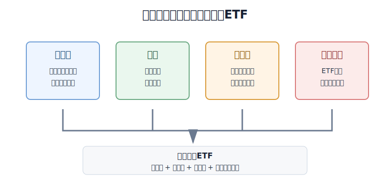
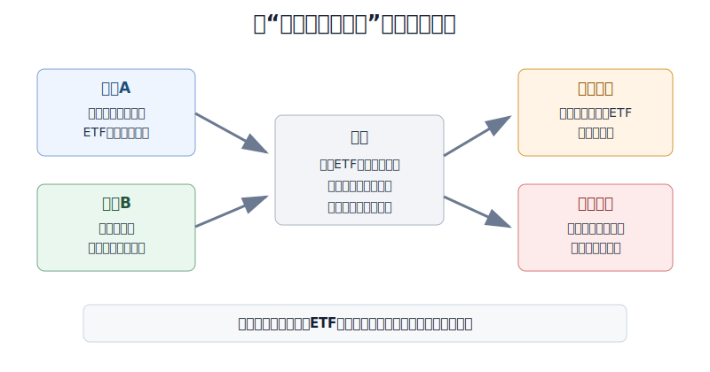
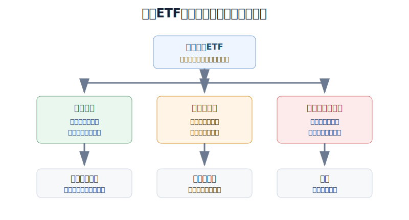

## 散户投资小白金融全品种操盘手册 - 10.6 美股宽基ETF - 费用率、规模、流动性、跟踪误差
  
### 作者  
digoal  
  
### 日期  
2026-06-07   
  
### 标签  
金融产品 , 金融工具 , 散户 , 投资小白 , 全品操盘手册  
  
----  
  
## 背景 
   

> 适用读者: 已经知道标普500、纳斯达克100、罗素2000这些指数，但还不会在一堆ETF代码里判断哪只更适合作为长期学习和配置工具的小白投资者。  
> 本文定位: 投资教育框架，不构成个性化投资建议。

## 先问一个反直觉的问题

两只ETF都写着“跟踪标普500”，是不是随便买哪只都一样？不一样。你买不到“指数本身”，只能买一个ETF外壳。**指数决定你承担什么市场风险，ETF外壳决定你为这个风险付出多少摩擦成本。**

## 核心概念: 宽基ETF要先过四道筛子

美股宽基ETF，就是跟踪一篮子美国股票的ETF，比如标普500ETF、美国全市场ETF、纳斯达克100ETF、罗素2000ETF。宽基的意思是覆盖面较宽，不押单家公司；ETF的意思是你买的是一个可以在交易所交易的基金份额。

对小白来说，最容易看错的地方是：只看指数名字，不看ETF外壳。外壳主要看四件事。

第一，费用率。费用率就是基金每年从资产里扣掉的运营成本。它不会像手续费那样跳出来提醒你，但会每天一点点体现在净值里。

第二，规模。规模不是越大越能涨，而是越大通常越不容易因为无人问津而清盘，也更容易形成稳定的交易生态。

第三，流动性。流动性不是“能买到”这么简单，而是你买卖时成交量够不够、买卖价差窄不窄。买卖价差，就是买一价格和卖一价格之间的差，它是看不见但真实存在的交易成本。

第四，跟踪误差。跟踪误差就是ETF实际表现和它跟踪指数之间的偏离。长期宽基ETF的目标不是跑出花活，而是尽量稳定地贴住指数。

所以本节先给出行动结论: **小白选美股宽基ETF，先确认指数，再用费用率、规模、流动性、跟踪误差筛掉不合格外壳；长期配置优先研究低费用、大规模、成交活跃、偏离较小的主流ETF，不因为代码热门或短期涨幅下单。**

## 逻辑推导链

【论证链标题】: 因为同一类宽基指数可以有不同ETF外壳，而外壳会通过费用、成交摩擦和跟踪偏离改变长期结果，所以小白买美股宽基ETF必须先筛外壳质量，再谈买入节奏。

── 第一步: 前提陈述

前提A: 指数决定底层风险，ETF决定执行质量。这是常量。标普500ETF的底层风险来自美国大盘股，纳斯达克100ETF的底层风险来自科技成长集中度，罗素2000ETF的底层风险来自小盘周期。但同样跟踪标普500，不同ETF的费用、规模、交易活跃度和分红处理可能不同。

前提B: 长期持有时，小成本会被时间放大。这是常量。费用率0.03%看起来只有万分之三，费用率0.0945%看起来也不高。但10万元持有一年，前者约扣30元，后者约扣94.5元；如果假设底层资产年化7%、持有20年，0.03%和0.0945%的费用差异会让期末结果相差约4614元。这个计算不是收益预测，只是说明小差异在长期会复利放大。

前提C: 规模和流动性会影响你能不能用接近合理价格进出。这是变量。SEC Investor.gov说明，ETF在交易所按市场价格买卖，市场价格可能不同于基金净值；投资者买入时可能付出高于净值的价格，卖出时也可能低于净值成交。对小白来说，这意味着ETF不是只看净值，还要看成交量、买卖价差和折溢价。

前提D: 跟踪误差无法完全消失，但主流宽基ETF应当长期贴近指数。这是变量。ETF要扣费用、处理现金、分红、指数调仓和交易成本，所以结果不会和指数完全一样。合格ETF的偏离应当小、稳定、可解释；如果偏离长期很大，说明外壳质量需要重新评估。

── 第二步: 逻辑推导

由A可得: 因为你买的是ETF外壳，不是指数本身，所以“跟踪同一个指数”只能说明底层篮子接近，不能说明交易成本和持有体验完全一样。

由A+B可得: 因为长期宽基ETF主要靠时间和复利工作，所以费用率越低，留给投资者的基础收益越多。费用率不是唯一标准，但它是长期持有必须先看的硬指标。

再由A+B+C可得: 因为低费用如果叠加低成交、高价差、高溢价，实际买卖成本也会变高，所以只看费用率仍然不够。正确动作是同时看规模、成交量、买卖价差和折溢价。

最后由A+B+C+D可得: 因为宽基ETF的任务是贴近指数并降低执行摩擦，所以小白的筛选顺序应是: 先看指数是否宽，再看费用是否低，再看规模和成交是否足够，最后看长期回报是否稳定贴近基准。

── 第三步: 正常情景下的操作结论

✅ 正常情景: 你准备用三年以上不用的钱研究美股宽基ETF，候选产品跟踪标普500、美国全市场、纳斯达克100这类清楚的宽基指数，费用率低，基金规模大，成交活跃，买卖价差很小，长期表现和基准指数接近。

对应操作: 把它放入买入清单。第一次只用计划仓位的三分之一到二分之一，使用限价单，记录当日费用率、规模、成交量、买卖价差、折溢价、汇率和买入理由。后续加仓只按计划执行，不因为当天涨跌临时改规则。

── 第四步: 数据和案例证实

证据1: 美国ETF市场已经很大，但大不等于每只ETF都合格。ICI《2026 Investment Company Fact Book》显示，截至2025年底，美国ETF市场有4495只基金、总净资产13.4万亿美元；其中大型美国股票ETF净资产约5.0万亿美元，占ETF净资产的38%。这说明美股宽基ETF是成熟工具，但也说明市场上产品很多，必须筛选。

证据2: 费用差异是真实存在的。iShares官网显示，IVV费用率为0.03%；Vanguard官网显示，VOO费用率为0.03%；State Street的SPY事实表显示，SPY总费用率和净费用率均为0.0945%。三者都跟踪标普500，但费用并不完全一样。对长期买入并持有的小白来说，费用率越低，长期摩擦越少。

证据3: 规模和流动性可以直接查。iShares官网显示，IVV截至2026年6月1日基金净资产约8598.54亿美元，日成交量约587.96万股，30日均量约622.24万股，30日中位买卖价差为0.01%，当日溢价/折价为0.01%。这对应前提C: 主流宽基ETF的交易摩擦可以被量化，而不是凭感觉判断。

证据4: 跟踪偏离要看长期表格。iShares官网显示，IVV截至2026年3月31日的1年、3年、5年、10年年化总回报分别为17.78%、18.28%、12.03%、14.12%，同期基准为17.80%、18.32%、12.06%、14.16%。State Street的SPY事实表显示，截至2026年3月31日，SPY的10年NAV回报为14.01%，指数为14.16%。这个差距提醒你: ETF长期结果会受费用和执行影响，合格产品应当偏离小且可解释。

失败案例: ICI同一报告显示，2025年美国ETF行业新开1099只ETF，同时有224只ETF被清算或合并，报告说明基金公司会清算或合并未能吸引足够需求的ETF。这个案例不是说小ETF一定会亏，而是说明低规模、低需求产品有持续运营风险。若小白只因为某只ETF名字新、主题热、短期涨幅高就买入，一旦产品成交稀疏、价差变宽或最终清盘，持有体验会和主流宽基ETF完全不同。

历史数据不代表未来，但这些数据验证了一个稳定规律: **宽基ETF的底层风险来自指数，额外摩擦来自外壳；小白能控制的不是市场涨跌，而是少买高成本、低流动性、跟踪差的外壳。**

── 第五步: 前提变化时的替代结论

若前提B改变，也就是候选ETF费用率明显高于同类主流ETF，推导路径变为: 因为底层指数相近，费用更高会长期吃掉结果。新结论: 除非它提供了你确实需要的特殊流动性或交易功能，否则长期配置不优先。

若前提C改变，也就是ETF规模小、成交少、买卖价差宽、折溢价明显，推导路径变为: 因为实际进出成本不可控，所以低费用也不能弥补交易摩擦。新结论: 降级为观察对象，等成交改善或换更主流替代品。

若前提D改变，也就是ETF长期明显跑偏基准，推导路径变为: 因为你买宽基ETF是为了贴近指数，不是为了押基金经理发挥，所以跟踪质量不合格。新结论: 暂停加仓，比较同指数其他产品，必要时替换。

若前提A改变，也就是候选产品其实不是宽基ETF，而是杠杆、反向、单一股票或窄主题ETF，推导路径变为: 因为底层风险已经变了，所以本节框架只剩下“检查外壳”的一部分，不再适合作为核心仓筛选。新结论: 移出宽基清单，回到第十章第十二节或第八节的高风险工具规则。

## 实操例子: 10万元账户怎样筛一只标普500ETF

这个例子对应论证链的正常结论: **同样跟踪标普500，也要先筛费用、规模、流动性和跟踪误差，再决定买入节奏。**

假设小林有10万元长期投资资金，其中计划用2万元等值资金学习美股宽基ETF。他已经决定先研究标普500ETF，不碰个股、期权和杠杆ETF。

第一步，确认指数。小林只把普通标普500ETF放进候选清单，不把“2倍标普500”“反向标普500”“标普500高股息增强”混进来。这一步对应前提A: 先确认底层风险一致。

第二步，填四项数据表。每只候选ETF都写清费用率、基金规模、30日均量、30日中位买卖价差、溢价/折价、1年和5年回报与基准差异。写不全，就不下单。

第三步，先排除两类产品。费用率明显高于主流同类产品、但你说不清为什么值得付费的，排除；成交稀疏、价差明显宽、折溢价波动大的，排除。这一步对应前提B和C。

第四步，分批买入。若候选ETF四项合格，小林第一次只买计划仓位的40%，也就是8000元等值以内；第二笔和第三笔按月或按季度执行。每次下单用限价单，不用市价单追涨。

第五步，写纠偏规则。如果买入后发现跨境产品溢价突然升高，停止加仓；如果ETF跟踪偏离明显扩大，先查基金公告和同类产品；如果只是指数本身下跌，但ETF外壳仍合格、仓位也在计划内，不因为短期亏损把长期宽基仓改成短线交易。

如果操作错误，最常见的后果是“只看0.03%费用率”。比如小林买了一只费用很低但成交很差的小ETF，买入时价差吃掉0.3%，卖出时又吃掉0.3%，这两次交易摩擦已经远高于一年费用率。纠偏方法不是争论“低费率有没有用”，而是回到四道筛子: 费用率、规模、流动性、跟踪误差必须一起看。

## 可复用框架

【四筛法】

适用前提: 你已经确认候选产品是普通美股宽基ETF，不是杠杆、反向、单股或窄主题产品。

核心逻辑: 因为ETF外壳会改变实际持有结果，所以先用四项指标筛掉不合格产品。

操作步骤:

1. 筛费用: 同类宽基ETF里优先低费用，费用高必须有明确理由。
2. 筛规模: 规模太小或需求不足的产品，只观察不重仓。
3. 筛交易: 看成交量、30日中位买卖价差、折溢价，不用市价单硬买。
4. 筛跟踪: 看长期回报和基准的差距，偏离大且不可解释就换。

前提失效时: 如果产品不是普通宽基ETF，四筛法不能把高风险产品洗成低风险工具；如果四项里两项以上不合格，直接排除。

举一反三: 这个框架也能用在A股ETF、港股ETF、债券ETF和黄金ETF上。区别只是底层风险不同，外壳检查逻辑相同。

【先壳后仓】

适用前提: 你已经看好某个宽基指数，准备决定买哪只ETF以及买多少。

核心逻辑: 因为指数负责方向，外壳负责摩擦，所以先检查外壳，再决定仓位。

操作步骤:

1. 先看壳: 费用、规模、成交、价差、折溢价、跟踪误差。
2. 再定仓: 外壳合格才进入买入清单，第一次不超过计划仓位的一半。
3. 后复盘: 每半年复查费用变化、规模变化、成交变化和跟踪情况。

前提失效时: 若出现高溢价、成交变差、跟踪偏离扩大，先暂停加仓；若产品清盘或合并，按公告处理并复盘为什么当初没有筛掉。

举一反三: 以后研究行业ETF时，也先看外壳，再看行业逻辑；不要被主题名字带走。

## 本节行动清单

| 动作 | 合格标准 |
|---|---|
| 确认指数 | 普通宽基指数，排除杠杆、反向、单股、窄主题 |
| 查费用率 | 写清费用率，并和同类主流ETF比较 |
| 查规模 | 基金净资产足够大，运营需求稳定 |
| 查流动性 | 看成交量、30日中位买卖价差、折溢价 |
| 查跟踪 | 看1年、3年、5年、10年与基准的差距 |
| 写下单规则 | 合格才分批买，使用限价单，记录汇率和买入理由 |
| 写失效条件 | 高费率、低成交、高溢价、跟踪偏离扩大时暂停加仓 |

## 一句话总结

美股宽基ETF不是“名字对了就能买”，而是先看指数，再看外壳；小白真正能控制的，是用低费用、大规模、好流动性、跟踪稳定的工具，把本来就要承担的市场风险买得更干净一点。

## 参考资料

- SEC Investor.gov: Exchange-Traded Funds (ETFs)，2026年访问，https://www.investor.gov/introduction-investing/investing-basics/investment-products/mutual-funds-and-exchange-traded-2
- Investment Company Institute: 2026 Investment Company Fact Book，2026年4月，https://www.ici.org/system/files/2026-04/2026-factbook.pdf
- iShares/BlackRock: iShares Core S&P 500 ETF (IVV)，数据截至2026年6月1日及2026年3月31日，https://www.ishares.com/us/products/239726/ishares-core-sp-500-etf
- State Street: SPDR S&P 500 ETF Trust (SPY)，2026年访问，https://www.ssga.com/us/en/intermediary/etfs/state-street-spdr-sp-500-etf-trust-spy
- State Street: SPY Fact Sheet，截至2026年3月31日，https://www.ssga.com/library-content/products/factsheets/etfs/us/factsheet-us-en-spy.pdf
- Vanguard: Vanguard S&P 500 ETF (VOO)，2026年访问，https://investor.vanguard.com/investment-products/etfs/profile/voo

> ⚠️ **声明**：本文内容为投资教育目的，所有历史数据、策略框架均为辅助学习工具，不构成证券投资建议。市场有风险，投资需谨慎。实际操作请结合自身风险承受能力，必要时咨询专业投顾。
  
#### [PostgreSQL 解决方案集合](../201706/20170601_02.md "40cff096e9ed7122c512b35d8561d9c8")
  
  
#### [德哥 / digoal's Github - 公益是一辈子的事.](https://github.com/digoal/blog/blob/master/README.md "22709685feb7cab07d30f30387f0a9ae")
  
  
#### [About 德哥](https://github.com/digoal/blog/blob/master/me/readme.md "a37735981e7704886ffd590565582dd0")
  
  

  
