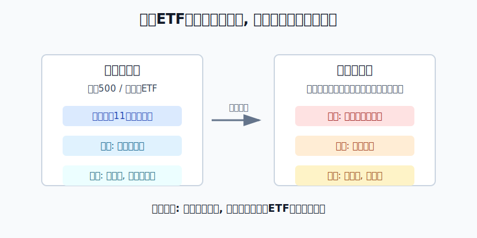
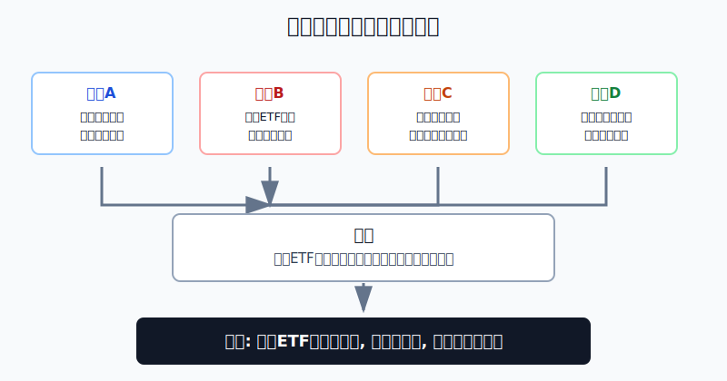
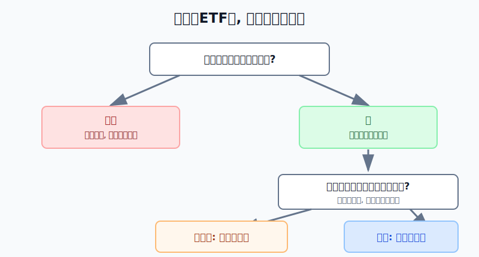

## 散户投资小白金融全品种操盘手册 - 10.7 行业ETF - 科技、医疗、金融、能源、消费、半导体
  
### 作者  
digoal  
  
### 日期  
2026-06-07   
  
### 标签  
金融产品 , 金融工具 , 散户 , 投资小白 , 全品操盘手册  
  
----  
  
## 背景 
   

> 适用读者: 已经知道标普500、纳斯达克100和美股宽基ETF，开始听到XLK、XLV、XLF、XLE、XLY、SMH这类行业ETF，但不知道该不该买、买多少、什么时候撤的小白投资者。  
> 本文定位: 投资教育框架，不构成个性化投资建议。

## 先问一个反直觉的问题

很多人买行业ETF，是因为觉得“我看好科技，所以买科技ETF；我看好AI，所以买半导体ETF”。这句话漏掉了最关键的一步: **如果你已经买了标普500，你本来就已经有科技、医疗、金融、能源和消费暴露。行业ETF不是从零开始买一个行业，而是在已有宽基仓上继续加浓度。**

## 核心概念: 行业ETF是“加浓度”的工具

宽基ETF像一锅配好的汤，里面本来就有科技、医疗、金融、能源、消费、工业、公用事业等不同配料。行业ETF不是另一锅更高级的汤，而是你单独往里面多加一勺某个配料。

科技ETF，常见代表是XLK这类信息技术行业ETF。它买的是软件、半导体、硬件、IT服务等公司。医疗ETF，常见代表是XLV这类医疗保健ETF，里面有制药、医疗设备、医疗服务公司。金融ETF，常见代表是XLF，核心驱动是银行、资本市场、保险和金融服务。能源ETF，常见代表是XLE，受油价、天然气、资本开支和地缘事件影响很大。可选消费ETF，常见代表是XLY，和居民消费、就业、收入、汽车、线上零售、餐饮旅游相关。半导体ETF，比如SMH，比“科技行业”还窄，集中在芯片设计、制造、设备和材料链条。

所以本节先给行动结论: **小白可以研究行业ETF，但默认把它放在卫星仓。先有核心宽基，再用小比例行业ETF表达明确判断；没有明确判断、不知道失效条件、只是因为涨得多，就不该把行业ETF买成主仓。**

## 逻辑推导链

【论证链标题】: 因为行业ETF是在宽基基础上主动增加单一行业浓度，所以它适合做有上限、有失效条件的卫星仓，不适合替代美股核心宽基。

── 第一步: 前提陈述

前提A: 宽基ETF已经包含行业暴露。这是常量，但各行业权重会变。State Street 的 SPY factsheet 显示，截至2026年3月31日，SPY 的行业权重包括信息技术32.91%、金融12.59%、通信服务10.28%、可选消费9.86%、医疗保健9.47%、能源4.02%。对小白来说，这意味着你买标普500时，已经不是“没有科技、没有金融、没有医疗”，而是已经按市值权重买了这些行业。

前提B: 行业ETF比宽基更集中。这是常量。State Street 的 XLK factsheet 显示，截至2026年3月31日，XLK 的总费用率为0.08%，持仓数为73只；VanEck 的 SMH factsheet 显示，截至2026年5月31日，SMH 持仓数为26只，总费用率为0.35%，主要跟踪美国上市半导体公司。费用低、交易方便，只解决“工具好不好用”的问题，不等于风险已经被分散掉。

前提C: 行业表现会随经济环境、利率、盈利周期和商品价格轮换。这是变量。行业不是永远按一个排名涨。科技受利率和盈利预期影响大，医疗受政策和药品周期影响大，金融受利率曲线和信用风险影响大，能源受油气价格和供需影响大，消费受就业、收入和消费信心影响大，半导体受库存周期、资本开支和AI算力需求影响大。

前提D: 小白很难长期稳定判断行业周期。这是常量。小白最大的问题不是完全看不懂行业，而是容易把“一个阶段的强势”误认为“长期安全”。行业ETF越热门，越容易让人忘记仓位上限。

── 第二步: 逻辑推导

由A可得: 因为宽基ETF已经包含主要行业，所以你买行业ETF不是为了“补上没有的行业”，而是在原有组合上主动加重某个行业。

由A+B可得: 因为行业ETF把资金集中到更窄的篮子里，所以它会放大该行业的共同风险。科技公司一起受利率和AI资本开支影响，能源公司一起受油价影响，金融公司一起受信用风险影响，半导体公司一起受库存和订单周期影响。

再由B+C可得: 因为行业ETF集中，而行业胜负会轮换，所以“今年涨得最好”不能直接推出“明年继续重仓”。行业ETF的买入理由必须是可检查的行业驱动，而不是过去涨幅。

最后由A+B+C+D可得: 因为小白难以长期判断行业轮换，又已经通过宽基持有行业底仓，所以正确动作不是重仓押行业，而是先用核心宽基做底盘，再把行业ETF控制在卫星仓，用明确前提买入，用前提破坏退出。

── 第三步: 正常情景下的操作结论

✅ 正常情景: 你已经有标普500、全市场ETF或其他美股核心宽基仓；投资期限三年以上；知道自己想加的是哪个行业；能写出行业上涨的驱动、失效条件和仓位上限。

对应操作: 行业ETF可以作为卫星仓参与。对小白示例而言，单个行业ETF先控制在总资产3%-8%以内，所有行业卫星仓合计不超过总资产10%-20%。第一次买入不超过计划仓位的三分之一。买入理由必须写成“行业驱动成立、估值没有明显透支、仓位不超上限”，不能写成“最近大家都在买”。

── 第四步: 数据和案例证实

证据1: 宽基里已经有行业暴露。State Street 的 SPY factsheet 显示，截至2026年3月31日，SPY 信息技术权重为32.91%，医疗保健9.47%，金融12.59%，能源4.02%。这对应前提A: 如果你已经持有SPY或类似标普500ETF，再买XLK、XLV、XLF、XLE，本质是在已有暴露上加仓，不是从零补齐。

证据2: 行业胜负确实会大幅轮换。S&P Dow Jones Indices 的 Sector Performance Matrix 显示，2022年 S&P 500 Energy 回报65.72%，而 Info Tech 回报-28.19%；到2023年，Info Tech 回报57.84%，Energy 回报-1.33%。这对应前提C: 行业ETF的优势和风险都来自同一个东西，就是行业驱动。一旦驱动换了，赢家和输家会换位。

证据3: 同样是ETF，窄行业ETF和宽基不是一个风险层级。XLK截至2026年3月31日持仓约73只、总费用率0.08%；SMH截至2026年5月31日持仓26只、总费用率0.35%，集中在半导体生产和设备公司。FINRA在集中风险教育材料中提醒，投资者要查看基金和ETF的底层持仓，单纯持有基金并不能自动消除集中风险。这对应前提B和D: ETF外壳不等于充分分散。

失败案例: 2022年就是典型反例。假设一个小白在2021年科技股强势后，把科技ETF或半导体ETF当成“长期肯定最强”的主仓，同时忽略利率上行和估值收缩，那么2022年信息技术行业-28.19%的回撤会直接打到账户上。反过来，如果他在2022年能源大涨65.72%后追高能源ETF，又会遇到2023年能源-1.33%、科技57.84%的轮换。历史不代表未来，但这个案例验证了一条稳定规律: **行业ETF不能只看上一年的赢家，必须看当下驱动是否仍成立。**

── 第五步: 前提变化时的替代结论

若前提A被忽略，也就是你已经有很高比例标普500或纳斯达克100，却继续加科技、半导体ETF，推导路径就变成: 因为核心仓里已经有高科技权重，所以额外行业ETF会把账户变成科技集中仓。新结论: 暂停加仓，先计算底层行业暴露，再决定是否需要降仓。

若前提C改变，也就是行业驱动失效，推导路径就变成: 因为行业ETF集中在一个驱动上，所以驱动破坏时，集中度会从优势变成伤害。新结论: 不补仓摊低成本，先把仓位降到观察仓，再复盘假设。

若前提D改变，也就是你没有核心宽基，只因为半导体、AI、能源或医疗很热就先买行业ETF，推导路径就变成: 因为你还没有账户底盘，所以卫星仓会被误用成主仓。新结论: 先建核心宽基，再谈行业。

## 六类常见行业ETF怎么理解

| 类型 | 常见例子 | 核心驱动 | 小白要盯什么 |
|---|---|---|---|
| 科技 | XLK | 盈利增长、利率、AI和软件周期 | 估值、前十大权重、盈利预期 |
| 医疗 | XLV | 药品、医疗服务、医保支付、人口老龄化 | 政策风险、龙头权重、研发周期 |
| 金融 | XLF | 利率曲线、信贷、资本市场活跃度 | 坏账、银行压力、净息差 |
| 能源 | XLE | 油气价格、供需、地缘事件、资本开支 | 油价、库存、现金流周期 |
| 可选消费 | XLY | 就业、收入、消费信心、利率 | 居民负债、耐用品消费、龙头集中度 |
| 半导体 | SMH | AI算力、库存周期、晶圆厂资本开支 | 订单、库存、设备周期、单股权重 |

这张表不是让你六个都买。它的用法正好相反: **每次只允许自己回答一个行业的驱动是否成立。答不清，就不买。**

## 实操例子: 10万元账户怎么放行业ETF

这个例子对应论证链的正常结论: **行业ETF只能在核心宽基之后，用小比例表达明确判断。**

假设小林有10万元长期投资资金，已经留足生活备用金。他计划拿4万元做美股ETF，其中3万元放在标普500或全市场ETF，剩下1万元用于纳指100、行业ETF和其他卫星工具。

第一步，先算已有行业暴露。假设小林买了3万元SPY，按2026年3月31日SPY factsheet 的行业权重估算，他已经间接持有约9873元信息技术、3777元金融、2958元可选消费、2841元医疗保健、1206元能源。这个动作对应前提A: 买行业ETF之前，先知道自己已经有什么。

第二步，只选一个行业假设。小林如果想买半导体ETF，必须把理由写清楚: AI算力资本开支仍在扩张，芯片公司盈利预期没有明显下修，库存周期没有恶化。如果他只能写“半导体最近涨得猛”，这不是合格理由。

第三步，定仓位上限。小林把单个行业ETF上限定为总资产5%，也就是5000元。第一次只买1500-2000元，第二次等行业驱动继续被财报或订单数据验证，第三次只在仓位没有超标、估值没有明显透支时补足。这个动作对应前提B和D: 集中工具先管上限。

第四步，写前提失效动作。半导体ETF的失效条件可以写成: 主要公司下调收入指引、AI资本开支明显放缓、库存重新上升、长期利率上行压缩成长估值。出现两项，就停止加仓；出现三项，就把仓位降回观察仓。这里不是预测顶部，而是防止自己把卫星仓硬扛成主仓。

第五步，处理盈利后的诱惑。如果半导体ETF从5000元涨到8000元，超过原计划上限，小林不因为赚钱就继续加仓，而是减回计划比例，把超出的部分转回核心宽基或现金防守仓。行业ETF最容易犯的错，就是赚钱后把纪律当成多余。

如果操作错误，后果很直接。小林原本只想买5000元行业ETF，后来被AI新闻刺激，临时买到2万元。这样他的美股仓不再是“核心宽基+行业卫星”，而是“宽基外壳+半导体重仓”。一旦半导体库存或估值前提反转，账户波动会立刻放大。纠偏动作是先把行业仓降回上限，再复盘当初违反了哪一个前提。

## 可复用框架

【三层过滤】

适用前提: 你已经有美股核心宽基，想额外买某个行业ETF。

核心逻辑: 因为行业ETF是在宽基之上加浓度，所以买入前必须先过滤已有暴露、行业驱动和仓位上限。

操作步骤:

1. 查已有暴露: 先看核心宽基里该行业已经占多少。
2. 查行业驱动: 写出这个行业上涨靠什么，不写新闻标题。
3. 查仓位上限: 单行业先控制在总资产3%-8%，所有行业卫星合计不超过10%-20%。

前提失效时: 如果已有暴露已经很高，暂停加仓；如果行业驱动说不清，放弃；如果仓位超上限，先减回计划比例。

举一反三: 这个框架也能用在A股行业ETF、港股互联网ETF、商品主题基金和AI主题ETF上。越窄的工具，越要先查浓度。

【驱动退出】

适用前提: 你已经持有行业ETF，不知道什么时候卖。

核心逻辑: 因为行业ETF买的是行业驱动，不是永久信仰，所以卖出条件必须和买入理由一一对应。

操作步骤:

1. 买入时写驱动: 例如利率下行、盈利上修、油价供需改善、AI资本开支扩张。
2. 持有时查证据: 每次财报季或重要宏观数据后，检查驱动有没有被验证。
3. 失效时减仓: 两个核心证据转坏，停止加仓；三个证据转坏，降到观察仓。

前提失效时: 如果你已经说不清当初为什么买，只剩“跌了不甘心”或“涨了怕错过”，说明这笔交易已经脱离框架。动作不是补仓，而是降仓复盘。

举一反三: 这个框架也适用于纳指100、罗素2000、REITs和黄金。只要买入依赖特定前提，退出就必须跟前提绑定。

## 本节行动清单

| 动作 | 合格标准 |
|---|---|
| 先识别已有暴露 | 看核心宽基里科技、金融、医疗、消费、能源各占多少 |
| 明确组合位置 | 行业ETF默认卫星仓，不替代标普500或全市场ETF |
| 写出行业驱动 | 用盈利、利率、油价、消费、政策、库存等变量表达，不用热门口号 |
| 设置仓位上限 | 单行业先按总资产3%-8%，行业卫星合计不超过10%-20% |
| 分批买入 | 第一次不超过计划行业仓位的三分之一 |
| 绑定退出条件 | 行业驱动被证伪时减仓，不用“跌了很多”当补仓理由 |

## 一句话总结

行业ETF的本质不是“更专业的宽基”，而是在核心宽基之外主动加行业浓度；小白只有把它放在卫星仓，并写清驱动、上限和失效条件，才是在使用工具，而不是被热点牵着走。

## 参考资料

- State Street: SPDR S&P 500 ETF Trust factsheet，截至2026年3月31日，https://www.ssga.com/library-content/products/factsheets/etfs/us/factsheet-us-en-spy.pdf
- State Street: Technology Select Sector SPDR ETF factsheet，截至2026年3月31日，https://www.ssga.com/library-content/products/factsheets/etfs/us/factsheet-us-en-xlk.pdf
- State Street: Health Care Select Sector SPDR ETF factsheet，截至2026年3月31日，https://www.ssga.com/library-content/products/factsheets/etfs/us/factsheet-us-en-xlv.pdf
- State Street: Financial Select Sector SPDR ETF factsheet，截至2026年3月31日，https://www.ssga.com/library-content/products/factsheets/etfs/us/factsheet-us-en-xlf.pdf
- State Street: Energy Select Sector SPDR ETF factsheet，截至2026年3月31日，https://www.ssga.com/library-content/products/factsheets/etfs/us/factsheet-us-en-xle.pdf
- State Street: Consumer Discretionary Select Sector SPDR ETF factsheet，截至2026年3月31日，https://www.ssga.com/library-content/products/factsheets/etfs/us/factsheet-us-en-xly.pdf
- VanEck: VanEck Semiconductor ETF factsheet，截至2026年5月31日，https://www.vaneck.com/us/en/investments/semiconductor-etf-smh-fact-sheet.pdf
- S&P Dow Jones Indices: S&P 500 Sector Performance Matrix，https://www.spglobal.com/spdji/kr/documents/performance-reports/spdji-sector-performance-matrix.pdf
- FINRA: Concentrate on Concentration Risk，2022年，https://www.finra.org/investors/insights/concentration-risk

> ⚠️ **声明**：本文内容为投资教育目的，所有历史数据、策略框架均为辅助学习工具，不构成证券投资建议。市场有风险，投资需谨慎。实际操作请结合自身风险承受能力，必要时咨询专业投顾。
  
#### [PostgreSQL 解决方案集合](../201706/20170601_02.md "40cff096e9ed7122c512b35d8561d9c8")
  
  
#### [德哥 / digoal's Github - 公益是一辈子的事.](https://github.com/digoal/blog/blob/master/README.md "22709685feb7cab07d30f30387f0a9ae")
  
  
#### [About 德哥](https://github.com/digoal/blog/blob/master/me/readme.md "a37735981e7704886ffd590565582dd0")
  
  

  
