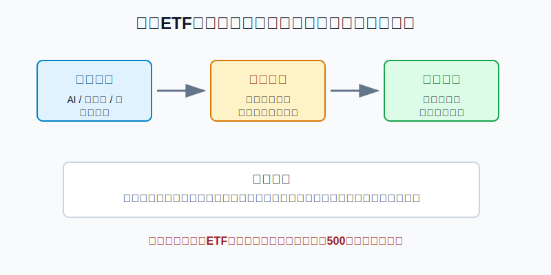
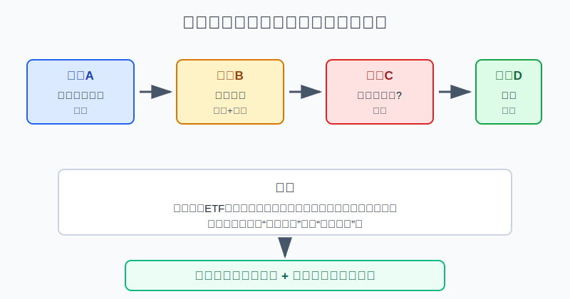
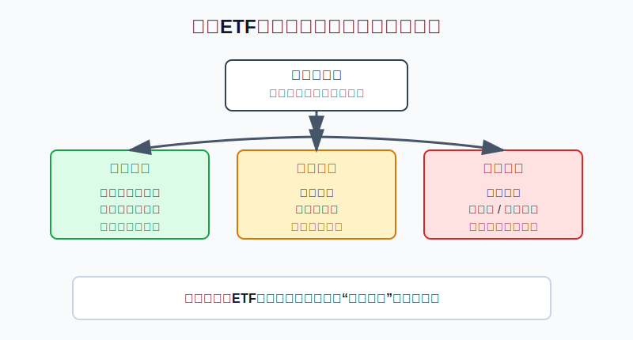
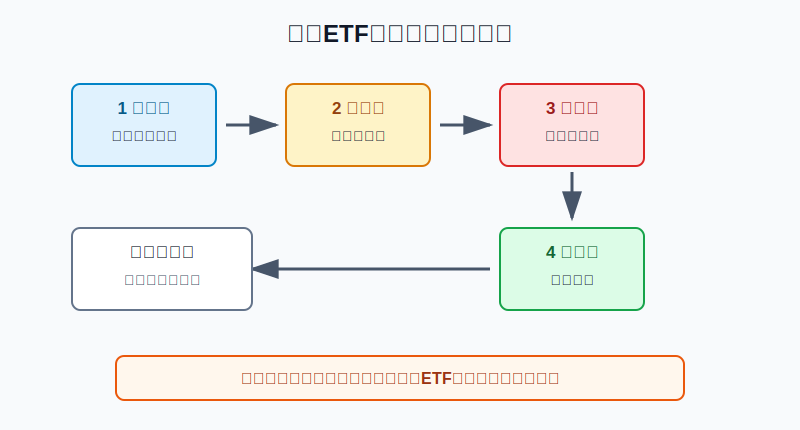

## 散户投资小白金融全品种操盘手册 - 10.8 主题ETF - AI、机器人、云计算、网络安全，为什么容易被高估
  
### 作者  
digoal  
  
### 日期  
2026-06-07   
  
### 标签  
金融产品 , 金融工具 , 散户 , 投资小白 , 全品操盘手册  
  
----  
  
## 背景 
   

> 适用读者: 已经知道美股宽基ETF和行业ETF，开始被AI、机器人、云计算、网络安全等主题吸引，但不知道这些主题ETF能不能买、怎么买、买多少的小白投资者。  
> 本文定位: 投资教育框架，不构成个性化投资建议。

## 先问一个反直觉的问题

AI改变世界，和AI主题ETF值得重仓，是两件事。前者讲的是产业趋势，后者讲的是你用什么价格买入一篮子公司。**小白最容易亏在中间这一步：主题判断对了，但买在估值、费用、流动性和仓位都不合格的位置。**

## 核心概念: 主题ETF买的是“故事包装后的股票篮子”

主题ETF，就是围绕某个长期叙事设计出来的ETF。AI、机器人、云计算、网络安全、自动驾驶、清洁能源，都属于典型主题。它和标普500ETF不一样。标普500买的是美国大盘核心公司，主题ETF买的是“符合某个主题定义的一组公司”。

用生活里的比喻讲，宽基ETF像一座城市的主干道，车流有快有慢，但覆盖面广；行业ETF像某一条商业街，受这个行业景气影响更明显；主题ETF更像“未来概念展馆”，名字很吸引人，但里面每个展位到底是真赚钱的公司、讲故事的公司、还是被硬塞进去凑主题的公司，要一格一格看。

这里先给行动结论: **主题ETF默认只能做卫星仓，不能替代标普500、全市场ETF或纳斯达克100这类核心仓。买入前必须同时检查五件事：主题是否真实、持仓是否纯正、估值是否透支、费用和价差是否合理、仓位是否可承受。**

## 逻辑推导链

【论证链标题】: 因为主题ETF把长期叙事、集中持仓、估值热度和交易成本打包在一起，所以它适合小比例研究仓或卫星仓，不适合小白重仓追热点。

── 第一步: 前提陈述

前提A: AI、机器人、云计算、网络安全这些主题，确实对应真实产业需求。这是变量，但不是空话。企业需要算力和软件，工厂需要自动化，数据上云带来网络安全需求。用小白能理解的话说，主题不是凭空编出来的，它背后有产品、客户和预算。

前提B: 主题真实，不等于ETF持仓纯正。这是常量。主题ETF通常按指数规则筛股票，但“与主题有关”和“主要收入来自主题”不是一回事。有些公司只是部分业务沾边，有些公司已经是大盘科技龙头，有些公司盈利还没跟上估值。你以为自己买的是AI，其实可能买到的是一篮子软件、半导体、工业自动化和高估值成长股。

前提C: 主题ETF最容易在市场最兴奋时被发行、被推荐、被买入。这是变量。因为主题越热，投资者越愿意听故事，产品发行方也越容易募集资金。问题是，市场兴奋时，底层股票往往已经涨过一轮；这时买入，不是买未来，而是在给别人已经形成的预期买单。

前提D: 主题ETF通常比核心宽基ETF更贵、更集中，交易成本也更容易被忽视。这是常量加变量。费用率是每年从基金资产里扣的成本；买卖价差，是买入价和卖出价之间的差；溢价折价，是ETF交易价格偏离净值的程度。小白只看主题名字，就会漏掉这些成本。

前提E: 小白的账户承受力有限，不能让一个主题决定整个组合命运。这是常量。主题仓的任务是学习和增加弹性，不是让账户跟着一个叙事大起大落。

── 第二步: 逻辑推导

由A可得: 因为这些主题背后有真实产业需求，所以它们值得研究，不能简单说“热门就是骗局”。

由A+B可得: 因为主题真实但ETF持仓未必纯正，所以买入前必须先看成分股、前十大权重、行业分布和收入来源。只知道主题名字，不等于知道自己买了什么。

再由B+C可得: 因为主题ETF容易在最受关注时吸引资金，而受关注时底层股票估值常已抬高，所以“故事越顺耳”反而越要检查估值和买入位置。这里的核心矛盾是：产业趋势越明显，市场越容易提前定价。

再由C+D可得: 因为主题ETF本身费用、价差、估值和集中度更高，所以即使主题长期成立，短中期也会出现大幅回撤或长期跑输宽基。买错价格，会吞掉看对主题的收益。

最后由A+B+C+D+E可得: 因为小白无法稳定判断一个主题是否已经被过度定价，所以正确动作不是“看好AI就重仓AI ETF”，而是先用核心宽基打底，再把主题ETF限制在小比例卫星仓；只有主题、持仓、估值、费用、流动性五项合格，才允许分批进入。

── 第三步: 正常情景下的操作结论

✅ 正常情景: 你已经有美股核心宽基仓，投资期限三年以上，能看懂ETF持仓和费用，目标主题有真实收入增长，底层公司估值没有明显透支，ETF成交量和买卖价差正常。

对应操作: 主题ETF可以作为小比例卫星仓。对小白示例而言，单个主题ETF先控制在总资产1%-3%，多个主题合计不超过总资产5%-8%。第一次买入只用计划仓位的三分之一，剩余仓位等待估值回落、业绩验证或市场回调后再分批。

── 第四步: 数据和案例证实

证据1: 主题基金规模很大，但长期胜率并不天然高。Morningstar 的 Global Thematic Fund Landscape Report 2025 页面披露，全球主题基金资产在2025年三季度达到7790亿美元；同页也提示，多数主题基金长期跑输全球股票。这对应前提C: 主题越热，资金越多，但资金流入不等于投资者一定赚钱。

证据2: 学术研究直接验证了“热门专题产品容易买在高估值”的问题。Ben-David、Franzoni、Kim、Moussawi 的论文《Competition for Attention in the ETF Space》研究专业化ETF后发现，这类ETF在发行后的前五年，风险调整后大约损失30%；论文给出的解释不是单纯费用太高，而是发行时底层股票已经被高估。这个证据正好对应本节核心结论: 看对故事，不等于买对价格。

证据3: 主题ETF成本明显高于核心宽基。Global X 官方页面显示，BOTZ 机器人与人工智能ETF在2026年5月资料中的总费用率为0.68%；AIQ 人工智能与科技ETF的总费用率也为0.68%。作为对比，Vanguard 官方页面显示，VOO 标普500ETF费用率为0.03%；BlackRock 官方页面显示，IVV 标普500ETF费用率为0.03%。费用差不是决定胜负的唯一因素，但它说明主题ETF从起跑线开始就要多赚一截，才能抵消成本。

证据4: ETF还有交易价格偏离净值和买卖价差问题。SEC Investor.gov 的ETF投资者公告提醒，ETF交易价格可能高于或低于基金净值，投资者还能在基金官网或招募说明书里查看历史溢价折价。FINRA关于集中风险的材料也提醒，投资者要看清基金或ETF的底层持仓，同一行业或市场片段里的资产高度相关。这个证据对应前提D: 主题ETF不是“点一下买入”这么简单，交易成本和集中风险都要检查。

历史不代表未来。上面的数据仍有参考价值，是因为它们不是讲某一只ETF的短线涨跌，而是在验证同一条结构规律：**越吸引注意力的投资主题，越容易在高估值、高费用和高集中度条件下被普通投资者追进去。**

── 第五步: 前提变化时的替代结论

若前提A改变，也就是主题需求没有兑现成收入和利润，推导路径变为: 因为产业故事没有转化为公司现金流，所以ETF持仓的估值缺少支撑。新结论: 不加仓，已有仓位降到观察仓，等收入、订单、利润率数据验证后再评估。

若前提C改变，也就是主题已经被市场极度追捧，媒体、社区和产品发行都在集中宣传，推导路径变为: 因为市场已经提前把好消息写进价格，所以你买入后的安全边际下降。新结论: 不追高，不用“长期趋势”覆盖短期估值风险。

若前提D改变，也就是ETF成交量小、买卖价差大、溢价明显或费用过高，推导路径变为: 因为你还没开始承担主题风险，已经先承担了交易成本和结构成本，所以买入条件不成立。新结论: 换更低成本、更高流动性的同类工具；没有合格工具，就只观察。

若前提E改变，也就是你已经把AI、云计算、半导体、网络安全多个主题都买成重仓，推导路径变为: 因为这些主题底层可能共同押注大型科技、成长股和高估值资产，所以表面上买了很多ETF，实质上风险高度重叠。新结论: 合并计算主题仓位，把超出上限的部分降回核心宽基或现金防守仓。

失败案例: 2021年前后全球主题产品发行潮就是典型反例。Morningstar 新闻稿披露，2021年全球新发行589只主题基金，超过2020年271只的两倍。随后大量热门成长主题经历估值回撤。这个案例的教训不是“所有主题都不能买”，而是“当一个主题热到密集发行产品时，小白更应该先查估值和仓位，而不是先下单”。

## 实操例子: 10万元账户怎么买AI主题ETF

这个例子对应论证链的正常结论: **主题ETF可以做小比例卫星仓，但必须先通过主题、持仓、估值、费用、流动性、仓位检查。**

假设小林有10万元长期投资资金，生活备用金已经留足。他已经用3万元配置了标普500或全市场ETF，用1万元配置短债或货币市场基金。现在他看到AI、机器人和云计算讨论很热，想买一只AI主题ETF。

第一步，先定上限。小林把单个AI主题ETF上限定为总资产3%，也就是3000元。多个主题ETF合计不超过8000元。这一步对应前提E: 主题仓是卫星，不是账户主骨架。

第二步，看基金到底买什么。小林打开ETF官网，看前十大持仓、行业分布、指数规则和费用率。如果前十大里大部分公司只是“沾AI概念”，主营收入不是AI相关，或者持仓和他已有的纳指100高度重叠，他不把它当成新增分散，而是当成科技成长仓的重复暴露。这一步对应前提B。

第三步，看估值和热度。小林不因为“AI长期一定重要”直接买满。他检查底层公司最近一年涨幅、估值水平、盈利增速和市场讨论热度。如果价格已经反映了很高增长预期，他只建立1000元观察仓，剩余2000元等待业绩验证或回调。这一步对应前提C。

第四步，看费用、价差和成交。小林比较同类ETF的费用率、30日买卖价差、日成交额和溢价折价。如果某只ETF费用高、成交少、买卖价差宽，他不碰；如果同类工具都不合格，他不为了买主题而买工具。这一步对应前提D。

第五步，分批买入并写失效条件。若四项检查合格，小林第一次买1000元；当季度财报显示相关公司收入和利润继续验证主题，再考虑第二笔；如果ETF上涨后占总资产超过3%，他再平衡回上限；如果主题公司盈利不及预期、利率上行压缩成长股估值，或ETF相对标普500连续走弱，他停止加仓并复盘。

如果操作错误，最常见的后果是把“学习一个主题”变成“重仓一个叙事”。比如小林原计划买3000元AI ETF，结果看到社区讨论热烈，连续追加到3万元，还同时买了机器人、云计算、半导体和网络安全ETF。表面看是四个主题，实际可能都押在同一批大型科技成长股上。一次估值回撤，就会让他的总账户跟着主题波动。纠偏方法不是继续找下一个热点，而是把所有主题ETF合并计算，超出上限的部分降回核心宽基。

## 可复用框架

【主题五问】

适用前提: 你准备买入AI、机器人、云计算、网络安全等主题ETF，但还没确认它是否适合进入组合。

核心逻辑: 因为主题ETF的收益取决于产业兑现、持仓纯度、买入价格、交易成本和仓位边界，所以买入前必须五项同时过关。

操作步骤:

1. 问主题: 这个主题有没有真实收入、订单、预算或利润验证。
2. 问持仓: ETF前十大持仓是不是主要受益公司，而不是硬凑概念。
3. 问估值: 价格是否已经把未来增长透支。
4. 问成本: 费用率、买卖价差、成交量、溢价折价是否合理。
5. 问仓位: 买入后单主题和多主题合计是否仍在上限内。

前提失效时: 五问里有两项答不上来，只观察不买；估值、流动性、仓位三项任意一项明显失控，停止加仓或降仓。

举一反三: 这个框架也适用于清洁能源ETF、元宇宙ETF、自动驾驶ETF、太空经济ETF。越像未来故事，越要先问现在价格。

【核心先行】

适用前提: 你还没有稳定的美股核心仓，却被主题ETF吸引。

核心逻辑: 因为核心仓负责长期承接美国市场整体收益，主题仓只负责小比例增强弹性，所以顺序必须是核心先行、主题后置。

操作步骤:

1. 先建核心: 标普500、全市场ETF或其他宽基工具先占主要比例。
2. 再设主题: 单个主题1%-3%，多个主题合计5%-8%以内。
3. 最后再平衡: 主题涨到超过上限就减回，主题逻辑失效就退出。

前提失效时: 如果你没有核心宽基仓，先不买主题ETF；如果你已经把主题ETF买成主仓，第一步不是研究下一个热点，而是把账户结构改回核心卫星。

举一反三: 行业ETF、罗素2000、黄金、REITs都能用这个框架。任何“听起来很有机会”的资产，都要先问它在组合里是核心还是卫星。

## 本节行动清单

| 动作 | 合格标准 |
|---|---|
| 区分主题和价格 | 长期看好不等于现在重仓 |
| 看底层持仓 | 查前十大、行业分布、指数规则和收入来源 |
| 查估值和热度 | 热门宣传越密集，越先看估值是否透支 |
| 比较成本 | 费用率、买卖价差、成交量、溢价折价都要看 |
| 控制仓位 | 单主题1%-3%，多主题合计5%-8%以内 |
| 合并计算重叠 | AI、云计算、半导体、网络安全可能共享科技成长风险 |
| 写退出条件 | 盈利不兑现、估值过热、流动性差、仓位超标时切换动作 |

## 一句话总结

主题ETF最危险的地方不是主题本身，而是小白把“未来会发生”误读成“现在可以买很多”；真正的操作顺序是先核心宽基，再小比例主题，最后用持仓、估值、成本和仓位反复校验。

## 参考资料

- Morningstar: Global Thematic Fund Landscape Report 2025，2025年，https://www.morningstar.com/business/insights/research/global-thematic-fund-landscape
- Morningstar Newsroom: Morningstar's Global Thematic Funds Landscape Report Shows Record Inflows into Thematic Funds Since the Start of COVID-19 Pandemic，2022年，https://newsroom.morningstar.com/news/news-details/2022/Morningstars-Global-Thematic-Funds-Landscape-Report-Shows-Record-Inflows-into-Thematic-Funds-Since-the-Start-of-COVID-19-Pandemic/default.aspx
- Ben-David, Franzoni, Kim, Moussawi: Competition for Attention in the ETF Space，NBER Working Paper 28369，2021年，https://www.nber.org/papers/w28369
- SEC Investor.gov: Updated Investor Bulletin: Exchange-Traded Funds (ETFs)，2023年，https://www.investor.gov/introduction-investing/general-resources/news-alerts/alerts-bulletins/investor-bulletins-24
- FINRA: Concentrate on Concentration Risk，2022年，https://www.finra.org/investors/insights/concentration-risk
- Global X: Robotics & Artificial Intelligence ETF (BOTZ) 官方页面，2026年访问，https://www.globalxetfs.com/funds/botz/
- Global X: Artificial Intelligence & Technology ETF (AIQ) 官方页面，2026年访问，https://www.globalxetfs.com/aiq
- Vanguard: Vanguard S&P 500 ETF (VOO) 官方页面，2026年访问，https://advisors.vanguard.com/investments/products/voo/vanguard-sp-500-etf
- BlackRock: iShares Core S&P 500 ETF (IVV) 官方页面，2026年访问，https://www.blackrock.com/us/individual/products/239726/ishares-core-s-p-500-etf

> ⚠️ **声明**：本文内容为投资教育目的，所有历史数据、策略框架均为辅助学习工具，不构成证券投资建议。市场有风险，投资需谨慎。实际操作请结合自身风险承受能力，必要时咨询专业投顾。
  
#### [PostgreSQL 解决方案集合](../201706/20170601_02.md "40cff096e9ed7122c512b35d8561d9c8")
  
  
#### [德哥 / digoal's Github - 公益是一辈子的事.](https://github.com/digoal/blog/blob/master/README.md "22709685feb7cab07d30f30387f0a9ae")
  
  
#### [About 德哥](https://github.com/digoal/blog/blob/master/me/readme.md "a37735981e7704886ffd590565582dd0")
  
  

  
