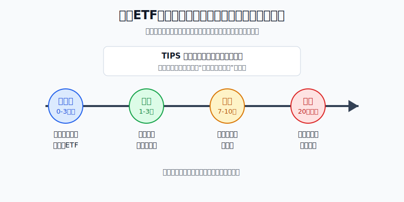
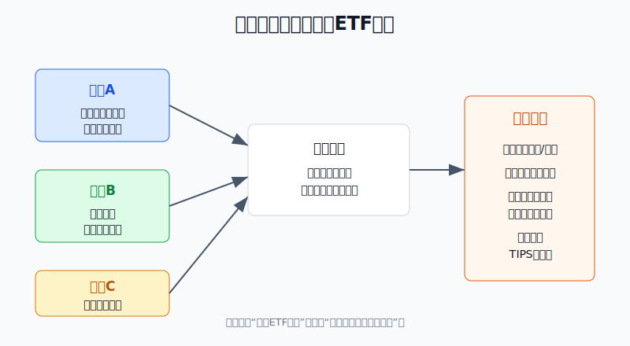
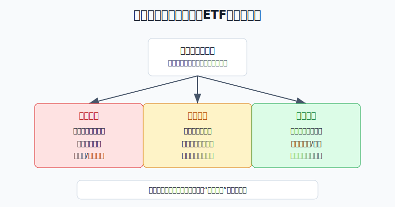
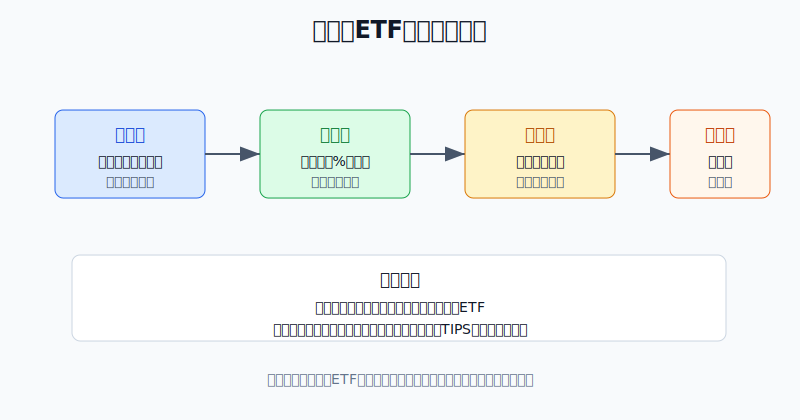

## 散户投资小白金融全品种操盘手册 - 10.9 债券ETF - 短债、中债、长债、TIPS
  
### 作者  
digoal  
  
### 日期  
2026-06-07   
  
### 标签  
金融产品 , 金融工具 , 散户 , 投资小白 , 全品操盘手册  
  
----  
  
## 背景 
  
  

> 适用读者: 已经知道美股ETF可以买股票指数，但不清楚债券ETF为什么也会亏、短债和长债到底差在哪里的小白投资者。  
> 本文定位: 投资教育框架，不构成个性化投资建议。

## 先问一个反直觉的问题

很多人以为债券ETF就是“稳”。但2022年，美股长债ETF的跌幅比不少股票ETF还难受。问题不在“债券骗人”，而在你买到的是不同久期的债券。**债券ETF第一课不是问收益率，而是问: 这笔钱多久不用，你能不能承受利率波动。**

## 核心概念: 债券ETF买的是“时间风险”

债券ETF，就是用一只ETF买一篮子债券。它和股票ETF一样可以在交易时间买卖，但底层资产不是公司股权，而是国债、公司债、通胀保护债券等债务工具。

对小白来说，先记住一个词: **久期**。久期不是简单的到期年限，而是债券价格对利率变化的敏感度。生活里的比喻是，久期像车速。车速低，转弯时不容易甩出去；车速高，方向盘稍微一动，车身反应就大。债券ETF也是这样: 短债久期低，价格波动小；长债久期高，利率一变，价格反应就大。

所以本节的行动结论先放出来: **短期要用的钱，只放现金型工具或超短债ETF；防守仓以短债为主；只有当你明确接受回撤，并且判断利率下行前提成立时，才用中债或长债ETF；TIPS只解决通胀侵蚀的一部分问题，不是无风险高息工具。**

## 逻辑推导链

【论证链标题】: 因为债券ETF的核心风险来自久期、利率和用钱期限，所以小白必须先匹配期限，再决定是否承担长久期。

── 第一步: 前提陈述

前提A: 债券价格和市场利率大多反向运动。这是常量。利率上升，新发债券给的利息更高，老债券吸引力下降，价格就要下调；利率下降，老债券的固定利息变得更有吸引力，价格就会上升。SEC的 Investor.gov 在解释债券风险时也提醒，利率风险会影响债券价格，尤其影响债券基金。

前提B: 久期越长，价格对利率越敏感。这是常量。用小白能理解的话说，短债像短途车票，路程短，天气变化影响有限；长债像二十年以上的长期合约，中间利率只要变一次，价格就会重新估算很多年现金流。BlackRock/iShares的基金资料显示，截至2026年6月初，iShares 0-3 Month Treasury Bond ETF（SGOV）的有效久期约0.10年，而 iShares 20+ Year Treasury Bond ETF（TLT）的有效久期约16年，二者不是同一种波动级别的工具。

前提C: 你的用钱期限会改变。这是变量。你以为三年不用的钱，可能因为换房、失业、创业、家庭支出变成半年内要用。如果短期资金买了长债ETF，利率刚好上行，你就会被迫在亏损时卖出。

前提D: TIPS能对抗通胀侵蚀，但仍然有利率风险。这是常量加变量。TIPS（Treasury Inflation-Protected Securities，通胀保护国债）会按通胀调整本金，美国财政部 TreasuryDirect 说明其本金会随通胀上调、随通缩下调；但TIPS ETF仍然是债券ETF，有久期，也会受到实际利率变化影响。

── 第二步: 逻辑推导

由A+B可得: 因为债券价格和利率反向运动，而久期决定反应强度，所以债券ETF不是简单分成“安全”和“不安全”，而是分成“利率敏感低”和“利率敏感高”。

再由A+B+C可得: 因为你的资金使用期限一旦缩短，就没有时间等待长债ETF从利率波动中恢复，所以短期钱必须先买低久期工具，不能为了多一点收益去买长债。

再由A+B+D可得: 因为TIPS虽然能调整通胀本金，但仍然有久期，所以它适合解决“担心通胀侵蚀”的小比例配置，不适合被当成“通胀上行一定赚钱”的押注。

最后由A+B+C+D可得: 因为债券ETF的收益来源和风险来源都围绕久期、利率和期限，所以小白的选择顺序必须是: 先问钱多久不用，再问能承受几%的回撤，最后才问买哪类ETF。

── 第三步: 正常情景下的操作结论

✅ 正常情景: 你已经有股票宽基ETF作为核心仓，另有一笔美元资金三年以上不用，目标是降低组合波动，而不是短线赚快钱；同时你能接受债券ETF也会出现净值回撤。

对应操作: 把债券ETF分成三层。第一层是一年内要用的钱，只放货币市场基金或超短债ETF；第二层是组合防守仓，以短债ETF为主，可少量搭配中债ETF；第三层是利率判断仓，只有在利率下行前提明确、且仓位上限写清楚时，才小比例使用长债ETF或TIPS ETF。

── 第四步: 数据和案例证实

证据1: 2022年是长久期风险的集中展示。美联储在2022年3月16日把联邦基金目标区间从0%-0.25%上调到0.25%-0.50%，到2023年7月26日已上调到5.25%-5.50%。同一轮加息里，10年期美国国债收益率也显著上行。BlackRock/iShares基金资料显示，2022年 iShares 20+ Year Treasury Bond ETF（TLT）的NAV年度回报约为-31%，而 iShares 1-3 Year Treasury Bond ETF（SHY）的2022年NAV年度回报约为-4%。这对应前提A+B: 同样是美国国债ETF，久期不同，回撤完全不是一个量级。

证据2: 短久期工具更接近现金管理，但收益会跟随短端利率变化。BlackRock/iShares的SGOV产品资料显示，截至2026年6月初，SGOV持有0-3个月美国国债，有效久期约0.10年；这类工具的价格波动通常很小，但收益率会随着美国短端利率下调而下降。这个数据对应前提C: 一年内要用的钱，重点是流动性和低波动，不是追求长债价格弹性。

证据3: TIPS不是“通胀来了就稳赚”。美国财政部 TreasuryDirect 说明，TIPS本金会随通胀上调，但通缩时也会下调；同时TIPS ETF的价格还会受实际利率影响。2022年通胀很高，但多只TIPS ETF仍出现负回报，原因就是实际利率快速上行压低了债券价格。这对应前提D: 抗通胀工具也要看久期和利率环境。

失败案例: 2022年很多人看到“美国国债”四个字就把长债ETF当稳健资产，结果遇到快速加息，TLT这类长久期ETF出现大幅回撤。历史不代表未来，但这个反例说明: **买的是国债，不等于买的是现金；买的是长债，就必须承担长久期价格波动。**

── 第五步: 前提变化时的替代结论

若前提C改变，也就是原本三年以上不用的钱变成半年内要用，推导路径变为: 因为你没有足够时间等待净值修复，所以必须降低久期。新结论: 停止买入中长债ETF，把新增资金转向货币市场基金、超短债或短债ETF；已有长债仓位先降到不影响用钱的位置。

若前提A的方向改变，也就是利率从下行预期变成重新上行，推导路径变为: 因为利率上行会压低债券价格，而长久期反应最大，所以长债ETF从“弹性工具”变成“回撤来源”。新结论: 降低长债仓位，回到短债和中债，等利率压力稳定后再评估。

若前提D被误读，也就是你把TIPS当成无风险高息工具，推导路径变为: 因为TIPS ETF仍然有久期，实际利率上行会伤害价格，所以抗通胀配置也可能亏钱。新结论: TIPS只做组合里的小比例通胀对冲，不替代现金和短债。

## 实操例子: 10万美元美股ETF账户怎么放债券ETF

这个例子对应论证链的正常结论: **先匹配用钱期限，再决定承担多少久期。**

假设小林有10万美元长期投资账户，其中6万美元已经配置标普500、全市场ETF和少量纳斯达克100。他希望拿2万美元做防守资产，另有1万美元是一年内可能要用的美元备用金。

第一步，先把备用金排除。那1万美元一年内可能要用，对应前提C，所以不进入中债、长债和TIPS选择。操作上只放货币市场基金或超短债ETF，目标是流动性和低波动，不追求价格上涨。

第二步，给2万美元防守仓分层。小林把1.2万美元放短债ETF，把5000美元放中债ETF，把3000美元留作观察仓。这样做对应前提A+B: 短债降低利率波动，中债提供一点票息和价格弹性，但不让久期压过账户。

第三步，只在利率下行前提成立时动用观察仓。假设美联储进入降息周期、10年期美债收益率停止上行，小林可以把3000美元观察仓分两次买入长债ETF或TIPS ETF。第一笔1500美元，第二笔必须等持仓不亏且利率前提没有破坏再买。

第四步，写退出条件。如果10年期美债收益率重新快速上行，或者美联储态度转向更高利率更久，小林先把长债观察仓减半；如果这笔钱的用途变成一年内要用，长债和中债都要继续降，回到现金型工具或短债ETF。

第五步，纠偏。如果小林看到长债ETF反弹，就把3000美元上限改成1.5万美元，这已经违反论证链。因为他的买入理由从“利率前提成立的小仓位弹性”变成了“涨了所以想多买”。纠偏动作是恢复上限，先保证防守仓的任务没有变形。

## 可复用框架

【期限先行】

适用前提: 你想用债券ETF管理美元现金或美股组合防守仓，但不知道该买短债还是长债。

核心逻辑: 因为用钱期限一旦缩短，长久期波动就会变成被迫卖出的风险，所以期限要排在收益率前面。

操作步骤:

1. 一年内要用的钱，只放货币市场基金、超短债或短债ETF。
2. 三年以上不用的钱，才能进入中债、长债和TIPS的讨论。
3. 每次买入前写清楚: 这笔钱多久不用，最大能承受几%的净值回撤。

前提失效时: 如果资金用途变短，先降久期，再讨论收益；不要等亏损扩大后才说“我其实要用钱”。

举一反三: 这个框架也能用在A股债券基金、短债基金、银行理财和REITs上。所有有净值波动的工具，都要先问用钱期限。

【久期三档】

适用前提: 你已经确定这笔钱可以投资债券ETF，下一步要决定短债、中债、长债和TIPS的比例。

核心逻辑: 因为久期决定利率敏感度，所以仓位应该按久期分档，而不是按名字里的“债券”二字一把买入。

操作步骤:

1. 防守档: 现金型工具和短债ETF，负责流动性和低波动。
2. 平衡档: 中债ETF，负责适度票息和适度价格弹性。
3. 弹性档: 长债ETF和TIPS ETF，只在利率或通胀前提明确时小比例参与。

前提失效时: 利率重新上行，先砍弹性档；通胀判断失效，先降TIPS；用钱期限缩短，平衡档也要降。

举一反三: 这个框架可以迁移到“核心宽基 + 行业卫星 + 防守资产”的ETF组合。先定义每个仓位的任务，再定义上限。

## 本节行动清单

| 动作 | 合格标准 |
|---|---|
| 说清债券ETF风险 | 不是只看发行人安全，还要看久期和利率 |
| 先分用钱期限 | 一年内要用的钱不买中长债ETF |
| 再分久期档位 | 短债防守，中债平衡，长债/TIPS做小比例弹性 |
| 写清利率前提 | 利率上行降久期，利率下行才考虑加久期 |
| 控制长债仓位 | 小白不要把长债当现金替代品 |
| 纠正TIPS误区 | TIPS抗通胀，但不是无风险高息工具 |

## 一句话总结

债券ETF的关键不是“债券两个字看起来稳”，而是用久期把风险分清楚: 短钱买短工具，防守仓少承担久期，长债和TIPS只在前提明确时小比例使用。

## 参考资料

- SEC Investor.gov: Bonds and Interest Rates，2026年访问，https://www.investor.gov/introduction-investing/investing-basics/investment-products/bonds-or-fixed-income-products/bonds-and-interest-rates
- U.S. TreasuryDirect: Treasury Inflation-Protected Securities，2026年访问，https://www.treasurydirect.gov/marketable-securities/tips/
- Federal Reserve: FOMC statement，2022年3月16日，https://www.federalreserve.gov/newsevents/pressreleases/monetary20220316a.htm
- Federal Reserve: FOMC statement，2023年7月26日，https://www.federalreserve.gov/newsevents/pressreleases/monetary20230726a.htm
- FRED, Federal Reserve Bank of St. Louis: 10-Year Treasury Constant Maturity Rate (DGS10)，2026年访问，https://fred.stlouisfed.org/series/DGS10
- BlackRock/iShares: iShares 0-3 Month Treasury Bond ETF (SGOV) product page，2026年6月访问，https://www.blackrock.com/us/individual/products/314116/ishares-0-3-month-treasury-bond-etf
- BlackRock/iShares: iShares 1-3 Year Treasury Bond ETF (SHY) product page，2026年6月访问，https://www.blackrock.com/us/individual/products/239452/ishares-13-year-treasury-bond-etf
- BlackRock/iShares: iShares 20+ Year Treasury Bond ETF (TLT) product page，2026年6月访问，https://www.blackrock.com/us/individual/products/239454/ishares-20-year-treasury-bond-etf
- BlackRock/iShares: iShares TIPS Bond ETF (TIP) product page，2026年6月访问，https://www.blackrock.com/us/individual/products/239467/ishares-tips-bond-etf

> ⚠️ **声明**：本文内容为投资教育目的，所有历史数据、策略框架均为辅助学习工具，不构成证券投资建议。市场有风险，投资需谨慎。实际操作请结合自身风险承受能力，必要时咨询专业投顾。
  
#### [PostgreSQL 解决方案集合](../201706/20170601_02.md "40cff096e9ed7122c512b35d8561d9c8")
  
  
#### [德哥 / digoal's Github - 公益是一辈子的事.](https://github.com/digoal/blog/blob/master/README.md "22709685feb7cab07d30f30387f0a9ae")
  
  
#### [About 德哥](https://github.com/digoal/blog/blob/master/me/readme.md "a37735981e7704886ffd590565582dd0")
  
  

  
