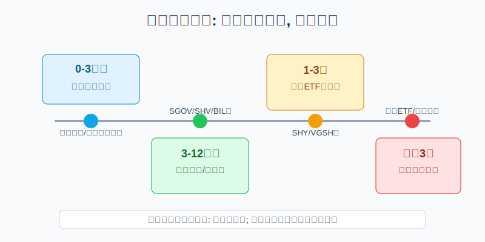
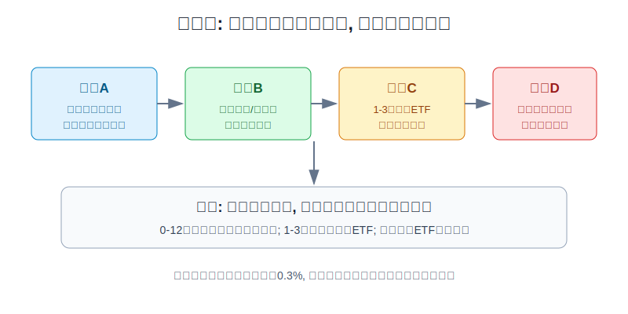
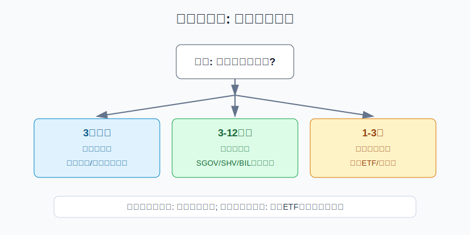

## 散户投资小白金融全品种操盘手册 - 10.10 美元现金管理 - 货币市场基金与短债ETF
  
### 作者  
digoal  
  
### 日期  
2026-06-07   
  
### 标签  
金融产品 , 金融工具 , 散户 , 投资小白 , 全品操盘手册  
  
----  
  
## 背景 
  

> 适用读者: 已经开始配置美股ETF，账户里有美元现金，但不知道该放在货币市场基金、短债ETF，还是干脆拿去买股票的小白投资者。  
> 本文定位: 投资教育框架，不构成个性化投资建议。

## 先问一个反直觉的问题

美元现金有收益以后，很多人会把现金仓当成一个“低风险理财产品”。这句话只对了一半。现金仓的第一任务不是赚最多，而是**在你需要用美元时，钱还在、能取、波动很小**。所以美元现金管理的核心不是找最高年化，而是先把用钱时间排清楚。

## 核心概念: 货币市场基金和短债ETF不是同一种“现金”

货币市场基金，是把钱投向现金、短期国债、回购、商业票据等短期工具的共同基金。对小白来说，它像一个“现金停车场”: 主要目标是保持流动性和稳定净值，收益会跟着短期利率走。

短债ETF，是把一篮子短期债券做成交易所买卖基金。它像“短途巴士”: 比长债稳，但仍然在路上颠簸。比如0-3个月国债ETF的久期很短，价格波动通常很小；1-3年国债ETF的久期更长，利率上行时会有更明显的净值压力。

所以本节先给行动结论: **美元现金管理要按用钱时间分桶。3个月内要用的钱，优先考虑银行现金、券商现金扫存、国债型货币市场基金这类高流动性工具；3-12个月不用的钱，可以研究超短国债ETF；1-3年不用、能接受小幅波动的钱，才考虑1-3年短债ETF。不要为了多拿一点收益，把活钱放进有明显净值波动的工具。**

## 逻辑推导链

【论证链标题】: 因为现金仓的第一目标是按时拿回钱，而货币市场基金和短债ETF的风险来自期限、信用和利率，所以美元现金管理必须先按用钱时间分桶，再比较收益率。

── 第一步: 前提陈述

前提A: 现金仓的钱通常有明确用途。这是常量。它可能是3个月后的学费、半年的生活费、等待买入美股ETF的备用弹药。既然有用钱日，现金仓就不能像股票仓那样承受大回撤。

前提B: 货币市场基金和超短国债ETF的收益主要跟短期利率走。这是变量。美联储在2026年4月29日把联邦基金目标区间维持在3.50%-3.75%，所以当前美元现金类工具仍有收益；但如果以后降息，这类工具的收益也会跟着下降。

前提C: 短债ETF不是存款，久期越长，净值越会受利率变化影响。这是常量。久期可以粗略理解为债券价格对利率变化的敏感度。0.1年的久期像浅水区，1.8年的久期就已经是更深一点的水，仍不危险，但不能说没有波浪。

前提D: 货币市场基金也不是FDIC保险存款。这是常量。SEC Investor.gov说明，多数零售和政府货币市场基金力求维持每份1美元稳定净值，但货币市场基金不像银行账户那样有FDIC保险；机构优先类和机构免税类货币市场基金还可能采用浮动净值。

── 第二步: 逻辑推导

由A可得: 因为现金仓有用钱日，所以判断标准必须从“收益最高”改成“到期能不能稳稳拿出来”。

由A+B可得: 因为货币市场基金和超短国债ETF收益跟短期利率走，所以它们适合承接短期美元闲钱，但不能把当前收益率当成未来固定收益。

再由A+C可得: 因为短债ETF有久期，所以1-3年短债ETF只能放不急用的钱。它可以是防守仓，但不是严格意义上的活钱。

最后由A+B+C+D可得: **正常情景下，小白应该用“用钱时间”给美元现金分桶，而不是用“哪个收益高”排序。收益率只在同一风险层级里比较；跨层级比较，会把现金仓变成债券仓。**

── 第三步: 正常情景下的操作结论

✅ 正常情景: 你有美元现金，未来3个月到3年内可能分批使用，目标是等待买入美股ETF、支付美元费用或保留海外资产备用金。

对应操作: 0-3个月的钱放在最高流动性层；3-12个月的钱研究政府货币市场基金、国债货币市场基金或0-3个月国债ETF；1-3年不用的钱才考虑1-3年短债ETF。任何工具下单前，都要写清费用、期限、久期、赎回或交易规则、是否有FDIC保险、是否有汇率和税务影响。

── 第四步: 数据和案例证实

证据1: 美元现金管理是主流需求，不是小众技巧。ICI在2026年6月4日披露，截至2026年6月3日，美国货币市场基金总资产为7.89404万亿美元，其中政府货币市场基金6.51034万亿美元，零售货币市场基金3.10075万亿美元。这个数据说明，大量资金确实把货币市场基金当作现金管理工具。

证据2: 超短国债ETF的波动确实低，但收益会变。BlackRock的iShares 0-3 Month Treasury Bond ETF页面显示，截至2026年6月4日，SGOV的30日SEC收益率为3.55%，有效久期0.11年，30日买卖价差中位数0.01%；截至2026年6月5日，基金净资产约936.27亿美元。它适合做低久期美元现金替代观察项，但它的收益率不是锁定利率。

证据3: 1-3年短债ETF已经不是“纯现金”。BlackRock的iShares 1-3 Year Treasury Bond ETF页面显示，截至2026年6月4日，SHY的30日SEC收益率为3.91%，有效久期1.87年，30日买卖价差中位数0.01%；该基金2026年3月31日fact sheet显示，2022年的NAV年度回报为-3.90%。这对应前提C: 期限拉长以后，即使是美国国债ETF，也会出现净值下跌。

失败案例: 2008年Reserve Primary Fund因为持有雷曼兄弟债务，在2008年9月16日“跌破1美元”，净值降到约0.97美元。这个案例不是说今天的政府货币市场基金都会出事，而是提醒小白: 只看“货币市场”四个字不够，还要看它是政府型、国债型、优先型，底层有没有信用风险。历史不代表未来，但它验证了一个稳定规律: **现金工具一旦为了多拿收益承担信用或期限风险，现金属性就会变弱。**

── 第五步: 前提变化时的替代结论

若前提B改变，也就是美联储进入降息周期，推导路径变为: 因为货币市场基金和超短债ETF收益跟短期利率走，所以未来分红会下降。新结论: 不要因为收益下降就冲进股票或长债；先确认这笔钱是否仍属于现金仓。

若前提C改变，也就是利率重新上行，推导路径变为: 因为1-3年短债ETF有久期，所以价格可能先跌。新结论: 3个月内要用的钱不能放进这类ETF；已有持仓如果错放了活钱，先把用钱部分挪回更短工具。

若前提D改变，也就是你买的是优先类或机构类货币市场基金，推导路径变为: 因为底层可能有企业短债和流动性费用规则，所以风险高于政府型货币市场基金。新结论: 小白默认先研究政府型、国债型，再研究优先型，不为小幅收益差额复杂化现金仓。

## 实操例子: 1万美元美元现金怎么分

这个例子对应论证链的正常结论: **先按用钱时间分桶，再在同一桶里比较收益。**

假设小林有1万美元在美股账户里，未来可能分三类用途: 3000美元是3个月内可能要用的生活备用金，4000美元计划半年到一年内逢低买入美股ETF，3000美元两年内大概率不用。

第一步，先锁定活钱。3000美元放在现金扫存、银行现金或政府型货币市场基金这类流动性最高的地方。判断依据是前提A: 这笔钱的失败标准不是少赚利息，而是要用时拿不出来或发生净值波动。

第二步，处理中短期备用资金。4000美元可以研究国债型货币市场基金或0-3个月国债ETF。如果选择ETF，要确认买卖价差、成交量、交易时间和结算规则；不要在盘前盘后用市价单乱买。判断依据是前提B: 它的收益跟短期利率走，适合等机会，但收益不是固定。

第三步，给两年不用的钱单独建“短债观察仓”。3000美元可以研究1-3年国债ETF，但小林必须接受一种情况: 如果利率重新上行，账面可能短期为负。判断依据是前提C: 它是防守债券仓，不是活钱。

第四步，写切换条件。如果美联储持续降息，货币市场收益会下降，小林不因为“收益变少”就把备用金推入股票仓；如果利率重新上行，短债ETF出现净值下跌，小林也不把3个月内要用的钱继续留在里面。

第五步，纠偏。最常见错误是看到SHY之类1-3年短债ETF收益率比超短债高一点，就把全部1万美元买进去。这样做等于把现金仓的期限拉长了。纠偏动作是按用钱日重新分桶: 活钱先挪回最短工具，半年以上的钱再讨论收益。

## 可复用框架

【用钱日历】

适用前提: 你手里有美元现金，但未来用途和时间不完全一样。

核心逻辑: 因为现金仓失败来自期限错配，所以先按用钱日期分桶，再选工具。

操作步骤:

1. 写日期: 3个月内、3-12个月、1-3年、3年以上。
2. 配工具: 越近的钱越靠近现金，越远的钱才允许承担短债波动。
3. 查规则: 费用、久期、买卖价差、赎回规则、是否FDIC保险。

前提失效时: 如果用钱日期提前，立刻把对应资金挪回更短工具；如果资金三年以上不用，它就不再是现金仓，可以进入资产配置讨论。

举一反三: 这个框架也能用在人民币现金管理、国债逆回购、短债基金和货币基金选择上。

【久期闸门】

适用前提: 你正在比较美元货币市场基金、超短债ETF和短债ETF。

核心逻辑: 因为久期决定利率波动对净值的影响，所以先设久期上限，再看收益。

操作步骤:

1. 活钱: 只接受接近现金或极短久期工具。
2. 等机会的钱: 可接受0-3个月国债ETF或类似超短债工具。
3. 防守仓: 1-3年短债ETF只放能忍受净值波动的钱。

前提失效时: 若利率快速上行，降低久期；若降息导致收益下降，也不为了追收益随意拉长久期。

举一反三: 以后研究中债、长债、TIPS ETF时，先看久期，再看收益率。收益率高但久期长，风险结构已经变了。

## 本节行动清单

| 动作 | 合格标准 |
|---|---|
| 写清用钱时间 | 每笔美元现金标注3个月内、3-12个月、1-3年或3年以上 |
| 先保活钱 | 3个月内要用的钱不放进有明显净值波动的短债ETF |
| 区分工具 | 货币市场基金、0-3个月国债ETF、1-3年短债ETF分开看 |
| 检查底层风险 | 政府型、国债型、优先型不要混为一谈 |
| 看久期和价差 | 久期、费用率、买卖价差、成交量、赎回规则写清 |
| 设切换规则 | 降息不乱追收益，加息不把活钱留在短债ETF里 |

## 一句话总结

美元现金管理的关键不是找到最高收益，而是让每一笔美元站在正确的时间位置上: 越快要用，越像现金；越久不用，才允许承担短债波动。

## 参考资料

- Investment Company Institute: Money Market Fund Assets，2026年6月4日，https://www.ici.org/research/stats/mmf
- Federal Reserve: Implementation Note issued April 29, 2026，https://www.federalreserve.gov/newsevents/pressreleases/monetary20260429a1.htm
- SEC Investor.gov: Money Market Funds Investor Bulletin，2026年访问，https://www.investor.gov/introduction-investing/general-resources/news-alerts/alerts-bulletins/investor-bulletins/updated-12
- SEC: Mutual Funds and Exchange-Traded Funds (ETFs) - A Guide for Investors，2026年访问，https://www.sec.gov/about/reports-publications/investor-publications/introduction-mutual-funds
- BlackRock iShares: iShares 0-3 Month Treasury Bond ETF (SGOV)，2026年6月访问，https://www.ishares.com/us/products/314116/ishares-0-3-month-treasury-bond-etf
- BlackRock iShares: iShares 1-3 Year Treasury Bond ETF (SHY)，2026年6月访问，https://www.ishares.com/us/products/239452/ishares-13-year-treasury-bond-etf
- BlackRock iShares: SHY fact sheet，截至2026年3月31日，https://www.ishares.com/us/literature/fact-sheet/shy-ishares-1-3-year-treasury-bond-etf-fund-fact-sheet-en-us.pdf
- Yale Journal of Financial Crises: United States: Reserve Primary Fund Suspension, 2008，2026年访问，https://elischolar.library.yale.edu/journal-of-financial-crises/vol7/iss2/9/

> ⚠️ **声明**：本文内容为投资教育目的，所有历史数据、策略框架均为辅助学习工具，不构成证券投资建议。市场有风险，投资需谨慎。实际操作请结合自身风险承受能力，必要时咨询专业投顾。
  
#### [PostgreSQL 解决方案集合](../201706/20170601_02.md "40cff096e9ed7122c512b35d8561d9c8")
  
  
#### [德哥 / digoal's Github - 公益是一辈子的事.](https://github.com/digoal/blog/blob/master/README.md "22709685feb7cab07d30f30387f0a9ae")
  
  
#### [About 德哥](https://github.com/digoal/blog/blob/master/me/readme.md "a37735981e7704886ffd590565582dd0")
  
  

  
