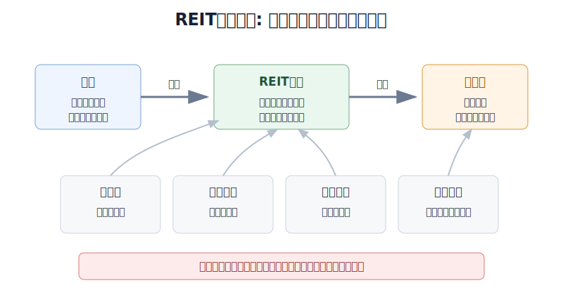
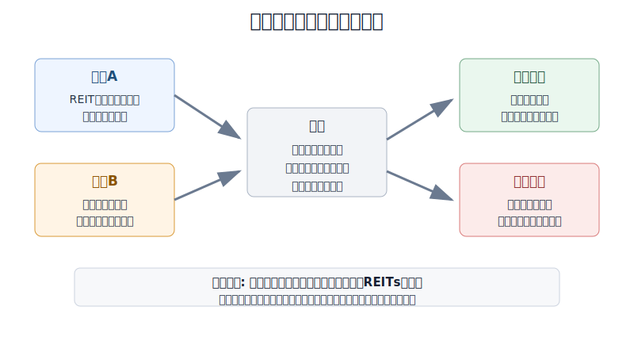
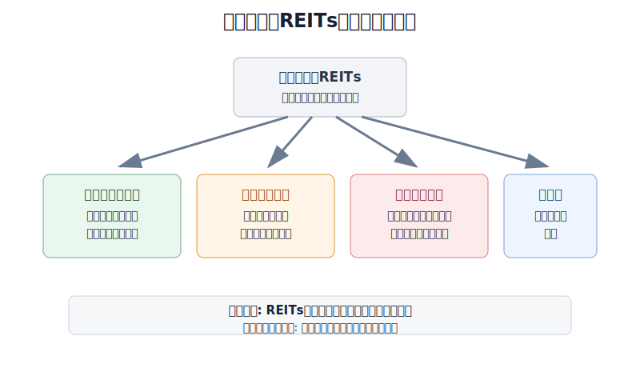

## 散户投资小白金融全品种操盘手册 - 10.11 美股REITs - 房地产现金流资产，但不是无风险高息
  
### 作者  
digoal  
  
### 日期  
2026-06-07   
  
### 标签  
金融产品 , 金融工具 , 散户 , 投资小白 , 全品操盘手册  
  
----  
  
## 背景 
  

> 适用读者: 已经知道美股ETF可以买宽基、行业和债券，开始被REITs的分红率吸引，但不清楚它到底算股票、债券还是房地产的小白投资者。  
> 本文定位: 投资教育框架，不构成个性化投资建议。

## 先问一个反直觉的问题

REITs经常被包装成“收租资产”，听起来比股票稳。但如果你在2022年把它当成现金替代品，结果可能比买普通宽基还难受。**REITs确实有房地产现金流，但它在美股市场里交易，本质仍是会波动的权益资产。**

## 核心概念: 你买的是“上市收租公司”，不是一张保息票

REIT，全称是 Real Estate Investment Trust，中文常译为房地产投资信托。小白可以先把它理解成一类上市公司: 它们持有或融资房地产资产，收租、运营、借钱、再把相当一部分收入分给股东。

这和自己买房收租有相似处，也有关键区别。

相似处是收益来源。REIT背后的钱，主要来自公寓、仓库、商场、医疗物业、数据中心、通信塔等资产的租金或相关现金流。

区别是交易方式。你买美股REIT或REIT ETF，买到的是股票市场里的份额。它可以每天涨跌，价格会受利率、估值、资金情绪、物业经营和负债结构影响。所以REIT不是存款，也不是短债。它更像“带分红的房地产股票篮子”。

本节的行动结论先放在前面: **美股REITs适合做收益型卫星仓，不能做现金管理工具，也不能因为分红率高就替代债券或货币市场基金。小白只有在长期资金、核心宽基已有、利率和物业经营没有明显逆风时，才适合小比例参与。**

## 逻辑推导链

【论证链标题】: 因为美股REITs把房地产现金流证券化成上市权益资产，所以它可以提供收益暴露，但不能被当成无风险高息工具。

── 第一步: 前提陈述

前提A: REIT有明确的房地产收入和分红制度约束。这是常量。SEC投资者公告和Nareit说明都提到，REIT通常需要把至少90%的 taxable income 分配给股东；同时，至少75%的资产、至少75%的年度总收入要来自房地产相关来源。用小白的话说，REIT不是随便给自己贴“地产”标签，它的制度设计确实逼着它更像现金流资产。

前提B: 公开交易的REIT和REIT ETF仍然是股票市场工具。这是常量。SEC把公开交易REIT描述为在主要交易所上市、像其他公开股票一样买卖的证券；Vanguard的VNQ资料也写明，ETF份额在二级市场连续交易，买卖价格可能高于或低于净值。也就是说，现金流是真的，股价波动也是真的。

前提C: REIT估值对利率和融资成本敏感。这是变量。房地产资产的价值，本质上是未来租金折现后的价格。利率上行时，未来现金流要被打更重的折扣；同时REIT借钱买楼、改造、再融资的成本也会上升。分红率看上去高，不代表价格不会跌。

前提D: 不同REIT板块差异很大。这是变量。数据中心、工业仓储、医疗、零售、办公楼、通信塔，背后需求完全不同。把它们都叫“房地产”，就像把医院、机场和商场都叫“楼”一样粗糙。

── 第二步: 逻辑推导

由A可得: 因为REIT有分红和房地产收入约束，所以它确实能给投资者提供房地产现金流暴露。这就是它适合进入组合的理由。

由A+B可得: 因为这份现金流被放进上市证券里交易，所以投资者拿到的不是固定利息，而是“分红 + 股价涨跌”的总回报。只盯分红率，会漏掉本金波动。

再由B+C可得: 因为市场会用利率重新给现金流定价，所以利率上行时，REIT可能出现“分红还在发，但价格先下跌”的情况。高息不是护身符。

最后由A+B+C+D可得: 因为REIT有现金流价值，但又受利率、经营和板块结构影响，所以它更适合放在美股组合的收益型卫星仓，而不是核心宽基仓、现金仓或保本仓。

── 第三步: 正常情景下的操作结论

正常情景: 你已经有现金备用金和美股核心宽基ETF，投资期限三年以上，能接受权益类波动，同时看到利率压力没有继续恶化、REIT ETF持仓板块分散、物业经营没有明显恶化。

对应操作: 可以把美股REIT ETF作为小比例收益型卫星仓。对小白示例而言，先控制在总资产5%以内，或美股权益仓的10%-15%以内。买入理由必须写成“长期资金 + 收益卫星 + 利率和经营前提合格”，不能写成“分红率比银行高”。

── 第四步: 数据和案例证实

证据1: REIT的现金流属性确实有制度基础。SEC投资者公告说明，REIT需要把至少90%的 taxable income 以分红形式分配给股东，并且至少75%的资产投向房地产资产和现金，至少75%的总收入来自租金、房地产抵押贷款利息等房地产相关来源。Nareit的REIT规则说明也给出同样的90%分配要求和75%收入、资产测试。这个证据对应前提A: REIT不是纯概念炒作，它有制度约束。

证据2: 现金流不等于低波动。Nareit的2026年4月行业快照显示，FTSE Nareit All Equity REITs市值约1.52万亿美元，股息率为3.68%，而同页列示的标普500股息率为1.06%；公开上市REIT在2024年支付约662亿美元分红。这个数据说明REIT确实比普通大盘更偏收益。但同一市场里的分红率，只能说明收益来源，不代表本金安全。

证据3: 利率逆风能直接打击REIT价格。美联储在2022年3月16日把联邦基金目标区间提高到0.25%-0.50%，到2022年12月14日目标区间已经升到4.25%-4.50%。同一年，Nareit统计的FTSE Nareit All Equity REITs总回报为-24.9%，FTSE Nareit Equity REITs为-24.4%。这个案例对应前提C: 当利率和融资环境快速变化，高分红不能阻止价格回撤。

证据4: REIT内部不是一个板块。Vanguard Real Estate ETF（VNQ）2026年3月31日factsheet显示，基金有145只股票，费用率0.13%，前十大持仓占54.7%；子行业里医疗REITs 16.5%、零售REITs 14.5%、工业REITs 11.5%、数据中心REITs 10.7%、通信塔REITs 9.1%、办公REITs 2.3%。Nareit在2026年6月3日的市场评论中也提到，2026年以来数据中心REITs总回报37.1%，而抵押型REITs指数年内小幅下跌0.2%。这个证据对应前提D: 你买的是一组不同地产生意，不是一块平均的房产。

失败案例: 2022年就是典型反例。假设一个小白看到REIT分红率高，就把短期备用金买成REIT ETF，他真正承担的是权益波动、利率上行和房地产估值重估三重风险。历史不代表未来，但它仍有参考价值，因为它验证的不是某一天涨跌，而是现金流资产在高利率环境下会被重新定价。

── 第五步: 前提变化时的替代结论

若前提C改变，也就是利率重新上行、10年期美债收益率走高、REIT再融资成本上升，推导路径变为: 因为未来租金现金流折现压力加大，所以股价可能先跌，分红率被动变高。新结论: 不把“分红率升高”当买入信号，先暂停加仓，等利率和估值稳定后再复盘。

若前提D改变，也就是某一类物业经营恶化，例如办公楼空置率上升、租金下调、债务到期压力集中，推导路径变为: 因为现金流基础变弱，所以分红可持续性下降。新结论: 避免单只REIT重仓，优先用分散ETF，或者直接降到观察仓。

若前提B改变，也就是你买的不是公开交易REIT ETF，而是费用高、流动性差的非交易REIT，推导路径变为: 因为退出难、报价不透明、费用高，所以风险边界更差。新结论: 小白不把它当默认工具。

若资金期限改变，也就是这笔钱三年内要买房、还贷、教育或应急，推导路径变为: 因为你需要稳定本金，而REIT价格会波动，所以新结论是不用这笔钱买REIT。

## 实操例子: 10万元账户怎么放美股REITs

这个例子对应论证链的正常结论: **REITs只做收益型卫星仓，不替代现金、短债和核心宽基。**

假设小林有10万元长期投资资金，另外已经单独留了6个月生活费。他计划把3万元放在海外资产，其中2.4万元用于标普500或全市场ETF，剩下6000元想配置美股REIT ETF。

第一步，先确认资金期限。小林把这6000元标成“三年以上不用”。如果这笔钱一年后要装修或还贷，直接退出本节流程，放回货币基金、存款或短债工具。这一步对应前提B: REIT会波动，不能承担短期确定性支出。

第二步，给仓位上限。小林把REIT上限定为总资产5%，也就是5000元。虽然他原本想买6000元，但上限写好后，只买5000元。这一步对应第三步结论: 收益卫星仓不能挤占核心宽基。

第三步，分两次买入。第一次买2500元，买入前写下三个判断: 利率没有明显继续上行，ETF持仓不是单一办公楼暴露，自己接受15%-25%的账面回撤。第二次只在这些前提没有变坏时补足到5000元。这里不追求抄底，而是避免一次性把高息想象买满。

第四步，设置复盘条件。如果10年期美债收益率明显上行、REIT ETF持续跑输美股宽基、或主要物业板块出现租金和出租率恶化，小林先停止加仓；如果REIT仓位因为上涨超过总资产8%，把超出的部分再平衡回宽基或现金。

第五步，纠偏。最常见错误是看到分红率从3.7%升到5%，就以为更便宜。小林必须先问: 分红率升高是因为分红变多，还是因为价格下跌？价格下跌是市场恐慌，还是利率、负债、租金真的变坏？如果回答不清，动作不是补仓，而是等下一次季报和ETF持仓更新。

## 可复用框架

【三问高息】

适用前提: 你被REIT或高股息资产吸引，想判断它是不是适合放进账户。

核心逻辑: 因为高分红可能来自真实现金流，也可能来自价格下跌后的被动高息，所以买入前必须同时检查现金流、利率和本金波动。

操作步骤:

1. 问现金流: 租金、出租率、FFO是否稳定。FFO可以简单理解为REIT常用的经营现金流指标。
2. 问利率: 无风险利率和融资成本是在改善，还是继续恶化。
3. 问仓位: 买入后它是小卫星，还是已经影响整个账户。

前提失效时: 现金流变差、利率上行、仓位超标，三项中出现两项，就停止加仓；三项全部出现，就降仓复盘。

举一反三: 这个框架也能用在高股息股票、红利ETF、公用事业ETF、优先股ETF上。凡是卖点是“高息”的工具，都要先问高息从哪里来。

【收益卫星】

适用前提: 你已经有现金备用金、债券或短债工具、核心宽基ETF，想补一点房地产现金流暴露。

核心逻辑: 因为REITs有收益属性，但仍是权益资产，所以它应该增强组合现金流特征，而不是承担保本任务。

操作步骤:

1. 现金先独立: 三年内要用的钱不买REIT。
2. 核心先建立: 标普500或全市场ETF先做美股主仓。
3. 卫星再上限: REIT先给总资产5%以内的示例上限。
4. 定期再平衡: 涨多了减回上限，前提坏了先停加。

前提失效时: 如果你没有核心宽基，先不买REIT；如果你把REIT当短债，立刻重写账户分类。

举一反三: 黄金、行业ETF、主题ETF、小盘ETF都可以用这个框架。先判断它在组合里负责什么，再决定买多少。

## 本节行动清单

| 动作 | 合格标准 |
|---|---|
| 说清REIT是什么 | 上市房地产现金流资产，不是存款和保本票据 |
| 区分收益和安全 | 分红率高只说明收入来源，不说明本金稳定 |
| 检查三项前提 | 利率、物业经营、资金期限都合格 |
| 控制仓位 | 小白示例先放总资产5%以内，作为收益卫星 |
| 优先分散工具 | 不懂单个物业和债务结构时，优先看分散REIT ETF |
| 写退出条件 | 利率上行、租金恶化、仓位超标时停止加仓或再平衡 |

## 一句话总结

美股REITs的价值在于把房地产现金流装进证券账户，但它不是无风险高息工具；小白把它当收益型卫星仓，才是在用现金流，而不是被分红率牵着走。

## 参考资料

- SEC Investor Bulletin: Real Estate Investment Trusts (REITs), https://www.sec.gov/files/reits.pdf
- Nareit: How To Form REIT? Forming a Real Estate Investment Trust, https://www.reit.com/what-reit/how-form-reit
- Nareit: REIT Industry Financial Snapshot, 2026年4月数据, https://www.reit.com/data-research/reit-market-data/report/reit-industry-financial-snapshot
- Nareit: Why REITs Underperformed Broader Markets in 2022, 2023年1月, https://www.reit.com/news/blog/market-commentary/reits-underperformed-broader-markets-2022
- Federal Reserve: FOMC statement, 2022年3月16日, https://www.federalreserve.gov/newsevents/pressreleases/monetary20220316a.htm
- Federal Reserve: Implementation Note, 2022年12月14日, https://www.federalreserve.gov/newsevents/pressreleases/monetary20221214a1.htm
- Vanguard: Vanguard Real Estate ETF (VNQ) fact sheet, 数据截至2026年3月31日, https://workplace.vanguard.com/assets/corp/fund_communications/pdf_publish/us-products/fact-sheet/F0986.pdf
- Nareit: REITs Maintain Year-to-Date Performance Lead Over Broader Markets, 2026年6月3日, https://www.reit.com/news/blog/market-commentary/reits-maintain-year-date-performance-lead-over-broader-markets

> ⚠️ **声明**：本文内容为投资教育目的，所有历史数据、策略框架均为辅助学习工具，不构成证券投资建议。市场有风险，投资需谨慎。实际操作请结合自身风险承受能力，必要时咨询专业投顾。
  
#### [PostgreSQL 解决方案集合](../201706/20170601_02.md "40cff096e9ed7122c512b35d8561d9c8")
  
  
#### [德哥 / digoal's Github - 公益是一辈子的事.](https://github.com/digoal/blog/blob/master/README.md "22709685feb7cab07d30f30387f0a9ae")
  
  
#### [About 德哥](https://github.com/digoal/blog/blob/master/me/readme.md "a37735981e7704886ffd590565582dd0")
  
  

  
