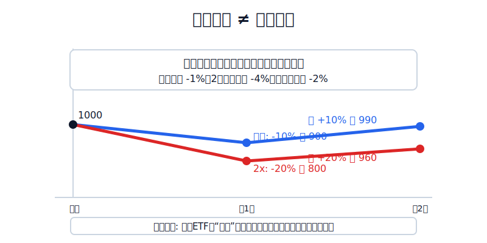
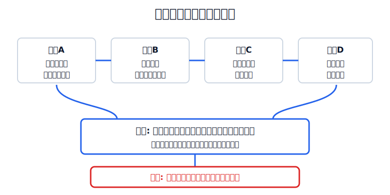
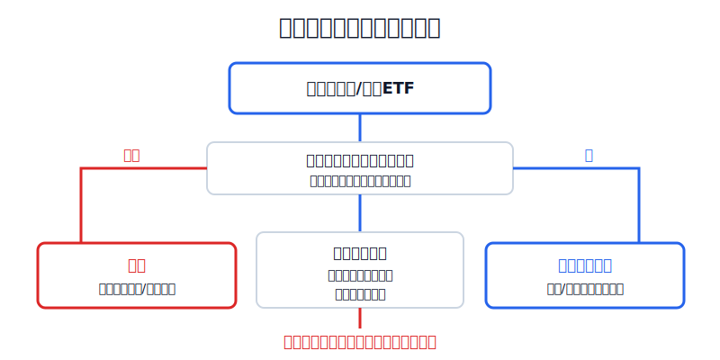

## 散户投资小白金融全品种操盘手册 - 10.12 杠杆ETF和反向ETF - 为什么只适合短期工具
  
### 作者  
digoal  
  
### 日期  
2026-06-07   
  
### 标签  
金融产品 , 金融工具 , 散户 , 投资小白 , 全品操盘手册  
  
----  
  
## 背景 
  

> 适用读者: 已经知道美股ETF可以买宽基、行业、债券和现金管理工具，但被TQQQ、SQQQ这类高波动产品吸引的小白投资者。  
> 本文定位: 投资教育框架，不构成个性化投资建议。

## 先问一个反直觉的问题

一只3倍杠杆ETF，听起来像“指数涨10%，我就赚30%”。问题是，它真正承诺的通常不是“长期3倍”，而是“单日3倍”。**把一个按天设计的工具拿去长期持有，就像把赛车当通勤车: 速度是真的快，失控也是真的快。**

## 核心概念: 杠杆ETF买的是“放大后的单日路径”

杠杆ETF，就是用衍生品、融资或其他金融工具，把某个指数的每日涨跌放大。例如3倍做多纳斯达克100的ETF，目标是每天大约跟着纳斯达克100的日涨跌乘以3。反向ETF，就是指数跌时它涨、指数涨时它跌；反向杠杆ETF则是把这个反方向再放大。

这里最容易误解的是“每天”两个字。普通宽基ETF更像你买一篮子公司，拿着它跟踪市场。杠杆ETF更像你每天收盘后重新调整一次油门，第二天再按新的本金继续跑。市场单边上涨时，它可能跑得很猛；市场来回震荡时，即使指数最后没怎么动，杠杆ETF也可能被路径磨损。

所以本节先给行动结论: **杠杆ETF和反向ETF只适合有明确短期计划、能盯盘、能止损、能控制仓位的人使用；小白不能把它们当长期配置、不能用来回本、不能放进核心仓。**

## 逻辑推导链

【论证链标题】: 因为杠杆ETF和反向ETF的目标是单日放大或单日反向，且每日重置会让长期结果依赖路径，所以它们只能放进短期工具箱，不能替代普通ETF做长期配置。

── 第一步: 前提陈述

前提A: 杠杆和反向ETF的核心目标通常是“单日目标”。这是常量。SEC在2023年8月29日的投资者公告中提醒，杠杆和反向ETF通常被设计为实现每日表现目标，超过一天后的结果可能明显不同于投资者以为的倍数。

前提B: 每日重置会让长期收益变成“路径题”。这是常量。路径题的意思是: 最后指数涨跌多少不够，还要看中间怎么涨、怎么跌。比如指数第一天跌10%、第二天涨10%，指数从1000到900再到990，两天只跌1%；但一个2倍杠杆产品若每天都完成目标，会从1000到800再到960，两天跌4%。

前提C: 杠杆、反向、衍生品和融资成本会放大错误。这是变量。ProShares的TQQQ页面说明，TQQQ寻求纳斯达克100指数单日表现的3倍；同一页面也提示，超过一天的持有期中，回报可能高于或低于单日目标，差异可能很大。它不是坏工具，但它不是普通宽基ETF。

前提D: 小白最缺的不是收益想象，而是交易纪律。这是常量。杠杆ETF要求你提前写清买入理由、持有时间、最大亏损、退出条件和仓位上限。没有这些东西，所谓“短期工具”很容易变成“亏了就长期持有”。

── 第二步: 逻辑推导

由A+B可得: 因为产品目标是单日，而长期结果受每日涨跌路径影响，所以“指数长期涨，我长期拿3倍ETF就赚3倍”这个想法不成立。

再由B+C可得: 因为震荡、费用、融资成本、衍生品跟踪和反向结构都会改变长期结果，所以持有时间越长，结果越不适合用简单乘法估算。

最后由A+B+C+D可得: 因为小白通常没有日内盯盘和严格止损纪律，所以杠杆ETF和反向ETF不能做核心仓，也不能作为长期定投工具。正常结论是: **只在短期、低仓位、计划明确、能及时退出的情景下观察或使用；否则直接排除。**

── 第三步: 正常情景下的操作结论

✅ 正常情景: 你已经有普通宽基ETF作为核心仓，生活备用金充足，这笔钱不是长期配置资金；你只想用极小仓位表达一个短期观点，并且已经写清交易计划。

对应操作: 杠杆ETF和反向ETF最多作为短期战术工具，仓位先控制在总账户的1%-3%以内；持有时间按交易计划执行，默认不跨越自己看不懂的重大事件；一旦买入理由失效、亏损触发止损、或持有时间超过计划，先退出，再复盘。

── 第四步: 数据和案例证实

证据1: 监管机构直接把“单日目标”和“长期偏离”列为核心风险。SEC在2023年8月29日的投资者公告中举例: 某指数四个月上涨2%，但一个2倍杠杆ETF下跌6%，一个2倍反向ETF下跌25%；另一个指数上涨约8%，对应的3倍杠杆ETF下跌53%，3倍反向ETF下跌90%。这个证据对应前提A和B: 方向猜对一部分，也不等于产品长期结果按倍数兑现。

证据2: FINRA在2022年7月28日的投资者文章中说明，多数带杠杆或反向目标的ETP会每日重置，目标只限制在一个交易日；持有长于目标周期，表现可能明显偏离每日目标。FINRA还提醒，杠杆倍数越高、标的波动越大，偏离就越明显。这个证据对应前提B和C。

证据3: 真实产品表现证明“放大收益”和“放大亏损”是一体两面。Nasdaq-100官方事实表显示，Nasdaq-100价格指数2022年下跌32.97%；ProShares TQQQ摘要招募说明书显示，TQQQ在2022年年度回报为-79.03%，且截至2025年6月30日版本披露的最差季度为2022年第二季度-58.60%。这不是说TQQQ永远不能涨，而是说明三倍工具在错误环境里会把回撤打到普通ETF难以比较的级别。

失败案例: 最常见的失败不是“买入当天就错”，而是“短线亏损后改口长期持有”。比如一个小白原本想用5000元做两天反弹交易，结果第一天亏8%，第二天不愿止损，第三天告诉自己“科技长期向上”，于是把TQQQ当成长线仓。此时前提已经从“短期战术”变成“长期配置”，但工具还是每日重置的杠杆工具。历史不代表未来，但监管案例和真实基金表现都说明一个稳定规律: **这类产品错用后，亏损速度比普通ETF快得多。**

── 第五步: 前提变化时的替代结论

若前提“短期计划明确”不成立，推导路径变为: 因为你不知道什么时候退出，所以每日重置和杠杆波动会把账户带进情绪交易。新结论: 不买，回到普通宽基ETF、债券ETF或美元现金管理工具。

若前提“能盯盘并止损”不成立，推导路径变为: 因为杠杆产品的波动会快速放大亏损，所以不能等到周末或下个月才处理。新结论: 不碰实盘，只能先做模拟和复盘。

若前提“市场处在低波动单边环境”改变，推导路径变为: 因为高波动震荡会加重路径损耗，所以即使方向没有完全错，产品结果也可能变差。新结论: 降低仓位、缩短持有时间，或者直接退出。

## 实操例子: 10万元账户看到TQQQ，怎么处理

这个例子对应论证链的正常结论: **杠杆ETF只能小仓短用，不能替代核心宽基ETF。**

假设小林有10万元长期投资资金，其中4万元计划配置美股ETF。他已经有3万元标普500或纳斯达克100普通ETF，另外1万元是学习仓。某天纳斯达克100连续下跌后反弹，小林看到TQQQ成交活跃，想“抄一把反弹”。

第一步，先问资金角色。3万元核心仓不能换成TQQQ；最多只能动用1万元学习仓中的一小部分。若按总账户1%-3%上限，小林最多只拿1000-3000元观察，不能拿4万元核心仓去赌。

第二步，写交易计划。买入前必须写四句话: 我买它是因为纳斯达克100短期反弹，而不是因为长期配置；计划持有不超过3个交易日；亏损达到5%-8%先退出；若指数跌破前一日低点或反弹失败，当天处理。这一步对应前提D。

第三步，确认产品机制。小林要写清: TQQQ追求的是纳斯达克100单日3倍，不是长期3倍；如果市场震荡，结果会偏离直觉；如果买入后自己不能盯盘，就取消交易。这一步对应前提A和B。

第四步，执行后只做两件事: 到达目标就卖，触发止损也卖。比如3000元买入后上涨12%，不把“短期反弹”临时改成“长期看好AI”；如果下跌6%，也不补仓证明自己正确。因为补仓会把原来的小仓战术，变成失控的仓位赌博。

第五步，前提不成立时切换。如果小林第二天要出差、无法看盘，或者当天有重要利率决议、财报集中发布，而他看不懂这些变量，就不持有过夜。退出不是认输，而是承认工具边界。

如果操作错误，后果很直接: 普通ETF跌5%时，3倍产品可能跌十几个百分点；若再遇到连续下跌或大幅震荡，账户会从“学习仓亏一点”变成“情绪失控想翻本”。纠偏方法只有一个: 先平掉杠杆工具，再复盘交易计划，不允许用更大仓位去追下一次反弹。

## 可复用框架

【单日边界】

适用前提: 你正在研究杠杆ETF、反向ETF或单股杠杆ETF。

核心逻辑: 因为产品目标多为单日表现，长期结果受路径和波动影响，所以先确定持有周期，再谈收益想象。

操作步骤:

1. 先写周期: 今天、明天、还是几天内，不能写“先拿着看看”。
2. 再写触发: 什么条件买，什么条件卖，什么条件止损。
3. 最后写仓位: 小白只用观察仓，不动核心仓。

前提失效时: 周期写不清、止损写不清、无法盯盘时，不买。

举一反三: 这个框架也适用于期权、期货和黄金T+D。凡是带杠杆的工具，都先问“它按什么周期工作”。

【三不替代】

适用前提: 你已经有美股ETF核心仓，但想用杠杆或反向ETF增强收益或对冲。

核心逻辑: 因为核心仓负责长期配置，杠杆和反向ETF负责短期表达，所以两者不能互相替代。

操作步骤:

1. 不替代核心仓: 标普500、全市场或普通纳斯达克100ETF仍是长期骨架。
2. 不替代止损: 杠杆工具亏损后不能靠“长期看好”硬扛。
3. 不替代学习: 没看懂每日重置、费用、反向和衍生品前，不做实盘。

前提失效时: 如果你买它是为了回本、翻倍、对冲焦虑，直接停止交易。

举一反三: 行业ETF、主题ETF、单股ETF也要先问组合角色。能短期表达观点，不等于能放进核心仓。

## 本节行动清单

| 动作 | 合格标准 |
|---|---|
| 先识别产品 | 写清是普通、杠杆、反向，还是反向杠杆ETF |
| 先看目标周期 | 招募说明书或官网是否写明单日目标 |
| 仓位极小 | 小白观察仓控制在总账户1%-3%以内 |
| 不替代核心仓 | 不用TQQQ、SQQQ替代普通宽基ETF |
| 必写退出条件 | 持有时间、止损幅度、失效条件提前写好 |
| 前提失效就退出 | 不能盯盘、波动放大、计划超时，先卖出再复盘 |

## 一句话总结

杠杆ETF和反向ETF不是“更猛的普通ETF”，而是按单日目标工作的短期工具；小白真正要学的不是怎么把收益放大，而是先知道什么工具绝不能放进长期核心仓。

## 参考资料

- SEC Investor.gov: Updated Investor Bulletin: Leveraged and Inverse ETFs，2023年8月29日，https://www.investor.gov/introduction-investing/general-resources/news-alerts/alerts-bulletins/investor-alerts/sec
- FINRA: The Lowdown on Leveraged and Inverse Exchange-Traded Products，2022年7月28日，https://www.finra.org/investors/insights/lowdown-leveraged-and-inverse-exchange-traded-products
- FINRA: Non-Traditional ETFs FAQ，2026年访问，https://www.finra.org/rules-guidance/key-topics/etf/non-traditional-etf-faq
- ProShares: TQQQ UltraPro QQQ 产品页，数据访问日2026年6月6日，https://www.proshares.com/our-etfs/leveraged-and-inverse/tqqq
- ProShares: TQQQ Summary Prospectus，2025年，https://prod.proshares.com/globalassets/proshares/prospectuses/tqqq_summary_prospectus.pdf
- ProShares: SQQQ UltraPro Short QQQ 产品页，2026年访问，https://prod.proshares.com/our-etfs/leveraged-and-inverse/sqqq
- Nasdaq: Nasdaq-100 Fact Sheet，数据截至2026年3月31日，https://indexes.nasdaq.com/docs/FS_NDX.pdf

> ⚠️ **声明**：本文内容为投资教育目的，所有历史数据、策略框架均为辅助学习工具，不构成证券投资建议。市场有风险，投资需谨慎。实际操作请结合自身风险承受能力，必要时咨询专业投顾。
  
#### [PostgreSQL 解决方案集合](../201706/20170601_02.md "40cff096e9ed7122c512b35d8561d9c8")
  
  
#### [德哥 / digoal's Github - 公益是一辈子的事.](https://github.com/digoal/blog/blob/master/README.md "22709685feb7cab07d30f30387f0a9ae")
  
  
#### [About 德哥](https://github.com/digoal/blog/blob/master/me/readme.md "a37735981e7704886ffd590565582dd0")
  
  

  
