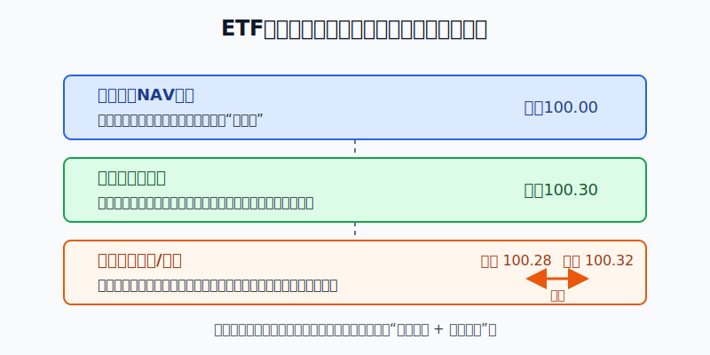
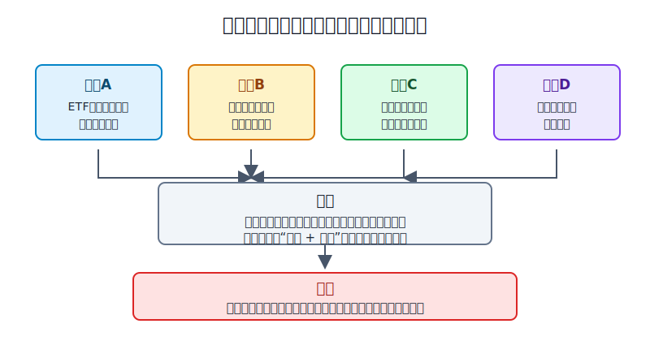
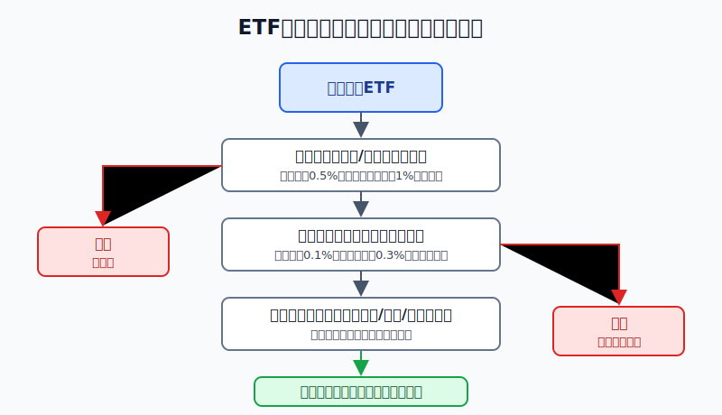

## 散户投资小白金融全品种操盘手册 - 10.13 ETF溢价、折价、成交量、买卖价差
  
### 作者  
digoal  
  
### 日期  
2026-06-07   
  
### 标签  
金融产品 , 金融工具 , 散户 , 投资小白 , 全品操盘手册  
  
----  
  
## 背景 
  


> 适用读者: 已经会搜索美股ETF代码，也知道费用率、规模、涨跌幅，但还不确定下单前应该看哪些交易指标的小白投资者。  
> 本文定位: 投资教育框架，不构成个性化投资建议。

## 先问一个反直觉的问题

同一只ETF，今天涨了0.2%，你却可能因为下单方式直接少拿0.3%。不是市场骗你，而是你没有看清楚：ETF不是只看净值，还要看溢价、折价、成交量和买卖价差。



## 核心概念: ETF有“价值锚”，也有“成交门票”

ETF有两套价格。

第一套叫净值，英文是NAV，意思是基金持有的一篮子资产扣掉费用后的每份价值。它像一盒水果的理论成本：苹果、香蕉、橙子加起来值多少钱，基金公司每天会算。

第二套叫市场价格，就是你在交易所看到的成交价、买一价和卖一价。它像菜市场摊位上的真实报价：理论成本是100元，摊主可能卖100.30元，也可能急着出货卖99.80元。

当ETF市场价格高于净值，叫溢价；低于净值，叫折价。公式很简单：

```text
溢价/折价率 = (市场价格 - NAV) / NAV
```

买卖价差是另一层成本。买一价是别人愿意买的最高价，卖一价是别人愿意卖的最低价。你立刻买，通常按卖一附近成交；你立刻卖，通常按买一附近成交。中间的差，就是价差。公式也很简单：

```text
买卖价差率 = (卖一价 - 买一价) / 买卖中间价
```

成交量告诉你这只ETF今天有多少交易，但它不是唯一答案。ETF的真正流动性还取决于底层资产是否容易交易、做市商是否愿意报价、跨境市场是否开盘。一个美股大盘ETF，底层是高度活跃的大盘股票，价差通常更容易收窄；一个冷门主题ETF、跨境ETF、债券ETF或杠杆ETF，底层资产难交易时，成交量再好看，也不能替代下单前的价差检查。

本节的行动结论先写在前面：**小白买ETF，下单前必须先过三道门：溢价/折价是否异常，买卖价差是否太宽，交易时段是否不友好。三道门没过，就不按市价单。**



## 逻辑推导链

【论证链标题】: 因为ETF按二级市场价格成交，而不是按净值成交，所以小白必须把溢价/折价和买卖价差当成下单前的硬过滤器。

── 第一步: 前提陈述

前提A: ETF在交易所买卖，成交价可以高于或低于净值。这是常量。SEC的投资者教育材料明确说明，ETF市场价格可能高于或低于每份NAV；高于叫premium，低于叫discount。对小白来说，这个前提的含义是：你买ETF不是直接向基金公司按净值申购，而是在交易所跟别人成交。

前提B: 买卖价差会直接吞掉收益。这是常量。SEC举过一个很直观的例子：某ETF买一价59.50美元、卖一价60美元，投资者以60美元买入200份后马上以59.50美元卖出，会损失100美元。这个损失不是基金经理亏出来的，而是你跨过买卖价差付出的交易成本。

前提C: ETF通常有授权参与人和做市机制，能把价格拉回净值附近，但这个机制不是永动机。这是变量。正常市场里，ETF溢价过高会吸引机构创建新份额卖出，折价过深会吸引机构买入ETF并赎回底层资产，价格因此向净值靠拢。但当底层资产不好交易、市场剧烈波动、跨境市场休市或债券报价失真时，这个拉回过程会变慢，偏离会放大。

前提D: 小白没有必要用糟糕成交去证明自己懂行情。这是常量。长期配置赚钱靠资产选择、仓位和时间，不靠在价差很宽时抢一笔成交。一次贵买或便宜卖，看起来只是零点几个百分点；如果反复发生，它就会变成持续漏水的水龙头。

── 第二步: 逻辑推导

由A可得: 因为ETF按市场价成交，所以“这只ETF净值合理”不等于“我现在买入价格合理”。你还要检查市场价格相对净值有没有明显溢价。

由A+B可得: 因为你买入看卖一、卖出看买一，所以买卖价差越宽，进出场成本越高。长期持有可以摊薄交易次数，但不能消灭第一次下单时的价差成本。

再由A+B+C可得: 因为ETF的价格拉回机制在正常市场更有效、在压力市场更慢，所以越是波动剧烈、底层资产休市、主题很热、成交稀薄的时候，越不能把市价单当成默认按钮。

最后由A+B+C+D可得: 因为小白无法判断做市商什么时候恢复报价，也无法控制成交队列，所以正确动作不是猜下一分钟涨跌，而是建立硬规则：溢价/折价异常不追，买卖价差过宽不追，开盘收盘或剧烈波动时不用裸市价单。

── 第三步: 正常情景下的操作结论

✅ 正常情景: 你买的是主流美股宽基ETF，底层市场正在正常交易，ETF官网披露的历史溢价/折价不大，当前买卖价差也接近30日中位数。

对应操作: 可以下单，但默认使用限价单。学习用红线可以这样设：主流宽基ETF，当前溢价或折价超过0.5%，先暂停；买卖价差率超过0.1%，先等一等。行业、主题、跨境、债券或杠杆ETF，溢价/折价超过1%，或买卖价差率超过0.3%，先暂停，不用市价单追进去。

这些红线不是交易所规则，也不是保证盈利的魔法。它们的作用只有一个：让小白在看不清交易成本时，先停手。

── 第四步: 数据和案例证实

证据1: ETF已经是足够大的市场，选择多不等于每只都适合随手买。ICI《2026 Investment Company Fact Book》显示，截至2025年底，ETF总净资产超过13万亿美元，ETF数量为4,495只。品种越多，费用率、底层资产、成交活跃度和价差差异越大。这个数据对应前提D：小白必须筛选，而不是看到“ETF”三个字就默认安全、便宜、好成交。

证据2: SEC要求ETF网站披露交易相关信息，说明这些指标不是可有可无的细节。SEC关于ETF网站披露的说明包括：ETF应披露前一营业日的NAV、市场价格、溢价或折价，以及最近30个日历日的买卖价差中位数。这个证据对应前提A和B：监管并不是只让你看费用率，还让你看价格偏离和交易成本。

证据3: 极端市场里，偏离会真实发生。IOSCO在2021年关于疫情压力下ETF表现的材料中总结，2020年3月市场压力期间，部分投资级债券ETF和高收益债券ETF曾短时间以6%-10%的折价交易，随后在市场稳定后逐步回到更接近正常水平。这个案例对应前提C：ETF结构没有失灵，但当底层债券市场流动性变差时，二级市场价格会先反映压力，折价会变大。

证据4: 券商和基金公司都把限价单、避开开盘收盘当作基础交易纪律。Fidelity的ETF交易提示建议投资者查看买卖价差、交易量和NAV信息，并避免在开盘和收盘附近交易；Vanguard也解释，开盘时部分底层证券可能尚未开始交易，收盘时做市参与者可能减少，因此价格不确定性会上升。这个证据对应前提D：小白把市价单当默认动作，承担的是本来可以避免的成交风险。

历史不代表未来。上面这些数据仍有参考价值，是因为它们验证的不是某只ETF涨跌，而是ETF交易机制本身：ETF按市场价格成交，市场价格会围绕净值波动，价差是真实成本，压力环境会放大偏离。

── 第五步: 前提变化时的替代结论

若前提C改变，也就是市场剧烈波动、底层资产休市、债券报价变慢或主题突然过热，推导路径变为: 因为做市商报价更保守，套利拉回速度下降，所以溢价/折价和价差会同时放大。新结论: 不用市价单，缩小订单，改用限价单；若超过红线，直接放弃本次交易。

若前提A被你误解，也就是你以为ETF会像场外基金一样按净值成交，推导路径变为: 因为你没有看市场价与NAV的差异，所以你可能在高溢价时买入，随后溢价回落，即使底层资产没跌，你也会亏。新结论: 先补课，看懂NAV、市场价、溢价/折价，再下单。

失败案例: 2020年3月部分债券ETF出现6%-10%折价时，如果小白只看到“折价就是便宜”就重仓买入，实际承担的是债券市场流动性压力和价格发现风险；如果小白在恐慌中用市价单卖出，则可能把短期折价变成真实亏损。这个反例说明：折价不是自动买入信号，溢价也不是自动卖出信号，必须结合底层市场和价差一起看。



## 实操例子: 10万元账户买美股ETF前怎么检查

这个例子对应论证链的正常结论: **通过溢价/折价、买卖价差、交易时段三道门之后，才允许下单，而且默认用限价单。**

假设小林有10万元长期投资资金，计划拿2万元买美股ETF。他已经决定不买杠杆ETF，不追冷门主题，今天只在一只标普500ETF和一只AI主题ETF之间选择。

第一步，先查ETF官网或券商页面。小林记录四个数字：上一日NAV、上一日市场收盘价、历史溢价/折价、30日买卖价差中位数。这一步对应前提A和SEC披露要求：先知道价值锚，再看成交价。

第二步，计算当前偏离。假设标普500ETF的NAV是100美元，当前卖一价是100.04美元，溢价约0.04%，低于0.5%的学习红线，可以继续看下一项。AI主题ETF的NAV是50美元，当前卖一价是50.80美元，溢价约1.6%，超过主题ETF 1%的学习红线。动作很明确：AI主题ETF今天不追，放入观察名单。

第三步，计算买卖价差。标普500ETF买一价100.03美元、卖一价100.04美元，中间价100.035美元，价差率约0.01%，低于0.1%的学习红线。继续。若某ETF买一价49.80美元、卖一价50.10美元，中间价49.95美元，价差率约0.60%，则不管故事多好，都先不下市价单。

第四步，看时间。小林不在美股开盘第一分钟下单，也不在收盘前最后几分钟下单。他等到底层股票正常交易、报价稳定后，用限价单买入。若卖一价100.04美元，他可以把买入限价设在100.04美元或略低；成交不了就等待，不为了成交而把限价一路抬高。

第五步，分批执行。2万元不是一次按完。小林先买计划金额的一半，剩下一半留到下一次再平衡或下跌后检查前提。这样做对应前提D：他不是在和做市商比速度，而是在控制自己能控制的交易成本。

如果操作错误，后果很直接。假设小林看到AI主题ETF涨得快，在1.6%溢价、0.60%价差时用市价单买入，买完后主题热度降温，溢价回到0，价差也恢复正常。即使底层资产价格没怎么跌，他也已经把溢价和价差付出去了。纠偏方法不是加仓摊平，而是把这笔交易写进复盘：错误不是看错AI，而是违反了三道门。

## 可复用框架

【三道门】

适用前提: 你准备买入或卖出ETF，且能看到NAV、市场价、买一卖一价和成交量。

核心逻辑: 因为ETF按市场价成交，而市场价会围绕NAV波动，所以先判断价格偏离和价差，再决定是否下单。

操作步骤:

1. 看偏离: 计算溢价/折价率，超过学习红线就暂停。
2. 看价差: 计算买卖价差率，超过学习红线就等待或缩小订单。
3. 看时段: 避开开盘、收盘和剧烈波动时段；必须交易时只用限价单。
4. 看订单: 小单分批，限价成交，不为了成交牺牲价格。

前提失效时: 如果底层市场休市、市场剧烈波动、成交量突然萎缩或价差显著宽于30日中位数，动作从“下单”切换为“观察”。

举一反三: 这个框架也适用于A股ETF、港股ETF、跨境ETF、债券ETF和商品ETF。越是冷门、跨境、杠杆或底层资产难交易，越要严格过三道门。

【成本先行】

适用前提: 你已经选好ETF，但不知道今天能不能买。

核心逻辑: 因为费用率是持有成本，买卖价差和溢价/折价是成交成本，所以短期下单先看成交成本，长期持有再看费用率。

操作步骤:

1. 先问: 我现在买入是不是高于NAV太多？
2. 再问: 我买入后立刻卖出，会被价差吞掉多少？
3. 最后问: 我能不能用限价单等一个合理成交？

前提失效时: 如果你只能说“怕错过”“大家都在买”“今天必须成交”，说明交易动机从配置变成追逐价格。动作应改为暂停。

举一反三: 这个框架也能用在个股、REITs、封闭式基金和流动性较差的债券ETF。凡是通过交易所撮合成交的工具，都有成交成本。

## 本节行动清单

| 动作 | 合格标准 |
|---|---|
| 查净值 | 能找到ETF官网或券商页面披露的NAV、市场价、溢价/折价 |
| 算偏离 | 主流宽基超过0.5%暂停；主题、跨境、债券、杠杆ETF超过1%暂停 |
| 算价差 | 主流宽基超过0.1%暂停；非核心ETF超过0.3%暂停 |
| 看时段 | 避开开盘、收盘和底层市场休市时段 |
| 用限价单 | 买入写最高可接受价格，卖出写最低可接受价格 |
| 写复盘 | 如果成交差，复盘偏离、价差、时段和订单类型，而不是只怪行情 |

## 一句话总结

ETF的费用率决定长期持有成本，溢价/折价和买卖价差决定你这一笔有没有买贵、卖便宜；小白下单前先过三道门，才是在用ETF，而不是被报价牵着走。

## 参考资料

- SEC Investor.gov: Updated Investor Bulletin: Exchange-Traded Funds (ETFs)，2023年，https://www.investor.gov/introduction-investing/general-resources/news-alerts/alerts-bulletins/investor-bulletins-24
- SEC: Mutual Funds and Exchange-Traded Funds (ETFs) - A Guide for Investors，2026年访问，https://www.sec.gov/about/reports-publications/investor-publications/introduction-mutual-funds
- SEC: ADI 2025-15 - Website posting requirements，2025年，https://www.sec.gov/about/divisions-offices/division-investment-management/accounting-disclosure-information/adi-2025-15-website-posting-requirements
- FINRA: Exchange-Traded Funds and Products，2026年访问，https://www.finra.org/investors/investing/investment-products/exchange-traded-products
- ICI: 2026 Investment Company Fact Book，2026年4月，https://www.ici.org/system/files/2026-04/2026-factbook.pdf
- IOSCO: Exchange Traded Funds Thematic Note - Findings and Observations during COVID-19 induced market stresses，2021年8月，https://www.iosco.org/library/pubdocs/pdf/IOSCOPD682.pdf
- Fidelity: ETF trading tips，2026年访问，https://www.fidelity.com/viewpoints/active-investor/ETF-trading-tips
- Vanguard: What are some best practices for trading ETFs?，2026年访问，https://www.vanguardoffshore.com/en/home/learn/explore/etf-fundamentals/trading/what-are-some-best-practices-for-trading-etfs

> ⚠️ **声明**：本文内容为投资教育目的，所有历史数据、策略框架均为辅助学习工具，不构成证券投资建议。市场有风险，投资需谨慎。实际操作请结合自身风险承受能力，必要时咨询专业投顾。
  
#### [PostgreSQL 解决方案集合](../201706/20170601_02.md "40cff096e9ed7122c512b35d8561d9c8")
  
  
#### [德哥 / digoal's Github - 公益是一辈子的事.](https://github.com/digoal/blog/blob/master/README.md "22709685feb7cab07d30f30387f0a9ae")
  
  
#### [About 德哥](https://github.com/digoal/blog/blob/master/me/readme.md "a37735981e7704886ffd590565582dd0")
  
  

  
