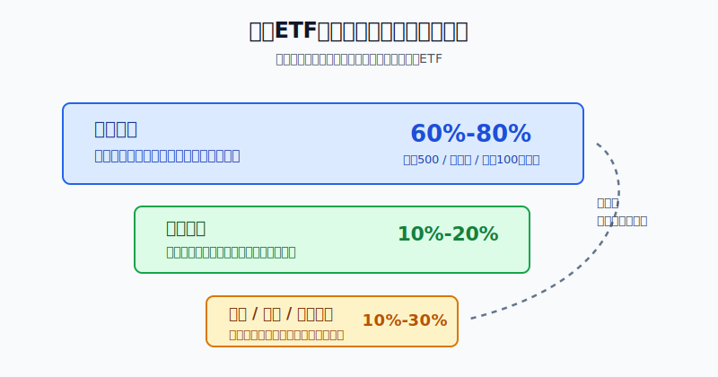
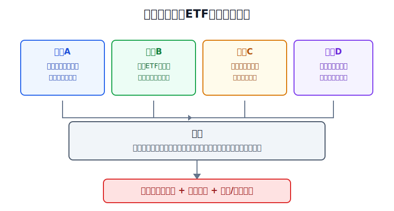
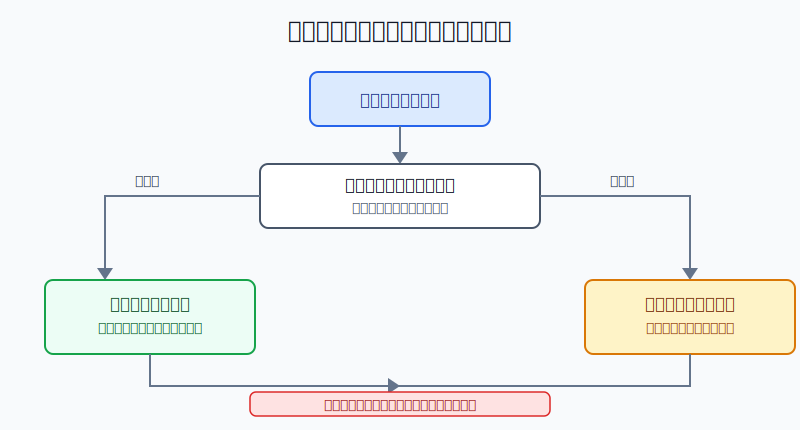

## 散户投资小白金融全品种操盘手册 - 10.14 美股ETF组合 - 核心宽基 + 行业卫星 + 债券/黄金防守
  
### 作者  
digoal  
  
### 日期  
2026-06-07   
  
### 标签  
金融产品 , 金融工具 , 散户 , 投资小白 , 全品操盘手册  
  
----  
  
## 背景 
  

> 适用读者: 已经知道标普500、纳斯达克100、行业ETF、债券ETF和黄金ETF，但不知道怎么把它们放进同一个账户的小白投资者。  
> 本文定位: 投资教育框架，不构成个性化投资建议。

## 先问一个反直觉的问题

很多人买ETF亏钱，不是因为ETF本身复杂，而是因为把所有ETF都当成同一种东西: 涨得快就多买，跌得多就补仓。**真正的组合不是一堆代码，而是一张分工表: 核心负责长期暴露，卫星负责有限进攻，防守负责降低账户脆弱性。**

## 核心概念: 组合先分工，再选产品

小白搭美股ETF组合，最容易犯的错是先问“买VOO、QQQ、XLK、TLT还是GLD”。这个顺序错了。正确顺序是先问三件事。

第一，账户的主骨架是什么。主骨架要能长期拿得住，规则透明，成本低，成交好。它不追求每一年第一名，而是让你持续留在美国市场里。

第二，哪些位置可以承担进攻。行业ETF、主题ETF和部分成长指数ETF有弹性，但也会把风险集中到一个行业、一个叙事或一组龙头公司上，所以它们只能做卫星。

第三，账户靠什么降低脆弱性。债券ETF、黄金ETF、货币市场基金和短债工具可以做防守，但防守不等于保本。尤其是长债ETF，在利率快速上行时也会大跌。

所以本节的行动结论很明确: **小白的美股ETF组合，先用核心宽基打底，再用行业卫星小比例增强，最后用债券、黄金或现金管理做防守。仓位上限比产品名字更重要。**

## 逻辑推导链

【论证链标题】: 因为不同ETF承担的风险不同，所以美股ETF组合必须按“核心宽基 + 行业卫星 + 债券/黄金防守”分工，而不是把热门ETF简单堆在一起。

── 第一步: 前提陈述

前提A: 宽基ETF更适合做核心仓。这是常量。宽基，就是覆盖很多公司、很多行业的指数。S&P Dow Jones Indices在S&P 500官方页面说明，S&P 500包含500家领先公司，覆盖约80%的可投资市值；BlackRock的ITOT factsheet显示，iShares Core S&P Total U.S. Stock Market ETF费用率为0.03%，截至2026年3月31日持有2490只股票。对小白来说，宽基ETF像账户的地基，不是因为它不会跌，而是因为它把单家公司判断先降到最低。

前提B: 行业ETF适合做卫星仓，不适合替代核心仓。这是常量。行业ETF把资金集中在科技、能源、医疗、金融、半导体等方向。集中意味着方向对了会跑得快，方向错了也会跌得狠。State Street的Technology Select Sector SPDR Fund资料显示，XLK跟踪的是S&P 500中的科技板块；同一系列的Energy Select Sector SPDR Fund资料显示，XLE跟踪的是能源板块。它们是“精准暴露”，不是“全面分散”。

前提C: 债券和黄金可以防守，但防守资产也有失效场景。这是变量。债券ETF怕利率快速上行，黄金ETF不生息，价格受实际利率、美元、避险需求和央行购金影响。也就是说，防守层的任务是降低组合在某些环境下的脆弱性，不是保证每次股市跌它都涨。

前提D: 小白最大的优势不是预测准，而是少犯大错。这是常量。SEC在资产配置、分散和再平衡的投资者教育材料中，把资产配置解释为把组合分到股票、债券、现金等不同资产类别；FINRA也把资产配置描述为不同资产类别在组合中的比例。对小白来说，组合纪律比“这次我看对了哪个行业”更可靠。

── 第二步: 逻辑推导

由A+D可得: 因为小白不应该把账户成败压在单家公司或单一主题上，所以核心仓必须先用宽基ETF承担美国市场主干风险。核心仓的任务不是涨最快，而是让账户有稳定骨架。

由B+D可得: 因为行业ETF会把风险集中到少数行业，所以它只能在你能说清行业逻辑、估值和失效条件时做卫星仓。卫星仓的任务是增强弹性，不是喧宾夺主。

再由C+D可得: 因为债券和黄金都有失效场景，所以防守层不能被神化。它只能用来降低组合在股市下跌、通胀上行、避险升温或流动性压力变化时的单一风险暴露。

最后由A+B+C+D可得: 因为核心、卫星、防守三层的任务不同，所以小白的正常结论不是“选出一只最强ETF”，而是“先给三层定仓位，再给每层选合格ETF，再定再平衡规则”。

── 第三步: 正常情景下的操作结论

✅ 正常情景: 你已经留足生活备用金，这笔投资资金三年以上不用，能接受美元汇率波动和美股回撤，而且还没有稳定研究美股个股和行业周期的能力。

对应操作: 核心宽基放在组合中心，参考范围为60%-80%；行业卫星控制在10%-20%；债券、黄金、现金管理等防守层控制在10%-30%。如果你刚开始学习，美股ETF仓位本身也可以只是总资产的一部分，不需要一上来把全部资金换成美元股票ETF。

── 第四步: 数据和案例证实

证据1: ETF已经是主流工具，但工具越多越需要分工。ICI《2026 Investment Company Fact Book》显示，截至2025年底，美国ETF市场共有4495只基金，总净资产13.4万亿美元。工具很多，不代表每个都适合进组合；越是产品多，越要先分清“核心、卫星、防守”。

证据2: 宽基ETF适合做核心，是因为覆盖面和成本都可检查。S&P 500官方页面显示，它覆盖约80%的可投资市值；BlackRock的ITOT factsheet显示，这只美国全市场ETF截至2026年3月31日持有2490只股票，费用率0.03%。这对应前提A: 核心仓要透明、低成本、覆盖广。

证据3: 行业ETF的弹性来自集中，也因此不能重仓替代核心。State Street的XLK summary prospectus显示，科技精选行业ETF在2022年年度回报为-27.71%；State Street的XLE summary prospectus显示，能源精选行业ETF在2022年年度回报为64.42%。同一年不同板块差异巨大，说明行业卫星能带来超额，也能带来错配风险。它适合小比例表达观点，不适合当账户主仓。

证据4: 防守资产也会失效。BlackRock的TLT factsheet显示，iShares 20+ Year Treasury Bond ETF在2022年NAV年度回报为-31.41%，市场价格年度回报为-31.25%。State Street关于SPDR Gold Shares的资料显示，GLD在2022年市场价格回报为-0.77%。这说明长债不是“股市下跌一定上涨”的保险，黄金也不是每年稳定赚钱的资产。历史不代表未来，但它验证了一个重要规则: **防守层要分散，也要控制久期和仓位，不能把一个防守工具当万能避险。**

失败案例: 2022年是典型反例。假设一个小白在2021年末把账户做成“科技ETF 60% + 长债ETF 40%”，以为科技负责增长、长债负责防守。进入2022年后，科技受估值和利率压力下跌，长债也因利率上行大幅回撤，组合两头受伤。问题不只是判断错，而是组合结构错: 核心仓不够宽，卫星仓太重，防守层过度押注长久期债券。

── 第五步: 前提变化时的替代结论

若前提A改变，也就是你选的“核心”其实是纳斯达克100、半导体或AI主题ETF，推导路径变为: 因为核心仓已经变成集中仓，所以账户主骨架会随单一风格剧烈波动。新结论: 先把真正宽基补上，再把集中ETF降回卫星位置。

若前提B改变，也就是行业逻辑失效但你还在加仓，推导路径变为: 因为卫星仓的买入前提已经破坏，所以继续加仓会把观点错误放大。新结论: 停止加仓，仓位回到上限以内，重新写行业逻辑。

若前提C改变，也就是利率快速上行、长债下跌，同时黄金也没有避险表现，推导路径变为: 因为防守层没有完成降低波动的任务，所以不能继续把它当保险。新结论: 降低长久期债券比例，增加短债、货币市场基金或现金缓冲，等利率压力稳定后再评估。

## 实操例子: 10万元账户怎么搭美股ETF组合

这个例子对应论证链的正常结论: **先定三层仓位，再给每层选合格ETF，最后用再平衡防止卫星仓失控。**

假设小林有10万元可投资资金，生活备用金已经留好，其中计划拿4万元做美股ETF组合，期限三年以上。他不会读完整10-K，也没有稳定判断行业周期的能力。

第一步，先定美股ETF内部结构。小林把4万元拆成三层: 核心宽基70%，也就是2.8万元；行业卫星15%，也就是6000元；防守层15%，也就是6000元。这一步对应前提D: 小白先靠比例降低犯大错的概率。

第二步，核心层只选宽基。2.8万元优先放在标普500或美国全市场ETF上。若他特别想配置纳斯达克100，先放在核心层的边缘，不让它替代全部核心。判断依据是前提A: 核心要覆盖市场主干，而不是只押科技成长。

第三步，行业卫星只表达一个观点。6000元卫星仓不能同时买科技、半导体、AI、机器人、网络安全、消费、医疗七八个方向。那不是分散，而是把自己不懂的东西堆满。小林只能选择1-2个能写清逻辑的行业，每个行业的买入理由必须包括: 行业景气为什么改善、估值是否过热、什么情况说明判断错了。这一步对应前提B。

第四步，防守层不要只买长债。6000元防守层可以拆成短债或货币市场工具、部分中短债ETF、少量黄金ETF。若小林完全不懂久期，就先少碰长债ETF。久期可以理解为债券对利率变化的敏感度，久期越长，利率上行时价格越容易下跌。这一步对应前提C。

第五步，设再平衡规则。每月只记录，不频繁交易；每季度检查一次三层比例。若行业卫星从15%涨到22%，先卖回20%以内，利润回到核心或防守层；若核心因大跌降到60%以下，但买入前提没有破坏，可以用新增资金补核心；若防守层在股债同跌时也大幅下跌，先复盘是不是长债比例过高，而不是机械补仓。

如果操作错误，最常见的后果是把“卫星仓涨得快”误判成“卫星仓应该变核心”。比如小林的科技ETF涨得好，从6000元一路加到2万元。此时组合从“核心宽基 + 卫星科技”变成了“科技主题组合”。一旦科技估值回落，账户会承受本来不该承受的集中回撤。纠偏动作很简单: 卫星超过上限就减回上限，新的钱优先补核心，不用靠猜顶部来解决仓位失控。

## 可复用框架

【三层分工】

适用前提: 你想用美股ETF搭一个长期组合，而不是只做短线主题交易。

核心逻辑: 因为宽基、行业和防守ETF承担的风险不同，所以先分工，再定比例，再选标的。

操作步骤:

1. 定核心: 用标普500、美国全市场等宽基ETF承担长期美国市场暴露。
2. 定卫星: 行业ETF只在逻辑清楚时小比例参与，默认不超过20%。
3. 定防守: 债券、黄金、现金管理分散使用，不把长债或黄金当万能保险。

前提失效时: 如果核心不够宽，先补核心；如果卫星超过上限，先减回上限；如果防守资产同步失效，先降低久期和单一防守工具集中度。

举一反三: 这个框架也能用在A股ETF组合、港股ETF组合和全球资产配置里。核心负责底盘，卫星负责表达观点，防守负责降低脆弱性。

【上限优先】

适用前提: 你已经有几个候选ETF，但容易因为涨跌临时改变计划。

核心逻辑: 因为小白最常见的亏损来自仓位失控，所以每次下单前先写上限，而不是先看涨幅。

操作步骤:

1. 写总上限: 美股ETF占总资产多少，不由情绪决定。
2. 写分层上限: 核心、卫星、防守分别占多少。
3. 写触发动作: 超过上限减回去，低于下限先检查前提再补。

前提失效时: 如果你说不清买入理由，只能放观察名单；如果你发现自己想加仓的理由是“怕错过”，停止操作，等下一次固定复盘日再看。

举一反三: 这个框架同样适用于个股、可转债、黄金和REITs。先写上限，能避免一个好故事变成一个坏仓位。

## 本节行动清单

| 动作 | 合格标准 |
|---|---|
| 先分三层 | 核心宽基、行业卫星、防守资产各自任务写清 |
| 核心要够宽 | 标普500或美国全市场优先，集中指数不替代全部核心 |
| 卫星有上限 | 行业ETF默认10%-20%，不能因上涨自动变核心 |
| 防守不神化 | 债券、黄金、现金管理分散使用，长债要看利率风险 |
| 定期再平衡 | 每季度检查比例，偏离上限先拉回纪律 |
| 写失效条件 | 行业逻辑、利率环境、汇率和资金期限变化时重新评估 |

## 一句话总结

美股ETF组合的重点不是猜哪只ETF最强，而是让每只ETF各司其职: 核心宽基负责长期底盘，行业卫星负责有限进攻，债券和黄金防守负责降低脆弱性；仓位纪律，才是小白真正能长期复用的武器。

## 参考资料

- S&P Dow Jones Indices: S&P 500指数介绍，2026年访问，https://www.spglobal.com/spdji/en/indices/equity/sp-500/
- Investment Company Institute: 2026 Investment Company Fact Book，2026年4月，https://www.ici.org/system/files/2026-04/2026-factbook.pdf
- SEC: Beginners' Guide to Asset Allocation, Diversification, and Rebalancing，https://www.sec.gov/investor/pubs/assetallocation.htm
- FINRA: Asset Allocation and Diversification，https://www.finra.org/investors/investing/investing-basics/asset-allocation-diversification
- BlackRock: iShares Core S&P Total U.S. Stock Market ETF factsheet，数据截至2026年3月31日，https://www.ishares.com/us/literature/fact-sheet/itot-ishares-core-s-p-total-u-s-stock-market-etf-fund-fact-sheet-en-us.pdf
- BlackRock: iShares 20+ Year Treasury Bond ETF factsheet，数据截至2026年3月31日，https://www.blackrock.com/us/individual/literature/fact-sheet/tlt-ishares-20-year-treasury-bond-etf-fund-fact-sheet-en-us.pdf
- State Street: Technology Select Sector SPDR Fund summary prospectus，2025年，https://sectorspdr.factsetdigitalsolutions.com/api/documents/by-fullname/Sector%20Documents/XLK%20-%20Technology%20Documents/Summary%20Prospectus
- State Street: Energy Select Sector SPDR Fund summary prospectus，2025年，https://www.sectorspdrs.com/api/documents/by-fullname/Sector%20Documents/XLE%20-%20Energy%20Documents/Summary%20Prospectus
- State Street: SPDR Gold Shares investment paper，数据截至2026年3月31日，https://www.ssga.com/library-content/products/fund-docs/etfs/us/insights-investment-ideas/spdr-invest-in-gold.pdf

> ⚠️ **声明**：本文内容为投资教育目的，所有历史数据、策略框架均为辅助学习工具，不构成证券投资建议。市场有风险，投资需谨慎。实际操作请结合自身风险承受能力，必要时咨询专业投顾。
  
#### [PostgreSQL 解决方案集合](../201706/20170601_02.md "40cff096e9ed7122c512b35d8561d9c8")
  
  
#### [德哥 / digoal's Github - 公益是一辈子的事.](https://github.com/digoal/blog/blob/master/README.md "22709685feb7cab07d30f30387f0a9ae")
  
  
#### [About 德哥](https://github.com/digoal/blog/blob/master/me/readme.md "a37735981e7704886ffd590565582dd0")
  
  

  
