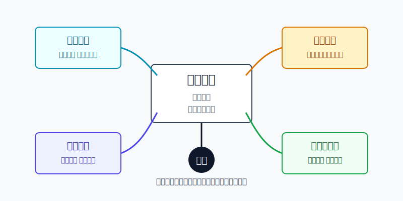
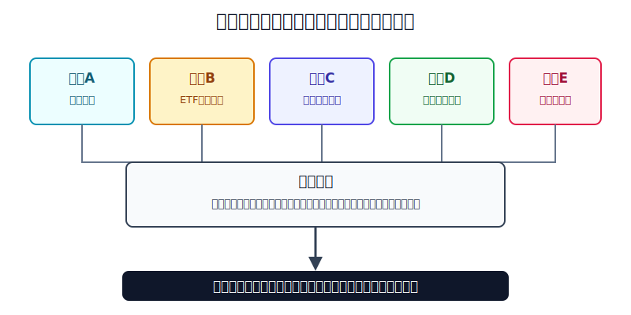
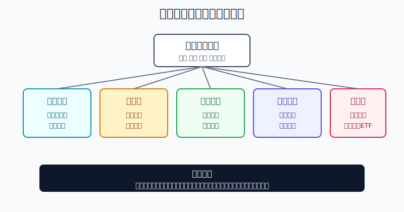

## 散户投资小白金融全品种操盘手册 - 10.15 美股ETF定投 - 估值、汇率、仓位、再平衡
  
### 作者  
digoal  
  
### 日期  
2026-06-07   
  
### 标签  
金融产品 , 金融工具 , 散户 , 投资小白 , 全品操盘手册  
  
----  
  
## 背景 
  

> 适用读者: 已经知道美股ETF比个股更适合入门，但还不知道“每月买一点”到底该怎么买、买多少、什么时候调整的小白投资者。
> 本文定位: 投资教育框架，不构成个性化投资建议。

## 先问一个反直觉的问题

定投最危险的地方，不是你买得太慢，而是你以为“定投”两个字能替你解决所有问题。**定投只解决一个问题: 不要把买点全押在某一天。它不自动解决估值贵、美元贵、仓位过高、长期组合失衡这些问题。**

## 核心概念: 定投是发动机，不是自动驾驶

美股ETF定投，英文常叫 dollar-cost averaging，直译是“美元成本平均”。小白可以把它理解成: 每隔一段时间投入固定或接近固定的钱，价格低时买到更多份额，价格高时买到更少份额。

但这里有一个坑: **“固定节奏”不等于“固定重仓”。**

如果你每月拿工资的一小部分买宽基ETF，这是纪律；如果你看到美股涨了三年，就把全部现金平均分成三个月冲进去，这不是纪律，只是把一次冲动拆成三次。真正的定投系统，至少要有四个阀门。

第一，估值阀门。市场越贵，未来容错率越低，投入速度就要慢一点；市场大跌且估值回落，投入速度才有条件提高。

第二，汇率阀门。人民币投资者买美股ETF，不只买股票，还要先把人民币换成美元资产。股票价格没变，美元贵了，你的人民币买入成本也会上升。

第三，仓位阀门。定投不能越投越兴奋，必须先写清美股ETF在总资产里最多占多少。超过上限时，哪怕市场还在涨，也不能继续盲目加。

第四，再平衡阀门。再平衡就是把跑偏的组合拉回原计划。它不是预测高点低点，而是防止某类资产涨多后变成账户里最大的风险来源。

所以本节的核心行动结论是: **美股ETF可以定投，但定投金额要服从估值、汇率和仓位；组合偏离目标后，要靠再平衡拉回，而不是靠情绪加仓或拍脑袋止盈。**

## 逻辑推导链

【论证链标题】: 因为定投只能降低一次性择时错误，不能消灭估值、汇率和仓位风险，所以小白应把美股ETF定投设计成“基础金额 + 四个阀门 + 再平衡”的规则系统。

── 第一步: 前提陈述

前提A: 普通人很难稳定猜中短期买点。这是常量。FINRA在2026年5月19日更新的定投文章中说明，定投是把资金按固定间隔分成相等部分投入；价格低时买到更多份额，价格高时买到更少份额。用生活里的话说，定投像分批进货，不把全部库存押在今天这个批发价上。

前提B: 美股宽基ETF仍然是股票资产，会经历明显波动。这是常量，但波动方向和幅度是变量。State Street SPDR S&P 500 ETF Trust事实表显示，截至2026年3月31日，S&P 500 Index当年一季度总回报为-4.33%，过去一年总回报为17.80%，过去十年年化总回报为14.16%。同一个指数，短期和长期看到的数字完全不同，这说明期限决定体验。

前提C: 估值影响长期赔率，但不能精确预测短期涨跌。这是变量。J.P. Morgan Asset Management《Guide to the Markets》2026年4月版显示，截至2026年3月31日，S&P 500远期市盈率为19.7倍，30年平均为17.2倍。市盈率就是“为一美元预期利润付多少钱”。估值高于长期均值，不代表明天必跌；但它意味着买入者为未来增长支付了更高价格，容错率下降。

前提D: 人民币投资者还叠加汇率风险。这是变量。美联储G.5A年度外汇数据显示，人民币兑美元年度平均汇率从2022年的6.7290，到2023年的7.0809，再到2024年的7.1957、2025年的7.1875。数字越高，代表一美元需要更多人民币。也就是说，美股ETF没变，换汇成本本身也会改变你的实际买入价。

前提E: 仓位会随价格波动自然漂移。这是常量。SEC投资者教育材料把再平衡定义为让组合回到原始资产配置比例。用小白的话说，原来你只想让美股ETF占账户30%，结果涨着涨着变成45%，此时账户风险已经不是原计划了。

── 第二步: 逻辑推导

由A+B可得: 因为短期买点难猜，而美股ETF又会出现明显波动，所以小白不应该一次性把长期资金全部打进去。定投的作用，是把“今天买错”的风险拆成多次执行。

再由B+C可得: 因为股票ETF会跌，而高估值会降低未来容错率，所以定投不能在任何估值下都用同一速度。估值偏高时，基础金额要降速；估值回落且账户风险可承受时，才允许小幅加速。

再由C+D可得: 因为美股估值和美元汇率会同时影响人民币买入成本，所以小白不能只看ETF价格。美股贵、美元也贵时，人民币成本是“双贵”；美股便宜、美元合理时，才更接近“赔率改善”。

最后由A+B+C+D+E可得: 因为定投解决执行问题，估值和汇率解决买入速度问题，仓位和再平衡解决账户风险问题，所以完整结论是: **先设目标仓位，再设基础定投金额；每月用估值和汇率调节速度；每半年或每年检查偏离，偏离过大就再平衡。**

── 第三步: 正常情景下的操作结论

✅ 正常情景: 这笔钱五年以上不用，生活备用金已经留足，买的是低费率、流动性好的美股宽基ETF或以宽基为核心的组合，且你能接受美元汇率和股票回撤。

对应操作: 用“基础金额”定投，不追涨加速；当估值偏高或美元偏贵时，把当期投入降到基础金额的50%左右；当市场明显回撤、估值回落、仓位仍低于上限时，才把当期投入提高到基础金额的150%左右。无论怎样调节，美股ETF总仓位不能超过事先写好的上限。

── 第四步: 数据和案例证实

证据1: 定投确实能降低一次性买错时点的心理压力，但它不是收益保证。FINRA在2026年5月19日文章中指出，定投会在固定间隔投入等额资金，并帮助投资者减少受市场波动影响的冲动决策。这对应前提A: 定投是执行纪律，不是收益承诺。

证据2: 美股宽基的短期体验和长期体验差别很大。State Street SPDR S&P 500 ETF Trust事实表显示，截至2026年3月31日，S&P 500 Index当年一季度总回报为-4.33%，过去一年为17.80%，过去十年年化为14.16%。这说明同一只宽基ETF，在季度、年度、十年维度下给人的感受完全不同。没有足够期限，小白很容易把短期回撤误解成策略失效。

证据3: 估值会改变赔率。J.P. Morgan Asset Management 2026年4月《Guide to the Markets》显示，S&P 500远期市盈率为19.7倍，高于30年平均17.2倍。这个数据不是让你清仓，也不是让你预测崩盘，而是提醒你: 当市场已经为未来利润付出更高价格时，定投速度应该更克制。

证据4: 汇率不是小数点问题。美联储G.5A显示，人民币兑美元年度平均汇率从2022年的6.7290升到2024年的7.1957。假设ETF美元价格不变，同样买1万美元资产，按这两个平均汇率折算，人民币成本从约6.73万元变成约7.20万元，差额约4667元。这个差额足以改变小白的实际持仓体验。

证据5: 再平衡是组合纪律，不是玄学择时。SEC投资者教育材料说明，再平衡是让组合回到原始资产配置比例；当股票从60%涨到80%时，投资者需要卖出部分股票或买入低配资产，以恢复原计划。这对应前提E: 组合涨多后不管，风险就会自动集中。

失败案例: 2022年美股估值和利率环境同时变化，J.P. Morgan《Guide to the Markets》中的年度表现图显示，S&P 500在2022年价格回报约为-19%，大型科技股集中组合跌幅更深。如果一个小白在高估值阶段把三年内要用的钱也拿来定投，或者把计划中的宽基定投变成纳斯达克100、半导体、AI主题的集中重仓，那么定投规则会失效。失败点不是“定投没用”，而是前提变了: 资金期限不够、资产过于集中、仓位超过上限。

历史不代表未来，但这些数据仍有参考价值，因为它们验证的是结构规律: 股票会波动，估值会影响赔率，汇率会改变人民币成本，仓位会自动漂移。定投只有放进这些约束里，才是系统；脱离这些约束，就只是机械买入。

── 第五步: 前提变化时的替代结论

若前提C改变，也就是估值从合理变成明显偏高，推导路径变为: 因为未来收益容错率下降，所以定投从“正常速度”切换为“半速执行”。新结论: 不停学、不追高，把当期投入降到基础金额50%左右，把剩余资金留在美元现金、短债或人民币现金管理里等待下一次复盘。

若前提D改变，也就是美元相对人民币明显走强，且美股估值也不便宜，推导路径变为: 因为人民币买入成本被汇率抬高，所以定投速度要继续保守。新结论: 不为换汇焦虑而抢买，依法合规使用账户和资金路径，优先让未来几个月的新钱慢慢进入。

若前提E改变，也就是美股ETF上涨后超过目标仓位，推导路径变为: 因为账户风险已经高于原计划，所以继续定投会让风险进一步集中。新结论: 暂停给超配资产加钱，把新钱投向低配资产或现金防守仓；偏离过大时做再平衡。

若前提“这笔钱五年以上不用”不成立，推导路径变为: 因为股票ETF存在用钱前下跌的风险，所以定投股票ETF不适合作为短期资金去处。新结论: 三年内明确要用的钱，不进入美股股票ETF定投计划。

## 实操例子: 10万元账户怎样做美股ETF定投

这个例子对应论证链的正常结论: **先设目标仓位，再用估值、汇率调节每期金额，最后用再平衡防止组合跑偏。**

假设小林有10万元可投资资金，生活备用金已经留足。他计划把其中3万元作为长期海外资产学习仓，期限五年以上。为了防止一次买错，他决定用12个月完成第一轮建仓，基础金额就是每月2500元人民币等值资金。

第一步，先写仓位上限。小林规定: 海外资产最多占总资产30%，其中美股宽基ETF占海外资产70%，纳斯达克100或行业ETF最多占20%，美元现金或短债ETF占10%。这一步对应前提E: 先确定账户结构，再讨论买入节奏。

第二步，设基础金额。正常情景下，每月投入2500元等值资金，只买低费率、成交活跃、跟踪主流指数的ETF。小林不因为某个月大涨就把2500元临时改成8000元，也不因为某个月下跌就直接停止。这一步对应前提A: 定投是执行纪律。

第三步，加入估值阀门。示例规则是: 如果S&P 500远期市盈率明显高于长期均值，同时指数又处在连续上涨后的高位，当月只投基础金额的50%，也就是约1250元；如果市场回撤15%以上，估值回落，且小林总仓位仍低于30%上限，当月才提高到150%，也就是约3750元。这个阀门对应前提C: 估值不预测明天，但决定买入速度。

第四步，加入汇率阀门。示例规则是: 如果美元兑人民币处在较高区间，且美股估值也偏高，不提前换太多美元，不把未来一年资金一次性换完；如果汇率回落、估值也不贵，可以提前准备1到2个月的定投资金。这里的重点不是猜汇率，而是不让“美股贵 + 美元贵”叠加成一次大额买入成本。这一步对应前提D。

第五步，执行再平衡。半年后，小林检查组合: 原计划美股宽基70%、成长卫星20%、现金短债10%。如果纳斯达克100涨得快，成长卫星从20%漂到32%，小林不再给成长卫星加钱，把未来几个月的新钱全部投向宽基或现金短债；如果偏离仍然过大，再考虑把成长卫星减回计划比例。这个动作对应前提E: 再平衡不是看空成长股，而是把风险拉回原计划。

如果操作错误，最常见的后果有两个。

第一个错误，是把定投做成追涨。小林原来每月2500元，结果看到美股连续创新高，就一次性把剩下的2万元全买了。若随后出现2022年那种级别的回撤，他不是亏一点心情，而是整个海外学习仓都被高点成本锁住。纠偏方法: 恢复基础金额，把未来投入降速，先检查总仓位是否超过30%。

第二个错误，是把宽基定投偷偷换成主题押注。计划里写的是标普500或全市场ETF，执行时却买成AI、半导体、三倍杠杆ETF。若主题退潮，跌幅会远大于宽基。纠偏方法: 把主题仓位重新归入“成长卫星”，严格执行20%上限，不能把它伪装成核心定投。

## 可复用框架

【四阀定投】

适用前提: 你买的是低费率、流动性好的美股宽基ETF或以宽基为核心的组合，资金期限五年以上。

核心逻辑: 因为定投只解决执行节奏，不解决估值、汇率和仓位风险，所以每月投入必须经过四个阀门。

操作步骤:

1. 定基础金额: 先按资金期限和目标仓位算出每月正常投入。
2. 看估值阀门: 估值明显偏高时半速，估值回落且仓位不足时才加速。
3. 看汇率阀门: 美元贵且美股贵时不抢换汇，不一次性把未来资金打满。
4. 看仓位阀门: 美股ETF超过总资产上限时停止加仓。
5. 做再平衡: 半年或一年检查一次，偏离目标比例就拉回。

前提失效时: 如果买的是杠杆ETF、反向ETF、窄主题ETF，或者资金三年内要用，“四阀定投”不适用，先退出股票ETF定投计划。

举一反三: 这个框架也适用于A股宽基ETF、港股ETF、QDII基金。只要涉及长期资产定投，都要先问: 估值贵不贵、汇率或交易成本高不高、仓位是否超标、是否需要再平衡。

【偏离再平衡】

适用前提: 你已经写好目标组合，比如美股宽基70%、成长卫星20%、现金短债10%。

核心逻辑: 因为不同资产涨跌速度不同，组合会自动跑偏；跑偏后不处理，账户风险就会从“计划风险”变成“行情奖励后的集中风险”。

操作步骤:

1. 设目标比例: 每类资产先写清目标和上限。
2. 设触发条件: 半年或一年固定检查；或者单类资产偏离目标5个百分点以上就检查。
3. 先用新钱纠偏: 超配资产暂停加钱，低配资产优先获得新增资金。
4. 偏离过大再交易: 新钱不够纠偏时，再考虑卖出超配资产买回低配资产。

前提失效时: 如果税费、交易成本、赎回限制很高，不要频繁交易式再平衡，优先用新增资金和分红慢慢拉回。

举一反三: 这个框架可以用在“美股 + A股 + 黄金 + 债券”的全球组合，也可以用在“核心宽基 + 行业卫星 + 防守资产”的ETF组合。

## 本节行动清单

| 动作 | 合格标准 |
|---|---|
| 先定资金期限 | 五年以上不用的钱才适合做美股股票ETF长期定投 |
| 先定仓位上限 | 美股ETF占总资产多少，宽基、卫星、防守资产各占多少，必须写清 |
| 设基础金额 | 按目标仓位和建仓周期算出每月正常投入，不临时追涨加码 |
| 看估值 | 估值高时降速，估值回落且仓位不足时才小幅加速 |
| 看汇率 | 美股贵、美元也贵时，不一次性换汇和买满 |
| 做再平衡 | 半年或一年检查一次，偏离目标比例就用新钱或交易拉回 |
| 排除不合格产品 | 杠杆ETF、反向ETF、窄主题ETF不当作长期定投核心 |

## 一句话总结

美股ETF定投不是闭眼每月买，而是用固定节奏克服择时冲动，再用估值、汇率、仓位和再平衡四个阀门，把长期配置变成可执行、可复盘、可纠偏的规则。

## 参考资料

- FINRA: The Benefits and Limitations of Dollar-Cost Averaging，2026年5月19日，https://www.finra.org/investors/insights/dollar-cost-averaging
- SEC: Beginners' Guide to Asset Allocation, Diversification, and Rebalancing，2009年8月27日，https://www.sec.gov/about/reports-publications/investorpubsassetallocationhtm
- State Street Global Advisors: SPDR S&P 500 ETF Trust Factsheet，截至2026年3月31日，https://www.ssga.com/library-content/products/factsheets/etfs/us/factsheet-us-en-spy.pdf
- J.P. Morgan Asset Management: Guide to the Markets - U.S.，2026年4月，https://am.jpmorgan.com/us/en/asset-management/adv/insights/market-insights/guide-to-the-markets/
- Federal Reserve Board: Foreign Exchange Rates - G.5A Annual，2026年1月5日，https://www.federalreserve.gov/releases/g5a/current/

> ⚠️ **声明**：本文内容为投资教育目的，所有历史数据、策略框架均为辅助学习工具，不构成证券投资建议。市场有风险，投资需谨慎。实际操作请结合自身风险承受能力，必要时咨询专业投顾。
  
#### [PostgreSQL 解决方案集合](../201706/20170601_02.md "40cff096e9ed7122c512b35d8561d9c8")
  
  
#### [德哥 / digoal's Github - 公益是一辈子的事.](https://github.com/digoal/blog/blob/master/README.md "22709685feb7cab07d30f30387f0a9ae")
  
  
#### [About 德哥](https://github.com/digoal/blog/blob/master/me/readme.md "a37735981e7704886ffd590565582dd0")
  
  

  
