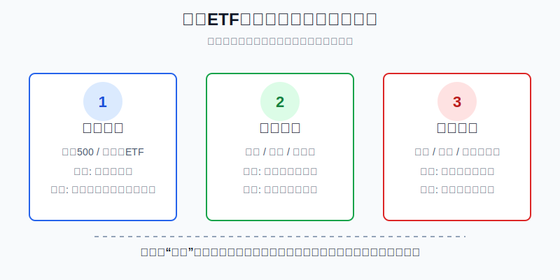
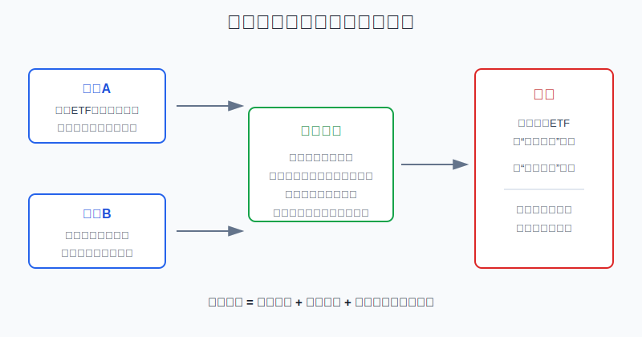
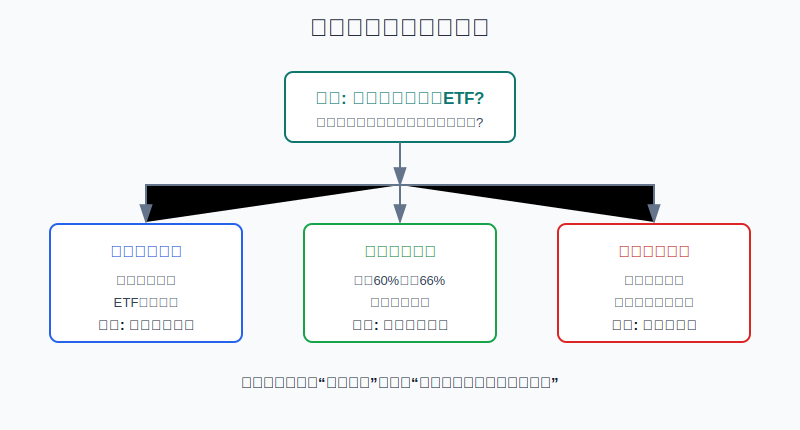

## 散户投资小白金融全品种操盘手册 - 10.16 美股ETF止盈止损 - 不要把长期配置做成短线赌博
  
### 作者  
digoal  
  
### 日期  
2026-06-07   
  
### 标签  
金融产品 , 金融工具 , 散户 , 投资小白 , 全品操盘手册  
  
----  
  
## 背景 
  

> 适用读者: 已经开始研究标普500、纳斯达克100、行业ETF和短债ETF，但一跌就想止损、一涨就想落袋为安的小白投资者。  
> 本文定位: 投资教育框架，不构成个性化投资建议。

## 先问一个反直觉的问题

很多人买美股ETF亏钱，不是因为ETF太复杂，而是因为把它当错了工具。明明买的是长期配置，却每天按短线涨跌止损；明明买的是主题交易，却安慰自己“长期会回来”。**止盈止损的第一步，不是找神奇百分比，而是先问: 这只ETF在你的账户里到底是什么角色。**

## 核心概念: 止盈止损不是价格按钮，而是卖出规则

止盈，就是在赚钱后按规则降低风险；止损，就是在错误扩大前按规则承认前提失效。听起来都和“卖出”有关，但卖出的理由完全不同。

长期核心ETF，比如标普500ETF、全市场ETF，买的是美国大盘长期盈利和复利。它的止盈重点不是“涨20%就跑”，而是仓位涨得太大以后，把风险减回原计划。它的止损重点也不是“跌8%就砍”，而是资金期限、风险承受能力或资产配置前提发生变化。

行业ETF和主题ETF，比如半导体、医疗、AI、网络安全，买的是某个行业阶段性机会。它可以有更明确的止盈止损，因为它本来就是卫星仓。卫星仓的任务是增强收益弹性，不是替代核心仓。

杠杆ETF和反向ETF更特殊，它们是短期交易工具，不是长期配置工具。你买它之前就要写好目标价、最长持有时间和最大亏损额。否则你不是在做配置，而是在用ETF包装短线赌博。

本节的行动结论先放在前面: **长期核心美股ETF，用“仓位偏离”止盈，用“前提失效”止损；行业和主题ETF，用“买入逻辑是否还成立”止盈止损；杠杆和反向ETF，不适合小白当长期持仓。**

## 逻辑推导链

【论证链标题】: 因为美股宽基ETF的普通回撤很常见、市场最佳上涨日很难预测，所以长期配置不能靠短线价格止损，而要靠资金期限、仓位上限和买入前提来决定卖出。

── 第一步: 前提陈述

前提A: 宽基ETF短期下跌是常态，不是每次下跌都代表买错。这是常量。ETF像一辆长途车，路上颠簸很正常；如果每次颠簸都跳车，你就很难到达长期目的地。

前提B: 美股长期收益往往来自少数关键上涨日，而这些日子常常出现在最恐慌的时候。这是常量。小白最容易犯的错，是在暴跌后止损离场，然后又不敢及时买回来。

前提C: 每只ETF在组合里的角色不同。这是常量。核心宽基负责长期底仓，行业ETF负责增强弹性，杠杆或反向ETF负责短期交易。角色不同，卖出规则必须不同。

前提D: 资金期限、风险承受能力和市场前提会变化。这是变量。例如原本五年不用的钱，突然一年内要买房；原本买的是行业景气，后来行业盈利逻辑被证伪；原本只是10%卫星仓，涨成了25%重仓。这些变化才是真正需要卖出的信号。

── 第二步: 逻辑推导

由A可得: 因为普通回撤本来就是宽基ETF的一部分，所以“跌了多少”不能单独成为长期核心仓的止损理由。否则你会把正常波动误判成错误。

由A+B可得: 因为恐慌期经常和大反弹挨得很近，所以短线止损后如果没有明确回补规则，很容易卖在低位、买不回来。这样表面上是控制亏损，实际是在切断长期复利。

再由A+B+C可得: 因为ETF角色不同，所以不能给所有ETF套同一个“-8%止损、+20%止盈”。核心宽基要看仓位和资金期限；行业ETF要看行业前提；杠杆和反向ETF要看交易计划。

最后由A+B+C+D可得: 因为真正改变收益风险的是资金用途、仓位暴露和买入逻辑是否失效，所以美股ETF的卖出规则应该写成三条线: **资金线、仓位线、逻辑线**。

── 第三步: 正常情景下的操作结论

✅ 正常情景: 你买的是标普500、全市场ETF或纳斯达克100这类长期核心或准核心ETF，资金三年以上不用，买入前已经设定目标仓位，并且ETF本身的长期配置角色没有变化。

对应操作: 不因为10%-15%的普通回撤清仓。止盈时，看仓位是否超过目标上限；止损时，看资金期限是否变短、仓位是否超过承受能力、买入逻辑是否不成立。只有这些前提变化，才执行卖出。

── 第四步: 数据和案例证实

证据1: 普通年度回撤很常见。J.P. Morgan Asset Management《Guide to the Markets》2026年版统计，1980年以来标普500年内平均最大回撤约14.2%，但46年里有35年全年仍为正收益。这个数据对应前提A: 对宽基ETF来说，年内下跌十几个点并不罕见，不能自动等同于“趋势完了”。

证据2: 错过关键上涨日的代价很高。Wells Fargo Investment Institute以1995年7月到2025年6月的标普500数据测算，持续持有的年化收益约8.4%；如果错过最好的30个交易日，年化收益降到约2.1%。同一资料还指出，过去30年10个最佳交易日中有9个出现在衰退期，6个也同时处在熊市里。这个数据对应前提B: 最想卖的时候，往往也是最容易错过反弹的时候。

证据3: 专业管理人长期跑赢指数也不容易。S&P Dow Jones Indices的SPIVA U.S. Scorecard Year-End 2025显示，2025年约78.78%的美国大盘主动基金跑输标普500；15年维度约89.93%跑输。这个数据不是说指数永远最好，而是提醒小白: 如果连专业机构都很难长期精准择时，散户更不能把核心ETF做成频繁进出的短线游戏。

证据4: 再平衡比猜顶更适合长期账户。Vanguard在投资者教育材料里举例，若70%股票、30%债券的组合偏离目标5个百分点或以上，就可以触发再平衡；它强调再平衡不是择时，而是让组合回到长期目标。这个数据对应止盈规则: 长期核心ETF赚钱后，先看仓位有没有偏离目标，而不是幻想卖在最高点。

失败案例: 一个小白买了标普500ETF，计划持有五年以上，却在年内回撤15%时清仓。表面上看，他执行了止损；实际上，他没有区分“正常回撤”和“买入前提失效”。如果市场随后反弹，他还要面对两个难题: 什么时候买回，买回多少。多数人没有答案，于是止损变成了长期离场。

── 第五步: 前提变化时的替代结论

若前提D中的资金期限改变，例如三年不用的钱突然一年内要用，推导路径变为: 因为短期要用的钱不能承受权益资产回撤，所以即使ETF本身没错，也要降低权益仓位。新结论: 先卖出一部分核心ETF，把要用的钱转到货币市场基金、短债ETF或现金类工具。

若前提C中的角色改变，例如你把10%的半导体ETF卫星仓越买越多，涨成账户25%，推导路径变为: 因为卫星仓已经挤占核心仓，所以组合风险暴露超标。新结论: 止盈不是清空，而是减回原定上限。

若买入逻辑被证伪，例如你买某个主题ETF是因为行业盈利上行，但连续财报显示盈利周期转弱、估值仍高，推导路径变为: 因为当初买入理由不成立，所以不能用“长期配置”安慰自己。新结论: 按计划减仓或退出。

若你持有的是杠杆ETF或反向ETF，推导路径变为: 因为这类工具本来就不是长期配置，所以不能套用“长期持有等回来”的规则。新结论: 按交易计划止盈止损，到时间、到亏损线、到目标价就走。

## 实操例子: 2万美元美股ETF账户怎么写卖出规则

这个例子对应论证链的正常结论: **长期核心ETF用仓位线止盈，用资金线和逻辑线止损，不用每天的涨跌当指挥棒。**

假设小林有2万美元长期美股ETF资金，五年内不用。他的计划是: 标普500ETF占60%，纳斯达克100ETF占20%，短债ETF或美元现金管理工具占20%。这不是推荐比例，只是为了演示规则。

第一步，写资金线。小林先写清楚: 这2万美元五年内不用。如果未来一年内要用其中5000美元，不管市场涨跌，都先把这5000美元从权益ETF里挪出来。判断依据是前提D: 资金期限改变，权益仓位就要降低。

第二步，写仓位线。标普500ETF目标60%，允许区间55%-65%；纳斯达克100ETF目标20%，允许区间15%-25%；短债和现金目标20%，允许区间15%-25%。如果标普500ETF涨到总账户66%，小林卖出约6个百分点，把它减回60%。这就是止盈: 不是猜顶，而是把风险暴露拉回计划。

第三步，写逻辑线。标普500ETF的买入逻辑是长期参与美国大盘盈利，不因普通回撤失效；纳斯达克100ETF的买入逻辑是科技成长弹性，但估值和集中度更高，所以仓位上限更严格。如果纳斯达克100ETF跌12%，但它仍在20%目标附近，资金期限没变，小林不自动止损；如果它因为大涨变成30%，即使还在上涨，也先减回25%以下。

第四步，写卫星仓特别规则。如果小林额外拿2000美元买AI主题ETF，这笔钱必须单独标记为卫星仓，目标上限10%。买入理由要写成可检查的句子，比如“AI资本开支和相关公司收入仍在增长”。如果后续财报和行业数据连续证伪这个理由，哪怕亏损只有8%，也要减仓；如果涨到总账户15%，哪怕逻辑还没坏，也要减回10%以内。

第五步，纠偏。假如小林看到标普500ETF跌了14%，就想全部清仓，他要先回到三条线检查: 资金五年内是否不用？仓位是否仍在区间内？买入逻辑是否失效？如果答案是“资金没变、仓位没超、逻辑没坏”，清仓就是情绪动作，不是止损。真正该做的是停止盯盘，等固定复盘日再看。

如果操作错误，后果很直接。核心仓过早止损，会让账户变成现金仓，后面反弹时很难买回；卫星仓不止盈，会让小仓位变成大风险；主题ETF逻辑坏了还死扛，会把交易仓伪装成长期仓。纠偏方法只有一个: 每笔ETF买入当天就写好角色、上限、失效条件。

## 可复用框架

【三线卖出】

适用前提: 你持有的是美股ETF，不是单只股票；你愿意先给每只ETF定义账户角色。

核心逻辑: 因为普通回撤常见、择时很难，所以卖出不能只看价格，要看资金线、仓位线、逻辑线。

操作步骤:

1. 资金线: 钱什么时候要用。三年内要用的钱，不放在高波动权益ETF里。
2. 仓位线: 每只ETF目标比例是多少。超过上限就止盈减回，不幻想卖在最高点。
3. 逻辑线: 当初为什么买。买入理由被证伪，就止损或退出。

前提失效时: 如果你买的是杠杆ETF、反向ETF或短线主题交易，不使用长期核心仓规则，必须单独设最大亏损、目标价和最长持有时间。

举一反三: 这个框架也能用在A股ETF、港股ETF、黄金ETF和REITs上。先定角色，再定仓位，最后才谈价格。

【先分后卖】

适用前提: 你同时持有宽基、行业、主题、债券等多类ETF。

核心逻辑: 因为ETF名字相似但风险角色不同，所以必须先分类，再决定止盈止损。

操作步骤:

1. 核心宽基: 用再平衡止盈，用资金期限和组合前提止损。
2. 行业主题: 用仓位上限止盈，用行业逻辑失效止损。
3. 债券和现金工具: 用利率、久期和资金用途判断，不把它当股票ETF处理。
4. 杠杆反向: 只按短线交易计划处理，不做长期仓。

前提失效时: 如果你说不清一只ETF属于哪一类，先不要加仓；因为说不清角色，就写不出卖出规则。

举一反三: 以后看到任何新ETF，先问“它在我的账户里负责什么”，再问“什么时候卖”。

## 本节行动清单

| 动作 | 合格标准 |
|---|---|
| 给ETF分类 | 核心宽基、行业卫星、债券现金、杠杆反向分清楚 |
| 写资金期限 | 三年内要用的钱，不放在高波动权益ETF里 |
| 写仓位上限 | 每只ETF有目标比例和允许区间 |
| 用再平衡止盈 | 核心ETF涨多了减回目标，不猜最高点 |
| 用前提失效止损 | 买入理由不成立、资金期限改变、风险超标才卖 |
| 避免机械止损 | 不给所有ETF套同一个跌幅百分比 |

## 一句话总结

美股ETF的止盈止损，不是用一个百分比替你思考；真正可执行的卖出规则，是先分清ETF角色，再用资金线、仓位线、逻辑线决定什么时候减仓、清仓或继续持有。

## 参考资料

- J.P. Morgan Asset Management: Guide to the Markets U.S., 2026年版，https://am.jpmorgan.com/content/dam/jpm-am-aem/global/en/insights/market-insights/guide-to-the-markets/mi-guide-to-the-markets-us.pdf
- Wells Fargo Investment Institute: Perils of Timing Volatile Markets，数据截至2025年6月，https://www.wellsfargoadvisors.com/research-analysis/reports/policy/volatile-markets.htm
- S&P Dow Jones Indices: SPIVA U.S. Scorecard Year-End 2025，https://www.spglobal.com/spdji/en/documents/spiva/spiva-us-year-end-2025.pdf
- Vanguard: Rebalancing your portfolio，2026年访问，https://investor.vanguard.com/investor-resources-education/portfolio-management/rebalancing-your-portfolio
- SEC Investor.gov: Investor Bulletin: Stop, Stop-Limit, and Trailing Stop Orders，2017年7月13日，https://www.investor.gov/introduction-investing/general-resources/news-alerts/alerts-bulletins/investor-bulletins-15
- FINRA: Stop Orders: Factors to Consider During Volatile Markets，2025年3月26日，https://www.finra.org/investors/insights/stop-orders-factors-consider-during-volatile-markets

> ⚠️ **声明**：本文内容为投资教育目的，所有历史数据、策略框架均为辅助学习工具，不构成证券投资建议。市场有风险，投资需谨慎。实际操作请结合自身风险承受能力，必要时咨询专业投顾。
  
#### [PostgreSQL 解决方案集合](../201706/20170601_02.md "40cff096e9ed7122c512b35d8561d9c8")
  
  
#### [德哥 / digoal's Github - 公益是一辈子的事.](https://github.com/digoal/blog/blob/master/README.md "22709685feb7cab07d30f30387f0a9ae")
  
  
#### [About 德哥](https://github.com/digoal/blog/blob/master/me/readme.md "a37735981e7704886ffd590565582dd0")
  
  

  
