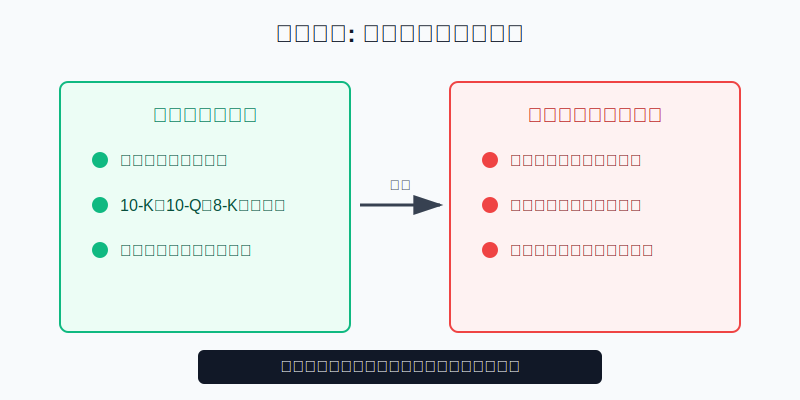
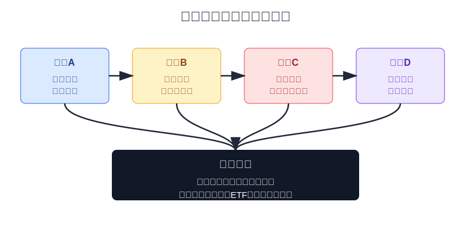
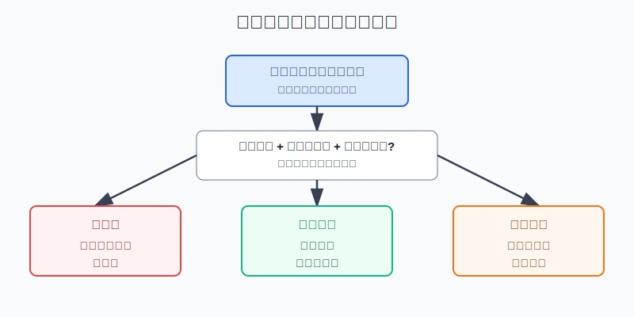

## 散户投资小白金融全品种操盘手册 - 11.1 美股个股为什么值得研究，但不等于更容易赚钱
  
### 作者  
digoal  
  
### 日期  
2026-06-07   
  
### 标签  
金融产品 , 金融工具 , 散户 , 投资小白 , 全品操盘手册  
  
----  
  
## 背景 
  

> 适用读者: 已经学过美股指数和ETF，开始被苹果、英伟达、特斯拉、微软这类公司吸引，但还不知道个股该放在账户什么位置的小白投资者。  
> 本文定位: 投资教育框架，不构成个性化投资建议。

## 先问一个反直觉的问题

美股最动人的财富故事，几乎都来自个股；但散户最容易把账户做坏的地方，也常常是个股。**值得研究，不等于值得重仓；看懂一家好公司，也不等于能用好价格、好仓位、好纪律赚到钱。**

## 核心概念: 个股是放大镜，不是提款机

买宽基ETF，是买一篮子公司；买个股，是把判断集中到一家公司身上。集中有好处: 你能更清楚地学习商业模式、收入来源、利润率、现金流、管理层和竞争格局。美国上市公司的披露体系也比较标准，10-K是年度报告，10-Q是季度报告，8-K是重大事项临时报告，普通投资者可以在SEC EDGAR系统查到原始文件。

但集中也有代价。ETF里一家企业出问题，通常只影响篮子的一小块；个股出问题，影响的是你这笔仓位的全部。个股研究的正确定位是: **先训练你理解公司和财报，再用小比例做卫星仓；它不能替代宽基ETF、现金管理和组合纪律。**

## 逻辑推导链

【论证链标题】: 因为美股个股披露充分、研究价值高，但单票收益高度集中且长期跑赢很难，所以小白应把个股当研究工具和小比例卫星仓，而不是把它当更容易赚钱的核心资产。

── 第一步: 前提陈述

前提A: 美股个股有较好的公开研究材料。这是常量。SEC Investor.gov说明，美国境内公司通常要提交10-K、10-Q和8-K等报告。对小白来说，这像看一家店的账本、客流和风险提示，比只听社区消息可靠。

前提B: 个股收益不是平均分布，而是少数大赢家贡献了市场大部分财富。这是常量。它像班级平均分很高，但分数主要由少数尖子生拉起来；你买错学生，拿不到平均分。

前提C: 单只股票有无法靠“相信公司”消除的个体风险。这是常量。产品失败、监管处罚、财务造假、技术替代、管理层错误，都会让一家公司长期跑输指数。

前提D: 小白的研究能力、估值能力和卖出纪律需要训练。这是变量。能读懂财报、写出估值区间、设定失效条件以后，个股仓位才可以从观察名单进入小比例试错仓。

── 第二步: 逻辑推导

由A可得: 因为美股披露资料充分，所以个股值得研究。研究个股能训练你理解收入、毛利率、营业利润、自由现金流和竞争优势，而这些能力反过来也能帮你看懂ETF和行业。

由B+C可得: 因为市场财富由少数赢家集中贡献，而单家公司又有不可分散的风险，所以“买个股”不是比“买ETF”更简单，而是把难题从市场判断放大成公司判断、估值判断和卖出判断。

再由A+B+C+D可得: 因为个股有学习价值，但普通投资者很难稳定选中赢家并避开大亏，所以正常结论不是“不碰个股”，而是给个股设边界: **先研究，后小仓；先写买入逻辑，后谈买入价格；先设失效条件，后允许加仓。**

── 第三步: 正常情景下的操作结论

✅ 正常情景: 你已经有宽基ETF或其他核心资产，生活备用金充足，这笔钱三年以上不用，并且能读完目标公司的10-K、最近两份10-Q、最近一年重大8-K和最近一次业绩电话会材料。

对应操作: 个股只能放在卫星仓或试错仓。单只个股不要替代核心资产，买入前必须写清三句话: 公司靠什么赚钱、现在价格贵不贵、什么情况证明我错了。

── 第四步: 数据和案例证实

证据1: 个股披露体系确实给研究者提供原始材料。SEC Investor.gov说明，境内公司需要提交年度10-K、季度10-Q和重大事项8-K；EDGAR可以查询公司文件。这个证据对应前提A: 美股个股值得研究，不是因为消息多，而是因为原始披露可查。

证据2: 赢家高度集中。Hendrik Bessembinder关于美国股票财富创造的研究显示，1926年至2019年，美国公开股票市场相对国库券创造了约47.4万亿美元净财富，但57.8%的股票减少了股东财富。ASU对该研究的介绍还提到，过去约90年里，86只股票贡献了约16万亿美元财富创造，约占总量一半。这个证据对应前提B: 买到赢家很重要，但赢家不是均匀分布。

证据3: 集中持股的下行风险很大。J.P. Morgan Asset Management对1980年以来Russell 3000成分股的分析显示，超过40%的公司经历过“灾难性损失”，即股价从高点下跌70%且未恢复；约66%的股票跑输Russell 3000，约42%的股票绝对收益为负。这个证据对应前提C: 单票风险不是小概率故事，而是长期统计里反复出现的结果。

证据4: 连专业主动管理也很难持续跑赢。S&P Dow Jones Indices的SPIVA U.S. Year-End 2025显示，截至2025年底，78.78%的美国大盘主动基金在1年维度跑输S&P 500，15年维度跑输比例为89.93%，20年维度为92.89%。这个证据对应前提D: 小白不能默认自己靠几篇帖子和几个热门视频，就能长期胜过指数。

失败案例: 一个小白先买了标普500ETF，后来看到某只AI热门股连续上涨，就把核心ETF卖掉，集中买入这只个股。他的问题不是研究AI，而是把“公司故事很强”直接推成“账户应该重仓”。如果后续业绩增速放缓、估值回落或市场风格切换，这笔仓位会同时承受公司风险和估值风险。历史不代表未来，但它提醒我们: 个股可以创造巨大回报，也可以制造巨大回撤。

── 第五步: 前提变化时的替代结论

若前提D改变，你已经能持续读披露、做同业对比、估算估值区间，并提前写出卖出条件，推导路径变为: 因为研究能力提升，个股可以从观察名单进入小仓试错。新结论: 允许少量买入，但仍受单票上限约束。

若前提A不成立，例如你只看中文社区摘要、短视频观点和股价走势图，推导路径变为: 因为原始信息链断了，所以研究价值没有兑现。新结论: 不下单，只把公司放入学习清单。

若前提C被你忽略，例如单票涨到总资产20%以上，推导路径变为: 因为个体风险已经压过组合纪律，所以即使公司仍优秀，也要先减回上限。新结论: 先管理仓位，再讨论长期看好。

## 实操例子: 10万元账户怎样开始研究第一只美股

这个例子对应论证链的正常结论: **个股先做研究工具和小比例卫星仓，不替代核心资产。**

假设小林有10万元可投资资金，已留足生活备用金。他计划把3万元用于美股，其中2.4万元放在宽基ETF或现金管理工具里，最多6000元用于个股学习仓；单只个股上限是总资产的5%，也就是5000元。

第一步，先写公司一句话。比如研究某云计算公司，必须能写出“它靠订阅收入和云服务赚钱，客户续费率、毛利率和资本开支决定利润质量”。写不出这句话，不进入下一步。

第二步，读三份文件。最近一份10-K看业务、风险和三张财务报表；最近两份10-Q看收入增速和利润率有没有变化；最近重大8-K看并购、裁员、诉讼、管理层变动和业绩指引。这个动作对应前提A。

第三步，写估值区间。小林不用做复杂模型，但至少写清: 当前市值对应的市销率或市盈率，和过去三年、同行公司相比是高还是低。如果只能说“大家都看好”，不买。

第四步，写失效条件。例子: 连续两个季度收入增速低于自己设定的下限，毛利率明显下滑，或公司下调全年指引，就停止加仓并重新评估。这个动作对应前提C和D。

第五步，执行仓位。若四步都完成，小林第一次只买入2000元，不因为上涨马上加到上限。下一次加仓必须满足两个条件: 财报继续验证买入逻辑，且总仓位仍低于单票上限。若股价上涨导致个股超过5%，先减回上限。

如果操作错误，后果很清楚: 没读披露就买，是把研究仓变成消息仓；没有估值就买，是把好公司买成坏交易；没有失效条件就买，是把投资变成死扛。纠偏方法只有一个: 任何个股下单前，先写完公司、估值、仓位、失效四张纸。

## 可复用框架

【先镜后仓】

适用前提: 你想研究美股个股，但还没有长期稳定跑赢指数的记录。

核心逻辑: 因为个股是理解公司的放大镜，不是更容易赚钱的捷径，所以先用它训练研究能力，再决定是否给小仓位。

操作步骤:

1. 先研究: 读10-K、10-Q、8-K，写清公司靠什么赚钱。
2. 再估值: 和历史、同行、增长质量比较，写出可接受价格区间。
3. 后下单: 单票不超过预设上限，且不能挤占核心ETF。

前提失效时: 原始披露没读、估值写不出、失效条件没有，就只观察不买。

举一反三: 这个框架也能用在港股、A股龙头和中概ADR上。先看公司，再看价格，最后才看仓位。

【四问下单】

适用前提: 你已经选出一只候选美股，准备从观察进入试错仓。

核心逻辑: 因为个股风险集中，所以每次下单前必须用四个问题拦住情绪。

操作步骤:

1. 它靠什么赚钱?
2. 现在价格贵不贵?
3. 单票亏损会不会伤到账户?
4. 什么事实出现，我承认自己错了?

前提失效时: 四问里有一问答不清，不下单；若持有后失效条件出现，按计划减仓或退出。

举一反三: 以后研究成长股、价值股、金融股、医药股，都先过这四问。

## 本节行动清单

| 动作 | 合格标准 |
|---|---|
| 保留核心资产 | 个股不替代宽基ETF、现金管理和组合纪律 |
| 读原始披露 | 至少读最近10-K、两份10-Q、重大8-K |
| 写三句话 | 公司靠什么赚钱、价格贵不贵、什么情况证明我错了 |
| 设单票上限 | 小白单票只做卫星仓或试错仓，不因上涨无限加码 |
| 按财报复盘 | 每个季度用收入、利润率、现金流和指引验证买入逻辑 |

## 一句话总结

美股个股值得研究，因为它能训练你理解真实公司；但它不等于更容易赚钱，因为赢家少、风险集中、估值和纪律都难。小白的正确顺序是: 宽基打底，个股学习，小仓试错，前提失效就撤。

## 参考资料

- SEC Investor.gov: Form 10-K，2026年访问，https://www.investor.gov/additional-resources/general-resources/glossary/form-10-k
- SEC Investor.gov: Using EDGAR to Research Investments，2026年访问，https://www.investor.gov/index.php/introduction-investing/getting-started/researching-investments/using-edgar-research-investments
- Hendrik Bessembinder: Wealth Creation in the U.S. Public Stock Markets 1926 to 2019，SSRN，2020年，https://papers.ssrn.com/sol3/papers.cfm?abstract_id=3537838
- ASU W. P. Carey: Do Stocks Outperform Treasury Bills，2026年访问，https://wpcarey.asu.edu/department-finance/faculty-research/do-stocks-outperform-treasury-bills
- J.P. Morgan Asset Management: Turn concentrated stock risk into potential tax-savings reward，2026年访问，https://am.jpmorgan.com/us/en/asset-management/adv/investment-strategies/separately-managed-accounts/tax-managed-solutions/concentrated-stock-risk/
- S&P Dow Jones Indices: SPIVA U.S. Scorecard Year-End 2025，2026年5月，https://www.spglobal.com/spdji/en/documents/spiva/spiva-us-year-end-2025.pdf

> ⚠️ **声明**：本文内容为投资教育目的，所有历史数据、策略框架均为辅助学习工具，不构成证券投资建议。市场有风险，投资需谨慎。实际操作请结合自身风险承受能力，必要时咨询专业投顾。
  
#### [PostgreSQL 解决方案集合](../201706/20170601_02.md "40cff096e9ed7122c512b35d8561d9c8")
  
  
#### [德哥 / digoal's Github - 公益是一辈子的事.](https://github.com/digoal/blog/blob/master/README.md "22709685feb7cab07d30f30387f0a9ae")
  
  
#### [About 德哥](https://github.com/digoal/blog/blob/master/me/readme.md "a37735981e7704886ffd590565582dd0")
  
  

  
