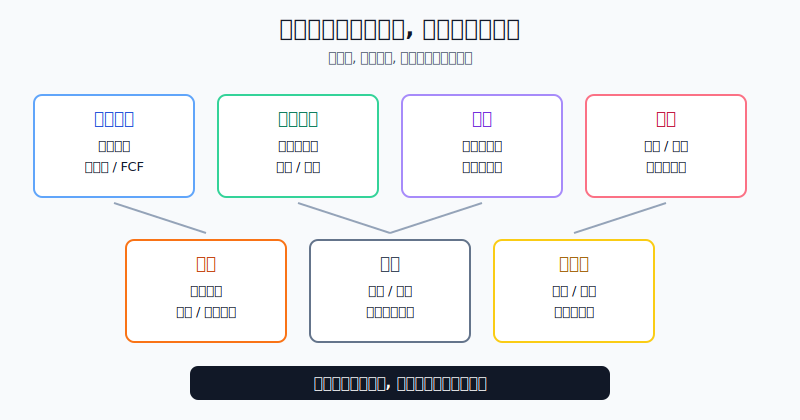
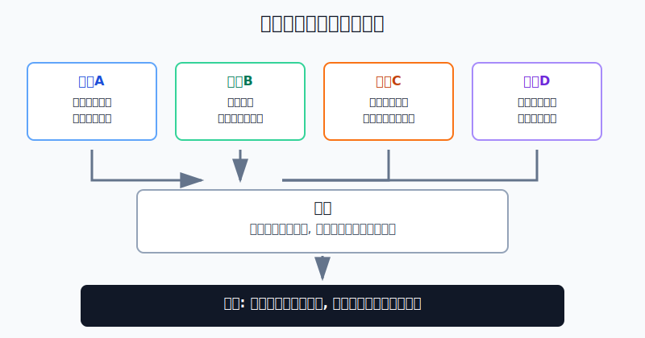
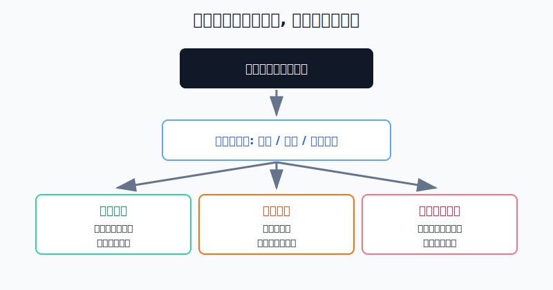

## 散户投资小白金融全品种操盘手册 - 11.2 公司分类 - 科技成长、消费龙头、金融、医药、能源、工业、周期股
  
### 作者  
digoal  
  
### 日期  
2026-06-07   
  
### 标签  
金融产品 , 金融工具 , 散户 , 投资小白 , 全品操盘手册  
  
----  
  
## 背景 
  

> 适用读者: 已经知道美股个股比ETF更难，但仍想开始研究单只公司的小白投资者。  
> 本文定位: 投资教育框架，不构成个性化投资建议。资料口径按 2026-06-06 可核查公开资料整理，实盘前仍要以公司最新公告、交易平台和自身风险承受能力为准。

## 先问一个反直觉的问题

买美股个股，第一步不是问“这家公司厉不厉害”，而是问“它靠什么发动机赚钱”。同样叫大公司，有的靠软件订阅，有的靠品牌复购，有的靠利差，有的靠油价。发动机不一样，看的仪表盘就不一样。

## 核心概念: 分类不是贴标签，而是选指标

官方分类有一套标准。FINRA 在2024年11月的投资者教育文章中说明，GICS 由 MSCI 和 S&P Dow Jones Indices 在1999年创建，把公开交易公司分成11个行业板块，再细分到行业组、行业和子行业。11个板块包括信息技术、金融、医疗保健、工业、能源、可选消费、必需消费、通信服务、材料、房地产和公用事业。

这套分类的作用，是帮你找到同类公司。比如银行要和银行比，药企要和药企比，半导体公司要和半导体公司比。把银行的P/E（市盈率，股价除以每股收益）拿去和软件公司的P/E硬比，就像拿货车油耗和跑车加速比，数字都是真的，但比较对象错了。

但小白操盘时，只记住11个官方行业还不够。因为很多公司跨行业: 电动车在官方分类里常被放到可选消费，但投资者讨论时又会把它当科技成长；支付公司有金融属性，也有科技平台属性；大型互联网公司可能同时有广告、云、AI、硬件和订阅收入。

所以本节用更适合实操的七类研究框架:

| 实操分类 | 赚钱发动机 | 优先看的指标 |
|---|---|---|
| 科技成长 | 新产品、软件、平台、AI、云、网络效应 | 收入增速、毛利率、研发投入、自由现金流、估值对增长的要求 |
| 消费龙头 | 品牌、渠道、复购、提价能力 | 同店销售、毛利率、库存、客单价、市场份额 |
| 金融 | 利差、手续费、资本市场活跃度、风险定价 | 净息差、坏账率、资本充足率、存款成本、资产质量 |
| 医药 | 专利、管线、审批、医保支付 | 核心药品销售、研发阶段、专利到期、FDA节点、单品依赖 |
| 能源 | 油气价格、产量、成本、资本开支 | 油价、天然气价格、现金成本、自由现金流、储量和回购 |
| 工业 | 订单、设备、运输、国防、自动化 | 新订单、积压订单、交付周期、产能利用率、资本开支 |
| 周期股 | 供需、库存、价格、经济周期 | 商品价格、库存、产能、负债率、利润率弹性 |

本节先给行动结论: **每只美股个股买入前，先写一张“分类卡”: 它属于哪类，赚钱发动机是什么，应该看哪三个指标，失效条件是什么，和你已有ETF仓位是否重复。分类卡写不出来，先不买。**

## 逻辑推导链

【论证链标题】: 因为不同公司靠不同发动机赚钱，而市场环境会奖励不同发动机，所以小白研究美股个股必须先归类、再选指标、再定仓位。

### 第一步: 前提陈述

前提A: 官方行业分类能帮助你找到可比公司。这是相对稳定的常量。GICS 把公司放进统一的行业框架，方便你把一家公司和同类公司、同行业ETF或行业指数比较。它像超市货架，先把饮料、粮油、药品、家电分区。

前提B: 实际投资要看赚钱发动机。这是常量。科技成长股主要看增长能不能变成现金流；消费龙头看品牌和复购；金融股看利差和坏账；医药股看管线和专利；能源和周期股看价格、供需和成本。发动机不同，仪表盘就不同。

前提C: 市场环境会改变哪个发动机更受欢迎。这是变量。利率上行时，高估值成长股压力会变大；经济复苏时，工业、金融和部分周期股更容易受益；油价上行时，能源公司现金流会改善；政策或专利变化时，医药股会重新定价。

前提D: 小白通常已经通过宽基ETF持有行业暴露。这是变量。State Street 的 SPY factsheet 显示，截至2026年3月31日，SPY 的信息技术权重为32.91%，金融12.59%，通信服务10.28%，可选消费9.86%，医疗保健9.47%，工业9.02%，能源4.02%。这说明你买一只美股个股，常常不是从零开始配置，而是在已有宽基上继续加浓度。

### 第二步: 逻辑推导

由A可得: 因为官方分类能找到同类公司，所以估值比较必须先限定比较对象。银行和银行比，药企和药企比，软件和软件比，不能看到一个P/E低就说便宜。

由A+B可得: 因为同一官方行业里也可能有不同赚钱发动机，所以小白还要写实操分类。比如同在可选消费里，餐饮龙头和电动车公司的指标完全不同；同在医疗里，成熟药企和早期生物科技公司的风险也完全不同。

再由B+C可得: 因为市场环境会改变奖励对象，所以分类不是为了给公司盖章，而是为了提前写清“什么情况对它有利，什么情况会让它失效”。成长股要警惕增长放缓和估值压缩，金融股要警惕信用风险，能源股要警惕油价和资本开支周期反转。

最后由A+B+C+D可得: 因为你通过宽基ETF已经持有一部分科技、金融、医疗、消费和工业暴露，所以买单只个股之前必须先问: 这笔交易是在补充组合，还是把原本分散的ETF仓位变成某一类公司的集中押注。

### 第三步: 正常情景下的操作结论

✅ 正常情景: 你准备研究一只美股个股，已经知道它的代码和业务大概方向，但还没决定是否买入。

对应操作: 先不下单。第一步查官方行业分类；第二步判断实操分类；第三步列出该类最重要的三个指标；第四步写出失效条件；第五步检查你已有ETF里是否已经有同类暴露。五步完成后，才进入估值、买入价格和仓位上限。

### 第四步: 数据和案例证实

证据1: FINRA 的行业板块指南说明，GICS 把公开交易公司分为11个板块，并用于公司、基金和ETF的比较；FINRA 的尽职调查文章也提醒，GICS 能帮助投资者识别并比较同业公司。这个证据验证前提A: 分类不是学术名词，而是比较公司的入口。

证据2: FINRA 的股票估值材料说明，EPS（每股收益）、P/E、P/S（市销率，市值除以收入）和D/E（负债权益比）等指标可以帮助比较公司，但这些比例要和公司所在行业一起看，因为不同行业的平均水平差异很大。这个证据验证前提B: 指标不能脱离公司类型使用。

证据3: S&P Dow Jones Indices 的 Sector Performance Matrix 显示，2022年 S&P 500 Energy 回报65.72%，S&P 500 Information Technology 回报-28.19%；到2023年，Information Technology 回报57.84%，Energy 回报-1.33%。这个证据验证前提C: 市场奖励的发动机会切换，上一年的强势分类不能直接当成下一年的买入理由。

证据4: State Street 的 SPY factsheet 显示，截至2026年3月31日，SPY 前十大持仓包括 NVIDIA 7.58%、Apple 6.66%、Microsoft 4.91%、Amazon 3.64%、Alphabet A 2.99%、Broadcom 2.62%、Alphabet C 2.40%、Meta 2.24%、Tesla 1.87%、Berkshire Hathaway B 1.57%。这个证据验证前提D: 很多小白通过宽基ETF已经持有大型科技、消费和金融相关公司，再买个股就是在加浓度。

失败案例: 小林看到一只“AI概念股”上涨很快，就把它归为科技成长，直接用P/S和收入增速做买入理由。但他没有发现公司收入主要来自一次性硬件订单，毛利率低，客户集中，资本开支很重，更接近工业或周期制造逻辑。后来订单放缓，市场不再按高成长软件估值给它定价，股价大幅回撤。错误不在于他看错一天涨跌，而在于一开始就把发动机看错了。

历史数据不代表未来，但它说明一个稳定机制: **市场不是永远奖励同一类公司。分类的价值，是让你知道自己该看哪组前提，而不是被热门标签牵着走。**

### 第五步: 前提变化时的替代结论

若前提B改变，也就是公司商业模式发生变化，推导路径变为: 因为赚钱发动机变了，原来的指标就不能继续用。新结论: 重新写分类卡，不用旧估值框架硬套新业务。

若前提C改变，也就是利率、油价、信贷、库存或政策环境反转，推导路径变为: 因为市场奖励对象变了，原来的强势分类会变成风险来源。新结论: 停止加仓，先检查买入假设是否仍成立。

若前提D改变，也就是你已经通过SPY、纳指100或科技ETF持有很高科技暴露，推导路径变为: 因为新买科技成长个股会继续提高集中度，所以仓位上限要下调。新结论: 个股不是为了让组合更热闹，而是必须补足组合里真正缺少的东西。

## 实操例子: 10万元账户如何给候选美股分类

这个例子对应论证链的正常结论: **每只个股先写分类卡，再谈买入价格。**

假设小林有10万元长期投资资金，其中4万元用于美股，已经用3万元买了标普500ETF，另外1万元打算学习美股个股。他同时看上三只候选股: 一只是云软件公司，一只是大型银行，一只是能源公司。

第一步，先查已有暴露。按2026年3月31日SPY行业权重估算，小林3万元标普500ETF里，已经约有9873元信息技术、3777元金融、2841元医疗保健、2706元工业、1206元能源。这个动作对应前提D: 买个股之前先知道自己已经间接买了什么。

第二步，给云软件公司写分类卡。实操分类是科技成长。优先看三个指标: 收入增速是否维持，毛利率是否稳定或改善，自由现金流是否从烧钱转向自我造血。失效条件是: 收入增速明显下台阶、客户续费变差、估值仍按高增长定价。这个动作对应前提B和C。

第三步，给大型银行写分类卡。实操分类是金融。优先看三个指标: 净息差（银行贷款收益和资金成本之间的差）、坏账率、资本充足率。失效条件是: 存款成本上升、贷款损失准备增加、资本市场业务下滑。银行不能只用“P/E比科技低”来判断便宜，因为它的核心风险是资产质量和信用周期。

第四步，给能源公司写分类卡。实操分类是能源，也带有周期股属性。优先看三个指标: 油气价格、单位生产成本、自由现金流分配。失效条件是: 油价下行、公司高价扩产、资产负债表恶化。能源股不能只看分红率，因为分红来自周期现金流，周期反转时高分红不等于低风险。

第五步，定仓位。因为小林已经有较高科技暴露，云软件个股第一次试买不超过美股资金的3%，也就是1200元等值资金；金融和能源如果只是补充暴露，也各自先不超过1000-1500元等值资金。任何一只个股都不能替代核心ETF。买入后每次财报只检查分类卡上的三个指标，不用每天被股价跳动带走。

如果操作错误，最常见后果是指标错配。拿P/S买银行，会忽略坏账；拿P/E买亏损成长股，会误以为“没有P/E就不能估值”；拿分红率买能源股，会忽略油价周期。纠偏方法是回到分类卡: 如果分类错了，先停止加仓；如果分类对但前提坏了，按失效条件减仓；如果分类对、前提也没坏，只是短期股价波动，才进入仓位和估值复盘。

## 可复用框架

【分类卡】

适用前提: 你准备研究或买入一只美股个股，但还没有形成完整买入理由。

核心逻辑: 因为公司赚钱发动机不同，所以先归类才能选指标，先选指标才能判断估值。

操作步骤:

1. 写官方行业: 用GICS、公司10-K或券商资料确认它属于哪个行业。
2. 写实操分类: 在科技成长、消费龙头、金融、医药、能源、工业、周期股中选一个主分类，必要时写一个副分类。
3. 写三个指标: 只选最能解释这家公司赚钱发动机的三个指标。
4. 写失效条件: 明确什么情况说明你的分类或买入理由错了。
5. 写组合暴露: 看你已有ETF和个股里是否已经持有同类风险。

前提失效时: 如果公司跨界太复杂、三个核心指标写不出来，先不买；如果业务已经变了，重新分类，不沿用旧买入理由。

举一反三: 这个框架也适用于港股互联网、中概ADR、A股科技股和周期资源股。只要是个股，先问赚钱发动机。

【同类比较】

适用前提: 你已经知道公司分类，准备判断估值高低。

核心逻辑: 因为不同行业的增长、利润率、杠杆和风险不同，所以估值只在同类公司之间才有比较意义。

操作步骤:

1. 找3-5家同类公司或同行业ETF作为参照。
2. 比收入增速、利润率、现金流、负债和估值，不只比股价涨跌。
3. 如果估值明显高于同类，必须写出它凭什么更贵；写不出，就不追高。

前提失效时: 如果公司业务混合，先拆收入来源，再分段比较；如果同类公司太少，把仓位降到观察仓。

举一反三: 这个框架也能用在ETF行业选择、可转债正股研究和高股息股票排雷上。

## 本节行动清单

| 动作 | 合格标准 |
|---|---|
| 查官方分类 | 能说清公司属于哪个GICS板块、行业或子行业 |
| 写实操分类 | 能在七类里选出主分类，并说明赚钱发动机 |
| 选三个指标 | 指标能对应赚钱发动机，不用一堆无关数据凑数 |
| 写失效条件 | 至少写出两条会让买入理由失效的情形 |
| 查已有暴露 | 看核心ETF里是否已经有同类公司或同类行业 |
| 同类再估值 | 只和同类公司比P/E、P/S、现金流和负债 |

## 一句话总结

美股个股研究的第一步，不是找最热门的股票，而是看清它靠什么发动机赚钱；分类卡写清楚，后面的估值、仓位和卖出条件才有落脚点。

## 参考资料

- FINRA: A Guide to Equity Market Sectors, 2024-11-07, https://www.finra.org/investors/insights/guide-to-equity-sectors
- FINRA: Stock Investing and Due Diligence, 2025-04-29, https://www.finra.org/investors/insights/stock-investing-due-diligence
- FINRA: Evaluating Stocks, https://www.finra.org/investors/investing/investment-products/stocks/evaluating-stocks
- SEC Investor.gov: Using EDGAR to Research Investments, https://www.investor.gov/index.php/introduction-investing/getting-started/researching-investments/using-edgar-research-investments
- State Street: SPDR S&P 500 ETF Trust factsheet，截至2026-03-31，https://www.ssga.com/library-content/products/factsheets/etfs/us/factsheet-us-en-spy.pdf
- S&P Dow Jones Indices: S&P 500 Sector Performance Matrix, https://www.spglobal.com/spdji/en/documents/performance-reports/spdji-sector-performance-matrix.pdf

> ⚠️ **声明**：本文内容为投资教育目的，所有历史数据、策略框架均为辅助学习工具，不构成证券投资建议。市场有风险，投资需谨慎。实际操作请结合自身风险承受能力，必要时咨询专业投顾。
  
#### [PostgreSQL 解决方案集合](../201706/20170601_02.md "40cff096e9ed7122c512b35d8561d9c8")
  
  
#### [德哥 / digoal's Github - 公益是一辈子的事.](https://github.com/digoal/blog/blob/master/README.md "22709685feb7cab07d30f30387f0a9ae")
  
  
#### [About 德哥](https://github.com/digoal/blog/blob/master/me/readme.md "a37735981e7704886ffd590565582dd0")
  
  

  
