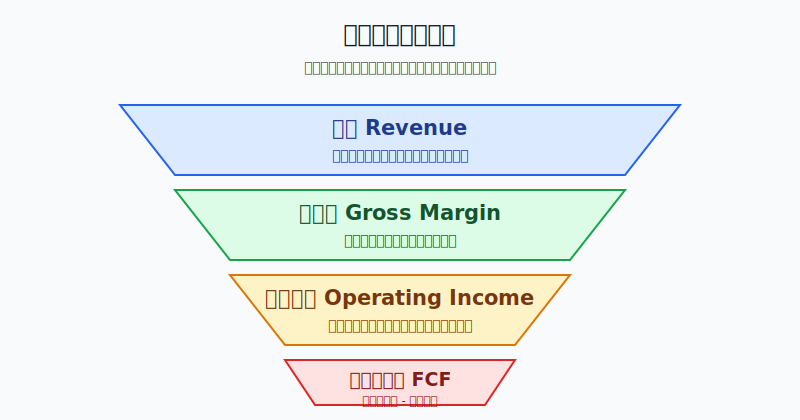
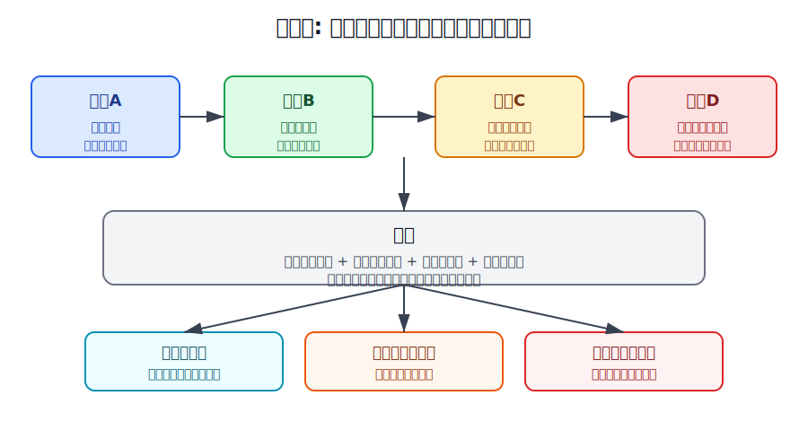
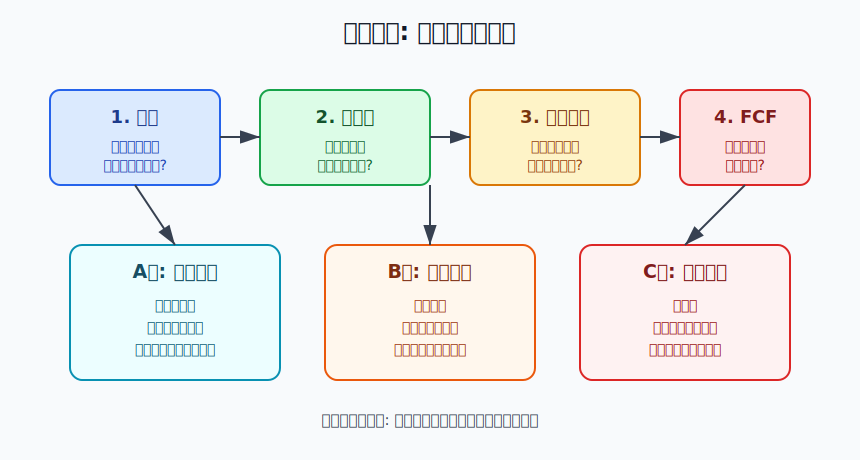

## 散户投资小白金融全品种操盘手册 - 11.3 美股财报基础 - 收入、毛利率、营业利润、自由现金流
  
### 作者  
digoal  
  
### 日期  
2026-06-07   
  
### 标签  
金融产品 , 金融工具 , 散户 , 投资小白 , 全品操盘手册  
  
----  
  
## 背景 
  

> 适用读者: 已经知道美股个股比ETF更难，准备开始读公司10-K、10-Q或财报新闻稿，但还不知道先看哪几个数字的小白投资者。  
> 本文定位: 投资教育框架，不构成个性化投资建议。

## 先问一个反直觉的问题

一家公司收入创新高，股价却大跌；另一家公司利润很好，现金流却很差。小白最容易在这里犯错: 只看一个漂亮数字，就以为自己看懂了财报。**读美股财报，第一步不是找亮点，而是用四个数字排雷: 收入、毛利率、营业利润、自由现金流。**

## 核心概念: 财报不是成绩单，是体检报告

美国上市公司通常会在10-Q、10-K和财报新闻稿里披露经营数据。10-Q是季度报告，10-K是年度报告。你可以把它理解成体检报告: 股价是体重秤上的数字，财报才告诉你血压、血糖、肝功能有没有异常。

本节只抓四个基础指标。

第一，收入，英文是 Revenue 或 Net Sales。它表示公司卖产品、服务或订阅拿到的总金额。收入增长说明有人愿意付钱，但它不等于公司赚钱。卖一台车亏一台，收入也能增长。

第二，毛利率，英文是 Gross Margin。毛利率 = 毛利 / 收入。毛利是收入扣掉直接成本后剩下的钱。用开餐馆打比方，客人付了100元，食材和直接人工花了40元，毛利就是60元，毛利率就是60%。毛利率越高，说明公司在定价、成本或产品差异化上越有空间。

第三，营业利润，英文是 Operating Income。它是在毛利基础上，再扣掉研发、销售、管理等经营费用后的主业利润。营业利润能回答一个问题: 公司日常经营这门生意，扣掉该花的钱以后，到底赚不赚钱。

第四，自由现金流，英文常写 Free Cash Flow，简称FCF。常见算法是经营现金流减资本开支。经营现金流是主业实际流入的现金，资本开支是买设备、建厂、买服务器等长期投入。自由现金流能回答最后一个问题: 账面利润有没有真正变成可支配现金。

本节的行动结论先放在前面: **小白研究美股个股时，先用“收入增长、毛利率稳定、营业利润为正、自由现金流为正”做第一层筛选；四项都过关，才进入观察池；任何一项掉链，都要降级观察，不急着买入。**

## 逻辑推导链

【论证链标题】: 因为收入只能证明需求，毛利率证明赚钱空间，营业利润证明主业效率，自由现金流证明利润质量，所以小白不能用单一指标买美股个股，必须按四层漏斗筛选。

── 第一步: 前提陈述

前提A: 收入增长说明客户愿意付钱，但不说明公司一定赚钱。这是常量。它像一家店门口排队很长，只能说明有人进店，不能说明老板最后能留下钱。

前提B: 毛利率说明单笔生意扣掉直接成本后还剩多少空间。这是变量。毛利率高，通常代表产品有定价能力、成本控制好或商业模式较轻；毛利率下降，则可能说明价格战、成本上升或产品竞争力变弱。

前提C: 营业利润说明主业扣掉研发、销售、管理费用后是否还能赚钱。这是变量。很多成长公司收入很快，但销售费用和研发费用也很高，如果营业利润长期为负，说明公司还没有证明“规模越大越赚钱”。

前提D: 自由现金流说明利润能不能落袋。这是变量。会计利润可能受应收账款、库存、折旧摊销影响；现金流更接近公司能不能自己造血。自由现金流长期为正，公司更有条件分红、回购、还债或继续投资。

── 第二步: 逻辑推导

由A可得: 因为收入只能证明需求存在，所以小白不能看到“营收创新高”就直接下结论。必须继续问: 这笔收入的成本是多少。

由A+B可得: 因为收入增长加上毛利率稳定，才说明公司不是靠亏本换规模，所以第二层要看毛利率有没有被价格战或成本上升打穿。

再由A+B+C可得: 因为毛利还要覆盖研发、销售、管理费用，所以营业利润为正，才说明主业经营模型已经跑通；如果营业利润长期为负，就只能算“仍在验证”，不能当成熟好公司看。

最后由A+B+C+D可得: 因为账面利润还要变成现金，公司才有能力持续回购、分红、还债和投资，所以自由现金流为正，是小白判断财报质量的最后一道门。

── 第三步: 正常情景下的操作结论

✅ 正常情景: 一家公司连续几年收入增长，毛利率稳定或改善，营业利润为正且利润率没有明显恶化，自由现金流也长期为正。

对应操作: 把它放进观察池，再进入下一步: 看估值、竞争格局、仓位上限和失效条件。注意，这里只是“可以研究”，不是“马上买”。好公司如果价格太贵，仍然会让投资回报变差。

── 第四步: 数据和案例证实

证据1: SEC在投资者教育材料中把财务报表分为资产负债表、利润表、现金流量表等，并说明利润表展示公司在一段时间内赚了多少钱，现金流量表展示现金流入和流出。这个官方定义对应本节逻辑: 小白不能只看利润表的收入和利润，还要看现金流量表。

证据2: Apple 2025财年10-K显示，2025财年净销售额为4161.61亿美元，毛利为1952.01亿美元，营业利润为1330.50亿美元，经营活动产生的现金流为1114.82亿美元，购买物业、厂房和设备支出为127.15亿美元。按“经营现金流 - 资本开支”粗算，自由现金流约987.67亿美元。这个案例说明: 成熟优质公司通常不是只有收入大，而是四层都能留下结果。

证据3: Microsoft 2025财年年报显示，2025财年收入为2817.24亿美元，毛利为1938.93亿美元，营业利润为1285.28亿美元，经营活动现金流为1361.62亿美元，资本开支为645.51亿美元，自由现金流约716.11亿美元。它对应前提D: 即使公司大规模投资云和AI基础设施，自由现金流仍然是判断利润质量的重要指标。

证据4: NVIDIA公布的2026财年业绩显示，2026财年收入为2159亿美元，较上一财年增长65%；GAAP毛利率约71.1%，GAAP营业利润约1304亿美元。高速增长和高毛利率同时出现，说明需求和定价空间都很强。但小白仍要继续看现金流、估值和客户集中度，不能只用“增长快”三个字做买入理由。

失败案例: Rivian 2024年10-K显示，2024年收入为49.70亿美元，毛亏损为12.00亿美元，营业亏损为46.89亿美元，经营活动现金流为-17.16亿美元，资本支出为11.41亿美元，自由现金流约-28.57亿美元。这个案例不是说公司一定没有未来，而是说明: 当收入存在但毛利、营业利润和自由现金流都没有通过时，小白不能把“故事”和“销量”当成财报质量。

历史数据不代表未来，但这些案例仍有参考价值，因为它们验证的是基础会计逻辑: 需求、毛利、主业利润和现金流是四道不同的门。只过第一道门，不等于通过体检。

── 第五步: 前提变化时的替代结论

若前提B改变，也就是收入增长但毛利率明显下降，推导路径变为: 因为公司可能在用降价换收入，所以收入增长的质量下降。新结论: 降级观察，先查价格战、原材料成本、产品结构变化，不加仓。

若前提C改变，也就是毛利率不错但营业利润长期为负，推导路径变为: 因为公司还没有证明费用投入能换来经营杠杆，所以它仍是高风险成长股。新结论: 只能用小仓位学习，或者等待营业利润转正后再研究。

若前提D改变，也就是营业利润为正但自由现金流长期为负，推导路径变为: 因为账面利润没有转化为现金，公司可能被应收账款、库存或资本开支拖住。新结论: 不把它当“现金牛”，先查现金流量表和资本开支计划。

若前提A也改变，也就是收入停止增长甚至下滑，同时毛利率和营业利润恶化，推导路径变为: 因为需求、定价和经营效率同时转弱，所以原来的买入逻辑失效。新结论: 已持有者要复盘是否减仓或退出；未持有者先排除。

## 实操例子: 2万美元美股个股学习仓怎么读财报

这个例子对应论证链的正常结论: **四项指标都通过，个股才进入观察池；指标掉链时先降级，不用股价涨跌替代财报判断。**

假设小林有2万美元美股投资资金，其中80%放在宽基ETF，只有20%，也就是4000美元，准备用来学习美股个股。他看中一家公司，准备在财报后判断是否能进入观察池。

第一步，看收入。小林打开公司10-K或年度报告，记录最近三年的收入。如果收入从100亿美元到115亿美元再到130亿美元，说明需求在增长；如果收入增长主要来自一次性并购，或者核心产品销量下滑，只是靠涨价撑住，就不能简单打满分。这一步对应前提A: 收入证明需求，但不证明赚钱质量。

第二步，看毛利率。小林用毛利除以收入，计算三年毛利率。如果毛利率从62%到63%再到64%，说明公司卖出去的产品仍有较强利润空间；如果收入增长但毛利率从60%掉到45%，就要查是不是价格战、成本上升或产品结构变差。这一步对应前提B: 收入增长必须经过毛利率检验。

第三步，看营业利润。小林记录营业利润和营业利润率。营业利润率 = 营业利润 / 收入。如果公司收入增长、毛利率稳定，营业利润率也从20%升到25%，说明规模扩大后费用没有失控；如果营业利润持续为负，说明公司还在烧钱换增长。这一步对应前提C: 主业要能自己赚钱。

第四步，看自由现金流。小林在现金流量表里找到经营活动现金流，再减去资本开支。如果公司营业利润很漂亮，但自由现金流连续三年为负，小林不把它当成熟现金牛；如果自由现金流长期为正，他才继续看回购、分红、债务和资本开支计划。这一步对应前提D: 利润要落袋，质量才更高。

第五步，分档行动。四项通过，进入A档观察池，小林继续研究估值和竞争格局，但单只个股最高不超过账户5%，也就是1000美元。三项通过、一项掉链，进入B档，只观察不加仓。两项以上掉链，进入C档，先排除，等下一份财报再看。

如果前提切换，操作也切换。比如公司收入增长30%，但毛利率明显下降、自由现金流转负，小林不能因为股价上涨就追买。他要把这家公司从A档降到B档，等待下一季确认。如果已经持有，先检查买入理由是否仍成立；如果单票仓位超过5%，先把仓位降回上限内。

如果操作错误，后果很清楚。只看收入买入，可能买到“越卖越亏”的公司；只看利润买入，可能忽视现金流恶化；只看自由现金流买入，也可能忽视收入萎缩后的长期衰退。纠偏方法是固定顺序: 收入、毛利率、营业利润、自由现金流，一个都不能跳。

## 可复用框架

【四层漏斗】

适用前提: 你研究的是美股单只公司，能找到10-K、10-Q、年报或财报新闻稿中的基础财务数据。

核心逻辑: 因为收入、毛利率、营业利润、自由现金流分别回答不同问题，所以必须按顺序筛选，不能用一个漂亮数字替代整张财报。

操作步骤:

1. 看收入: 判断客户需求是否增长，排除只会讲故事但没有付费客户的公司。
2. 看毛利率: 判断单笔生意是否有利润空间，排除靠亏本换规模的增长。
3. 看营业利润: 判断主业是否跑通，排除费用长期失控的公司。
4. 看自由现金流: 判断利润是否能落袋，排除账面好看但现金紧张的公司。

前提失效时: 如果公司处于早期高增长阶段，营业利润和自由现金流暂时为负，不直接判死刑，但必须降低仓位等级，把它归入“高风险验证中”，不能当成熟公司重仓。

举一反三: 这个框架也能用在A股、港股和中概股。无论市场在哪里，收入、毛利、主业利润和现金流的顺序都不能乱。

【三档行动】

适用前提: 你已经用四层漏斗检查完一家公司，并准备决定下一步动作。

核心逻辑: 因为财报质量不是非黑即白，所以操作也要分档，而不是一看好就满仓、一看差就情绪清仓。

操作步骤:

1. A档: 四项都通过，进入观察池，再研究估值、竞争和仓位。
2. B档: 一项明显掉链，降级观察，不加仓，不补仓摊低成本。
3. C档: 两项以上掉链，先排除，等下一次财报重新评估。

前提失效时: 如果出现会计重述、审计意见异常、收入确认争议或现金流大幅恶化，直接从A档或B档降到C档，先保护本金。

举一反三: 以后看财报季大涨大跌，也先做三档分类。股价反应是市场情绪，财报质量才是你的操作依据。

## 本节行动清单

| 动作 | 合格标准 |
|---|---|
| 找原始资料 | 优先看公司10-K、10-Q、年报、投资者关系网站和SEC EDGAR |
| 记录四个数字 | 收入、毛利率、营业利润、自由现金流逐项写下 |
| 看三年趋势 | 不只看单季惊喜，至少看最近三年方向 |
| 做四层筛选 | 收入证明需求，毛利率证明空间，营业利润证明主业，自由现金流证明质量 |
| 分档行动 | A档观察，B档降级，C档排除 |
| 控制仓位 | 个股学习仓不替代宽基ETF核心仓，单票上限提前写好 |

## 一句话总结

美股财报入门不是背一堆复杂术语，而是按顺序问四个问题: 有人买吗、卖一单赚钱吗、主业赚钱吗、现金留下了吗；四个问题都答得过去，才值得进入下一步研究。

## 参考资料

- SEC: Beginners' Guide to Financial Statements，2026年访问，https://www.sec.gov/about/reports-publications/investorpubsbegfinstmtguide
- Apple Inc.: Form 10-K for fiscal year ended September 27, 2025，2025年10月31日，https://www.sec.gov/Archives/edgar/data/0000320193/000032019325000079/aapl-20250927.htm
- Microsoft: 2025 Annual Report，2025财年，https://www.microsoft.com/investor/reports/ar25/
- NVIDIA: Announces Financial Results for Fourth Quarter and Fiscal 2026，2026年，https://investor.nvidia.com/news/press-release-details/2026/NVIDIA-Announces-Financial-Results-for-Fourth-Quarter-and-Fiscal-2026/
- Rivian Automotive, Inc.: Form 10-K for fiscal year ended December 31, 2024，2025年2月20日，https://www.sec.gov/Archives/edgar/data/1874178/000187417825000007/rivn-20241231.htm

> ⚠️ **声明**：本文内容为投资教育目的，所有历史数据、策略框架均为辅助学习工具，不构成证券投资建议。市场有风险，投资需谨慎。实际操作请结合自身风险承受能力，必要时咨询专业投顾。
  
#### [PostgreSQL 解决方案集合](../201706/20170601_02.md "40cff096e9ed7122c512b35d8561d9c8")
  
  
#### [德哥 / digoal's Github - 公益是一辈子的事.](https://github.com/digoal/blog/blob/master/README.md "22709685feb7cab07d30f30387f0a9ae")
  
  
#### [About 德哥](https://github.com/digoal/blog/blob/master/me/readme.md "a37735981e7704886ffd590565582dd0")
  
  

  
