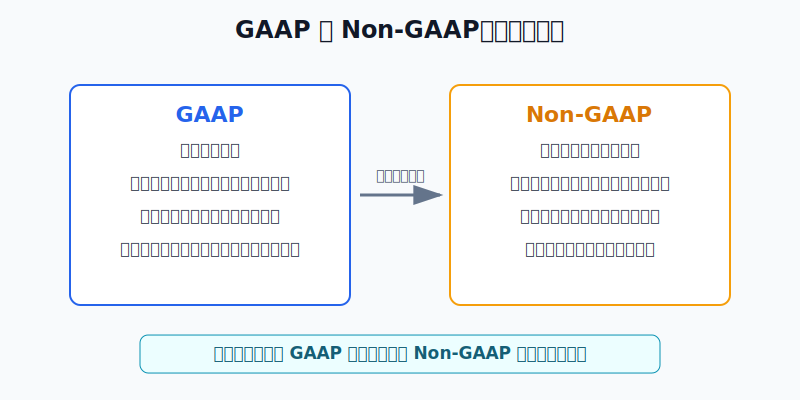
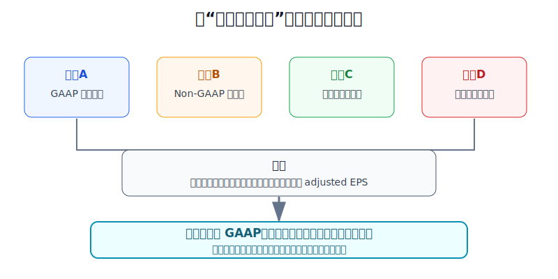
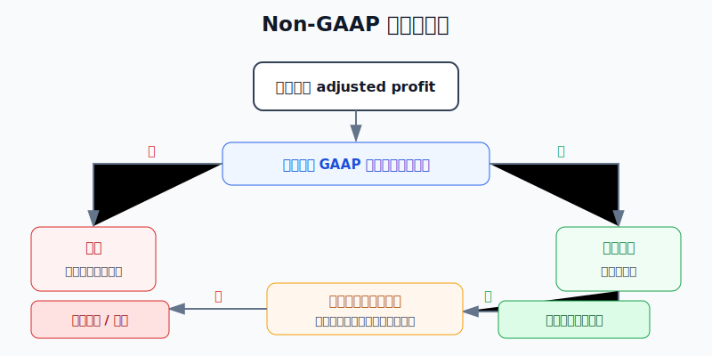

## 散户投资小白金融全品种操盘手册 - 11.4 GAAP 与 Non-GAAP - 为什么公司会调整利润
  
### 作者  
digoal  
  
### 日期  
2026-06-07   
  
### 标签  
金融产品 , 金融工具 , 散户 , 投资小白 , 全品操盘手册  
  
----  
  
## 背景 
  

> 适用读者: 已经开始看美股财报, 但看到 GAAP EPS、Non-GAAP EPS、adjusted earnings、adjusted EBITDA 就不知道该信哪一个的小白投资者。  
> 本文定位: 投资教育框架, 不构成个性化投资建议。规则口径按 2026-06-06 可核查公开资料整理, 实盘前仍要以 SEC、公司最新披露和专业税务/会计意见为准。

## 先问一个反直觉的问题

同一家公司, 同一个季度, 为什么会同时告诉你两个利润? 一个叫 GAAP, 一个叫 Non-GAAP。更反直觉的是: **公司调整利润不一定是骗人, 但你只看调整后的利润, 很容易被骗。**

## 核心概念: GAAP 是统一尺, Non-GAAP 是调整尺

**GAAP** 是 Generally Accepted Accounting Principles, 美国通用会计准则。小白可以把它理解成“统一体检标准”: 每家公司都要按同一套规则确认收入、费用、资产、负债和利润。统一尺的好处是可比, 你才能拿微软和苹果比、拿今年和去年比。

**Non-GAAP** 是不完全按 GAAP 算出来的财务指标。常见名字包括 adjusted EPS、adjusted net income、adjusted operating income、adjusted EBITDA、free cash flow。它不是正式财务报表的替代品, 而是公司额外给投资者看的“调整后视角”。

为什么要调整? 因为 GAAP 有时会把一次性损失、并购相关摊销、重组费用、股权激励费用、投资资产公允价值波动等放进利润。管理层会说: 这些项目不能代表核心经营, 剔除后更能看出生意本身。

这句话有一半道理。比如一家软件公司收购另一家公司后, 会产生无形资产摊销; 一家芯片公司遇到出口限制, 可能一次性计提库存损失。这些项目确实会让当期 GAAP 利润大幅波动。

但另一半风险也很硬: 公司有动力把不好看的费用剔出去, 把利润调得更顺。特别是股权激励、重组费用、并购费用、诉讼费用, 如果年年出现, 就不能轻易当作“特殊情况”。它们可能就是做生意的真实成本。

本节行动结论先放前面: **看美股个股财报时, 先用 GAAP 利润定底线, 再用 Non-GAAP 调节表看公司剔除了什么; 如果调整项目反复发生、现金流不支持、公司只强调调整后利润, 就按更保守的 GAAP 口径估值, 并降低仓位。**

## 逻辑推导链

【论证链标题】: 因为 GAAP 提供统一可比的底线, 而 Non-GAAP 反映管理层选择性调整后的视角, 所以小白不能只看 adjusted EPS, 必须先看 GAAP, 再拆调整项目, 最后决定估值和仓位是否打折。

### 第一步: 前提陈述

前提A: GAAP 是统一尺。这是常量。它像同一个秤, 不管公司故事讲得多漂亮, 最终都要把收入、费用、利润放到同一套规则里称一遍。统一尺不完美, 但没有它, 公司之间就很难比较。

前提B: Non-GAAP 是公司给出的调整尺。这是常量。它通常从 GAAP 利润出发, 加回或扣除某些项目, 形成 adjusted profit。它像医生在体检报告旁边写的说明: “这次发烧是临时感染, 不代表长期体质。”说明可能有价值, 但不能替代体检报告。

前提C: 调整项目有好坏之分。这是变量。一次性诉讼和突发减值, 可以帮助你看清核心经营; 但反复发生的股权激励、营销费用、重组费用, 如果被长期剔除, 就是在把真实成本搬出视野。

前提D: 公司有动力让利润看起来更平滑、更好看。这是常量。股价、融资、管理层奖金、市场预期都和利润表现有关。不是说公司一定造假, 而是小白不能假设所有调整都中立。

### 第二步: 逻辑推导

由A可得: 因为 GAAP 是统一尺, 所以小白看财报的第一眼必须回到 GAAP 收入、GAAP 净利润、GAAP EPS 和经营现金流。没有 GAAP 底线, 你不知道公司到底按正式规则赚了多少钱。

由A+B可得: 因为 Non-GAAP 是在 GAAP 基础上的调整, 所以它的价值不在最终数字, 而在调节表。调节表告诉你公司把哪些费用加回、把哪些收益扣掉、为什么这么调。

再由B+C可得: 因为调整项目有好坏之分, 所以不能把所有 Non-GAAP 都当坏, 也不能把所有 adjusted profit 都当真。正确做法是逐项分类: 一次性、非现金、经营必需、反复发生、现金流相关。

最后由A+B+C+D可得: 因为公司有动机美化利润, 所以小白必须用三条规则保护自己: **调节表不清楚, 不信; 经常性成本被剔除, 打折; GAAP 利润和现金流不支持 Non-GAAP 故事, 降仓或不买。**

### 第三步: 正常情景下的操作结论

✅ 正常情景: 你研究的是普通美股个股, 公司同时公布 GAAP EPS 和 Non-GAAP EPS, 并提供逐项 reconciliation, 也就是从 GAAP 到 Non-GAAP 的调节表。

对应操作: 先记下 GAAP EPS, 再把每一项调整分成三类。第一类是真正一次性项目, 可以作为辅助参考; 第二类是非现金但和经营长期相关的项目, 估值要打折; 第三类是反复发生的现金成本, 不应轻易剔除。最后估值时至少同时算两遍: 一遍按 GAAP, 一遍按 Non-GAAP, 两者差距超过30%时, 用更保守的口径决定仓位。

### 第四步: 数据和案例证实

证据1: SEC 在 Regulation G 最终规则中明确, 上市公司公开披露重要 Non-GAAP 财务指标时, 需要同时列示最直接可比的 GAAP 指标, 并提供 Non-GAAP 与 GAAP 之间的调节。这个规则验证前提A和B: Non-GAAP 可以出现, 但必须回到 GAAP 这把统一尺。

证据2: SEC 公司金融部在 2022-12-13 更新的 Non-GAAP C&DIs 中提示, 剔除正常、反复发生、经营必需的现金费用, 可能让 Non-GAAP 指标具有误导性; 不同期间不一致地调整项目、只剔除损失不剔除收益、使用“量身定制”的会计口径, 也可能误导投资者。这个证据验证前提C和D: 问题不在“调整”两个字, 而在调整是否把真实经营成本藏起来。

证据3: Calcbench 与 Suffolk University 2025年报告研究了 S&P 500 公司2024年年度盈利公告, 发现351家公司, 即71%的 S&P 500, 报告了 Non-GAAP 净利润或 Non-GAAP EPS; 在这些公司中, 89%的调整让 Non-GAAP 利润高于 GAAP 利润; 调整项目合计2249项, 总金额3040亿美元; 平均每家公司 adjusted net income 比 GAAP net income 高8.70亿美元, 约高30%。这个数据说明: Non-GAAP 不是少数公司才用的小技巧, 而是美股财报里的常见现象。

证据4: NVIDIA 在2026-05-20发布的一季度财年2027财报中披露, 该季度收入816亿美元; GAAP diluted EPS 为2.39美元, Non-GAAP diluted EPS 为1.87美元。它还在2026年2月的财年2026财报中说明, 自财年2027第一季度起, Non-GAAP 指标不再剔除 stock-based compensation expense, 也就是股权激励费用。这个案例有两个用处: 第一, Non-GAAP 不必然比 GAAP 高; 第二, 公司可以改变 Non-GAAP 口径, 所以你必须读说明和调节表, 不能只看标题数字。

失败案例: SEC 在2023-03-14公告中称, DXC Technology 在2018年至2020年初的多个期间对 Non-GAAP 财务表现作出误导性披露, 将数千万美元费用错误归入交易、分拆和整合相关成本并从 Non-GAAP 利润中剔除, 导致三个财季 Non-GAAP 净利润被重大高估。DXC 同意支付800万美元罚款并改进 Non-GAAP 政策和披露控制。这个案例说明: 当调整项目分类不可靠时, adjusted profit 会直接误导估值。

历史数据不代表每家公司都会滥用 Non-GAAP, 但它给小白一条稳定教训: **调整后利润越好看, 越要回到调节表检查它是怎么来的。**

### 第五步: 前提变化时的替代结论

若前提C改变, 也就是调整项目确实是一次性、非经营、金额清楚、后续不再反复出现, 推导路径变为: 因为 GAAP 利润被临时项目压低, 所以 Non-GAAP 能帮助你看核心经营。新结论: 可以把 Non-GAAP 作为辅助估值口径, 但仓位仍以现金流和资产负债表验证。

若前提C反向改变, 也就是公司年年剔除股权激励、重组费用、客户获取成本或库存减值, 推导路径变为: 因为所谓“特殊费用”已经变成经营常态, 所以它不是噪音, 而是生意成本。新结论: 按 GAAP 或折中口径估值, 不用公司给的 adjusted EPS 直接算 PE。

若前提B改变, 也就是公司没有提供清楚调节表, 或把 Non-GAAP 指标放在比 GAAP 更醒目的位置, 推导路径变为: 因为你无法验证调整来源, 所以 Non-GAAP 不具备可用性。新结论: 不按调整利润买入, 已持有则降低仓位并等待更清楚披露。

若前提D强化, 也就是公司刚好卡市场预期、管理层奖金和 adjusted EPS 挂钩、现金流长期弱于调整后利润, 推导路径变为: 因为管理层有更强动机包装利润, 所以调整项目可信度下降。新结论: 停止加仓, 用观察仓或退出替代重仓。

## 实操例子: 一家公司 adjusted EPS 很漂亮, 你该怎么下手

这个例子对应论证链的正常结论: **先看 GAAP, 再拆 Non-GAAP 调整, 最后给估值和仓位打折。**

假设小林有20万元人民币等值的全球资产账户, 美股个股学习仓上限是总资产10%, 单只个股上限是2%, 也就是单只股票最多4000元人民币等值。他看中一家云软件公司, 财报标题写着: 本季度 Non-GAAP EPS 1.00美元, 大幅超过市场预期。

第一步, 不看标题先找 GAAP EPS。小林发现 GAAP EPS 只有0.40美元。判断依据是前提A: GAAP 是统一尺。此时不能直接用1.00美元算 PE, 因为正式口径和调整口径差了0.60美元, 差距达到150%。

第二步, 打开调节表。公司从0.40美元调到1.00美元, 主要加回三项: 股权激励0.35美元、重组费用0.15美元、并购无形资产摊销0.10美元。判断依据是前提B: Non-GAAP 的价值在调节表, 不在最终数字。

第三步, 给调整分类。并购无形资产摊销偏非现金, 可以作为辅助参考; 重组费用如果只发生一次, 可以部分加回, 但要查过去八个季度是否反复出现; 股权激励虽然是非现金, 但会稀释股东, 对软件公司通常是长期经营成本, 不能完全无视。判断依据是前提C。

第四步, 做两套估值。若股价是50美元, 用 Non-GAAP EPS 年化4.00美元算, PE 是12.5倍; 用 GAAP EPS 年化1.60美元算, PE 是31.25倍。小林不取最乐观的12.5倍, 而采用折中口径: 把并购摊销0.10美元加回, 对重组费用只加回一半0.075美元, 股权激励不加回。这样每季度可用利润是0.575美元, 年化2.30美元, 对应 PE 约21.7倍。

第五步, 决定仓位。因为调整后估值和 GAAP 估值差距很大, 小林不直接买满2%单票上限。他只用0.5%观察仓, 并写下三个后续条件: 下个季度股权激励占收入比例下降; 重组费用不再反复出现; 经营现金流覆盖调整后利润。如果三项有两项不满足, 不加仓。

如果前提不成立, 操作立刻切换。假如小林发现公司过去八个季度每季都有“重组费用”, 那么重组就不是一次性, 这0.15美元不加回。假如公司经营现金流长期弱于 Non-GAAP 净利润, 那么 adjusted EPS 只说明故事漂亮, 不能说明现金真的进账。此时结论不是“再等等看”, 而是不买或只保留极小观察仓。

如果操作错误, 后果很直接。小林若直接用1.00美元 Non-GAAP EPS 算低估, 可能把一家真实盈利能力一般的公司当成便宜股; 等市场开始按 GAAP 或现金流重新定价, 股价下跌时他会发现自己没有止损依据。纠偏方法是: 每次财报后把 GAAP EPS、Non-GAAP EPS、调整项目、经营现金流写在同一张表里, 不允许只截图标题。

## 可复用框架

【三问调利润】

适用前提: 公司同时披露 GAAP 和 Non-GAAP 利润, 并提供调节表。

核心逻辑: 因为 Non-GAAP 是管理层选择性调整后的利润, 所以必须先问调整是否清楚、是否反复、是否影响现金或股东权益。

操作步骤:

1. 问清楚: 从 GAAP 到 Non-GAAP, 每一项加回或扣除是什么。
2. 问反复: 过去八个季度是否经常出现同类调整。
3. 问代价: 调整项目是否消耗现金、稀释股东、掩盖经营成本。

前提失效时: 如果没有调节表, 或调整项目标签含糊, 不使用 Non-GAAP 估值; 如果调整项目反复出现, 按 GAAP 或折中口径估值。

举一反三: 这个框架也能用在港股 adjusted profit、A股扣非净利润、REITs 的 FFO/AFFO 和美股 EBITDA 上。凡是“调整后”, 都要问调整了什么。

【两尺估值】

适用前提: 你准备根据财报利润给个股估值。

核心逻辑: 因为 GAAP 和 Non-GAAP 代表两把不同利润尺, 所以估值至少算两遍, 差距越大, 仓位越小。

操作步骤:

1. 用 GAAP EPS 算一遍 PE, 得到保守底线。
2. 用 Non-GAAP EPS 算一遍 PE, 得到管理层视角。
3. 两者差距超过30%, 不直接采用乐观口径, 改用折中口径或降低仓位。
4. 若现金流不支持 Non-GAAP 利润, 估值回到 GAAP 或不买。

前提失效时: 如果公司处于亏损期, EPS 估值本身失效, 改看收入质量、毛利率、现金消耗、资产负债表和融资风险。

举一反三: 以后看任何“便宜股”, 先问便宜是按哪把尺算出来的。按 adjusted EPS 便宜, 按 GAAP 和现金流昂贵, 这不是便宜, 是口径差。

## 本节行动清单

| 动作 | 合格标准 |
|---|---|
| 先找 GAAP | 记录 GAAP 收入、GAAP 净利润、GAAP EPS、经营现金流 |
| 再看 Non-GAAP | 找到 reconciliation, 不只看财报标题 |
| 分类调整项目 | 一次性、非现金、反复发生、经营必需、现金相关分清楚 |
| 检查八个季度 | 同类调整反复出现, 不当作特殊项目 |
| 两套估值 | GAAP 和 Non-GAAP 至少各算一遍, 差距超过30%就保守 |
| 现金流验证 | adjusted profit 好看但经营现金流弱, 不重仓 |
| 看不懂就降仓 | 调节表看不懂, 只观察, 不用个股替代核心ETF |

## 一句话总结

GAAP 告诉你公司按统一规则赚了多少钱, Non-GAAP 告诉你管理层希望你怎样理解利润; 小白真正要做的不是二选一, 而是先守住 GAAP 底线, 再拆开 Non-GAAP 调整, 最后用更保守的口径决定估值和仓位。

## 参考资料

- FASB: About the FASB, 2026年访问, https://www.fasb.org/about-us/about-the-fasb
- FASB: Cost-Benefit Analysis, 2026年访问, https://www.fasb.org/page/PageContent?PageId=%2Fabout-us%2FAbout-the-FASB%2Fstandard-setting-process%2Fcost-benefit-analysis.html
- SEC: Conditions for Use of Non-GAAP Financial Measures, Final Rule, 2003-03-28生效, https://www.sec.gov/rules-regulations/2003/03/conditions-use-non-gaap-financial-measures
- SEC: Non-GAAP Financial Measures Compliance and Disclosure Interpretations, Last Update 2022-12-13, https://www.sec.gov/rules-regulations/staff-guidance/corporation-finance-interpretations/non-gaap-financial-measures
- Calcbench and Suffolk University: Non-GAAP Reconciliations Study, 2025年6月, https://www.calcbench.com/home/pdf?name=CB-2025-NONGAAP.pdf
- Calcbench: 2025 Non-GAAP Adjustments Report Is Here, 2025-06-23, https://www.calcbench.com/blog/post/blogger5113601224570157510/2025-Non-GAAP-Adjustments-Report-Is-Here
- NVIDIA: NVIDIA Announces Financial Results for First Quarter Fiscal 2027, 2026-05-20, https://investor.nvidia.com/news/press-release-details/2026/NVIDIA-Announces-Financial-Results-for-First-Quarter-Fiscal-2027/default.aspx
- NVIDIA: NVIDIA Announces Financial Results for Fourth Quarter and Fiscal 2026, 2026-02-25, https://investor.nvidia.com/news/press-release-details/2026/NVIDIA-Announces-Financial-Results-for-Fourth-Quarter-and-Fiscal-2026/
- SEC: SEC Charges IT Services Provider DXC Technology Co. for Misleading Non-GAAP Disclosures, 2023-03-14, https://www.sec.gov/newsroom/press-releases/2023-49

> ⚠️ **声明**：本文内容为投资教育目的，所有历史数据、策略框架均为辅助学习工具，不构成证券投资建议。市场有风险，投资需谨慎。实际操作请结合自身风险承受能力，必要时咨询专业投顾。
  
#### [PostgreSQL 解决方案集合](../201706/20170601_02.md "40cff096e9ed7122c512b35d8561d9c8")
  
  
#### [德哥 / digoal's Github - 公益是一辈子的事.](https://github.com/digoal/blog/blob/master/README.md "22709685feb7cab07d30f30387f0a9ae")
  
  
#### [About 德哥](https://github.com/digoal/blog/blob/master/me/readme.md "a37735981e7704886ffd590565582dd0")
  
  

  
