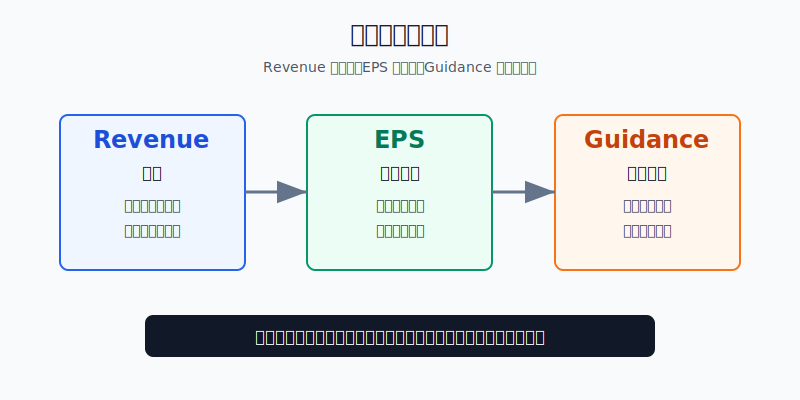
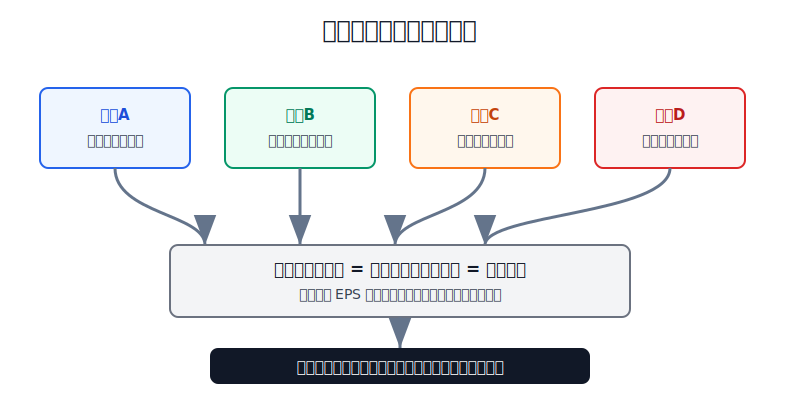
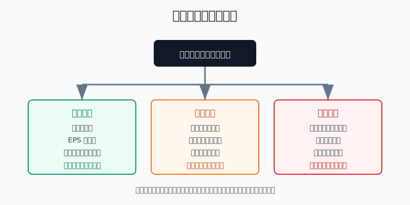

## 散户投资小白金融全品种操盘手册 - 11.5 EPS、Revenue、Guidance - 财报季最重要的三个词
  
### 作者  
digoal  
  
### 日期  
2026-06-07   
  
### 标签  
金融产品 , 金融工具 , 散户 , 投资小白 , 全品操盘手册  
  
----  
  
## 背景 
  
  

> 适用读者: 已经开始看美股个股财报，但一看到“EPS beat”“Revenue miss”“raise guidance”就不知道该买、该卖还是该等的小白投资者。  
> 本文定位: 投资教育框架，不构成个性化投资建议。

## 先问一个反直觉的问题

财报季最容易亏钱的动作，不是看不懂财报，而是只看懂一个词就下单。公司 EPS 超预期，股价照样能跌；收入增长很快，利润照样能垮；当季数字漂亮，管理层一句下调指引，市场也会重新定价。**财报不是看谁“成绩好”，而是看收入、利润和未来预期是否同时过关。**

## 核心概念: 三个词分别看三件事

Revenue，中文通常叫收入或营收。它回答的是: 公司卖出了多少产品或服务。小白可以把它理解成一家店的流水。流水增长，说明客户还在买；流水下滑，说明需求、价格、渠道或竞争至少有一项出了问题。

EPS，全称 earnings per share，中文叫每股收益。它回答的是: 公司扣掉成本、费用、税费之后，摊到每一股上赚了多少钱。SEC 投资者教育材料把收入表比作一段楼梯: 顶部是收入，中间一级级扣掉成本和费用，底部才是净利润，EPS 就是把净利润按股份分摊后的结果。也就是说，EPS 是“赚没赚到钱”的压缩指标，不是收入本身。

Guidance，中文叫业绩指引。它回答的是: 管理层认为下一季度或全年大概会做到什么水平。财报看的是已经交卷的成绩，Guidance 看的是下一次考试的预告。美股市场非常重视它，因为估值买的是未来，而不是过去。

本节的行动结论先放在前面: **财报季不要只看 EPS，也不要只看股价反应。小白先填“三词表”: Revenue 是否超预期，EPS 是否超预期，Guidance 是否上调或强于预期。三者同向过关，再进入估值和仓位判断；只过一两个，先观察；Guidance 明确转坏，先防守。**

## 逻辑推导链

【论证链标题】: 因为财报季股价反应取决于“过去结果是否超预期”和“未来预期是否改善”，所以小白必须同时看 Revenue、EPS、Guidance，不能凭单个数字追涨杀跌。

── 第一步: 前提陈述

前提A: 美股财报是一场“预期考试”，不是绝对分数考试。这是常量。一家公司赚钱很多，但如果市场原本期待它赚更多，股价仍会跌；一家公司的亏损缩小，若好于预期，股价也会涨。财报季看的是“实际值”和“预期值”的差。

前提B: Revenue 看需求，EPS 看利润兑现。这是常量。收入像店里的客流和流水，EPS 像最后落进口袋的净钱。收入强、EPS 弱，说明增长被成本吃掉；EPS 强、收入弱，说明利润可能来自削减费用、税率变化、回购或一次性因素，持续性要打折。

前提C: Guidance 会重置未来预期。这是变量。公司上调指引，分析师会提高未来收入和利润假设；公司下调指引，市场会把未来估值基础往下调。估值里的 PE，P 是股价，E 是每股收益预期；E 变了，P 也会被重新计算。

前提D: 市场对坏消息的惩罚比对好消息的奖励更重。这是变量，但在高估值和高期待阶段尤其明显。小白在财报后补跌，常常不是买到便宜，而是在买“预期刚刚变坏”的公司。

── 第二步: 逻辑推导

由A+B可得: 因为财报是预期考试，而且收入和 EPS 代表不同层面的质量，所以“EPS 超预期”不能单独证明公司变好。必须继续问: 收入是否也超预期？利润增长是不是靠真实需求和经营效率，而不是一次性项目？

再由B+C可得: 因为估值买的是未来，所以当季 Revenue 和 EPS 再好，如果 Guidance 下调，市场会把未来 E 往下修。此时股价下跌不是“市场不懂财报”，而是市场在重新定价未来。

最后由A+B+C+D可得: 因为好消息需要三词同向才能形成高质量财报，而坏消息只要 Guidance 或核心收入出问题就会破坏预期，所以小白的财报季规则应该是: **三词同绿才进入买入研究；三词分裂先等待；指引转坏先降低风险。**

── 第三步: 正常情景下的操作结论

✅ 正常情景: 公司 Revenue 超预期且同比增长，EPS 超预期且不是靠明显一次性收益，Guidance 上调或至少强于市场预期，同时估值没有离谱、仓位没有超标。

对应操作: 不在财报发布前押注。财报后先填三词表，再看估值、股价跳空幅度和自己的仓位。如果三词同绿但股价已大涨，等待回落或分批；如果三词同绿且估值仍合理，可用小仓位进入观察仓。小白单只美股个股仍然不能替代核心 ETF。

── 第四步: 数据和案例证实

证据1: 财报季确实是预期游戏。FactSet《Earnings Insight》2026年5月8日报告显示，当时标普500已有89%的公司发布2026年一季度财报，其中84%的公司 EPS 高于市场平均预期，高于5年平均78%和10年平均76%；但收入端只有80%的公司收入高于预期，收入超预期幅度为1.7%，低于5年平均2.0%。这说明 EPS 和 Revenue 不是同一个信号，必须分开看。

证据2: 市场对 EPS 负面意外的惩罚很重。同一份 FactSet 报告显示，2026年一季度发布负面 EPS 意外的标普500公司，在财报发布前两天到发布后两天平均下跌4.9%，显著高于5年平均2.9%的跌幅；正面 EPS 意外公司的平均涨幅是1.1%，只是略高于5年平均1.0%。这对应前提D: 坏消息的杀伤力通常大于好消息的奖励。

证据3: Guidance 会改变未来估值基础。FactSet 同期报告显示，截至报告日，77家标普500公司已经发布2026年二季度 EPS 指引，其中38家负面、39家正面，负面指引占49%，低于5年平均58%和10年平均60%。市场关心这个数字，是因为公司指引会影响分析师下一季和全年 EPS 估计，进而影响估值里的 E。

证据4: 三词同向时，财报质量更容易被市场理解。NVIDIA 2026年5月20日发布的2027财年一季度财报显示，季度收入816亿美元，同比增长85%；数据中心收入752亿美元，同比增长92%；GAAP 稀释 EPS 为2.39美元，Non-GAAP 稀释 EPS 为1.87美元；公司给出的下一季度收入指引为910亿美元，上下浮动2%。这个案例对应三词同绿: 收入强、EPS 强、未来指引也强。

失败案例: UnitedHealth Group 2025年4月17日发布一季度财报时，收入1096亿美元，同比增加98亿美元，调整后 EPS 为7.20美元，但公司把2025年全年调整后 EPS 指引下调到26.00-26.50美元，理由包括 Medicare Advantage 医疗服务使用率高于计划等。S&P Global Market Intelligence 统计，4月16日至4月24日 UnitedHealth 股价从585.04美元跌到424.25美元，跌幅27.48%。这个案例说明: 当 Guidance 明确转坏时，收入增长本身不足以保护股价。

历史不代表未来，但这些数据有参考价值，因为它们验证的是结构规律: 财报季不是单看好坏，而是看实际结果、预期差和未来指引是否同向。

── 第五步: 前提变化时的替代结论

若前提C改变，也就是 Guidance 下调，即使 Revenue 和 EPS 当季过关，推导路径变为: 因为未来 EPS 预期下修，所以估值基础变弱。新结论: 持仓者先减仓或降低仓位上限，未持仓者不接下跌飞刀，等下一季确认。

若前提B改变，也就是 Revenue 增长但 EPS 弱，推导路径变为: 因为需求有增长但利润没兑现，所以公司可能在用高成本换增长。新结论: 不按成长股高估值追买，必须继续查毛利率、费用率和现金流。

若前提A改变，也就是市场原本预期极低，公司只是“没那么差”，推导路径变为: 因为反弹来自预期修复，不等于长期逻辑恢复。新结论: 可以观察，但不能把一次财报反弹当成基本面反转。

反例/失败案例: 如果小白只看到 UnitedHealth 收入同比增长，就在财报后暴跌中补仓，而没有看到全年 EPS 指引被下调，他买到的不是“便宜的大公司”，而是“市场正在重新估值的坏预期”。这种错误的核心不是看错价格，而是漏看了 Guidance。

## 实操例子: 5000美元个股学习仓怎么读财报

这个例子对应论证链的正常结论: **财报后先填三词表，再决定买入、观察、减仓或退出。**

假设小林有5000美元美股个股学习仓，核心资产仍放在宽基 ETF，个股只是学习和卫星配置。他准备研究一家云软件公司，财报将在美股盘后发布。

第一步，财报前不押方向，只写预期表。小林记录三项市场预期: Revenue 预期是多少，EPS 预期是多少，公司上一次给出的 Guidance 是多少。他还写下仓位红线: 单只个股最多1000美元，财报前不买期权，不用保证金。

第二步，财报后填三词表。假设公司收入同比增长18%，高于市场预期；EPS 也高于预期；但管理层把下一季度收入增速指引从原先市场期待的20%左右降到15%左右。小林把 Revenue 打绿，EPS 打绿，Guidance 打红。

第三步，按分支做动作。因为 Guidance 打红，对应论证链的前提C变化，小林不在盘后大跌时补仓。如果他没有持仓，动作是等待下一季或等管理层解释清楚客户需求是否放缓；如果他已经持有1000美元，动作是把仓位降到500美元或以下，保留观察仓，而不是幻想第二天反弹。

第四步，检查 EPS 质量。如果 EPS 超预期来自一次性税收收益、投资收益或大额回购，而收入增速放缓，小林把 EPS 从绿改成黄。判断依据是前提B: EPS 强但收入弱，持续性不足。此时即使股价上涨，也不追。

第五步，只有三词同绿才进入估值判断。假设另一家公司收入超预期、EPS 超预期、下一季度和全年 Guidance 都上调，小林也不能直接满仓。他先看 PE、Forward PE、PS 和自由现金流，再决定是否用三分之一仓位试错。买入后必须写失效条件: 下一季收入或 Guidance 转红，减仓；估值过热且仓位超过上限，止盈；业务逻辑被证伪，退出。

如果操作错误，后果很清楚。财报前押注，错一次就会被跳空打穿；只看 EPS，容易买到靠成本压缩撑起来的短期利润；只看收入，容易买到越卖越亏的增长；忽略 Guidance，容易在预期下修初期不断补仓。纠偏方法也只有一个: 每次财报后先填三词表，表没填完，不下单。

## 可复用框架

【三词打分】

适用前提: 你研究的是已经公开披露季度财报的美股公司，并且能找到市场预期、公司财报和管理层指引。

核心逻辑: 因为财报季看的是预期差和未来预期，所以 Revenue、EPS、Guidance 必须一起看。

操作步骤:

1. Revenue: 实际收入是否高于预期，是否同比增长，增长来自价格、销量还是并购。
2. EPS: 实际 EPS 是否高于预期，利润是否来自主营业务，是否有一次性项目。
3. Guidance: 下一季度或全年指引是否上调，至少是否强于市场预期。
4. 三词同绿: 再进入估值和仓位判断。
5. 任何一项红: 降低动作等级，先观察或减仓。

前提失效时: 如果公司不提供 Guidance，不能硬猜未来，只能用订单、剩余履约义务、管理层电话会和分析师一致预期辅助判断，并把仓位上限降低。

举一反三: 这个框架也能用在港股和中概股财报，只是数据来源和披露节奏不同。

【先预期后下单】

适用前提: 财报发布时间已知，且股价可能在盘前或盘后大幅波动。

核心逻辑: 因为财报反应来自实际值相对预期值的差，所以先写预期，后看结果，最后才谈交易。

操作步骤:

1. 财报前: 写下 Revenue、EPS、Guidance 的市场预期，不押注方向。
2. 财报后: 填实际值和管理层指引，标绿、黄、红。
3. 电话会后: 看管理层是否解释清楚增长、成本和未来需求。
4. 交易日: 避开第一波情绪波动，用小仓位或不交易执行结论。

前提失效时: 如果你找不到市场预期，或者看不懂公司业务，直接跳过这次财报，不把不懂当机会。

举一反三: 这个框架同样适用于 ETF 重仓公司、行业龙头和财报季板块轮动。先理解预期，再理解价格反应。

## 本节行动清单

| 动作 | 合格标准 |
|---|---|
| 财报前写预期 | 记录 Revenue、EPS、Guidance 的市场预期和公司上次指引 |
| 财报后填三词表 | 每项标绿、黄、红，不用一句“财报不错”糊弄自己 |
| 区分收入和利润 | 收入看需求，EPS 看利润兑现，二者不能互相替代 |
| 优先看 Guidance | 指引下调时，不用“股价跌了很多”作为补仓理由 |
| 检查 EPS 质量 | 剔除一次性收益、税率变化、回购等对 EPS 的短期影响 |
| 控制个股仓位 | 单只个股不替代核心 ETF，财报前不重仓押注 |
| 写失效条件 | 下一季收入、EPS 或 Guidance 转坏时，必须触发复盘和减仓 |

## 一句话总结

财报季最重要的三个词不是让你更快下单，而是让你慢下来: Revenue 看需求，EPS 看利润，Guidance 看未来；三者同向才值得继续研究，三者分裂先保护本金。

## 参考资料

- SEC: Beginners' Guide to Financial Statements，2026年访问，https://www.sec.gov/about/reports-publications/investorpubsbegfinstmtguide
- Investor.gov: Earnings Per Share，2026年访问，https://www.investor.gov/index.php/introduction-investing/investing-basics/glossary/earnings-share
- FactSet: Earnings Insight，2026年5月8日，https://advantage.factset.com/hubfs/Website/Resources%20Section/Research%20Desk/Earnings%20Insight/EarningsInsight_050826.pdf
- NVIDIA Investor Relations: NVIDIA Announces Financial Results for First Quarter Fiscal 2027，2026年5月20日，https://investor.nvidia.com/news/press-release-details/2026/NVIDIA-Announces-Financial-Results-for-First-Quarter-Fiscal-2027/default.aspx
- UnitedHealth Group: Reports First Quarter 2025 Results and Revises Full Year Guidance，2025年4月17日，https://prd.unitedhealthgroup.com/content/dam/UHG/PDF/investors/2025/UNH-Reports-Q1-2025-Results-Revises-Full-Year-Guidance.pdf
- S&P Global Market Intelligence: UnitedHealth Group stock plunges after disappointing Q1 earnings，2025年4月，https://www.spglobal.com/market-intelligence/en/news-insights/articles/2025/4/unitedhealth-group-stock-plunges-after-disappointing-q1-earnings-88650495

> ⚠️ **声明**：本文内容为投资教育目的，所有历史数据、策略框架均为辅助学习工具，不构成证券投资建议。市场有风险，投资需谨慎。实际操作请结合自身风险承受能力，必要时咨询专业投顾。
  
#### [PostgreSQL 解决方案集合](../201706/20170601_02.md "40cff096e9ed7122c512b35d8561d9c8")
  
  
#### [德哥 / digoal's Github - 公益是一辈子的事.](https://github.com/digoal/blog/blob/master/README.md "22709685feb7cab07d30f30387f0a9ae")
  
  
#### [About 德哥](https://github.com/digoal/blog/blob/master/me/readme.md "a37735981e7704886ffd590565582dd0")
  
  

  
